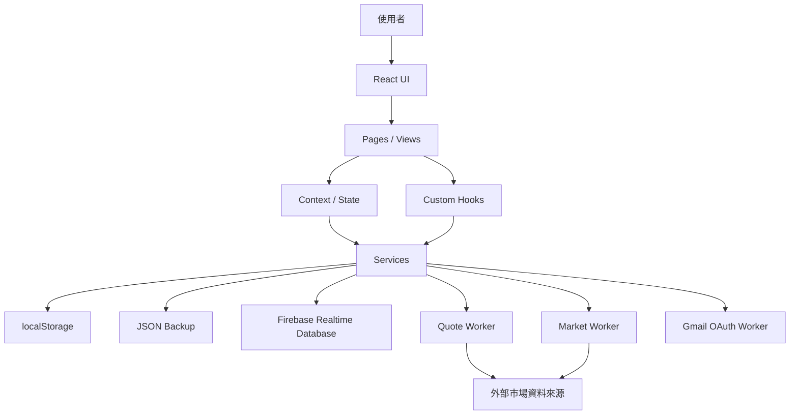
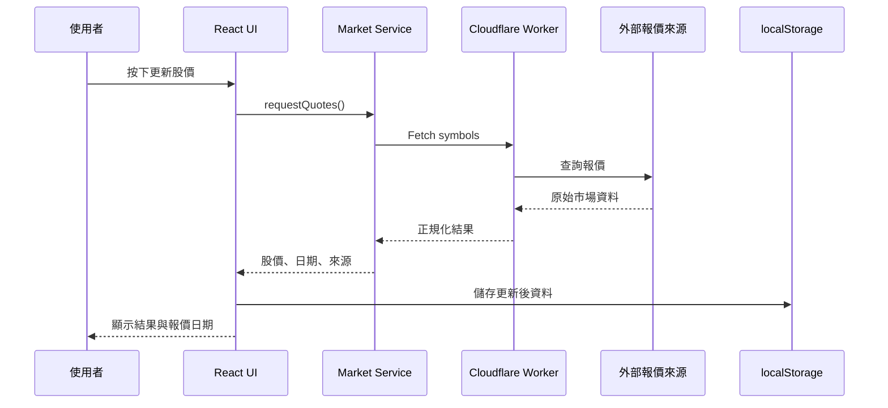
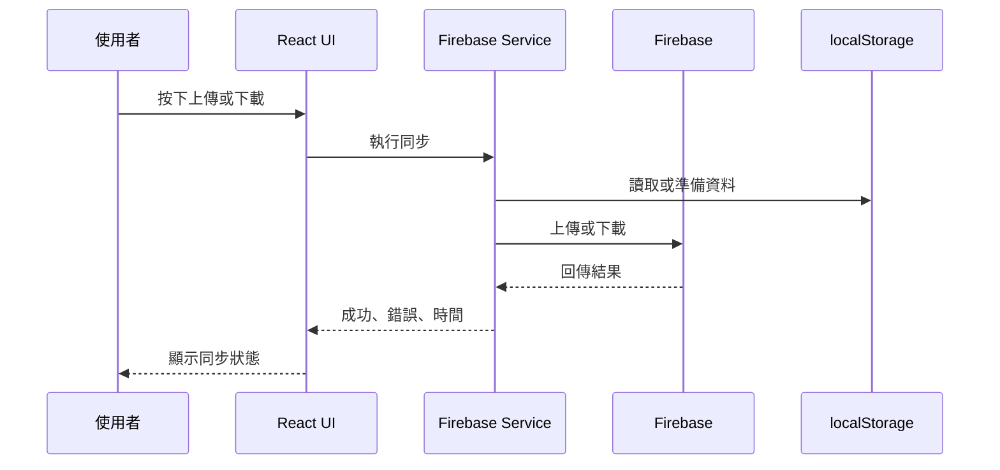

# Universal Rebalance Project Architecture

> 文件目的：讓 ChatGPT、Claude、Gemini、Codex、Cursor 等 AI 開發工具，能快速理解 Universal Rebalance 的實際架構、資料流、外部服務與相容性限制。  
> 本文件必須以「目前程式碼」為準；若內容與程式碼不一致，應先標記差異，再更新文件。

---

## 1. 專案概覽

- 專案名稱：Universal Rebalance
- 中文名稱：萬用資產再平衡儀表板
- GitHub Repository：`hyc640110/family-universal-rebalance`
- 正式網站：`https://hyc640110.github.io/family-universal-rebalance/`
- 技術棧：
  - React
  - Vite
  - TypeScript
  - GitHub Pages
  - Firebase Realtime Database
  - Cloudflare Workers
  - localStorage
  - JSON Backup
  - CSV / XLSX 匯入

### 1.1 專案定位

Universal Rebalance 是個人與家庭財富管理平台，不只是單一再平衡工具。

主要功能方向：

- 持股與資產管理
- 資產配置
- 標準再平衡
- 只買不賣加碼建議
- 交易建議清單
- 股息與現金流
- 報酬與風險分析
- 借款管理
- 市場報價
- Firebase 手動同步
- JSON 備份與還原
- CSV / XLSX 匯入
- Gmail OAuth
- AI 財務決策輔助

---

## 2. 高階系統架構



---

## 3. 資料夾結構

> 下列為建議記錄格式。首次整理時，應由 AI 實際掃描 Repository 後更新，不可憑空假設。

```text
family-universal-rebalance/
├── public/
├── src/
│   ├── components/
│   ├── pages/
│   ├── hooks/
│   ├── contexts/
│   ├── services/
│   ├── utils/
│   ├── types/
│   ├── data/
│   ├── assets/
│   ├── App.tsx
│   └── main.tsx
├── tests/
├── docs/
├── package.json
├── tsconfig.json
├── vite.config.ts
└── README.md
```

### 3.1 資料夾責任

| 路徑 | 主要責任 | 注意事項 |
|---|---|---|
| `src/components/` | 可重複使用 UI 元件 | 避免放入大型業務邏輯 |
| `src/pages/` | 頁面層與主要版面 | 負責組合元件，不直接處理底層 API |
| `src/hooks/` | 共用狀態與行為 | 應保持單一責任 |
| `src/contexts/` | 全域或跨頁狀態 | 避免所有資料集中在單一 Context |
| `src/services/` | API、Firebase、匯入匯出等服務 | 不應依賴 UI |
| `src/utils/` | 純函式與共用工具 | 應方便測試 |
| `src/types/` | TypeScript 型別 | 重要資料格式變更需評估相容性 |
| `src/data/` | 靜態資料或預設值 | 不存放敏感資訊 |
| `public/` | 靜態資源 | 注意 GitHub Pages base path |

---

## 4. React 應用架構

### 4.1 入口層

- `main.tsx`
  - 建立 React Root
  - 掛載全域 Provider
  - 載入全域樣式
- `App.tsx`
  - 應用程式主入口
  - Router 或頁面切換
  - 共用 Layout
  - 錯誤邊界與全域狀態整合

### 4.2 頁面結構

長期目標為五個主要頁面：

1. 總覽
2. 持股
3. 分析
4. 借款
5. 設定

### 4.3 UI 分層原則

```text
Page
└── Feature Section
    └── Feature Component
        └── Shared UI Component
```

- Page：負責頁面組合與資料取得
- Feature Section：負責某一功能區塊
- Feature Component：負責特定互動
- Shared UI Component：按鈕、卡片、Modal、表格等

---

## 5. Context 架構

> 下列名稱只是記錄格式。請依 Repository 中實際存在的 Context 更新。

每個 Context 應記錄：

- 檔案位置
- 管理資料
- 對外提供的方法
- 使用頁面
- 是否寫入 localStorage
- 是否與 Firebase / JSON Backup 同步
- 是否涉及資料版本

範例：

| Context | 管理內容 | 儲存位置 | 使用區域 |
|---|---|---|---|
| Portfolio Context | 持股、現金、資產分類 | localStorage / Firebase | 總覽、持股、分析 |
| Settings Context | 顯示、同步、偏好設定 | localStorage | 全站 |
| Market Context | 股價、報價日期、更新狀態 | localStorage / Worker | 總覽、持股 |
| Loan Context | 借款本金、利率、期數 | localStorage / Firebase | 借款頁 |

### 5.1 Context 原則

- 不得在 Context 中混入過多 UI 邏輯
- 不得任意更改既有資料欄位
- 資料結構變更需提供 migration
- 所有更新方法應有明確型別
- 非必要資料不應放入全域 Context

---

## 6. Hooks 架構

每個 Hook 應記錄：

- Hook 名稱
- 檔案位置
- 主要責任
- 依賴的 Context / Service
- 回傳值
- 是否有副作用
- 是否會寫入 localStorage 或遠端服務

可能的功能類型：

- 持股資料
- 市場報價
- 再平衡
- 加碼建議
- Firebase 手動同步
- localStorage
- JSON 匯入匯出
- 響應式版面
- 圖表資料轉換

### 6.1 Hook 原則

- 單一責任
- 避免隱藏式資料寫入
- 非同步狀態應包含 loading、error、lastUpdated
- 涉及報價時必須保留 quote date
- 避免在多個 Hook 中重複同一演算法

---

## 7. Components 架構

建議依功能分類：

```text
components/
├── common/
├── dashboard/
├── portfolio/
├── rebalance/
├── market/
├── analytics/
├── dividend/
├── loan/
├── settings/
├── charts/
└── mobile/
```

### 7.1 元件責任

- 共用元件：Card、Button、Modal、Empty State、Error State
- 持股元件：持股卡、資產分類、股數與市值
- 再平衡元件：偏離、目標比例、加碼建議
- 市場元件：更新股價、報價日期、錯誤狀態
- 圖表元件：資產配置、趨勢、報酬、風險
- 借款元件：本金、利率、期數、安全存量
- 設定元件：同步、備份、版本、除錯

### 7.2 手機版原則

- 手機版與桌機版資訊順序一致
- 主要卡片使用精簡模式
- 詳細內容以展開方式呈現
- 避免文字裁切與橫向溢出
- 重要按鈕不可過小
- 刪除按鈕需降低誤觸機率
- 趨勢圖日期不可缺失或重疊

---

## 8. Services 架構

Services 應負責：

- 對外 API 呼叫
- Cloudflare Worker 呼叫
- Firebase 上傳與下載
- localStorage 讀寫封裝
- JSON Backup
- CSV / XLSX 匯入
- Gmail OAuth
- 資料正規化
- 錯誤處理

### 8.1 Service 原則

- Service 不依賴 React UI
- 回傳資料需有明確型別
- 錯誤需可被 UI 顯示
- 不可吞掉例外
- 外部資料需正規化後再進入主狀態
- API 回傳欄位變動時，不應直接破壞 UI

---

## 9. Firebase 架構

### 9.1 使用方式

- 使用 Firebase Realtime Database
- 同步模式為手動上傳、手動下載
- 禁止未經要求改成即時自動同步
- 必須維持與 localStorage、JSON Backup 的相容性

### 9.2 手動上傳流程

```text
使用者按下上傳
→ 讀取本機目前資料
→ 驗證資料格式
→ 加入版本資訊
→ 寫入 Firebase
→ 回傳成功或錯誤
→ UI 顯示同步時間
```

### 9.3 手動下載流程

```text
使用者按下下載
→ 從 Firebase 取得資料
→ 驗證資料格式與版本
→ 必要時執行 migration
→ 使用者確認覆蓋
→ 寫入 localStorage
→ 更新 Context
→ UI 重新渲染
```

### 9.4 安全限制

禁止把以下資料寫入本文件：

- API Key
- Token
- Client Secret
- Firebase 私密憑證
- OAuth Secret
- 個人識別碼或密碼

---

## 10. Cloudflare Worker 架構

目前可能包含：

- Quote Worker
- Market Worker
- Gmail OAuth Preview Worker

### 10.1 Worker 責任

- 代理外部市場資料
- 處理 CORS
- 統一回傳格式
- 避免前端直接暴露第三方 API
- 區分 Preview 與 Production
- 回傳報價日期、來源、錯誤狀態

### 10.2 Preview / Production

| 項目 | Preview | Production |
|---|---|---|
| 用途 | PR 驗收 | 正式使用 |
| Worker | Preview 專用 | Production 專用 |
| Firebase | 不得覆蓋正式資料 | 正式資料 |
| OAuth | Preview callback | Production callback |
| 部署 | 驗收後可移除 | 由使用者確認後發布 |

### 10.3 Worker 回傳建議

```ts
interface ApiResponse<T> {
  success: boolean;
  data?: T;
  error?: {
    code: string;
    message: string;
  };
  source?: string;
  quoteDate?: string;
  fetchedAt?: string;
}
```

---

## 11. API Flow

### 11.1 更新股價



### 11.2 Firebase 手動同步



---

## 12. localStorage 架構

首次更新本文件時，應實際列出所有 key。

建議格式：

| Key | 用途 | 資料型別 | 版本 | 是否同步 Firebase |
|---|---|---|---|---|
| `待掃描` | 持股資料 | Object | 待確認 | 是 |
| `待掃描` | 設定資料 | Object | 待確認 | 視情況 |
| `待掃描` | 市場報價 | Object | 待確認 | 視情況 |

### 12.1 localStorage 原則

- 不可任意更名既有 key
- 不可直接刪除舊欄位
- 新資料格式需提供 migration
- JSON Backup 必須能完整匯出必要資料
- 匯入前需驗證
- 報價資料需包含日期
- 若資料損毀，應提供安全 fallback

---

## 13. 資料相容性

任何資料格式變更，至少檢查：

- localStorage 舊資料
- Firebase 舊資料
- JSON Backup 舊檔
- CSV / XLSX 匯入
- Preview 資料
- Production 資料

### 13.1 Migration 原則

```text
讀取資料
→ 檢查版本
→ 執行逐版本 migration
→ 驗證結果
→ 寫回新版本
→ 保留失敗回復方案
```

---

## 14. 不可破壞規則

1. 不直接修改 `main`
2. 不直接部署正式站
3. 不自行 Merge PR
4. 不改成 Firebase 自動同步
5. 不破壞 localStorage 舊資料
6. 不破壞 Firebase 舊資料
7. 不破壞 JSON Backup
8. 不混用 Preview 與 Production
9. 不在未驗證時宣稱完成
10. 不把舊報價顯示成即時報價
11. 不在文件中保存密鑰
12. 不為了重構而重構

---

## 15. 已知技術限制

此區應持續更新，包括：

- 報價來源延遲
- 非交易日報價
- CORS
- Worker 版本落差
- 第三方 API 不穩定
- Firebase 手動同步衝突
- 舊資料 migration
- GitHub Pages base path
- 手機 Safari 差異
- 圖表在小螢幕的日期與刻度問題

---

## 16. 架構更新規則

本文件應在以下情況更新：

- 新增或移除主要資料夾
- 新增主要 Context
- 更換狀態管理方式
- 新增 Worker
- Firebase 結構改版
- localStorage schema 改版
- 新增資料 migration
- API Flow 改變
- Preview / Production 流程改變

小型 UI 修正不必每次更新本文件。

---

## 17. 待首次掃描項目

AI 第一次接手時，應實際掃描並補齊：

- [ ] 真實資料夾樹
- [ ] App 與 Router 結構
- [ ] 所有 Context
- [ ] 主要 Hooks
- [ ] 主要 Components
- [ ] 所有 Services
- [ ] Firebase 節點與版本
- [ ] Worker 名稱與用途
- [ ] localStorage keys
- [ ] JSON Backup schema
- [ ] Preview / Production 環境變數
- [ ] 測試與 Build 指令
