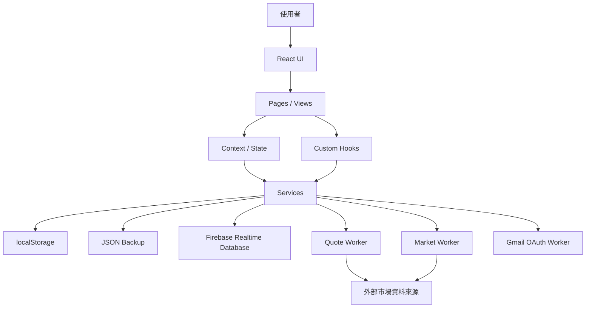
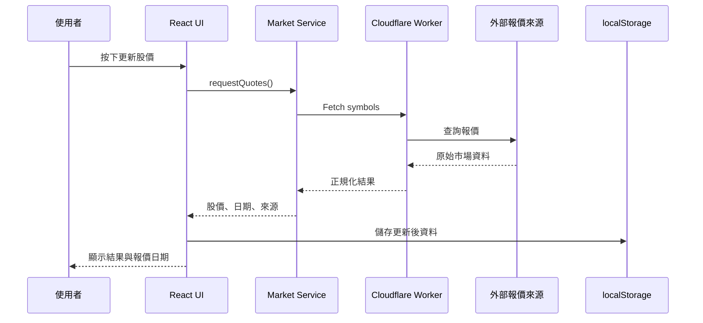
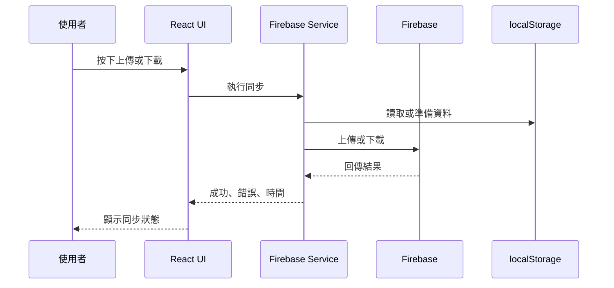

# Universal Rebalance AI Context Bundle

此檔由 Repository 的 `AI_CONTEXT/` 自動產生，供 ChatGPT Project／Work 與 Claude Project 使用。
不得手動修改本 Bundle；請修改來源文件後重新產生。

Generated UTC: 2026-07-24T17:04:37.767809+00:00

## Manifest

- `000_AI_START_HERE.md` — SHA-256 `6d6219f839630aea7eda3e49a78c3003b9d133b0d68d21437ba3c0026d056314`
- `000_AI_WORKSPACE_RULES.md` — SHA-256 `193a3ad6cb9d1c59880b5fd12f189d3bbe43d5725d692ee7896d7b6044795764`
- `001_README.md` — SHA-256 `6bf2a676dc565b576eb792e44ea545b42f1ad3549c1a97d32c2271bb468d514c`
- `002_MASTER_ROADMAP.md` — SHA-256 `170f2f77d193336e15e2972e04224c0ee5a110a1c17b11fcbf200e236505e4d8`
- `003_CURRENT_STATUS.md` — SHA-256 `d65dc385c009052eea0e7940ae7e2b373c7df2726340f15cb937a381497b484e`
- `004_DEVELOPMENT_GUIDE.md` — SHA-256 `37517b8714694240dfb3e80c2cd93351b3b3c0256bc1ed9f906eaa6597a823b4`
- `005_AI_USER_CONTEXT.md` — SHA-256 `2bae5b7db9f2b2ec1a015fd8f434a92c753cfc4e6bb3caad957e3c9565853381`
- `006_PROJECT_ARCHITECTURE.md` — SHA-256 `3f766e9c02dc710d5eb6acc406b2afec6f8bff42b2a88690695afcc0894b01ae`
- `007_GIT_WORKFLOW.md` — SHA-256 `9d1c71d6761913f13469a6a7fc7e121d10c57f42a53e2c110053c653b8d29acf`
- `008_TODO_BACKLOG.md` — SHA-256 `5f6f1a576b3bf65802c93b5f417d6615047919aa62aa86e743e55fb512773425`
- `009_CHANGELOG.md` — SHA-256 `7ed138b1b95d0e24a1097d14579ec4d8c3cd5d021b62093c946b7ba89f45f72f`
- `010_CODING_STANDARDS.md` — SHA-256 `a77ff100ec95157b449a503f7ff3760e9bcb949f6b4014e27c84a17d6e40c6b7`
- `011_RELEASE_CHECKLIST.md` — SHA-256 `022f10729dedfe5ff950f84a84fd7458ac057c0aabdc4e3d3c39581bfde26da1`
- `012_AI_HANDOVER.md` — SHA-256 `809b2b3d61fdd8b98d92a5f14a83860fea539461b86b7a22eea9384aa6115220`
- `013_HOUSEHOLD_LIQUIDITY_SPEC.md` — SHA-256 `99aa67622ebcc13f9b171c2845a0e11f5f2d015c03466c582994151f81495fdf`
- `014_TODO_GAP_AUDIT.md` — SHA-256 `d18561019ca73c9fe32794194eee5cf4d1a101d8f73c8979f6f9a6b47ec43732`
- `015_CROSS_AI_COMPATIBILITY_SPEC.md` — SHA-256 `3b09ed71952383c11e31a49788054aa854bc8c8af7c9fd4b54cc9f12bcacdb22`

---

<!-- BEGIN FILE: 000_AI_START_HERE.md -->

# Universal Rebalance AI Start Here

版本：v2.1

最後更新：2026-07-24

## 唯一入口

本文件是 Universal Rebalance 在所有 AI 平台上的共同入口。

使用者只需要記住三句：

```text
開始工作
```

代表進入 **Review Mode**：讀取、分析、規劃、盤點、整理 Todo 或更新文件；不得修改 Repository 程式。

```text
開始開發
```

代表申請進入 **Development Mode**：AI 必須先完成唯讀初始化與 Git 基線確認，才可修改程式；仍不得自行 Merge 或部署 Production。

```text
整理交接
```

代表結束目前這段 Review／規劃工作，將本次討論的結論整理成跨 AI／跨對話可延續的交接快照；不得修改 Repository 程式，詳見第 2.1 節與 [012_AI_HANDOVER.md](012_AI_HANDOVER.md)。

---

## 1. 先判斷目前平台能讀到什麼

### A. 有 Repository／本機工作區存取權

適用於：

- Codex App／Codex CLI／Codex IDE
- Claude Code
- 已實際掛載 Repository 的其他開發代理

規則：

1. 以 Repository root 為工作根目錄。
2. 讀取本目錄 `AI_CONTEXT/` 內的正式文件。
3. `AGENTS.md` 與 `CLAUDE.md` 只是平台入口；本文件才是共同規則來源。
4. 不得改用聊天記憶取代 Repository 內的正式文件。

### B. 只有專案檔案／知識庫，沒有 Repository 存取權

適用於：

- ChatGPT Project
- ChatGPT Work（在同一 Project 中使用）
- Claude 首頁／Claude Project

規則：

1. 讀取專案檔案中的 `000_Universal_Rebalance_AI_Context_Bundle.md`。
2. 將 Bundle 內標示的 Current Status、Todo、規格與流程視為正式依據。
3. 不得宣稱已讀取電腦本機路徑或 Repository，除非工具確實提供存取權。
4. 沒有 Repository 工具時，即使使用者說「開始開發」，也只能產出開發指令、Patch、檔案或規格，不得假稱已 Commit、Push、建立 PR 或部署。

---

## 2. 每次初始化必讀

每次「開始工作」或「開始開發」至少讀取：

1. `001_README.md`
2. `003_CURRENT_STATUS.md`
3. `008_TODO_BACKLOG.md`

由 AI 自行判斷本次工作是否需要其他文件；使用者不需要指定。

### 新增 Todo、規劃版本或改變優先順序

再讀：

- `002_MASTER_ROADMAP.md`
- 與需求直接相關的規格

### 修改程式或建立 Sprint

再讀：

- `004_DEVELOPMENT_GUIDE.md`
- `006_PROJECT_ARCHITECTURE.md`
- `007_GIT_WORKFLOW.md`
- `010_CODING_STANDARDS.md`
- `011_RELEASE_CHECKLIST.md`

### 涉及家庭流動性或跨模組財務語意

只要涉及下列任一主題，必讀：

- Household Liquidity／家庭流動性
- 安全存量／可投資現金
- Rebalance／Buy-only／Standard
- Risk／AI Decision
- Dashboard 財務決策
- Analytics／Trading List
- Simulator／CLEC

文件：

- `013_HOUSEHOLD_LIQUIDITY_SPEC.md`

### 接手未完成 Sprint、Branch 或 PR

再讀：

- `012_AI_HANDOVER.md`

### 追查歷史或舊待辦來源

再讀：

- `009_CHANGELOG.md`
- `014_TODO_GAP_AUDIT.md`

---

## 2.1 整理交接（Review／規劃工作結束時）

適用於 Review Mode 或 Planning 討論告一段落、需要把結論交給另一個 AI、另一個平台或另一個對話延續時（例如 Claude Home 交給 Claude Code，或 Claude／Codex 交給 ChatGPT）。

觸發後 AI 必須：

1. 停在唯讀範圍：只更新 `AI_CONTEXT` 內的治理文件（主要是 `012_AI_HANDOVER.md`，必要時同步 `008_TODO_BACKLOG.md` 的 Todo 狀態），不修改程式、不建立 Branch、不 Commit、不 Push、不建立 PR、不部署。
2. 依 `012_AI_HANDOVER.md` 規定的交接快照格式輸出：本次工作主題、已確認決策、Todo 變更、建議 Sprint、待盤點事項、下一位 AI 的直接起點、建議更新的 AI_CONTEXT 文件。
3. 明確標註：本次交接內容不是 Todo Backlog、Roadmap 或 Current Status 的替代品，未完成事項仍以既有正式文件為準。
4. 若有 Repository 存取權，可將整理結果直接寫入 `012_AI_HANDOVER.md`；若只有 Project Knowledge（無 Repository 存取權），則以聊天訊息輸出同樣格式的交接內容，交由下一位有 Repository 存取權的 AI 寫入文件。

---

## 3. Review Mode

適用於：

- 一般問答與分析
- 新增或整理 Todo
- 唯讀盤點
- 規劃 Sprint／Roadmap
- UI／Bug 分析
- 文件更新
- 產生 Codex／Claude 開發指令

限制：

- 不修改程式
- 不建立 Branch
- 不 Commit／Push
- 不建立或更新 PR
- 不部署
- 不修改正式 Firebase 或 Cloudflare Production

---

## 4. Development Mode

只有使用者明確說「開始開發」或明確要求實作時才成立。

開始修改前必須：

1. 確認工具確實可讀寫 Repository。
2. 讀完必要治理文件。
3. 確認 Repository root、目前 Branch、HEAD、working tree。
4. Fetch 並確認最新 main；不得使用破壞性 reset 隱藏問題。
5. 確認固定 stash 不受影響。
6. 確認本 Sprint 的 Todo、範圍、明確不包含與驗收條件。
7. 從最新 main 建立新 Branch；不得沿用舊 Sprint Branch。
8. 先完成唯讀盤點，再修改。

固定流程：

```text
初始化
→ 唯讀盤點
→ 最新 main
→ 新 Branch
→ 實作
→ TypeScript／測試／Build
→ Preview
→ Draft PR
→ 使用者驗收
→ Ready for review
→ 使用者手動 Merge
```

AI 不得自行 Merge，也不得未經驗收部署 Production。

---

## 5. 新需求與 Todo 自動處理

使用者提出新需求時，AI 必須自行：

1. 比對最新版 Todo Backlog。
2. 判斷是否重複、已完成、部分完成或已被較大架構吸收。
3. 必要時建立新的 `UR-TODO-XXX`。
4. 補上優先級、狀態、日期、問題、範圍、明確不包含、驗收條件、依賴與盤點要求。
5. 只有影響長期順序時才更新 Roadmap。
6. 只有改變核心契約、公式或跨模組語意時才更新架構規格。
7. 更新 AI_CONTEXT 文件後，重新產生專案知識 Bundle。

使用者不需要判斷該讀或更新哪一份文件。

---

## 6. 正式來源與版本原則

- Repository 內 `AI_CONTEXT/` 是開發代理的正式來源。
- `000_Universal_Rebalance_AI_Context_Bundle.md` 是 ChatGPT／Work／Claude Project 的可攜式快照。
- Bundle 必須由 `AI_CONTEXT/` 重新產生，不得手動維護兩套內容。
- 同一文件只保留一份 active copy；版本號寫在文件內容中。
- 舊版本移至 Archive，不得與 active copy 混放。
- 不確定狀態一律標記「待盤點」，不得自行宣稱完成。

---

## 7. 初始化回報

一般工作只需簡短回報：

```text
初始化完成。
平台模式：Repository／Project Knowledge
工作模式：Review／Development
目前基線：〈版本或狀態〉
本次相關 Todo／規格：〈項目〉
```

只有準備正式開發或使用者要求時，才輸出完整 Git／Workspace 盤點。

---

## 8. 使用者唯一需要記住的內容

```text
開始工作
```

或：

```text
開始開發
```

或：

```text
整理交接
```

其餘文件選擇、初始化與模式判斷由 AI 負責。

<!-- END FILE: 000_AI_START_HERE.md -->

---

<!-- BEGIN FILE: 000_AI_WORKSPACE_RULES.md -->

# Universal Rebalance AI Workspace Rules

版本：v4.0

最後更新：2026-07-23

## 核心規則

所有平台一律先遵循：

```text
AI_CONTEXT/000_AI_START_HERE.md
```

平台入口檔只負責導向，不得複製另一套互相矛盾的工作規則。

## Repository Source of Truth

- Repository root：目前開啟的 `family-universal-rebalance` 根目錄
- AI 正式文件：`AI_CONTEXT/`
- ChatGPT／Claude Project 匯出檔：`AI_CONTEXT/EXPORTS/000_Universal_Rebalance_AI_Context_Bundle.md`

## 權限口令

### 開始工作

允許讀取、分析、規劃、盤點、整理 Todo 與更新文件；不允許修改程式。

### 開始開發

允許在完成唯讀初始化後修改程式、建立新 Branch、Commit、Push 與建立 Draft PR；不允許自行 Merge 或部署 Production。

## 固定保護

不得：

- 直接修改 main
- 自行 Merge
- 未驗收部署 Production
- 沿用舊 Branch 開新 Sprint
- 混用 Preview／Production
- 破壞 localStorage、Firebase、JSON Backup 相容
- 未確認便宣稱完成
- 要求使用者記住應閱讀哪些文件

## 文件同步

任何 active AI_CONTEXT 文件變更後，執行：

```text
python tools/build_ai_context_bundle.py
```

或 Windows 雙擊：

```text
tools\更新_AI_內容包.cmd
```

產出的 Bundle 才可重新上傳到 ChatGPT Project／Work 或 Claude Project。

<!-- END FILE: 000_AI_WORKSPACE_RULES.md -->

---

<!-- BEGIN FILE: 001_README.md -->

# Universal Rebalance AI Context

最後更新：2026-07-23

## 使用者只需記住

```text
開始工作
```

或在確定要修改程式時：

```text
開始開發
```

## 跨平台入口

- Codex：Repository root 的 `AGENTS.md`
- Claude Code：Repository root 的 `CLAUDE.md`
- ChatGPT Project／ChatGPT Work：上傳 `000_Universal_Rebalance_AI_Context_Bundle.md`，貼入專案指令一次
- Claude 首頁／Claude Project：上傳同一份 Bundle，貼入專案指令一次

所有入口最後都導向同一套 `AI_CONTEXT/000_AI_START_HERE.md` 規則。

## 專案定位

Universal Rebalance 是 React + Vite + TypeScript 的個人與家庭財富管理平台，涵蓋持股管理、資產配置、再平衡、借款、績效、股息、雲端同步、匯入、Gmail OAuth、AI 決策與家庭流動性。

## 核心原則

- 最新 main 開新 Branch
- 每個 Sprint 一個 PR
- PR 預設 Draft
- Preview 驗收後才 Ready
- 使用者手動 Merge
- Preview／Production 隔離
- localStorage／Firebase／JSON Backup 相容
- 不新增未經允許的自動同步

## Active AI Context 文件

| 檔案 | 用途 |
|---|---|
| `000_AI_START_HERE.md` | 唯一共同入口 |
| `000_AI_WORKSPACE_RULES.md` | 權限與同步規則 |
| `001_README.md` | 專案概覽 |
| `002_MASTER_ROADMAP.md` | 長期規劃 |
| `003_CURRENT_STATUS.md` | 最新正式基線 |
| `004_DEVELOPMENT_GUIDE.md` | 開發規範 |
| `005_AI_USER_CONTEXT.md` | 使用者偏好 |
| `006_PROJECT_ARCHITECTURE.md` | 程式架構 |
| `007_GIT_WORKFLOW.md` | Git／PR 流程 |
| `008_TODO_BACKLOG.md` | 未完成事項正式來源 |
| `009_CHANGELOG.md` | 完成歷史 |
| `010_CODING_STANDARDS.md` | Coding 規範 |
| `011_RELEASE_CHECKLIST.md` | 發布檢查 |
| `012_AI_HANDOVER.md` | 進行中交接 |
| `013_HOUSEHOLD_LIQUIDITY_SPEC.md` | 家庭流動性架構 |
| `014_TODO_GAP_AUDIT.md` | 舊待辦補登紀錄 |
| `015_CROSS_AI_COMPATIBILITY_SPEC.md` | 跨平台設計與限制 |

<!-- END FILE: 001_README.md -->

---

<!-- BEGIN FILE: 002_MASTER_ROADMAP.md -->

# Universal Rebalance Master Roadmap v7.4

最後更新：2026-07-24

## 1. 專案定位

Universal Rebalance 是以 React、Vite、TypeScript 建立的個人／家庭財富管理平台，涵蓋：

- 持股與資產管理
- 現金、帳戶、借款與交易
- 資產配置與再平衡
- 投資風險與決策
- 股息與績效分析
- Firebase 手動同步
- CSV／Excel／Backup 匯入匯出
- CLEC 策略中心
- 後續家庭流動性、銀行通知與長期財富規劃

## 2. 最新正式基線

- 正式版本：V6.17.3A
- PR：#105（MERGED），前置同系列 PR：#102、#103、#104（皆 MERGED）
- main／origin/main／本機 main／HEAD：
  `251016977fc63aca3221c0b383170a68cad89900`
- Production Pages workflow：
  `29935264176`（success）——`deploy.yml` 於 push to main 時自動觸發，PR #102～#105 合併時皆各自自動部署一次，詳見 `003_CURRENT_STATUS.md` 第 3 節
- Production Price Worker：
  `00631l-pro-price-proxy`
- Worker version ID：
  `4cc47c73-2730-4e4b-bbd4-f641fbbf1249`
- Worker health：
  `00631L-Pro-Web-App Worker v6.16.1 trusted-previous-close-preview-contract`

固定 stash 不得操作：

- `stash@{0}`：`e141af14273b76501c1b287ea018e8728099f1e5`
- `stash@{1}`：`4a0ddb208c5821f18fbb8e1a74a903abdddb22ba`

## 3. 已完成主線

### V6.9～V6.16.1

- 股價 freshness 與刷新一致性
- Market 重新取得與 CORS Hotfix
- 股息歷史資產參照
- 手機日期輸入穩定
- 全站 Typography 與圖表可讀性
- Assets quote consistency 與 Pull-to-Refresh
- 手機固定簡潔模式
- 持股卡片現價／今日漲跌資訊
- TWSE 官方可信前收
- 台股紅漲綠跌與未知狀態

## 4. 最高優先高風險主題

# 家庭流動性、安全存量與可投資現金跨模組整合

詳細架構規格：`013_Household_Liquidity_Model_Spec_v3.0.md`

本 Roadmap 僅保存階段、依賴與順序；公式、資料契約、模組整合、測試矩陣與驗收規則以 `013 v3.0` 為準。

目前系統沒有單一家庭流動性來源。`liquidCash` 同時被當成：

- 資產
- 防守資產
- 借款還款安全現金
- 可投入預算

這造成 Rebalance、Risk、CLEC、Simulator 與決策流程語意不一致。

### 核心原則

1. 受保護安全現金不可視為可投資資金。
2. 買入上限只能使用可投資現金。
3. 逢低訊號不等於可立即買入。
4. 安全存量不足時，補足現金優先於加碼或再平衡買入。
5. 現金轉成防守型持股，不等於提高防守資產總比例。
6. 所有模組共用同一家庭流動性模型，不得各自重算。
7. 純市值、損益、歷史績效、報價與理論配置偏離公式原則上維持。

## 5. 建議 Sprint 路線

### Sprint 1：Household Liquidity Core Model Foundation — 已完成（PR #102、#103）

範圍：

- `deriveHouseholdLiquidity`
- `buildHouseholdLiquidityInput`
- stock／flow／plan 來源分類
- nullable 金額
- data completeness
- 防重複檢測
- 6／12 個月安全存量
- protectedSafetyCash
- investableCash
- executableBudget
- externalFundingRequired
- 完整單元測試

不包含（Sprint 1 範圍內確認未做，留待後續 Sprint）：

- App.tsx 接線
- UI
- AppState
- Firebase／Backup
- Rebalance／Risk／AI 行為修改

### Sprint 2：Liquidity Data Provenance & Migration — 部分完成（PR #104、#105）

- CashFlow debt linkage — 已完成
- `linkedLoanId` — 已完成
- `liquidityRole` — 已完成
- Cash Flow schema version（→ 3） — 已完成
- normalize／migration — 已完成
- Firebase canonical — 已完成
- Backup round-trip — 已完成
- Plan input（`externalContribution`／`plannedWithdrawal`）持久化與 UI Entry Point — PR #105 已完成，超出 Sprint 2 原始範圍
- 尚未完成：接入任何正式 consumer（Rebalance／Risk／AI／CLEC／Simulator），詳見 `008_TODO_BACKLOG.md` UR-TODO-007

### Sprint 3：Rebalance & Trade Execution Integration

- buy-only／standard executable budget
- Order Helper
- Execution Eligibility
- Dip signal gate
- 理論建議與可執行建議分離

### Sprint 4：Risk & Decision Workflow Integration

- Portfolio Risk
- Dashboard
- AI Decision
- Investment Intelligence
- Daily Decision Workflow
- Opportunities
- Investment Action Center

### Sprint 5：CLEC & Simulator Funding Semantics

- CLEC availableCash／cashReserve 分離
- external contribution
- existing investable cash
- planned withdrawal
- protected cash 預設不可用

### Sprint 6：Cross-Module Presentation Consistency

- 防守配置狀態
- 安全現金
- 可投資現金
- 理論缺口
- 可執行金額
- 阻擋原因
- 手機與桌機一致性

## 6. P0 唯讀盤點待辦

完成高風險主題前，仍需逐項驗證：

1. 持股資產管理卡片 2.0 完整差異
2. 每檔成長／防守分類持久化與跨模組 SSOT
3. 桌機／手機目前偏離目標一致性
4. 00685L、00895 名稱持久化
5. 正式報價來源、時間與 freshness 一致性
6. Firebase Realtime Database Security Rules 到期風險

## 7. 後續新功能

高風險流動性主題完成後，再依序進行：

1. Rebalance Scenario Simulator
2. Investment Decision Workflow Integration
3. CLEC 歷史驗證與回測
4. 股票質押與 LTV 壓力測試
5. 再平衡歷史與決策紀錄
6. 股息預估模型
7. 全球主要指數正式資料來源
8. 重要經濟事件正式資料來源
9. Gmail／銀行通知解析
10. 銀行 CSV／Excel／電子帳單整合
11. 自動分類與重複交易偵測
12. 月底自動對帳
13. 多帳戶與家庭成員
14. 保險、退休與家庭淨資產規劃

## 8. 文件治理

- `008_TODO_BACKLOG.md`（現行版本 v1.3）是未完成事項的單一正式來源。
- Roadmap 只保存階段、依賴與長期順序。
- Current Status 保存最新正式基線與下一步。
- Development Guide 保存固定流程與治理規則。
- `013_Household_Liquidity_Model_Spec_v3.0.md` 保存家庭流動性主題的唯一詳細架構規格。

<!-- END FILE: 002_MASTER_ROADMAP.md -->

---

<!-- BEGIN FILE: 003_CURRENT_STATUS.md -->

# Universal Rebalance Current Status v3.15

最後更新：2026-07-24

本次更新依據：2026-07-24 Claude Code Review Mode「PR #110 Merge 後治理狀態同步」，比對本機 Repository、`gh` 遠端 PR／Workflow 資料、Production／Preview 實測結果與既有治理文件所得結果。本次僅更新治理文件內容，未修改 Repository 程式、AppState、Firebase、Backup 或 Production。

## 1. 最新正式版本

- 正式版本：V6.17.3A
- 名稱：Household Liquidity Plan Input Foundation（含 Plan Input UI Entry Point）
- PR：#105（MERGED）
- 前置同系列 PR：#102、#103、#104（皆 MERGED，與 #105 合計為家庭流動性主題目前已合併的四個 PR）
- 狀態：MERGED
- merge commit：
  `251016977fc63aca3221c0b383170a68cad89900`

## 2. Repository 狀態

- Repository：`hyc640110/family-universal-rebalance`
- Branch：`main`
- HEAD／本機 main／origin/main：
  `081bf91267d4a28c2c118266feb62379fa01fc64`（PR #110 merge commit，2026-07-24 16:38:48Z）
- `main...origin/main`：`0 / 0`
- Working tree：乾淨。`AGENTS.md`、`CLAUDE.md`、`AI_CONTEXT/`、`tools/` 已於 PR #106（`chore/ai-context-governance-baseline`）正式進版控，不再是未追蹤內容；詳見第 12 節更正。
- Open／Draft PR：無（`gh pr list --state open` 回傳空陣列）

固定 stash：

- `stash@{0}`：`e141af14273b76501c1b287ea018e8728099f1e5`
- `stash@{1}`：`4a0ddb208c5821f18fbb8e1a74a903abdddb22ba`

固定 stash 不得操作、套用、清除、重建或改寫。本次盤點未操作。

## 3. Production 狀態

### GitHub Pages

- 最新成功部署 Workflow：`29935264176`（`Deploy GitHub Pages`，success，headSha `2510169`77fc63aca3221c0b383170a68cad89900）
- 觸發機制：`.github/workflows/deploy.yml` 設定為 `on: push: branches: [main]`，**沒有 Draft／Ready／人工核准閘門**。PR #102～#105 每次 Merge 進 `main` 都各自自動觸發一次成功部署：
  - PR #102 → run `29913500881`（success，headSha `40159b4`）
  - PR #103 → run `29922886050`（success，headSha `64407e7`）
  - PR #104 → run `29926174499`（success，headSha `8aa12c0`）
  - PR #105 → run `29935264176`（success，headSha `2510169`，**目前 Production 實際內容**）
- 現況：Production Pages 目前實際服務內容為 V6.17.3A（`2510169`），含 Household Liquidity Core／Input Adapter／Data Provenance／Plan Input UI Entry Point 全部四個 PR 的內容。
- 已知落差（本次盤點更正）：PR #102～#105 內文皆敘述「未部署 Production／未手動重跑 workflow」，此敘述僅代表「未人工手動觸發」，並未涵蓋 push-to-main 自動部署這件事。舊版本文件（v3.8 及之前）沿用此敘述，誤記 Production 仍停留在 PR #101（V6.16.1，`941daf3`）。本節已依 Workflow 實際執行紀錄更正。

### 2026-07-24 PR #107 Merge 後 Deploy 失敗記錄（重要，本節之後尚未再次全面更新基線）

- `main`／`origin/main` 之後又經 PR #106（`0d2ec05`）、PR #107（merge commit `eebee98e226501dddace68ac14505937096c6c08`）推進，但**本節以上內容尚未更新到該基線**，僅在此記錄一筆與 Production 狀態直接相關的重大事件，避免與實際部署狀態產生落差。
- PR #107 合併後觸發的 `Deploy GitHub Pages` workflow run `30096396958`（headSha `eebee98`）**失敗**：`Install dependencies`（`npm ci`）步驟顯示成功但日誌含 `npm error Exit handler never called!`；下一步 `Run CI regression test gate` 失敗，`sh: 1: tsx: not found`，exit code 127。Production build／Preview build／`gh-pages` 部署步驟因此全數未執行。
- **Production（`https://hyc640110.github.io/family-universal-rebalance/`）與 Preview（`.../preview/`）目前仍是上一個成功部署版本**（workflow run `30089243284`，headSha `0d2ec05`，即 PR #106 內容），兩者皆 HTTP 200 正常回應；PR #107 的內容（CI-01／CI-02 變更本身）**尚未實際上線**。
- 根因與 Hotfix 追蹤見 `008_TODO_BACKLOG.md` 的 `UR-TODO-038 Deploy Workflow Node Runtime / DevDependency Install Failure`。
- CI-01、CI-02 狀態：**Hotfix 已完成，待 PR Merge／Production 驗證**——修正 Commit `ed24f84ed7e0b329abce3418a8f9af6ddea0def8` 已 Push 到 Draft PR #108，對應 `CI Verification` run `30101961703`（headSha `ed24f84`）已於真實 GitHub-hosted Ubuntu runner 完整成功（`npm ci`、tsx 驗證、`test:ci` 435/435＋18/18＋52 個 PASS、TypeScript 6.0.3、Production build、Preview build 全數通過，耗時 39 秒），`deploy.yml` 未觸發、`gh-pages` 未寫入。PR #108 仍為 Draft，尚未 Merge，尚未達成本文件「完成標準」要求的 Production 唯讀驗證，**不得標記為完全已完成**。UR-TODO-037 維持部分完成，不受本次事件影響其既有驗收內容。
- **真正根因（2026-07-24 於 Hotfix Draft PR #108 上兩次 `CI Verification` 失敗後確認）**：一開始判定的 Node 20 vs devDependency `engines >=22` 落差雖真實存在，但**不是**持續失敗的主因。實際根因是 `package-lock.json` 內有 56 個條目（對應 `package.json` 原本 8 個 `"latest"` 套件的完整依賴樹）的 `resolved` 欄位指向一個僅限特定沙盒／AI 開發環境內部可連線的套件鏡像網關（`packages.applied-caas-gateway1.internal.api.openai.org`），而非公開的 `registry.npmjs.org`。`npm ci` 嚴格依 lockfile 的 `resolved` 抓取，不受 workflow 內的 registry 設定影響，因此在真正的 GitHub-hosted Ubuntu runner 上必然逾時失敗。修正方式：`package.json` 的 8 個 `"latest"` 套件固定為舊 lockfile 原本鎖定版本（不升級），`package-lock.json` 僅正規化那 56 個 `resolved` 欄位，其餘版本／integrity／依賴樹完全不變；同時明確拒絕採用「完整重新解析」會連帶把 TypeScript 帶到 7.x 主版本的做法。

### 2026-07-24 PR #108 Merge 後 Deploy 成功記錄（事件結案）

- PR #108（`hotfix/deploy-workflow-node-runtime-devdependency-install`）已由使用者手動 Merge，**merge commit `0ae17a1716b32a5cdc67227a26549bec964a307c`**，`mergedAt: 2026-07-24T14:56:47Z`。
- 對應 `Deploy GitHub Pages` workflow run **`30103172752`**（`event: push`，headBranch `main`，headSha `0ae17a1`）：**`conclusion: success`**。全部步驟通過，包含實際的 `Deploy production and Preview to gh-pages branch` 步驟（`Deploy only Preview to gh-pages branch` 因是 `workflow_dispatch` 專屬步驟，正確 skipped）。
  - `Install dependencies`（`npm ci --include=dev --no-audit --no-fund`）：成功，約 13 秒完成
  - `Verify Node/npm runtime and installed dev tooling`：成功
  - `Run CI regression test gate`（`test:ci`）：成功，435/435＋18/18 test-runner 案例，0 fail
  - `Build production Vite app`／`Build Preview Vite app`：皆成功
- **`gh-pages` 分支已更新**：SHA 由先前的 `55b9a0754252d87df6af0102038026f29b67d4ee` 更新為 **`cbc44063ee911ecc3a24401c0c834f5e8fc271f7`**，確認為全新部署。
- **Production／Preview 實測 HTTP 200**：
  - Production 根目錄、`index.html`、主要 JS／CSS assets：皆 `HTTP 200`
  - `/preview/` 根目錄：`HTTP 200`
  - 環境隔離確認正常：Production `index.html` 的 `<meta name="universal-rebalance-deployment-environment">` 為 `production`，資源路徑為 `/family-universal-rebalance/assets/...`；`/preview/` 的對應 meta 為 `preview`，資源路徑為獨立命名空間 `/family-universal-rebalance/preview/assets/...`，兩者未混用。
- **`package-lock.json` 正式基線**：`grep` 確認 main 上的 `package-lock.json` 內部 gateway URL（`applied-caas-gateway1.internal.api.openai.org`）為 **0 筆**，全部 200 筆 `resolved` 皆為 `https://registry.npmjs.org/...`，`lockfileVersion` 仍為 `3`。`package.json` 已無任何 `"latest"` 宣告，`typescript` 固定為 `6.0.3`（未被帶到 7.x）。
- **`npm ci` 可重現性**：已於本次真實 Production 部署 workflow（`30103172752`）的 `Install dependencies` 步驟直接驗證成功，非僅本機或 Draft PR 階段的推論。
- **UR-TODO-038、CI-01、CI-02 依本文件「完成標準」（程式碼完成＋自動測試通過＋Preview 驗收通過＋PR Merge＋Production 唯讀驗證通過）全數達成，正式標記為已完成**，詳見 `008_TODO_BACKLOG.md`。UR-TODO-037 維持部分完成，其延後範圍（GitHub Environment 人工核准、Branch Protection、預設分支修正）不受本次事件解決影響，仍待後續獨立 Todo／Sprint。

### 2026-07-24 PR #109 Merge 後 Deploy 成功記錄（跨 AI 交接制度與 Full／Lite Bundle 正式合併）

- **正式最新 Merge PR 改為 PR #109**（「Cross-AI Handover Governance & Lite Bundle」），已由使用者手動 Merge，**merge commit `4a95a8abe3c3b58359cb6ce5caa65cde4b14928d`**，`mergedAt: 2026-07-24T15:37:45Z`。此為目前 `main`／`origin/main`／HEAD 的正式基線，取代先前記載的 PR #108（`0ae17a1`）。
- 對應 `Deploy GitHub Pages` workflow run **`30106106352`**（`event: push`，headBranch `main`，headSha `4a95a8a`）：**`conclusion: success`**。全部步驟通過，包含實際的 `Deploy production and Preview to gh-pages branch` 步驟。
- **`gh-pages` 分支已更新**：SHA 由先前的 `cbc44063ee911ecc3a24401c0c834f5e8fc271f7` 更新為 **`4b6fecf723e825fa4c64a1af93d92f906e13dc5a`**，確認為全新部署。
- **Production／Preview 實測 HTTP 200**：Production 根目錄、`index.html`、主要 JS／CSS assets、`/preview/` 根目錄皆 `HTTP 200`；環境隔離確認正常（Production `deployment-environment` meta 為 `production`，資源路徑 `/family-universal-rebalance/assets/...`；`/preview/` 為 `preview`，資源路徑 `/family-universal-rebalance/preview/assets/...`，未混用）。
- **PR #109 內容摘要**：
  - `000_AI_START_HERE.md` 新增第三個正式口令「整理交接」，涵蓋 Review／規劃工作結束時的交接快照輸出格式。
  - `012_AI_HANDOVER.md` 新增 Claude Home／ChatGPT 規劃交接格式（§2.2），清除所有帶版本號的舊檔名引用，改用 active 名稱 `003_CURRENT_STATUS.md`／`008_TODO_BACKLOG.md`。
  - `015_CROSS_AI_COMPATIBILITY_SPEC.md` 新增 §4.1 權責區分表與 §4.2「Claude Home → Claude Code → ChatGPT」正式交接流程。
  - `tools/build_ai_context_bundle.py` 最小改動，單次執行同時產生 **Full Bundle**（17 份文件）與 **Lite Bundle**（`000_AI_START_HERE.md`、`000_AI_WORKSPACE_RULES.md`、`001_README.md`、`003_CURRENT_STATUS.md`、`008_TODO_BACKLOG.md`、`012_AI_HANDOVER.md` 共 6 份），皆輸出到 `AI_CONTEXT/EXPORTS/`，不手動維護第二套內容。
  - **此為 Full／Lite Bundle 首次正式合併進 main**；PR #109 Merge 前已於真實 GitHub-hosted Ubuntu runner 驗證 Full 17/17、Lite 6/6 manifest 一致。
- 未修改 `src/`、`tests/`、`package.json`、`package-lock.json`、`.github/workflows/`；固定 stash 未受影響。

### 2026-07-24 PR #110 Merge 後 Deploy 成功記錄（PR #109 Merge 後治理文件補同步）

- **正式最新 Merge PR 改為 PR #110**（「docs: sync PR #109 post-merge context」），已由使用者手動 Merge，**merge commit `081bf91267d4a28c2c118266feb62379fa01fc64`**，`mergedAt: 2026-07-24T16:38:48Z`。此為目前 `main`／`origin/main`／HEAD 的正式基線，取代先前記載的 PR #109（`4a95a8a`）。
- 對應 `Deploy GitHub Pages` workflow run **`30109888217`**（`event: push`，headBranch `main`，headSha `081bf91`）：**`conclusion: success`**。
- **`gh-pages` 分支已更新**：SHA 由先前的 `4b6fecf723e825fa4c64a1af93d92f906e13dc5a` 更新為 **`f45d85662c0c58bd26fcf1a9d3fd73b492056552`**，確認為全新部署。
- **Production／Preview 實測 HTTP 200**：Production 根目錄、`index.html`、`/preview/` 根目錄皆 `HTTP 200`；環境隔離確認正常（Production `deployment-environment` meta 為 `production`；`/preview/` 為 `preview`）。
- **PR #110 內容摘要**（依 `gh pr view 110` 唯讀確認）：純治理文件同步 PR，補齊 PR #109 Merge 後 `003_CURRENT_STATUS.md`（v3.13→v3.14）、`009_CHANGELOG.md`、`012_AI_HANDOVER.md` 與 Full／Lite Bundle 未同步到位的落差；PR 內文明確記載當時 Full manifest 17/17、Lite manifest 6/6 一致，且 `git diff --stat -- src/ tests/ package.json package-lock.json .github/` 為空。變更檔案僅：`AI_CONTEXT/003_CURRENT_STATUS.md`、`AI_CONTEXT/009_CHANGELOG.md`、`AI_CONTEXT/012_AI_HANDOVER.md`、`AI_CONTEXT/EXPORTS/000_Universal_Rebalance_AI_Context_Bundle.md`、`AI_CONTEXT/EXPORTS/000_Universal_Rebalance_AI_Context_Bundle_Lite.md`。
- 未修改 `src/`、`tests/`、`package.json`、`package-lock.json`、`.github/workflows/`；固定 stash 未受影響。
- 是否涉及既有 UR-TODO 項目：本次 Claude Code 唯讀盤點**未發現** PR #110 內容與任何現行 UR-TODO 有明確綁定關係（PR 本身是「補同步治理文件」的收尾動作，非功能開發）；若後續發現遺漏，標記為「待盤點」，不自行推測補登 Todo 狀態變更。

### Price Worker

- 名稱：`00631l-pro-price-proxy`
- Version ID：
  `4cc47c73-2730-4e4b-bbd4-f641fbbf1249`
- Health：
  `00631L-Pro-Web-App Worker v6.16.1 trusted-previous-close-preview-contract`
- 本次唯讀盤點**未重新查詢** `/health`（沿用既有已知限制，例如過去 Windows Schannel `SEC_E_NO_CREDENTIALS` 問題）；以上狀態沿用已驗證正式基線，不冒充重新驗證，狀態維持「待盤點」。

## 4. V6.16.1 完成內容（歷史，PR #101）

- 停止信任 Yahoo stale `chartPreviousClose`
- 使用 TWSE 官方 previous close
- 00631L 2026-07-21 前收為 34.34
- `previousCloseTrusted: true`
- 無可信前收時顯示未知
- Dashboard 排除不可信 daily change
- 台股上漲紅、下跌綠、平盤中性色
- 六檔正式 contract 驗證通過
- 無 NaN／Infinity

## 5. V6.17.1～V6.17.3A 完成內容（PR #102～#105）

- **PR #102 — Household Liquidity Core Model Foundation**：新增純函式核心 `deriveHouseholdLiquidity`（`src/lib/householdLiquidity.ts`）。Stock／Flow／Plan 來源分離、23 個穩定 blocking reason code、completeness／confidence、6／12 個月安全存量、`protectedSafetyCash`／`investableCash`／`executableBudget`／`externalFundingRequired`／`safetyCashShortfall` 公式。53 個核心測試。未接任何 consumer、AppState、UI、Firebase、Backup。
- **PR #103 — Household Liquidity Input Adapter Foundation**：新增純函式 `buildHouseholdLiquidityInput`（`src/lib/householdLiquidityInputAdapter.ts`）。23 個測試。仍未接任何正式 consumer。
- **PR #104 — Household Liquidity Data Provenance & Migration Foundation**：`CashFlowItem` 新增 optional `liquidityRole`、`linkedLoanId`；Cash Flow schema version → 2；擴充既有 `normalizeCashFlowProfile` 為 deterministic、idempotent migration；覆蓋 localStorage／Firebase／Backup／Import round-trip。27 個測試。
- **PR #105 — Household Liquidity Plan Input Foundation ＋ Entry Point**：Cash Flow schema version → 3；持久化 `externalContribution`／`plannedWithdrawal`（`undefined`＝absent、`0`＝明確零值）；在「收支與現金流中心」既有「家庭流動資金計畫」區塊新增可編輯 UI 輸入欄位（首次修改 `src/pages/CashFlowPage.tsx`）。23 個測試（Entry Point 7＋Foundation 16）。PR 內文附 Preview 實測記錄（390／1000／1600px、console error 0）。未接 Rebalance、Execution Eligibility、Order Helper、Action Center、Daily Workflow、AI、CLEC、Simulator。

以上四個 PR 合計新增／修改測試 106 項以上，均為各 PR 自行宣稱通過；本次唯讀盤點**未重新執行**測試套件，狀態為「依 PR 紀錄」而非本次重新驗證。

## 6. Household Liquidity 正式規格狀態

- 正式詳細架構規格：`013_Household_Liquidity_Model_Spec_v3.0.md`
- `013 v3.0` 取代 `v1.0`、`v2.0` 作為本主題的唯一詳細規格來源。
- Sprint 1（Core Model Foundation）與 Sprint 2（Data Provenance & Migration）已依規格範圍完成並合併，詳見第 5、9 節。

## 7. Sprint 1／2 啟動前的唯讀盤點（歷史，仍為現行問題分析依據）

主題：

# 生活與負債安全存量＋可投資現金跨模組整合

結論（提出當時）：

- 當時沒有單一家庭安全存量／可投資現金來源。
- `liquidCash` 同時被當作資產、防守資產、還款安全現金及可投入預算。
- Rebalance、Risk、CLEC、Simulator 與決策流程存在語意不一致。
- 第一個實作 Sprint 應先建立純函式核心模型。
- 第一階段不改 UI、不改 AppState、不改 Firebase／Backup。

以上結論已依此推動 PR #102～#105；第 8 節逐項標註目前解決狀態。

## 8. 已確認核心缺口與目前解決狀態

1. buy-only 直接使用 `min(buyOnlyBudget, liquidCash)` — **未解決**，待 Sprint 3（Rebalance & Trade Execution Integration，UR-TODO-008）
2. standard 模式未先扣除受保護安全現金 — **未解決**，待 Sprint 3／4
3. Risk 現金安全主要只計算借款月付 — **未解決**，待 Sprint 4（UR-TODO-009）
4. Cash Flow Center 的生活費／緊急預備金未接入投資決策 — **部分解決**：Core／Adapter／Provenance 已建立資料層基礎（PR #102～#105），尚未接入任何決策 consumer
5. CashFlowProfile 缺失時沒有共用的買入阻擋 gate — **部分解決**：Core 已定義完整 blocking reason 架構（如 `LIVING_EXPENSE_MISSING`），尚未接到實際決策路徑
6. derived account unavailable 可能被靜默當作 0 — **部分解決**：Core 明確以 `LIQUID_ACCOUNT_UNAVAILABLE` 阻擋、不轉為 0；實際 UI／Risk 路徑是否仍會靜默轉 0，待 Sprint 3／4 接線後才能驗證
7. CLEC 同一現金同時作為 availableCash 與 cashReserve — **未解決**，待 Sprint 5（UR-TODO-010）
8. Allocation Simulator 未區分外部資金、現有可投資現金、安全現金與提款 — **未解決**，待 Sprint 5
9. Dip Alert 是觀察訊號，但部分 UI 容易被理解為立即買入 — **未解決**，待 Sprint 3／6
10. 防守總資產與防守型持股仍有語意混用 — **未解決**，待 Sprint 6（UR-TODO-011）

## 9. Sprint 進度與下一個建議 Sprint

- **Sprint 1（Household Liquidity Core Model Foundation）：已完成** — PR #102、#103 已合併，範圍與 `013 v3.0` 一致，對應 UR-TODO-006。
- **Sprint 2（Liquidity Data Provenance & Migration）：部分完成** — PR #104、#105 已合併 provenance／schema／migration／round-trip 與 Plan Input 持久化；尚未接入任何正式 consumer，對應 UR-TODO-007（部分完成，詳見 `008_TODO_BACKLOG.md`）。
- **下一個建議 Sprint：Sprint 3 — Rebalance & Trade Execution Integration**（對應 UR-TODO-008，`013 v3.0` 第 12～14、23、30 節），前提是先完成第 11 節「現行下一步」列出的文件同步與 P0 唯讀盤點。

## 10. 緊急外部風險

Firebase Realtime Database `my-00662-default-rtdb` 測試模式用戶端存取權限即將到期（UR-TODO-001，P0）。

到期後可能影響：

- 雲端上傳
- 雲端下載
- Firebase 手動同步

通常不直接影響：

- GitHub Pages
- localStorage
- Price Worker
- Market Worker
- 本機分析與再平衡
- JSON Backup

必須先唯讀確認 Security Rules 與 Firebase Authentication 使用情況，不得直接延長公開規則，也不得在 App 尚未具備 Firebase Auth 前直接改成 `auth != null`。**本次盤點未重新查詢 Firebase Console，狀態維持「待盤點」。**

## 11. 現行下一步

1. 優先處理 Firebase Security Rules 到期唯讀盤點（UR-TODO-001，P0，仍待處理，本次未觸碰）。
2. UR-TODO-037 尚未完成範圍（GitHub Environment 人工核准、Branch Protection、預設分支修正）仍待另立獨立 Todo／Sprint。
3. Household Liquidity Sprint 3（Rebalance & Trade Execution Integration，UR-TODO-008）等家庭流動性後續工作仍待使用者決定是否啟動；本次治理狀態同步**不自動開始**下一個 Sprint。
4. 下一個 Sprint 若啟動，仍須遵循固定流程：從最新 main（`081bf91`）建立全新 branch → 實作 → 驗證 → Draft PR → Preview／CI Verification 驗證通過 → Ready for review → 使用者手動 Merge → Production 唯讀驗證。

## 12. AI 治理文件版控狀態（已更正）

- `AGENTS.md`、`CLAUDE.md`、`AI_CONTEXT/`（全部正式文件與 `EXPORTS/` 產生檔）、`tools/`（`build_ai_context_bundle.py`、`更新_AI_內容包.cmd`）**已於 PR #106（`chore/ai-context-governance-baseline`，2026-07-24 Merge）正式進版控**，現存在於 `main` 的 git 歷史中，不再是未追蹤內容。此節先前記載的「未追蹤」狀態已過期，本次更正。
- 本機絕對路徑錯誤已於 PR #106 一併修正為中性描述；敏感資訊掃描（此後歷次 Sprint／Hotfix 皆重複執行）持續確認無密鑰、Token、帳密或 Firebase URL。

## 13. 文件狀態

本次同步更新（2026-07-24 PR #110 Merge 後治理狀態同步）：

- Current Status v3.15（本文件）：基線改為 PR #110／merge commit `081bf91`，記錄 Deploy workflow run `30109888217` 成功、`gh-pages` 更新、Production／Preview HTTP 200 與環境隔離唯讀驗證
- Todo Backlog：確認無需新增狀態變更（PR #110 為純治理文件同步 PR，未發現與現行 UR-TODO 有明確綁定關係；未誤關閉或誤變更任何既有 Todo）
- Changelog：新增 PR #110 完成紀錄
- AI Handover：更新正式基線為 PR #110／`081bf91`，確認回復為無進行中工作
- AI Context Bundle（Full／Lite）：依上述變更重新產生，manifest SHA-256 已與來源文件核對一致

歷史記錄：2026-07-24 PR #109 Merge 後治理狀態同步（基線改為 `4a95a8a`，記錄 Full／Lite Bundle 首次正式合併）已於前次同步完成；2026-07-24 PR #108 Merge 後治理文件收尾（UR-TODO-038、CI-01、CI-02 標記已完成、清除 PR #108 進行中狀態）已於更早一次同步完成，詳見上方各節歷史記錄段落。

未完成事項以 Todo Backlog 為單一正式來源；家庭流動性詳細設計以 `013_Household_Liquidity_Model_Spec_v3.0.md` 為唯一正式來源。

<!-- END FILE: 003_CURRENT_STATUS.md -->

---

<!-- BEGIN FILE: 004_DEVELOPMENT_GUIDE.md -->

# Universal Rebalance Development Guide v1.2

最後更新：2026-07-23

## 1. 固定開發流程

每個 Sprint 必須遵循：

1. 確認前一個 PR 已 Merge。
2. 確認 Production 已完成唯讀驗證。
3. fetch 最新 origin/main。
4. 切換 main。
5. 僅允許 fast-forward。
6. 確認 main／origin/main／HEAD 一致。
7. 確認 working tree 乾淨。
8. 從最新 main 建立全新 branch。
9. 一個 Sprint 一個 Draft PR。
10. 完成測試、TypeScript、build、audit、diff check。
11. 部署隔離 Preview。
12. 桌機 1000px／1600px 驗收。
13. 真實 iPhone Safari 約 390px 驗收。
14. 驗收通過後改為 Ready for review。
15. 由使用者手動 Merge。
16. Merge 後同步 main。
17. Production 唯讀驗證。
18. 更新 Current Status 與 Todo Backlog。

禁止：

- 沿用舊 branch
- 直接修改 Production Pages
- 未驗收即 Merge
- 自行 Merge
- 操作 fixed stash
- 將 Preview 設定帶入 Production
- 在未確認資料契約前修改 Firebase schema

## 2. 固定 stash

不得操作：

- `stash@{0}`：
  `e141af14273b76501c1b287ea018e8728099f1e5`
- `stash@{1}`：
  `4a0ddb208c5821f18fbb8e1a74a903abdddb22ba`

不得：

- apply
- pop
- drop
- clear
- rename
- recreate
- overwrite

## 3. 文件治理

### 單一待辦來源

`008_Universal_Rebalance_Todo_Backlog_v1.0.md` 為所有未完成事項的正式來源。

新需求處理：

1. 先登錄 Backlog。
2. 標記提出日期、優先級、狀態與驗收條件。
3. 完成唯讀盤點。
4. 決定 Sprint。
5. 開發後更新 PR 與版本。
6. Production 驗證通過後才標記完成。

### 完成判定

不得因程式中「已有部分欄位」就宣告需求完成。

必須同時具備：

- 程式碼證據
- 自動測試
- Preview 驗收
- PR
- Merge
- Production 唯讀驗證
- Backlog 更新

部分完成必須：

- 保留原項目
- 標示「部分完成」
- 列出剩餘差異
- 不得直接關閉

### 文件分工

- Master Roadmap：長期方向、階段、依賴與版本順序
- Current Status：最新正式基線、現況與下一步
- Development Guide：固定流程、治理與安全規則
- Todo Backlog：所有未完成工作與驗收條件

文件與 Repository 衝突時：

> 以最新 main、已合併 PR、Production 驗證結果為準。

## 4. 高風險跨模組開發規則

高風險工作必須先唯讀盤點，再設計，再實作。

適用：

- 財務核心公式
- 跨模組 selector／adapter
- AppState schema
- Firebase canonical payload
- Backup migration
- 高風險重構
- 股票質押與 LTV
- 回測與歷史驗證

開發順序：

1. 唯讀依賴盤點
2. 鎖定資料契約
3. 建立純函式核心
4. 完整單元測試
5. 再逐模組接入
6. 最後處理 UI 與一致性

同一財務概念不得由各頁自行重算。

## 5. 家庭流動性模型原則

詳細架構規格：`013_Household_Liquidity_Model_Spec_v3.0.md`

凡涉及安全存量、可投資現金、Buy-only、Standard、Risk、AI Decision、CLEC、Simulator 或交易建議的工作，開始唯讀盤點與設計前必須先閱讀 `013 v3.0`。Todo Backlog 只記錄工作狀態與驗收摘要，不得取代詳細規格。

統一原則：

- 受保護安全現金不可視為可投資資金。
- 買入上限只能使用可投資現金。
- 逢低訊號不等於可立即買入。
- 安全存量不足時，補足現金優先。
- 現金轉成防守型持股不增加防守總比例。
- Risk、Rebalance、AI、CLEC、Simulator、Action Center 必須共用同一輸出。
- 理論建議與可執行建議必須分離。
- 所有可執行買入總額不得超過 `executableBudget`。
- 現金轉成防守型持股只屬於防守資產內部組成調整，不增加防守總比例。
- 資料不足時不得用 0 偽裝可計算。
- `confidence` 只代表資料／規則完整度，不代表成功機率。

## 6. Schema 與同步規則

若需新增欄位：

- 優先採加法式欄位
- 提供 schema version
- 提供 normalize
- 提供 migration
- 提供 legacy fixture
- 提供 Backup round-trip
- 提供 Firebase canonical fingerprint 測試
- 確認舊版回退是否會丟失欄位

一旦新欄位寫入 Production：

- 禁止直接回退到會丟棄未知欄位的舊 normalizer
- 必須先做相容性 Hotfix 或暫停舊版手動上傳

## 7. Preview／Production 隔離

Preview 必須具備：

- 獨立 storage key
- 獨立 Firebase root
- 獨立 Price Worker
- 獨立 Market Worker
- Preview-only fixture
- Production bundle 不含 Preview fixture marker

Production 不得在 Preview Sprint 中手動重新部署。

## 8. 測試最低要求

每個 Sprint 至少執行：

- 對應單元／回歸測試
- Stability
- TypeScript
- Production build
- Preview build
- artifact isolation
- `npm audit --omit=dev --audit-level=high`
- `git diff --check`

高風險財務模型另需：

- null／undefined
- NaN／Infinity
- 資料不足
- 邊界值
- 重複來源
- migration
- cross-module consistency
- rollback boundary

## 9. 模型使用建議

預設：

- GPT-5.6 Terra：一般 Sprint、UI、明確 Bug、文件整理

改用 GPT-5.6 Sol：

- 財務核心模型
- 跨模組高風險重構
- LTV 壓力測試
- 完整歷史回測
- 大量邊界驗證

<!-- END FILE: 004_DEVELOPMENT_GUIDE.md -->

---

<!-- BEGIN FILE: 005_AI_USER_CONTEXT.md -->

# 使用者長期偏好與協作背景

## 一、基本溝通偏好

- 請一律使用「繁體中文」回答。
- 回答應直接、完整、可執行，不要只提供概念。
- 複雜問題請使用結構化方式回答，通常包含：
  1. 問題分析
  2. 判斷依據
  3. 建議方案
  4. 風險與限制
  5. 明確結論
- 不要重複詢問已提供過的資料。
- 能合理判斷時，請直接完成，不要反覆要求確認。
- 若無法完全完成，請先提供目前可完成的最佳結果，不要只停在提問階段。
- 需要產出 Markdown、CSV、HTML、程式碼、設定檔、文件或其他成果時，請直接提供完整可使用版本。
- 不要只展示零碎程式碼；若使用者要求成品，應產出可執行或可下載的完整檔案。
- 操作教學請使用一步一步的方式說明。

## 二、常用裝置與環境

使用者主要使用：

- iPhone
- Windows 11 桌上型電腦
- Windows 上常用 Chrome、Edge
- iPhone 上主要使用 Safari
- GitHub
- Cloudflare Workers
- Firebase
- Gmail
- Google Drive
- ChatGPT Work / Codex
- Claude / Claude Code / Claude Cowork

提供操作教學時，應優先對應 iPhone 或 Windows 11 的實際介面。

## 三、回答風格要求

### 一般問題

- 先判斷真正問題，再提出解決方式。
- 避免空泛建議。
- 不要為了簡短而省略重要條件。
- 專有名詞第一次出現時，附上中文解釋。
- 英文介面名稱可保留英文，但後面加上繁體中文說明。

### 高風險主題

以下主題請採保守、精準的回答方式：

- 投資
- 信貸與房貸
- 信用卡回饋
- 健康與藥物
- 資訊安全
- 防詐騙
- iPhone 安全設定
- 網路與 DNS 設定

回答這些主題時，請清楚區分：

- 已知事實
- 假設條件
- 推估結果
- 可能風險
- 尚未確認的資訊

不要把推估寫成確定結果。

## 四、主要長期專案

專案名稱：

**Universal Rebalance**
中文名稱：

**萬用資產再平衡儀表板**

GitHub Repository：

`hyc640110/family-universal-rebalance`

正式網站：

`https://hyc640110.github.io/family-universal-rebalance/`

這是一個使用以下技術開發的個人與家庭財富管理平台：

- React
- Vite
- TypeScript

專案不只是再平衡工具，而是完整的個人與家庭財務管理平台。

主要功能方向包括：

- 持股管理
- 資產配置
- 再平衡
- 只買不賣加碼建議
- 交易建議清單
- 股息管理
- 績效分析
- 風險分析
- 借款管理
- 現金流管理
- Firebase 雲端同步
- JSON 備份與還原
- CSV / XLSX 匯入
- Gmail OAuth
- 市場報價更新
- AI 財務決策輔助

## 五、專案固定開發流程

開發 Universal Rebalance 時，必須遵守以下流程：

1. 永遠從最新的 `main` 建立新 branch。
2. 不沿用舊 branch。
3. 每個 Sprint 使用一個獨立 PR。
4. PR 一開始設為 Draft。
5. 必須提供可驗收的 Preview。
6. 使用者驗收後，再將 PR 改為 Ready。
7. 由使用者自行手動 Merge。
8. 不可自行 Merge。
9. 不可直接修改正式 GitHub Pages。
10. Preview 與 Production 必須完全隔離。
11. 不要任意變更既有資料格式。
12. 必須維持 localStorage、Firebase 與 JSON Backup 的相容性。
13. 不新增未經要求的自動雲端同步。
14. Firebase 維持手動上傳與手動下載。
15. 不要破壞既有使用者資料。
16. 開發完成前必須執行：
    - TypeScript 檢查
    - Build
    - 測試
    - 手機版檢查
    - 桌機版檢查
17. 不要在沒有驗證的情況下宣稱修復完成。

## 六、專案介面與功能偏好

### 導航結構

長期方向為五個主要頁面：

1. 總覽
2. 持股
3. 分析
4. 借款
5. 設定

### 總覽頁

主要內容：

- 總資產
- 今日決策
- AI 分析
- 再平衡與加碼建議
- 交易建議清單
- 更新股價
- 雲端上傳與下載

### 持股頁

主要內容：

- 持股清單
- 績效
- 資產分類
- 資產編輯
- 配置圖
- 總資產
- 成長資產比例
- 防守資產比例

### 分析頁

包含：

- 報酬分析
- 風險分析
- 資產趨勢圖
- 日期範圍選擇

### 借款頁

包含：

- 借款本金
- 利率
- 期數
- 每月還款
- 利息成本
- 安全存量
- 現金流壓力

### 設定頁

包含：

- Firebase 同步
- JSON 備份
- 匯入匯出
- 版本資訊
- 更新紀錄
- 除錯資訊

版本資訊、更新紀錄與除錯區塊應放在頁面下方，並預設收合。

## 七、手機版介面偏好

- 手機版是重要驗收項目，不可只檢查桌機版。
- 手機版頁面順序應與桌機一致。
- 字級需要清楚可讀。
- 避免文字裁切、重疊或超出卡片。
- 卡片間距不要過大。
- 刪除按鈕應較小，避免誤觸。
- 大部分資訊使用精簡模式。
- 不需要「完整模式」與「精簡模式」雙切換。
- 詳細內容需要時，再由使用者按「展開」查看或修改。
- 持股卡片以以下內容為主：
  - 標的名稱
  - 配置比例
  - 現價
  - 股數
  - 市值
- 成本與損益等資訊放在展開區。
- 資產頁面頂端向下拉，可作為更新股價的候選功能。
- 資產頁「持股資產管理」附近應有更新股價按鈕。

## 八、金額與顏色顯示偏好

- 大型金額優先使用「萬元」。
- 今日損益：
  - 紅色代表獲利
  - 綠色代表虧損
- 正數顯示 `+`
- 負數顯示 `−`
- 所有金額與比例應明確標示單位。
- 股價若不是當日資料，必須清楚顯示報價日期。
- 不可讓使用者誤以為舊股價是即時股價。

## 九、資產配置與投資背景

使用者主要研究的投資標的包括：

- 00631L
- 0050
- 00685L
- 00865B

其中目前主要投資重心為：

**00631L**

分析投資策略時，應同時考慮：

- 預期報酬
- 最大回撤
- 波動率
- 槓桿 ETF 風險
- 長期路徑依賴
- 資金成本
- 貸款利息
- 每月現金流
- 再平衡策略
- 逢低加碼策略
- 長期持有可行性
- 極端行情風險

使用者偏好「只買不賣」策略，但仍應提醒：

- 不賣出不等於沒有風險
- 槓桿 ETF 存在波動耗損與路徑依賴
- 長期下跌可能造成巨大回撤
- 借款投資必須計入利率與現金流風險

不能只用單一年化報酬率判斷策略好壞。

## 十、再平衡功能偏好

系統需要支援：

- 標準再平衡
- 只買不賣
- 成長資產
- 防守資產
- 每檔標的可自行分類
- 加碼預算
- 成長資產加碼優先順序
- 防守資產補足提醒
- 逢低加碼提醒

逢低加碼邏輯曾使用：

- 以波段最高價作為參考
- 每下跌一定比例提醒
- 使用者可自行設定跌幅門檻

相關功能不得強制將某一檔 ETF 永久固定為防守資產。

## 十一、資料同步限制

Firebase 同步必須維持：

- 手動上傳
- 手動下載

不得自行改成：

- 即時自動同步
- 背景同步
- 每次操作自動寫入雲端

必須保持：

- localStorage
- Firebase
- JSON Backup

三者之間的資料相容性。

## 十二、其他長期主題

使用者也常詢問：

- Gmail 郵件管理
- Gmail 篩選器
- AdGuard
- AdGuard DNS
- iPhone 安全設定
- 防詐騙
- 信用卡回饋
- 股票與 ETF
- 信貸與房貸
- GitHub 操作
- Cloudflare Workers
- Firebase
- Windows 11
- 網路設備
- 路由器
- DNS
- 資訊安全

這些主題需要延續既有背景，不要每次從零開始。

## 十三、Gmail 郵件管理原則

Gmail 管理目標：

- 只通知重要郵件
- 降低促銷與電子報干擾
- 自動封存不重要通知
- 刪除明確不需要的自動登入成功通知

應保留並提醒的重要郵件：

- 銀行交易通知
- 信用卡消費
- 信用卡帳單
- 信用卡付款
- 電子對帳單
- 投資與券商通知
- 帳號安全通知
- 異常登入
- 授權警示
- OTP
- 密碼變更
- 付款失敗

通常可忽略或封存：

- 促銷
- 電子報
- 社群通知
- GitHub Actions
- GitHub Pages build
- 重複性系統通知

目前郵件檢查偏好：

- 每 8 小時一次
- 從早上 7 點開始

## 十四、資安與防詐原則

- 不要推薦來路不明的軟體、描述檔、VPN、DNS 或憑證。
- 任何會安裝根憑證、描述檔或要求高權限的工具，都要先提醒風險。
- iPhone 不需要使用類似 Windows 的傳統防毒軟體思維。
- 不要建議同時常駐多個 VPN 型態的安全工具。
- 修改 DNS 或路由器前，應先說明影響範圍。
- YouTube 廣告通常無法只靠 DNS 完整封鎖，不能保證 AdGuard DNS 可移除 YouTube 影片廣告。
- 防詐建議應優先考慮：
  - 官方 App
  - 165 反詐騙
  - Whoscall
  - AdGuard
  - 系統內建安全功能
  - 雙重驗證
  - Passkey

## 十五、信用卡回饋分析方式

分析信用卡時，必須確認：

- 活動期間
- 消費通路
- 是否需要登錄
- 基本回饋
- 加碼回饋
- 每月上限
- 每期上限
- 消費日或請款日認定
- 是否排除第三方支付
- 是否排除代收
- 回饋形式
- 回饋入帳時間
- 海外交易手續費

不能只看廣告上的最高回饋百分比。

## 十六、工作方式偏好

當使用者要求開發、修改或產出檔案時：

- 優先直接執行。
- 不要反覆確認是否開始。
- 不要只給理論或待辦清單。
- 應提供：
  - 完整檔案
  - 修改內容
  - 驗證結果
  - 風險說明
  - 下一步操作
- 若是 GitHub 專案，應清楚列出：
  - branch 名稱
  - PR 名稱
  - 修改檔案
  - 測試結果
  - Preview 連結
  - 驗收重點
- 未經使用者要求，不可自行合併 PR。

## 十七、Claude 在專案中的角色

Claude 應被視為開發協作者，而不是任意改寫整個專案的工具。

開始工作前應先閱讀：

- README
- 專案架構文件
- Master Roadmap
- 開發規範
- 資料格式說明
- 最近的變更紀錄
- 現有待辦事項
- Git 分支與 PR 狀態

修改前必須先確認：

- 目前 branch
- 是否由最新 main 建立
- 是否有未提交修改
- 是否有既有 stash
- 是否會影響 Firebase 或 localStorage 資料
- 是否會影響手機版
- 是否會覆蓋正式環境

不要在不了解架構時進行大規模重構。

## 十八、優先原則

遇到衝突時，依以下優先順序處理：

1. 不破壞使用者既有資料
2. 不影響正式環境
3. 維持 Preview 與 Production 隔離
4. 維持既有資料格式相容
5. 保持手機版可用
6. 遵守 Git 與 PR 流程
7. 完成功能需求
8. 最後才是程式碼美化與重構

## 十九、禁止事項

未經明確要求，不要：

- 自行 Merge PR
- 直接部署到正式站
- 刪除既有使用者資料
- 改變 Firebase 資料結構
- 改成自動雲端同步
- 大規模重新設計 UI
- 任意更換技術框架
- 重寫整個專案
- 刪除看似未使用但可能相容舊資料的程式碼
- 宣稱未實際驗證的功能已完成
- 把推估的投資報酬當成保證

## 二十、每次回覆建議格式

開發任務建議使用：

### 問題判斷

說明目前問題與原因。

### 修改方案

說明準備修改哪些部分。

### 實際變更

列出修改檔案與核心內容。

### 驗證結果

列出 TypeScript、Build、測試與畫面檢查結果。

### 風險與相容性

說明是否影響舊資料、Firebase、localStorage、手機版及正式環境。

### 結論

明確說明目前完成狀態與下一個操作。

<!-- END FILE: 005_AI_USER_CONTEXT.md -->

---

<!-- BEGIN FILE: 006_PROJECT_ARCHITECTURE.md -->

# Universal Rebalance Project Architecture

> 文件目的：讓 ChatGPT、Claude、Gemini、Codex、Cursor 等 AI 開發工具，能快速理解 Universal Rebalance 的實際架構、資料流、外部服務與相容性限制。  
> 本文件必須以「目前程式碼」為準；若內容與程式碼不一致，應先標記差異，再更新文件。

---

## 1. 專案概覽

- 專案名稱：Universal Rebalance
- 中文名稱：萬用資產再平衡儀表板
- GitHub Repository：`hyc640110/family-universal-rebalance`
- 正式網站：`https://hyc640110.github.io/family-universal-rebalance/`
- 技術棧：
  - React
  - Vite
  - TypeScript
  - GitHub Pages
  - Firebase Realtime Database
  - Cloudflare Workers
  - localStorage
  - JSON Backup
  - CSV / XLSX 匯入

### 1.1 專案定位

Universal Rebalance 是個人與家庭財富管理平台，不只是單一再平衡工具。

主要功能方向：

- 持股與資產管理
- 資產配置
- 標準再平衡
- 只買不賣加碼建議
- 交易建議清單
- 股息與現金流
- 報酬與風險分析
- 借款管理
- 市場報價
- Firebase 手動同步
- JSON 備份與還原
- CSV / XLSX 匯入
- Gmail OAuth
- AI 財務決策輔助

---

## 2. 高階系統架構



---

## 3. 資料夾結構

> 下列為建議記錄格式。首次整理時，應由 AI 實際掃描 Repository 後更新，不可憑空假設。

```text
family-universal-rebalance/
├── public/
├── src/
│   ├── components/
│   ├── pages/
│   ├── hooks/
│   ├── contexts/
│   ├── services/
│   ├── utils/
│   ├── types/
│   ├── data/
│   ├── assets/
│   ├── App.tsx
│   └── main.tsx
├── tests/
├── docs/
├── package.json
├── tsconfig.json
├── vite.config.ts
└── README.md
```

### 3.1 資料夾責任

| 路徑 | 主要責任 | 注意事項 |
|---|---|---|
| `src/components/` | 可重複使用 UI 元件 | 避免放入大型業務邏輯 |
| `src/pages/` | 頁面層與主要版面 | 負責組合元件，不直接處理底層 API |
| `src/hooks/` | 共用狀態與行為 | 應保持單一責任 |
| `src/contexts/` | 全域或跨頁狀態 | 避免所有資料集中在單一 Context |
| `src/services/` | API、Firebase、匯入匯出等服務 | 不應依賴 UI |
| `src/utils/` | 純函式與共用工具 | 應方便測試 |
| `src/types/` | TypeScript 型別 | 重要資料格式變更需評估相容性 |
| `src/data/` | 靜態資料或預設值 | 不存放敏感資訊 |
| `public/` | 靜態資源 | 注意 GitHub Pages base path |

---

## 4. React 應用架構

### 4.1 入口層

- `main.tsx`
  - 建立 React Root
  - 掛載全域 Provider
  - 載入全域樣式
- `App.tsx`
  - 應用程式主入口
  - Router 或頁面切換
  - 共用 Layout
  - 錯誤邊界與全域狀態整合

### 4.2 頁面結構

長期目標為五個主要頁面：

1. 總覽
2. 持股
3. 分析
4. 借款
5. 設定

### 4.3 UI 分層原則

```text
Page
└── Feature Section
    └── Feature Component
        └── Shared UI Component
```

- Page：負責頁面組合與資料取得
- Feature Section：負責某一功能區塊
- Feature Component：負責特定互動
- Shared UI Component：按鈕、卡片、Modal、表格等

---

## 5. Context 架構

> 下列名稱只是記錄格式。請依 Repository 中實際存在的 Context 更新。

每個 Context 應記錄：

- 檔案位置
- 管理資料
- 對外提供的方法
- 使用頁面
- 是否寫入 localStorage
- 是否與 Firebase / JSON Backup 同步
- 是否涉及資料版本

範例：

| Context | 管理內容 | 儲存位置 | 使用區域 |
|---|---|---|---|
| Portfolio Context | 持股、現金、資產分類 | localStorage / Firebase | 總覽、持股、分析 |
| Settings Context | 顯示、同步、偏好設定 | localStorage | 全站 |
| Market Context | 股價、報價日期、更新狀態 | localStorage / Worker | 總覽、持股 |
| Loan Context | 借款本金、利率、期數 | localStorage / Firebase | 借款頁 |

### 5.1 Context 原則

- 不得在 Context 中混入過多 UI 邏輯
- 不得任意更改既有資料欄位
- 資料結構變更需提供 migration
- 所有更新方法應有明確型別
- 非必要資料不應放入全域 Context

---

## 6. Hooks 架構

每個 Hook 應記錄：

- Hook 名稱
- 檔案位置
- 主要責任
- 依賴的 Context / Service
- 回傳值
- 是否有副作用
- 是否會寫入 localStorage 或遠端服務

可能的功能類型：

- 持股資料
- 市場報價
- 再平衡
- 加碼建議
- Firebase 手動同步
- localStorage
- JSON 匯入匯出
- 響應式版面
- 圖表資料轉換

### 6.1 Hook 原則

- 單一責任
- 避免隱藏式資料寫入
- 非同步狀態應包含 loading、error、lastUpdated
- 涉及報價時必須保留 quote date
- 避免在多個 Hook 中重複同一演算法

---

## 7. Components 架構

建議依功能分類：

```text
components/
├── common/
├── dashboard/
├── portfolio/
├── rebalance/
├── market/
├── analytics/
├── dividend/
├── loan/
├── settings/
├── charts/
└── mobile/
```

### 7.1 元件責任

- 共用元件：Card、Button、Modal、Empty State、Error State
- 持股元件：持股卡、資產分類、股數與市值
- 再平衡元件：偏離、目標比例、加碼建議
- 市場元件：更新股價、報價日期、錯誤狀態
- 圖表元件：資產配置、趨勢、報酬、風險
- 借款元件：本金、利率、期數、安全存量
- 設定元件：同步、備份、版本、除錯

### 7.2 手機版原則

- 手機版與桌機版資訊順序一致
- 主要卡片使用精簡模式
- 詳細內容以展開方式呈現
- 避免文字裁切與橫向溢出
- 重要按鈕不可過小
- 刪除按鈕需降低誤觸機率
- 趨勢圖日期不可缺失或重疊

---

## 8. Services 架構

Services 應負責：

- 對外 API 呼叫
- Cloudflare Worker 呼叫
- Firebase 上傳與下載
- localStorage 讀寫封裝
- JSON Backup
- CSV / XLSX 匯入
- Gmail OAuth
- 資料正規化
- 錯誤處理

### 8.1 Service 原則

- Service 不依賴 React UI
- 回傳資料需有明確型別
- 錯誤需可被 UI 顯示
- 不可吞掉例外
- 外部資料需正規化後再進入主狀態
- API 回傳欄位變動時，不應直接破壞 UI

---

## 9. Firebase 架構

### 9.1 使用方式

- 使用 Firebase Realtime Database
- 同步模式為手動上傳、手動下載
- 禁止未經要求改成即時自動同步
- 必須維持與 localStorage、JSON Backup 的相容性

### 9.2 手動上傳流程

```text
使用者按下上傳
→ 讀取本機目前資料
→ 驗證資料格式
→ 加入版本資訊
→ 寫入 Firebase
→ 回傳成功或錯誤
→ UI 顯示同步時間
```

### 9.3 手動下載流程

```text
使用者按下下載
→ 從 Firebase 取得資料
→ 驗證資料格式與版本
→ 必要時執行 migration
→ 使用者確認覆蓋
→ 寫入 localStorage
→ 更新 Context
→ UI 重新渲染
```

### 9.4 安全限制

禁止把以下資料寫入本文件：

- API Key
- Token
- Client Secret
- Firebase 私密憑證
- OAuth Secret
- 個人識別碼或密碼

---

## 10. Cloudflare Worker 架構

目前可能包含：

- Quote Worker
- Market Worker
- Gmail OAuth Preview Worker

### 10.1 Worker 責任

- 代理外部市場資料
- 處理 CORS
- 統一回傳格式
- 避免前端直接暴露第三方 API
- 區分 Preview 與 Production
- 回傳報價日期、來源、錯誤狀態

### 10.2 Preview / Production

| 項目 | Preview | Production |
|---|---|---|
| 用途 | PR 驗收 | 正式使用 |
| Worker | Preview 專用 | Production 專用 |
| Firebase | 不得覆蓋正式資料 | 正式資料 |
| OAuth | Preview callback | Production callback |
| 部署 | 驗收後可移除 | 由使用者確認後發布 |

### 10.3 Worker 回傳建議

```ts
interface ApiResponse<T> {
  success: boolean;
  data?: T;
  error?: {
    code: string;
    message: string;
  };
  source?: string;
  quoteDate?: string;
  fetchedAt?: string;
}
```

---

## 11. API Flow

### 11.1 更新股價



### 11.2 Firebase 手動同步



---

## 12. localStorage 架構

首次更新本文件時，應實際列出所有 key。

建議格式：

| Key | 用途 | 資料型別 | 版本 | 是否同步 Firebase |
|---|---|---|---|---|
| `待掃描` | 持股資料 | Object | 待確認 | 是 |
| `待掃描` | 設定資料 | Object | 待確認 | 視情況 |
| `待掃描` | 市場報價 | Object | 待確認 | 視情況 |

### 12.1 localStorage 原則

- 不可任意更名既有 key
- 不可直接刪除舊欄位
- 新資料格式需提供 migration
- JSON Backup 必須能完整匯出必要資料
- 匯入前需驗證
- 報價資料需包含日期
- 若資料損毀，應提供安全 fallback

---

## 13. 資料相容性

任何資料格式變更，至少檢查：

- localStorage 舊資料
- Firebase 舊資料
- JSON Backup 舊檔
- CSV / XLSX 匯入
- Preview 資料
- Production 資料

### 13.1 Migration 原則

```text
讀取資料
→ 檢查版本
→ 執行逐版本 migration
→ 驗證結果
→ 寫回新版本
→ 保留失敗回復方案
```

---

## 14. 不可破壞規則

1. 不直接修改 `main`
2. 不直接部署正式站
3. 不自行 Merge PR
4. 不改成 Firebase 自動同步
5. 不破壞 localStorage 舊資料
6. 不破壞 Firebase 舊資料
7. 不破壞 JSON Backup
8. 不混用 Preview 與 Production
9. 不在未驗證時宣稱完成
10. 不把舊報價顯示成即時報價
11. 不在文件中保存密鑰
12. 不為了重構而重構

---

## 15. 已知技術限制

此區應持續更新，包括：

- 報價來源延遲
- 非交易日報價
- CORS
- Worker 版本落差
- 第三方 API 不穩定
- Firebase 手動同步衝突
- 舊資料 migration
- GitHub Pages base path
- 手機 Safari 差異
- 圖表在小螢幕的日期與刻度問題

---

## 16. 架構更新規則

本文件應在以下情況更新：

- 新增或移除主要資料夾
- 新增主要 Context
- 更換狀態管理方式
- 新增 Worker
- Firebase 結構改版
- localStorage schema 改版
- 新增資料 migration
- API Flow 改變
- Preview / Production 流程改變

小型 UI 修正不必每次更新本文件。

---

## 17. 待首次掃描項目

AI 第一次接手時，應實際掃描並補齊：

- [ ] 真實資料夾樹
- [ ] App 與 Router 結構
- [ ] 所有 Context
- [ ] 主要 Hooks
- [ ] 主要 Components
- [ ] 所有 Services
- [ ] Firebase 節點與版本
- [ ] Worker 名稱與用途
- [ ] localStorage keys
- [ ] JSON Backup schema
- [ ] Preview / Production 環境變數
- [ ] 測試與 Build 指令

<!-- END FILE: 006_PROJECT_ARCHITECTURE.md -->

---

<!-- BEGIN FILE: 007_GIT_WORKFLOW.md -->

# Universal Rebalance Git Workflow

## 1. 目的

本文件定義 Universal Rebalance 的固定 Git、Branch、Pull Request、Preview、驗收與 Merge 流程。

---

## 2. 核心原則

1. 永遠從最新 `main` 建立新 Branch。
2. 不沿用舊 Branch。
3. 每個 Sprint 使用一個獨立 PR。
4. PR 初始狀態為 Draft。
5. 必須提供 Preview。
6. 使用者驗收後才改為 Ready for review。
7. 由使用者自行 Merge。
8. AI 不可自行 Merge。
9. 不直接修改正式 GitHub Pages。
10. Preview 與 Production 必須隔離。
11. 不任意變更既有資料格式。
12. 不破壞 localStorage、Firebase、JSON Backup 相容性。

---

## 3. 開始工作前

```bash
git status
git branch --show-current
git fetch origin
git checkout main
git pull --ff-only origin main
```

必須確認：

- 目前是否在正確 Repository
- 工作目錄是否乾淨
- 是否存在未提交修改
- 是否存在未處理 stash
- `main` 是否為最新
- 是否有尚未 Merge 的相關 PR
- 本次修改是否會影響正式資料

若工作目錄不乾淨，不可直接覆蓋或刪除使用者修改。

---

## 4. Branch 命名

建議格式：

```text
feat/vX.Y-short-description
fix/vX.Y-short-description
hotfix/vX.Y-short-description
docs/short-description
refactor/short-description
```

範例：

```text
feat/v6.14-mobile-asset-refresh
fix/v6.13-chart-date-overflow
docs/project-architecture
```

---

## 5. Commit 原則

建議使用：

```text
feat: 新增功能
fix: 修正錯誤
docs: 文件更新
refactor: 重構但不改功能
test: 測試
chore: 工具或設定
```

範例：

```bash
git add .
git commit -m "fix: correct mobile chart date overflow"
```

要求：

- 每個 Commit 聚焦單一目的
- 不混入無關格式化
- 不提交密鑰
- 不提交大型暫存檔
- 不提交未驗證的產物

---

## 6. 驗證流程

開 PR 前至少執行：

```bash
npm ci
npx tsc -b
npm run test:ci
npm run build
npm run build:preview
```

若專案實際 script 名稱不同，應依 `package.json` 為準。`npm run test:ci` 是 2026-07-24 CI-01 Sprint 建立的完整回歸測試聚合腳本，涵蓋當時既有全部 `test:*` 腳本引用的檔案；新增測試時，若該測試檔未被任何既有 `test:*` 腳本或 `test:ci:unit-ts`／`test:ci:unit-mjs`／`test:ci:checks` 引用，必須一併加入，否則不會被部署前的 CI 測試閘門涵蓋。

2026-07-24 Hotfix「Deploy Workflow Node Runtime / DevDependency Install Failure」（UR-TODO-038）起，`.github/workflows/ci.yml`（`on: pull_request`，唯讀權限，無任何部署或 `gh-pages` 寫入步驟）會在每個 PR 於真實 GitHub Ubuntu runner 上自動執行 `npm ci`、tsx 可用性驗證、`npm run test:ci`、Production build、Preview build。開 PR 前的本機驗證仍應照上方指令執行，但 Draft PR 建立後應等待 `CI Verification` workflow 的實際結果，不得只憑本機通過就假設 GitHub Actions runner 環境也會成功——PR #107 合併後即發生本機通過但 CI runner 兩度失敗的案例，真正根因並非 Node 版本，而是 `package-lock.json` 內含指向內部沙盒網關的 `resolved` URL，見第 11 節。

還需檢查：

- 桌機版
- 手機版
- 主要資料流程
- localStorage 舊資料
- Firebase 手動同步
- JSON Backup
- 報價日期
- Preview / Production 隔離

---

## 7. Pull Request 流程

### 7.1 建立 Draft PR

PR 應包含：

- PR 標題
- 修改摘要
- 修改檔案
- 測試結果
- Preview 連結
- 驗收重點
- 相容性說明
- 已知限制
- 回復方式

### 7.2 PR 範本

```md
## 修改摘要

## 修改檔案

## 驗證結果

- [ ] TypeScript
- [ ] Test
- [ ] Build
- [ ] Desktop
- [ ] Mobile
- [ ] localStorage
- [ ] Firebase
- [ ] JSON Backup

## Preview

## 驗收重點

## 相容性與風險

## 回復方式
```

### 7.3 驗收後

只有使用者確認通過後，才能：

- 將 Draft 改為 Ready for review
- 等待使用者手動 Merge

AI 不可自行 Merge。

---

## 8. Preview 與 Production

### Preview

- 僅供驗收
- 使用 Preview Worker
- 使用 Preview OAuth callback
- 不覆蓋正式 Firebase
- 不覆蓋正式 GitHub Pages

### Production

- 只在使用者確認後發布
- 使用 Production Worker
- 使用正式 OAuth callback
- **`main` 的 push（含 PR Merge）會由 `.github/workflows/deploy.yml` 自動觸發 Production 部署，沒有獨立、額外的人工部署核准步驟。因此「使用者手動 Merge」本身就是目前實際的 Production 發布決策點，不是「先 Merge、之後再另外決定要不要部署」。**
- 2026-07-24 CI-01／CI-02 Sprint 起，`deploy.yml` 會先執行 `npm ci` 與 `npm run test:ci`，任一失敗會中止該次 workflow、不會產出部署；但這是「部署當下」的自動把關，不是「Merge 前」的人工核准，Merge 之前仍不得描述 Production 已部署或已發布。
- PR 說明在使用者手動 Merge 完成前，一律不得寫「Production 已部署」；只能敘述本機／Preview 驗證結果。
- Merge 完成後，AI 或負責回報的人必須實際查詢該次 push 觸發的 `Deploy GitHub Pages` workflow run（run id、headSha、`status`、`conclusion`），並如實記錄為「成功」「失敗」或「待確認」，不得只憑「PR 已 Merge」就假設 Production 已成功更新。
- GitHub Environment 人工核准、Branch Protection、預設分支（目前為 `gh-pages`）修正等強化措施，本次（CI-01／CI-02／UR-TODO-037 部分）**明確不處理**，需另立獨立 Todo／Sprint。

---

## 9. Hotfix 流程

Hotfix 仍需：

1. 從最新 `main` 建立新 Branch
2. 確認問題可重現
3. 做最小修改
4. 執行 TypeScript、Test、Build
5. 建立 Draft PR
6. 提供 Preview 或明確驗證證據
7. 使用者手動 Merge

不可因為是 Hotfix 就直接修改正式站。

---

## 10. 禁止事項

- 不直接推送到 `main`
- 不自行 Merge
- 不刪除使用者 stash
- 不強制 reset 使用者工作目錄
- 不混入無關重構
- 不改動正式環境密鑰
- 不把 Preview 指向 Production 資料
- 不在測試未通過時宣稱完成
- 不改變資料格式卻沒有 migration

---

## 11. 依賴與 Lockfile 來源規則

2026-07-24 UR-TODO-038 事件確認：`package.json` 使用 `"latest"` 作為版號、以及 `package-lock.json` 內含指向非公開來源的 `resolved` URL，會導致真正的 GitHub-hosted Ubuntu runner 上的 `npm ci` 逾時失敗，即使本機（可能位於能連線該來源的沙盒／開發環境）執行完全正常。為避免重演，訂立以下規則：

1. `package.json` 的 `dependencies`／`devDependencies` **不得使用 `"latest"`**。所有直接依賴必須是明確版號或標準 semver range（`^`／`~`），確保任何時間、任何環境重新解析都得到可預期、可重現的結果。
2. `package-lock.json` 的每一筆 `resolved` 欄位**必須**是公開可存取的來源（例如 `https://registry.npmjs.org/...`），**不得**包含任何內部、私有或僅限特定沙盒環境可連線的網關／代理網址（例如過去出現過的 `packages.applied-caas-gateway1.internal.api.openai.org`）。
3. 修改 `package.json` 或 `package-lock.json` 前後，應以 `grep -c "resolved" package-lock.json` 與 `grep -i "internal\|gateway\|proxy"`（或等效方式）快速確認沒有內部網址混入；若懷疑 lockfile 已受污染，應先以逐筆比對 `version`／`integrity` 的方式驗證修正，不得直接刪除 lockfile 重新解析並無條件接受結果（重新解析可能因無版號護欄的套件而意外拉入非預期的主版本升級）。
4. 若必須重新產生 lockfile，應先備份現有版本（含 `version`／`resolved`／`integrity`），修正後與備份逐筆比對，任何非預期的版本或 integrity 變更都必須先停止並回報，不得直接 Commit。
5. AI 或任何自動化代理在自己的執行環境中執行 `npm install`／`npm ci` 成功，**不代表**在真正的 GitHub Actions runner 或使用者本機也會成功——尤其當執行環境本身可能位於特殊網路路徑（如內部沙盒代理）之後時，必須以真實 CI（例如 `.github/workflows/ci.yml`）的結果為準。

<!-- END FILE: 007_GIT_WORKFLOW.md -->

---

<!-- BEGIN FILE: 008_TODO_BACKLOG.md -->

# Universal Rebalance Todo Backlog v1.8

最後更新：2026-07-24

本文件是 Universal Rebalance 所有未完成事項的單一正式來源。

家庭流動性、安全存量與可投資現金主題的詳細架構規格，以 `013_Household_Liquidity_Model_Spec_v3.0.md` 為唯一正式來源；本文件只保存 Todo 狀態、Sprint 邊界與驗收摘要。

2026-07-23 已完成舊對話待辦遺漏比對，補登 UR-TODO-026～035。以上項目仍須以最新 main 唯讀盤點後確認實際狀態。

2026-07-24 依「最新基線與 AI 治理文件唯讀差異盤點」（PR #102～#105 唯讀實證）更新 UR-TODO-006、UR-TODO-007 狀態，並補登 UR-TODO-036、UR-TODO-037。

2026-07-24 Sprint「Deployment CI Reproducibility & Test Gate」（CI-01／CI-02／UR-TODO-037 部分範圍）將 UR-TODO-037 更新為部分完成，並記載尚未完成的 GitHub Environment 人工核准、Branch Protection、預設分支修正等延後範圍。

2026-07-24 PR #107（merge commit `eebee98e226501dddace68ac14505937096c6c08`）合併後，對應 Deploy GitHub Pages workflow run `30096396958` 實測失敗（`npm ci` 後 `tsx: not found`，exit code 127）。測試閘門正確中止部署，Production／Preview 仍停留在上一個成功部署版本（`0d2ec05`）未受影響。補登 UR-TODO-038 追蹤此 Hotfix；CI-01、CI-02 狀態改為「開發中／待真實 CI 驗證」，不得標記已完成。

2026-07-24 UR-TODO-038 根因確認為 `package-lock.json` 有 56 個條目的 `resolved` 指向內部沙盒網關 `applied-caas-gateway1.internal.api.openai.org`，而非公開 `registry.npmjs.org`；`package.json` 8 個 `"latest"` 套件已改為固定版本（沿用舊 lockfile 鎖定值），`package-lock.json` 僅正規化上述 56 個 `resolved` 欄位，version／integrity／依賴樹／`lockfileVersion` 完全不變。同時記錄並拒絕採用「完整重新解析 lockfile」路徑產生的 223 條目、TypeScript 7 版本樹（本專案禁止非必要依賴升級）。

2026-07-24 修正 Commit `ed24f84ed7e0b329abce3418a8f9af6ddea0def8` 已 Push 到 Draft PR #108，對應 `CI Verification` run `30101961703` 已於真實 GitHub-hosted Ubuntu runner 完整成功。UR-TODO-038、CI-01、CI-02 狀態更新為「Hotfix 已完成，待 PR Merge／Production 驗證」，尚未 Merge，不得標記為完全已完成。

2026-07-24 PR #108 已由使用者手動 Merge（merge commit `0ae17a1716b32a5cdc67227a26549bec964a307c`），對應 Production `Deploy GitHub Pages` workflow run `30103172752` 成功，`gh-pages` 已更新，Production／Preview HTTP 200 且環境隔離正常，`package-lock.json` 正式基線已無內部 gateway URL。依完成標準（程式碼完成＋自動測試通過＋Preview 驗收通過＋PR Merge＋Production 唯讀驗證通過），UR-TODO-038、CI-01、CI-02 正式標記為**已完成**。其餘 Todo 狀態不受本次更新影響。

2026-07-24 PR #109（跨 AI 交接制度＋Full／Lite Bundle，merge commit `4a95a8abe3c3b58359cb6ce5caa65cde4b14928d`）與 PR #110（PR #109 Merge 後治理文件補同步，merge commit `081bf91267d4a28c2c118266feb62379fa01fc64`）皆為治理文件／交接制度變更，唯讀盤點確認兩者內容均未涉及任何現行 UR-TODO 項目，本文件狀態不變動。

狀態：

- 未盤點
- 已盤點
- 待設計
- 待開發
- 開發中
- 待驗收
- 部分完成
- 已完成
- 阻擋

完成標準：

- 程式碼完成
- 自動測試通過
- Preview 驗收通過
- PR Merge
- Production 唯讀驗證通過

## P0－緊急與唯讀盤點

### UR-TODO-001 Firebase Realtime Database Security Rules Expiry

- 優先級：P0
- 狀態：待盤點
- 提出日期：2026-07-22
- 問題：`my-00662-default-rtdb` 測試模式用戶端存取權限即將到期。
- 可能影響：
  - 雲端上傳
  - 雲端下載
  - Firebase 手動同步
- 必須確認：
  - 現行 Rules
  - Firebase Authentication 使用情況
  - 正式 App 的讀寫節點
  - Preview／Production Firebase 隔離
  - 到期日期
  - 安全 Hotfix 方案
- 禁止：
  - 直接延長公開 `.read/.write`
  - 在 App 無 Firebase Auth 時直接改為 `auth != null`
- 完成條件：
  - 正式安全規則
  - Preview 驗證
  - Production 手動同步驗證
  - 不公開資料
  - 無資料遺失

### UR-TODO-002 持股資產管理卡片 2.0 差異盤點

- 優先級：P0
- 狀態：部分完成
- 已完成：
  - 現價
  - 今日漲跌金額
  - 今日漲跌幅
  - 台股紅漲綠跌
  - TWSE 可信前收
  - 手機主卡移除均價
- 待確認：
  - 現價與漲跌幅同列
  - 漲跌金額次列
  - `▲／▼`
  - 三者完全同色
  - 與未實現損益清楚區隔
  - 桌機／手機一致
- 完成 PR：#100、#101（部分）

### UR-TODO-003 每檔成長／防守分類完整性

- 優先級：P0
- 狀態：部分完成
- 已有：
  - `assetClass`
  - 持股編輯 UI
  - `allocationRoleBySymbol`
- 待盤點：
  - localStorage
  - Firebase
  - Backup
  - 封存／恢復
  - Dashboard
  - Risk
  - Rebalance
  - CLEC
  - SSOT
  - `cash-like` 與 `defensive` 的語意

### UR-TODO-004 桌機／手機目前偏離目標一致性

- 優先級：P0
- 狀態：待盤點
- 驗證：
  - currentWeight
  - targetWeight
  - deviation
  - rounding
  - compact／desktop selector

### UR-TODO-005 00685L、00895 名稱持久化

- 優先級：P0
- 狀態：待盤點
- 驗證：
  - 更新股價
  - reload
  - Firebase
  - Backup
  - 封存／恢復
  - 自訂名稱優先權

### UR-TODO-037 Deployment Workflow Approval & Status Accuracy

- 優先級：P0
- 狀態：**部分完成**（Sprint「Deployment CI Reproducibility & Test Gate」，2026-07-24）
- 提出日期：2026-07-24
- 提出依據：2026-07-24「最新基線與 AI 治理文件唯讀差異盤點」
- 問題：
  - `.github/workflows/deploy.yml` 觸發條件為 `on: push: branches: [main]`，沒有 Draft／Ready／人工核准閘門。
  - 任何 PR 一旦 Merge 進 `main`，即會自動部署到 Production GitHub Pages，與治理文件（`000_AI_START_HERE.md`、`001_README.md`）描述的「PR 預設 Draft、Preview 驗收後才 Ready、使用者手動 Merge」流程之間，實際上沒有對應的「使用者手動決定是否部署 Production」步驟。
  - PR #102～#105 內文均敘述「Production 未部署」，但實際上四次 Merge 皆各自觸發成功的 Production 部署（見 `003_CURRENT_STATUS.md` 第 3 節），代表既有 PR 撰寫慣例未正確區分「未手動觸發部署」與「未部署」。
- 本次已完成：
  - `007_GIT_WORKFLOW.md` §8 已明確記載：「使用者手動 Merge」是目前實際的 Production 發布決策點，push-to-main 會自動觸發部署，不存在額外的人工部署核准步驟。
  - 明確規定 PR 說明在使用者手動 Merge 完成前，一律不得寫「Production 已部署」。
  - 明確規定 Merge 完成後，必須依實際 `Deploy GitHub Pages` workflow run 結果（run id、headSha、status、conclusion）記錄成功、失敗或待確認，不得只憑「已 Merge」推定成功。
  - 部署 pipeline 本身新增測試與依賴可重現性把關（見 CI-01、CI-02），降低「品質不佳但仍自動上線」的風險，但這屬於部署當下的自動檢查，不是 Merge 前的人工核准。
- 尚未完成範圍（明確延後，需另立 Todo／Sprint）：
  - GitHub Environments 人工核准（required reviewers）
  - Branch Protection Rule（`main` 目前仍是 `Branch not protected`）
  - GitHub 預設分支修正（目前仍是 `gh-pages`，非 `main`，會影響 `gh pr create` 等工具的預設行為）
- 禁止：
  - 不得未經使用者授權直接修改 `deploy.yml` 或其他 CI／CD 設定。
- 驗收條件：
  - Production 部署觸發方式與治理文件描述一致，不再有「PR 稱未部署但實際已部署」的落差 —— **已透過 `007_GIT_WORKFLOW.md` 更新達成**。
  - 若新增人工核准閘門，Preview／Production 部署行為需重新驗證 —— **未完成，留待後續 Sprint**。

### UR-TODO-038 Deploy Workflow Node Runtime / DevDependency Install Failure

- 優先級：P0
- 狀態：**已完成**（完成日期：2026-07-24；完成依據：PR #108 MERGED＋Production workflow 成功＋真實 Ubuntu runner CI 成功＋Production 驗證成功，四項皆達成，詳見下方「已確認驗證結果」）
- 提出日期：2026-07-24
- 提出依據：PR #107（merge commit `eebee98e226501dddace68ac14505937096c6c08`）合併後的 Merge 後唯讀驗證，以及後續兩次 Draft PR #108 上 `CI Verification` workflow 的實測

**問題時間線：**

1. `Deploy GitHub Pages` workflow run `30096396958`（headSha `eebee98`）**失敗**：`Install dependencies` 顯示成功（✓）但日誌含 `npm error Exit handler never called!`；下一步 `Run CI regression test gate` 失敗 `sh: 1: tsx: not found`，exit code 127。
2. 第一版 Hotfix（`node-version: 20→24`、`npm ci --include=dev`、新增 tsx 驗證步驟、新增 `.github/workflows/ci.yml` 於 Ubuntu runner 做非部署驗證）在 Draft PR #108 上觸發 `CI Verification` run `30097774853`，**再次於 `Install dependencies` 失敗**，這次是明確的 `npm error code ETIMEDOUT`，連線目標為 `https://packages.applied-caas-gateway1.internal.api.openai.org/artifactory/api/npm/npm-public/vite/-/vite-8.1.1.tgz`（IP `10.192.71.42:443`），耗時約 13 分 34～35 秒。以 `gh run rerun --failed` 重跑同一 run 一次，**結果完全相同**（同 hostname、同 IP、幾乎同耗時）。
3. **真正根因確認**：`package-lock.json`（lockfileVersion 3，200 個套件條目）中，**56 個**條目的 `resolved` 欄位指向 `packages.applied-caas-gateway1.internal.api.openai.org`（一個僅限特定沙盒／AI 開發環境內部可連線的 Artifactory 風格套件鏡像網關），而非公開的 `registry.npmjs.org`。這 56 個條目精準對應 `package.json` 中原本標為 `"latest"` 的 8 個套件（`react`、`react-dom`、`typescript`、`vite`、`@vitejs/plugin-react`、`@types/node`、`@types/react`、`@types/react-dom`）及其完整遞移依賴樹。`npm ci` 依規範嚴格依照 lockfile 記錄的 `resolved` URL 抓取套件，完全不受 workflow 內 `npm config set registry https://registry.npmjs.org/` 影響，因此在任何無法連線該內部網關的環境（包含真正的 GitHub-hosted Ubuntu runner）執行 `npm ci` 必然逾時失敗。Node 版本（20 vs ≥22 的 `EBADENGINE` 警告）是真實存在但**次要**的問題，不是這次持續失敗的主因。

**已確認影響：**
- 兩次失敗（PR #107 merge 後的 `30096396958`，以及 PR #108 上的 `30097774853` 首跑＋重跑）皆在 `Install dependencies`／`test:ci` 階段被攔下，Build production／Preview／`gh-pages` 部署步驟全數**未執行**，未以壞狀態覆蓋正式站。
- Production（`https://hyc640110.github.io/family-universal-rebalance/`）與 Preview（`.../preview/`）皆仍是 PR #107 之前最後一次成功部署版本（workflow run `30089243284`，headSha `0d2ec05`），HTTP 200 正常回應，未受影響。

**本次 Hotfix 已完成（本機驗證通過，Commit `ed24f84ed7e0b329abce3418a8f9af6ddea0def8` 已 Push 到 PR #108）：**
- `actions/setup-node@v4`（`deploy.yml`、`ci.yml`）Node 版本 20→24；`package.json` 新增 `engines.node: ">=22.0.0"`；`Install dependencies` 明確使用 `npm ci --include=dev --no-audit --no-fund`；新增安裝後的 tsx／版本診斷步驟；新增獨立、唯讀（`permissions: contents: read`，無部署步驟）的 `.github/workflows/ci.yml`，於每個 PR 在真實 Ubuntu runner 上驗證 `npm ci`／tsx／`test:ci`／Production build／Preview build，且保證不寫入 `gh-pages`。
- **`package.json` 的 8 個 `"latest"` 套件全部改為明確固定版本**（沿用舊 lockfile 原本鎖定值：`react`＝`19.2.7`、`react-dom`＝`19.2.7`、`@vitejs/plugin-react`＝`6.0.3`、`typescript`＝`6.0.3`、`vite`＝`8.1.1`、`@types/node`＝`26.0.1`、`@types/react`＝`19.2.17`、`@types/react-dom`＝`19.2.3`），不再使用 `latest`，避免日後重新解析時因無版號護欄而意外拉入主版本升級（曾實測：改用公開 registry 完整重新解析後 `typescript` 會從 6.0.3 跳到 7.0.2，已明確拒絕採用該結果）。
- `package-lock.json` 僅正規化 56 個條目的 `resolved` 欄位（`applied-caas-gateway1.internal.api.openai.org/artifactory/api/npm/npm-public/<path>` → `registry.npmjs.org/<path>`，逐筆以腳本驗證 package 名稱／版本／integrity 與原始 lockfile 完全一致才寫入），其餘 199 個條目、`version`、`integrity`、依賴樹、`lockfileVersion`（仍為 3）**完全未變**。

**已確認驗證結果：**
- Draft PR #108 上 `CI Verification` 於真實 GitHub-hosted Ubuntu runner **兩次完整成功**：run `30101961703`（headSha `ed24f84`，39 秒）與 run `30102799090`（headSha `f78e643`，文件用語修正後再驗證一次，38 秒），`npm ci --include=dev`、tsx 驗證（`node v24.18.0`、`npm 11.16.0`、`tsx v4.23.0`）、`test:ci`（435/435＋18/18＋52 PASS，0 fail）、TypeScript `6.0.3`、Production build、Preview build 皆通過。
- **PR #108 已由使用者手動 Merge**，merge commit `0ae17a1716b32a5cdc67227a26549bec964a307c`，`mergedAt: 2026-07-24T14:56:47Z`。
- **Production Deploy GitHub Pages workflow run `30103172752`（headSha `0ae17a1`，`event: push`）成功**：`npm ci`、tsx 驗證、`test:ci`（435/435＋18/18）、Production build、Preview build、`Deploy production and Preview to gh-pages branch` 全數通過。
- **Production 唯讀驗證通過**：`gh-pages` 分支已更新（`55b9a075...` → `cbc44063ee911ecc3a24401c0c834f5e8fc271f7`）；Production 根目錄／`index.html`／主要 JS／CSS assets／`/preview/` 皆 `HTTP 200`；環境隔離確認正常（Production `index.html` 的 `deployment-environment` meta 為 `production`，資源路徑與 `/preview/` 完全分離、未混用）。
- 正式 main 上的 `package-lock.json` 已確認：內部 gateway URL 0 筆、全部 200 筆 `resolved` 為 `registry.npmjs.org`、`lockfileVersion` 仍為 3；`npm ci` 已於本次真實 Production workflow 直接驗證可重現。

**禁止（歷史記錄，事件已解決，供未來參考）：**
- 不得以重跑既有失敗 run（re-run）當作修復（已驗證過此路徑無效）。
- 不得接受 TypeScript 7 或任何非必要的依賴版本升級；不得使用曾產生的 223 條目新 lockfile。

**驗收條件（全數達成）：**
- `CI Verification`（`ci.yml`）在 Hotfix PR 的 Ubuntu runner 上，`npm ci`、tsx 驗證、`test:ci`、Production build、Preview build 全數通過 —— ✅ 已達成。
- PR #108 MERGED —— ✅ 已達成。
- Production `Deploy GitHub Pages` workflow 成功，`gh-pages` 更新，Production／Preview HTTP 200 且環境隔離正常 —— ✅ 已達成。
- 依本文件「完成標準」（程式碼完成＋自動測試通過＋Preview 驗收通過＋PR Merge＋Production 唯讀驗證通過），**UR-TODO-038、CI-01、CI-02 正式標記為已完成**。

## P1－家庭流動性高風險主題

### UR-TODO-006 Household Liquidity Core Model Foundation

- 優先級：P1
- 狀態：**已完成**
- 完成日期：2026-07-22（PR #102、#103，2026-07-24 唯讀盤點確認）
- 完成 PR：#102 `feat: Household Liquidity Core Model Foundation`（merge `40159b4`）、#103 `V6.17.1 Household Liquidity Input Adapter Foundation`（merge `64407e7`）
- 詳細規格：`013_Household_Liquidity_Model_Spec_v3.0.md`
- 實作時不得以舊版 `013 v1.0`、`v2.0` 或聊天摘要取代 v3.0
- 核心（已實作，`src/lib/householdLiquidity.ts`、`src/lib/householdLiquidityInputAdapter.ts`）：
  - `deriveHouseholdLiquidity`
  - `buildHouseholdLiquidityInput`
  - stock／flow／plan 分類
  - nullable money
  - dataCompleteness
  - confidence
  - blockingReasons（23 個 code）
  - 6／12 個月安全存量
  - protectedSafetyCash
  - investableCash
  - executableBudget
  - externalFundingRequired
- 測試：Core 53/53、Adapter 23/23，PR 內文宣稱通過；本次盤點未重新執行測試套件
- 不包含（按原始範圍，本 Todo 完成不代表以下已完成，需由後續 Sprint／Todo 處理）：
  - UI
  - AppState
  - Firebase
  - Backup
  - 現有 consumer 接線

### UR-TODO-007 Liquidity Data Provenance & Migration

- 詳細規格：`013_Household_Liquidity_Model_Spec_v3.0.md` 第 16、29、30 節

- 優先級：P1
- 狀態：**部分完成**
- 完成日期：2026-07-22（PR #104、#105，2026-07-24 唯讀盤點確認）
- 完成 PR：#104 `V6.17.2 Household Liquidity Data Provenance & Migration Foundation`（merge `8aa12c0`）、#105 `V6.17.3A Household Liquidity Plan Input Foundation`（merge `2510169`）
- 已完成：
  - CashFlowItem `liquidityRole`
  - `linkedLoanId`
  - Cash Flow schema version（PR #104 → 2，PR #105 → 3）
  - normalize（`normalizeCashFlowProfile` 擴充為 deterministic／idempotent migration）
  - migration（localStorage／Firebase／Backup／Import round-trip 覆蓋，共 27 個測試）
  - ambiguous debt gate（沿用 Core 既有 blocking reason，未新增額外 gate）
  - Firebase canonical
  - Backup round-trip
  - `externalContribution`／`plannedWithdrawal` 持久化契約（PR #105，`undefined`＝absent、`0`＝明確零值）
- 尚未完成範圍：
  - 未接入任何正式 consumer（Rebalance、Risk、AI、CLEC、Simulator 均未讀取本模型輸出）
  - Plan Input 目前只有一個獨立 UI Entry Point（見新增 Todo：Household Liquidity Plan Input UI Entry Point），尚未與其他頁面（Dashboard、Risk、Rebalance）的現金／預算欄位整合或去重
  - 尚未定義「正式 consumer 接線後」的驗收條件與回歸測試矩陣
- 測試：PR #104 27/27、PR #105（Entry Point 7/7＋Foundation 16/16），皆為 PR 內文宣稱通過；本次盤點未重新執行測試套件

### UR-TODO-008 Rebalance & Trade Execution Integration

- 詳細規格：`013_Household_Liquidity_Model_Spec_v3.0.md` 第 12～14、23、30 節

- 優先級：P1
- 狀態：待開發
- 涉及：
  - 再平衡與加碼建議
  - 交易建議清單
  - Order Helper
  - Execution Eligibility
  - standard
  - buy-only
  - Dip signal gate
- 原則：
  - 理論缺口與可執行金額分離
  - 買入總額不得超過 executableBudget
  - 安全現金不足不得產生可執行買單

### UR-TODO-009 Risk & Decision Workflow Integration

- 詳細規格：`013_Household_Liquidity_Model_Spec_v3.0.md` 第 11、19～25、30 節

- 優先級：P1
- 狀態：待開發
- 涉及：
  - Portfolio Risk
  - Dashboard
  - AI Decision
  - Investment Intelligence
  - Daily Decision Workflow
  - Investment Opportunities
  - Investment Action Center
- 優先順序：
  1. 資料完整性
  2. 安全存量
  3. 可投資現金
  4. 配置偏離
  5. 逢低訊號
  6. 其他機會

### UR-TODO-010 CLEC & Simulator Funding Semantics

- 詳細規格：`013_Household_Liquidity_Model_Spec_v3.0.md` 第 15、26、27、30 節

- 優先級：P1
- 狀態：待開發
- CLEC：
  - availableCash 與 cashReserve 分離
- Simulator：
  - externalContribution
  - existingInvestableCash
  - protectedSafetyCash
  - plannedWithdrawal
  - `allowSafetyCashUsage = false`

### UR-TODO-011 Cross-Module Presentation Consistency

- 詳細規格：`013_Household_Liquidity_Model_Spec_v3.0.md` 第 19、28、30～32 節

- 優先級：P1
- 狀態：待開發
- 將「防守資產補足提醒」改為「防守配置狀態」
- 顯示：
  - 防守總比例
  - 安全現金
  - 防守型持股
  - 可投資現金
  - 理論缺口
  - 可執行方式
  - 阻擋原因

### UR-TODO-036 Household Liquidity Plan Input UI Entry Point

- 優先級：P1
- 狀態：待盤點
- 提出日期：2026-07-24
- 提出依據：PR #105（V6.17.3A.1 Entry Point，merge `2510169`）
- 背景：
  - PR #105 在「收支與現金流中心」（`CashFlowPage.tsx`）新增「家庭流動資金計畫」UI 區塊，可編輯 `externalContribution`（額外投入資金）與 `plannedWithdrawal`（預計提領資金），這是家庭流動性主題第一次修改正式 UI 頁面。
  - 此範圍未被 UR-TODO-006、UR-TODO-007 原始描述涵蓋，也未被 UR-TODO-011（Cross-Module Presentation Consistency）明確涵蓋。
- 待確認：
  - 此 UI 區塊與 UR-TODO-011「防守配置狀態」呈現規劃之間的關係與邊界。
  - 是否需要與 Dashboard、Rebalance、Simulator 既有的預算／資金輸入欄位整合或去重。
  - 手機／桌機一致性、萬元輸入元儲存的 validation 是否已涵蓋所有邊界案例（見 PR #105 測試：Entry Point 7/7、Foundation 16/16）。
- 依賴：
  - UR-TODO-007（部分完成，尚未接 consumer）
  - UR-TODO-011（待開發）
- 驗收條件：
  - 明確記錄此 UI Entry Point 與家庭流動性主題其餘 Sprint（Rebalance、Risk、CLEC、Simulator、Cross-Module Presentation）的整合關係，不得重複設計相同的資金輸入欄位。

## P1－舊待辦遺漏補登

> 本區為舊對話需求與現行 Backlog 的遺漏比對結果。只補登尚未確認完成、且未被其他 Todo 完整吸收的項目。開發前仍須先唯讀盤點最新 main。

### UR-TODO-026 持股卡片移除「持有比率」文字
- 優先級：P1
- 狀態：待盤點
- 提出日期：2026-07-22
- 修改方向：
  - 移除「持有比率」四個字。
  - 保留圓圈與圓圈內比例數字。
  - 桌機與手機一致。
- 驗收條件：
  - 不再顯示「持有比率」文字。
  - 圓圈與比例數字正常。
  - 不改變比例計算。

### UR-TODO-027 趨勢圖剩餘視覺與刻度問題
- 優先級：P1
- 狀態：待盤點
- 提出日期：2026-07-19
- 待確認：
  - 07／15 附近是否仍有中間空白。
  - Y 軸是否使用易讀整數刻度。
  - 手機左側文字是否裁切。
  - Y 軸位置是否需調整。
  - 綠色漸層需求是否仍保留。
- 驗收條件：
  - 真實資料無日期斷裂。
  - 手機 Safari 約 390px 無裁切。
  - 桌機 1000px／1600px 正常。

### UR-TODO-028 股息中心未指定資產編輯限制
- 優先級：P1
- 狀態：待盤點
- 提出日期：2026-07-19
- 問題：
  - 未指定資產的股息紀錄可能只能刪除、無法編輯。
- 待確認：
  - 是否可補選或修改資產。
  - 已清倉／封存資產參照完成後是否仍有問題。
  - 編輯後 localStorage、Firebase、Backup 是否一致。
- 驗收條件：
  - 未指定資產紀錄可安全編輯，或有明確限制說明。

### UR-TODO-029 股息收款日期圖示顏色
- 優先級：P2
- 狀態：待盤點
- 提出日期：2026-07-19
- 修改方向：
  - 日期圖示改為白色或符合深色模式對比的顏色。
- 驗收條件：
  - 深色與淺色模式都清楚。
  - 手機 Safari 與 Windows Chrome／Edge 正常。

### UR-TODO-030 首頁「重要提醒」重複性盤點
- 優先級：P2
- 狀態：待盤點
- 提出日期：2026-07-19
- 問題：
  - 可能與「今日投資狀態」或其他決策卡片重複。
- 依賴：
  - UR-TODO-009
  - UR-TODO-011
- 驗收條件：
  - 首頁不重複顯示相同提醒。
  - 必要風險仍保留。

### UR-TODO-031 投資健康度安全存量命名與說明
- 優先級：P1
- 狀態：已被架構吸收／待 UI 接線
- 提出日期：2026-07-19
- 正式規格：
  - `013_Household_Liquidity_Model_Spec_v3.0.md`
- 關聯 Todo：
  - UR-TODO-006～011
- 驗收條件：
  - 不再使用易誤解的「現金安全」舊語意。
  - 顯示生活費＋負債還款的安全存量來源。

### UR-TODO-032 資產頁更新股價入口與手機下拉更新盤點
- 優先級：P1
- 狀態：部分完成／待盤點
- 提出日期：2026-07-19
- 待確認：
  - 是否有明確更新股價按鈕。
  - 手機頂端下拉是否可靠觸發。
  - loading、error、lastUpdated、quote date 是否一致。
- 驗收條件：
  - 桌機與手機使用同一刷新契約。
  - 更新後各頁報價一致。

### UR-TODO-033 持股卡片現價與今日漲跌版面完整差異
- 優先級：P1
- 狀態：部分完成／待盤點
- 提出日期：2026-07-19
- 與既有 Todo 關係：
  - 補充 UR-TODO-002，不取代它。
- 待確認：
  - 現價與漲跌幅是否同列。
  - 漲跌金額是否次列。
  - 是否顯示 ▲／▼。
  - 三者是否依台股紅漲綠跌一致著色。
  - 是否與未實現損益清楚區隔。
- 驗收條件：
  - 桌機與手機一致。
  - 非今日報價清楚標示。

### UR-TODO-034 持股更新後仍顯示舊報價的殘留案例盤點
- 優先級：P1
- 狀態：部分完成／待盤點
- 提出日期：2026-07-16
- 已知相關完成：
  - Quote refresh consistency
  - TWSE 可信前收
  - Market refresh／CORS
- 待確認：
  - 00631L、00865B 等是否仍有殘留舊值。
  - Worker、cache、state、localStorage 與 selector 是否一致。
- 驗收條件：
  - 所有頁面使用同一份最新可信報價。
  - 無可信報價時顯示 unknown／非今日資料。

### UR-TODO-035 市場頁「重新取得」按鈕回歸確認
- 優先級：P2
- 狀態：已完成候選／待回歸確認
- 提出日期：2026-07-16
- 已知相關完成：
  - Market 重新取得
  - Market CORS Hotfix
- 驗收條件：
  - 按鈕實際發出請求。
  - loading、成功、失敗狀態可見。
  - Preview／Production Worker 不混用。

## P2－新功能

### UR-TODO-012 Rebalance Scenario Simulator

- 優先級：P2
- 狀態：待開發
- 前置依賴：UR-TODO-006～011

### UR-TODO-013 Investment Decision Workflow Integration

- 優先級：P2
- 狀態：部分完成
- 前置依賴：UR-TODO-009

## P3－中長期投資功能

### UR-TODO-014 CLEC 歷史驗證與回測
- 狀態：待開發

### UR-TODO-015 股票質押與 LTV 壓力測試
- 狀態：待開發

### UR-TODO-016 再平衡歷史與決策紀錄
- 狀態：待開發

### UR-TODO-017 股息預估模型
- 狀態：待開發

### UR-TODO-018 全球主要指數正式資料來源
- 狀態：待開發

### UR-TODO-019 重要經濟事件正式資料來源
- 狀態：待開發

## P4－家庭財富管理長期項目

### UR-TODO-020 Gmail 銀行／信用卡通知解析
- 狀態：待開發

### UR-TODO-021 銀行 CSV／Excel／電子帳單整合
- 狀態：部分完成

### UR-TODO-022 自動分類與重複交易偵測
- 狀態：部分完成

### UR-TODO-023 月底自動對帳
- 狀態：待開發

### UR-TODO-024 多帳戶與多家庭成員
- 狀態：待開發

### UR-TODO-025 保險、退休與家庭淨資產規劃
- 狀態：待開發

## 已完成並關閉

- V6.13 Typography
- 手機日期欄位溢出
- 股息歷史／已清倉資產參照
- Market 重新取得
- Market CORS Hotfix
- 手機固定簡潔模式
- 只買不賣預算預設 10 萬
- Quote refresh consistency
- TWSE 官方可信前收
- 台股紅漲綠跌

<!-- END FILE: 008_TODO_BACKLOG.md -->

---

<!-- BEGIN FILE: 009_CHANGELOG.md -->

# Universal Rebalance Changelog

本文件記錄已完成並通過驗收的重要變更。

格式參考 Keep a Changelog，但可依專案實際版本調整。

---

## [Unreleased]

### Added

### Changed

### Fixed

### Deprecated

### Removed

### Security

---

## [Hotfix] Deploy Workflow Node Runtime & DevDependency Install Failure - 2026-07-24

### Fixed
- `.github/workflows/deploy.yml`、新增的 `.github/workflows/ci.yml`：`actions/setup-node@v4` 的 `node-version` 由 `20` 提升為 `24`，解決 `@cloudflare/kv-asset-handler`／`miniflare`／`wrangler` 的 `EBADENGINE` 警告。
- `Install dependencies` 步驟改為明確的 `npm ci --include=dev --no-audit --no-fund`；新增安裝後的 tsx／版本診斷步驟，安裝異常時會直接讓 workflow 失敗並保留診斷資訊，而非靜默帶到後面才爆出難以診斷的錯誤。
- **真正根因修復**：`package-lock.json` 有 56 個條目的 `resolved` 欄位指向僅限特定沙盒／AI 開發環境內部可連線的套件鏡像網關（`packages.applied-caas-gateway1.internal.api.openai.org`），而非公開的 `registry.npmjs.org`，導致真實 GitHub-hosted Ubuntu runner 上 `npm ci` 逾時失敗。已逐筆以腳本驗證套件名稱／版本／integrity 一致後，僅正規化該 56 個 `resolved` 欄位為公開來源；其餘 199 個條目、`version`、`integrity`、依賴樹、`lockfileVersion`（3）完全未變。

### Changed
- `package.json` 8 個原本標為 `"latest"` 的直接依賴（`react`、`react-dom`、`@vitejs/plugin-react`、`typescript`、`vite`、`@types/node`、`@types/react`、`@types/react-dom`）改為明確固定版本，沿用舊 lockfile 原本鎖定值，未升級任何依賴（明確拒絕採用會將 TypeScript 帶到 7.x 主版本的「完整重新解析 lockfile」路徑）。
- `package.json` 新增 `engines.node: ">=22.0.0"`，明確記錄專案實際的最低 Node 版本需求。

### Added
- 新增獨立、唯讀的 `.github/workflows/ci.yml`（`on: pull_request`，`permissions: contents: read`，無任何部署或 `gh-pages` 寫入步驟），讓每個 PR 都能在真實 GitHub Ubuntu runner 上驗證 `npm ci`、tsx 可用性、`test:ci`、Production build、Preview build，不必等到 Merge 進 main 才發現環境落差（CI-01／CI-02）。

### Compatibility
- localStorage：不受影響（未修改 `src/`）
- Firebase：不受影響
- JSON Backup：不受影響
- Preview / Production：Production 已透過 Merge 後的 `Deploy GitHub Pages` workflow run `30103172752` 成功重新部署；`gh-pages` 分支更新至 `cbc44063ee911ecc3a24401c0c834f5e8fc271f7`；Production／Preview 環境隔離實測正常

### Verification
- TypeScript：通過（確認維持 `6.0.3`，未被帶到 7.x）
- Test：通過（`test:ci` 435/435＋18/18 test-runner 案例＋52 個 check PASS，0 fail；兩次 Draft PR `CI Verification`（run `30101961703`、`30102799090`）與一次正式 Production 部署 workflow（run `30103172752`）皆於真實 GitHub-hosted Ubuntu runner 驗證通過）
- Build：通過（Production／Preview build 皆成功）
- Desktop／Mobile：不適用（本次未修改任何 UI／前端功能）

### Pull Request
- PR #108（`hotfix/deploy-workflow-node-runtime-devdependency-install`），merge commit `0ae17a1716b32a5cdc67227a26549bec964a307c`

---

## [Docs] PR #109 Post-Merge Context Sync - 2026-07-24

### Changed
- `003_CURRENT_STATUS.md`（v3.13→v3.14）、`009_CHANGELOG.md`、`012_AI_HANDOVER.md`：補齊 PR #109（Cross-AI Handover Governance & Lite Bundle）Merge 後尚未同步的治理文件落差；基線改為 PR #109／merge commit `4a95a8abe3c3b58359cb6ce5caa65cde4b14928d`。
- Full／Lite Bundle：依上述文件變更重新產生。

### Compatibility
- localStorage／Firebase／JSON Backup：不受影響（未修改 `src/`）
- Preview／Production：Production 已透過 `Deploy GitHub Pages` workflow run `30106106352` 成功部署；`gh-pages` 更新至 `4b6fecf723e825fa4c64a1af93d92f906e13dc5a`；HTTP 200 與環境隔離實測正常

### Verification
- `git diff --stat -- src/ tests/ package.json package-lock.json .github/`：空
- Full manifest 17/17、Lite manifest 6/6 一致
- 敏感資訊掃描：無命中

### Pull Request
- PR #110（`chore/pr109-post-merge-context-sync`），merge commit `081bf91267d4a28c2c118266feb62379fa01fc64`

---

## [Docs] Cross-AI Handover Governance & Lite Bundle - 2026-07-24

### Added
- `000_AI_START_HERE.md`：新增第三個正式口令「整理交接」，用於 Review／規劃工作結束時整理跨 AI／跨對話可延續的交接快照；無 Repository 存取權時不得宣稱已確認 Branch、HEAD、PR、Merge、部署或 Production。
- `012_AI_HANDOVER.md`：新增 §2.2 Claude Home／ChatGPT 規劃交接格式（本次工作主題、已確認決策、Todo 變更、建議 Sprint、待盤點事項、下一位 AI 的直接起點、建議更新的 AI_CONTEXT 文件）。
- `015_CROSS_AI_COMPATIBILITY_SPEC.md`：新增 §4.1 權責區分表（Claude Home／ChatGPT 讀 Bundle、負責規劃；Claude Code／Codex 讀 Repository、負責確認與寫回）與 §4.2 正式交接流程（Claude Home → 整理交接 → Claude Code → Repository 唯讀確認 → 更新 AI_CONTEXT → 重建 Full／Lite Bundle → 使用者更新 Project Knowledge → ChatGPT → 開始工作）。
- `tools/build_ai_context_bundle.py`：單次執行同時產生 Full Bundle（沿用既有檔名，17 份文件）與新增的 Lite Bundle（`000_Universal_Rebalance_AI_Context_Bundle_Lite.md`，含 `000_AI_START_HERE.md`、`000_AI_WORKSPACE_RULES.md`、`001_README.md`、`003_CURRENT_STATUS.md`、`008_TODO_BACKLOG.md`、`012_AI_HANDOVER.md` 共 6 份），皆輸出到 `AI_CONTEXT/EXPORTS/`，不手動維護第二套內容。

### Changed
- `012_AI_HANDOVER.md`：全部帶版本號的舊檔名引用（如 `008_Universal_Rebalance_Todo_Backlog_v1.0.md`）改為 active 無版本號名稱（`003_CURRENT_STATUS.md`、`008_TODO_BACKLOG.md`）；明確聲明本文件是短期工作快照，非 Todo Backlog、Roadmap 或 Current Status 的替代品。

### Compatibility
- localStorage／Firebase／JSON Backup：不受影響（未修改 `src/`）
- Preview / Production：PR Merge 後透過 `Deploy GitHub Pages` workflow run `30106106352` 成功重新部署；`gh-pages` 分支更新至 `4b6fecf723e825fa4c64a1af93d92f906e13dc5a`；Production／Preview 環境隔離實測正常

### Verification
- Bundle：Full 17/17、Lite 6/6 manifest 皆與來源文件核對一致
- Test：`CI Verification` 於 Draft PR 上兩次（初版與 P1 文件一致性修正後）皆於真實 GitHub-hosted Ubuntu runner 成功
- `git diff --check`：0 警告
- 敏感資訊掃描：無命中
- Desktop／Mobile：不適用（本次未修改任何 UI／前端功能）

### Pull Request
- PR #109（`chore/ai-context-cross-ai-handover-governance`），merge commit `4a95a8abe3c3b58359cb6ce5caa65cde4b14928d`

---

## 建議記錄格式

```md
## [版本號] - YYYY-MM-DD

### Added
- 新增功能

### Changed
- 行為或介面調整

### Fixed
- 修正問題

### Compatibility
- localStorage：相容／需 migration
- Firebase：相容／需 migration
- JSON Backup：相容／需 migration
- Preview / Production：影響說明

### Verification
- TypeScript：通過
- Test：通過
- Build：通過
- Desktop：通過
- Mobile：通過

### Pull Request
- PR #xxx
```

---

## 既有歷程待整理

以下僅作為整理方向，應以 GitHub PR、Commit 與 Current Status 為準：

- V5 系列：Dashboard、績效、股息、AI 決策、風險、匯入中心、CLEC
- V6.8～V6.10.1：報價刷新、Market Worker、CORS、手機字體與圖表刻度
- V6.13：Typography 與 Chart 修正

不可只依記憶填寫正式 Changelog；應以 Repository 記錄驗證。

<!-- END FILE: 009_CHANGELOG.md -->

---

<!-- BEGIN FILE: 010_CODING_STANDARDS.md -->

# Universal Rebalance Coding Standards

## 1. 核心原則

- 優先正確性與資料相容性
- 避免不必要重構
- 保持 TypeScript 嚴格型別
- 業務邏輯與 UI 分離
- 手機版與桌機版同等重要
- 外部資料必須驗證與正規化
- 任何資料格式變更都要考慮 migration

---

## 2. TypeScript

- 禁止無理由使用 `any`
- 優先使用 `unknown` 搭配 type guard
- 共用資料型別放在 `types/`
- API 回傳建立明確 interface
- Nullable 狀態要清楚表示
- 函式回傳型別應可推斷或明確標註
- 對外 service 函式建議明確標註回傳型別

範例：

```ts
interface Quote {
  symbol: string;
  price: number;
  quoteDate: string;
  source: string;
}

interface ServiceResult<T> {
  success: boolean;
  data?: T;
  error?: string;
}
```

---

## 3. React

- 元件保持單一責任
- 大型元件拆成 Feature Section
- 不在 render 中執行重型計算
- 複雜計算使用純函式或 memo
- 非同步請求需處理 loading、error、empty
- Effect 需有清楚依賴
- 避免不必要的全域 Context
- 表單輸入需有驗證

---

## 4. Hooks

- Hook 名稱以 `use` 開頭
- Hook 不應隱藏高風險副作用
- 任何會寫入 Firebase 或 localStorage 的 Hook，要在名稱或文件中清楚說明
- 非同步 Hook 回傳：
  - data
  - loading
  - error
  - refresh / retry
  - lastUpdated（適用時）

---

## 5. Services

- Service 不依賴 React
- 外部 API 回傳先正規化
- 不直接把第三方格式傳給 UI
- 保留來源、時間與錯誤資訊
- 不吞掉例外
- 錯誤訊息需可供 UI 判斷

---

## 6. 資料與金額

- 金額計算避免浮點誤差
- 比例與百分比需統一四捨五入規則
- 今日損益：
  - 紅色 = 獲利
  - 綠色 = 虧損
- 正數顯示 `+`
- 負數顯示 `−`
- 大額金額優先顯示萬元
- 股價資料必須包含報價日期
- 非當日報價需明確標示

---

## 7. localStorage / Firebase / JSON

- 不任意更改既有 key
- 不直接刪除舊欄位
- Schema 變更要有版本
- 匯入資料先驗證
- Migration 失敗時不得覆蓋原資料
- Firebase 維持手動上傳與下載
- 不新增背景自動同步

---

## 8. CSS 與響應式

- 先檢查 iPhone 寬度
- 避免固定寬度造成溢出
- 文字需允許合理換行
- 圖表需處理小螢幕刻度
- 按鈕觸控區需足夠
- 刪除等高風險按鈕需避免誤觸
- 深色模式需檢查對比度
- 不以桌機正常作為完成依據

---

## 9. 測試

至少涵蓋：

- 再平衡計算
- 只買不賣
- 資產分類
- 比例與偏離
- 借款試算
- 匯入匯出
- localStorage migration
- Firebase 資料驗證
- 報價日期
- 錯誤與空資料狀態

---

## 10. 完成前檢查

- [ ] TypeScript 通過
- [ ] Test 通過
- [ ] Build 通過
- [ ] 桌機版檢查
- [ ] iPhone / 手機版檢查
- [ ] 無文字裁切
- [ ] 無橫向溢出
- [ ] localStorage 相容
- [ ] Firebase 相容
- [ ] JSON Backup 相容
- [ ] Preview 與 Production 隔離
- [ ] 報價日期正確
- [ ] 文件已更新

<!-- END FILE: 010_CODING_STANDARDS.md -->

---

<!-- BEGIN FILE: 011_RELEASE_CHECKLIST.md -->

# Universal Rebalance Release Checklist

## 1. 發布前

- [ ] 從最新 `main` 建立 Branch
- [ ] 工作目錄無未處理修改
- [ ] 沒有覆蓋使用者 stash
- [ ] 修改範圍與需求一致
- [ ] 未混入無關重構
- [ ] 無密鑰或敏感資訊

## 2. 程式驗證

- [ ] TypeScript 通過
- [ ] Test 通過
- [ ] Build 通過
- [ ] Console 無新的嚴重錯誤
- [ ] 主要流程可操作
- [ ] 錯誤狀態可顯示

## 3. 資料相容性

- [ ] 舊 localStorage 可讀取
- [ ] Firebase 手動上傳正常
- [ ] Firebase 手動下載正常
- [ ] JSON Backup 可匯出
- [ ] JSON Backup 可還原
- [ ] CSV / XLSX 匯入未受影響
- [ ] 必要 migration 已測試
- [ ] Migration 失敗不覆蓋原資料

## 4. UI 驗證

### 桌機

- [ ] Windows 11 Chrome / Edge
- [ ] 無版面溢出
- [ ] 圖表可讀
- [ ] Modal 與表單正常
- [ ] 導航正常

### 手機

- [ ] iPhone Safari
- [ ] 文字無裁切
- [ ] 按鈕可點
- [ ] 卡片間距合理
- [ ] 圖表日期與刻度可讀
- [ ] 無橫向捲動
- [ ] 展開區正常
- [ ] 更新股價狀態正常

## 5. 外部服務

- [ ] Quote Worker 使用正確環境
- [ ] Market Worker 使用正確環境
- [ ] Gmail OAuth callback 正確
- [ ] CORS 正常
- [ ] Preview 未指向 Production 資料
- [ ] 報價日期與來源正確

## 6. PR

- [ ] PR 為 Draft
- [ ] PR 標題清楚
- [ ] 修改摘要完整
- [ ] 修改檔案已列出
- [ ] 驗證結果已列出
- [ ] Preview 連結可開啟
- [ ] 驗收重點明確
- [ ] 相容性風險已說明
- [ ] 回復方式已說明

## 7. 驗收後

- [ ] 使用者確認通過
- [ ] PR 改為 Ready for review
- [ ] 等待使用者手動 Merge
- [ ] AI 未自行 Merge
- [ ] Changelog 已更新
- [ ] Current Status 已更新
- [ ] Todo Backlog 已移除完成項目

<!-- END FILE: 011_RELEASE_CHECKLIST.md -->

---

<!-- BEGIN FILE: 012_AI_HANDOVER.md -->

# Universal Rebalance AI Handover

> 文件定位：本文件是 AI 交接時使用的「工作狀態快照」。
>
> 它不是 Master Roadmap、Current Status 或 Todo Backlog 的替代品，也不是新的待辦來源。
>
> 所有未完成事項仍以 `008_TODO_BACKLOG.md` 為唯一正式來源；最新正式版本與正式環境狀態仍以 `003_CURRENT_STATUS.md` 為準。本文件也不是 `002_MASTER_ROADMAP.md` 的替代品：長期順序異動仍只記錄於 Roadmap。

---

## 1. 使用時機

只有在以下情況需要更新本文件：

- ChatGPT 交接給 Claude
- Claude Home 交接給 Claude Code
- Claude／Codex 交接給 ChatGPT
- 開發工作暫停，之後由另一個 AI 接手
- 同一 Sprint 尚未完成，需要跨工具或跨對話延續

若目前沒有進行中的 Sprint、Branch 或 Draft PR，可保留本文件為「無進行中工作」。

本文件同時涵蓋兩種交接內容：

- **開發交接快照**（第 3～14 節）：有 Repository 存取權、涉及 Branch／PR／程式修改時使用。
- **Claude Home／ChatGPT 規劃交接**（第 2.2 節）：只在 Review Mode／規劃討論中使用「整理交接」口令時使用，不涉及 Branch 或程式。

---

## 2.1 與其他文件的關係

- 本文件是「工作狀態快照」，記錄目前這一段交接需要的短期資訊。
- 不是 `008_TODO_BACKLOG.md` 的替代品：所有未完成事項一律以 Todo Backlog 為唯一正式來源。
- 不是 `002_MASTER_ROADMAP.md` 的替代品：長期優先順序與版本規劃一律以 Roadmap 為準。
- 不是 `003_CURRENT_STATUS.md` 的替代品：正式版本與正式環境狀態一律以 Current Status 為準。
- 本文件只做「指向＋短期快照」，不得複製上述文件的完整內容；下一位 AI 仍須自行讀取正式文件確認細節。

---

## 2.2 Claude Home／ChatGPT 規劃交接格式

適用於 [000_AI_START_HERE.md](000_AI_START_HERE.md) 第 2.1 節「整理交接」口令觸發時，且本次只是 Review／規劃討論（沒有 Branch、沒有程式修改）。

輸出格式：

```text
### 本次工作主題


### 已確認決策


### Todo 變更
（是否已同步寫入 008_TODO_BACKLOG.md；若尚未寫入，列出待補項目）

### 建議 Sprint
（若討論結論指向未來某個 Sprint，列出候選與優先級；不代表已核准開始開發）

### 待盤點事項
（下一位 AI 需要另外唯讀確認、本次未確認的項目）

### 下一位 AI 的直接起點
（下一位 AI 應先讀哪些文件、先做哪些唯讀確認，才能接續本次結論）

### 建議更新的 AI_CONTEXT 文件
（本次結論預期會影響哪些正式文件，例如 002／003／008／013，由下一位有 Repository 存取權的 AI 實際執行更新）
```

只有 Project Knowledge、沒有 Repository 存取權時，以聊天訊息輸出以上格式；有 Repository 存取權時，可直接寫入本節下方或第 3～14 節對應欄位。

---

## 2. 更新原則

更新時只記錄目前交接所需的短期資訊，不複製整份 Roadmap、Current Status 或 Todo Backlog。

必須遵守：

1. 以 Repository、已合併 PR 與 Production 驗證結果為準。
2. 不把推測寫成已確認事實。
3. 不在本文件保存密鑰、Token、Client Secret、帳號密碼或其他敏感資訊。
4. 不將本文件當成新的 Todo SSOT。
5. 交接完成或 Sprint Merge 後，應清除過期的工作中內容，重新建立最新快照。
6. 若文件與 Repository 衝突，先停止修改並提出差異。

---

# 目前交接快照

## 3. 基本資訊

- 最後更新時間：2026-07-24
- 更新者／工具：Claude Code（PR #110 Merge 後治理狀態同步）
- 交接給：（尚未指定，供下一位 AI／工作階段使用）
- 工作模式：
  - [x] Review Mode
  - [ ] Planning Mode
  - [ ] Development Mode

---

## 4. 正式基線

- 正式版本：docs: sync PR #109 post-merge context（治理文件補同步，非產品功能版本）
- 正式 PR：#110（MERGED）
- merge commit：`081bf91267d4a28c2c118266feb62379fa01fc64`
- Production Pages workflow：`30109888217`（success）
- Production Worker 版本：沿用 `003_CURRENT_STATUS.md` 既有記錄，本次未重新查詢
- 正式基線是否已重新驗證：
  - [x] 是（見 `003_CURRENT_STATUS.md` 2026-07-24 PR #110 Merge 後 Deploy 成功記錄）
  - [ ] 否，沿用 `003_Current_Status` 已驗證結果

---

## 5. Repository 狀態

- Repository：`hyc640110/family-universal-rebalance`
- Repository Root：目前 checkout 所在的 Repository 根目錄（依實際環境而定，不固定寫死本機絕對路徑）
- 目前 Branch：`main`
- HEAD：`081bf91267d4a28c2c118266feb62379fa01fc64`
- origin/main：同上
- main：同上
- `main...origin/main`：`0 / 0`
- Working tree：乾淨
- Open／Draft PR：無
- PR Head：不適用（無進行中 PR）
- Preview：不適用
- 是否存在未提交修改：否
- 是否存在未追蹤檔案：否

### 固定 stash

以下固定 stash 不得操作：

- `stash@{0}`：`e141af14273b76501c1b287ea018e8728099f1e5`
- `stash@{1}`：`4a0ddb208c5821f18fbb8e1a74a903abdddb22ba`

不得 apply、pop、drop、clear、rename、recreate、overwrite。

---

## 6. 目前 Sprint

**目前無進行中的 Branch、Draft PR 或未完成開發工作。** PR #108（Hotfix）已於 2026-07-24 14:56:47Z Merge 並通過 Production 驗證，UR-TODO-038、CI-01、CI-02 已標記為已完成；PR #109（跨 AI 交接制度＋Full／Lite Bundle）已於 2026-07-24 15:37:45Z Merge 並通過 Production 驗證；PR #110（PR #109 Merge 後治理文件補同步）已於 2026-07-24 16:38:48Z Merge 並通過 Production 驗證。下一個 Sprint（例如 Household Liquidity Sprint 3／UR-TODO-008，或 Firebase Security Rules P0 盤點／UR-TODO-001）尚未啟動，需使用者明確指示才開始。

- Sprint／版本名稱：（無）
- 對應 Todo ID：（無）
- 目標：（無）
- 開發範圍：（無）
- 明確不包含：（無）
- Branch：（無）
- PR：（無）
- PR 狀態：
  - [ ] 尚未建立
  - [ ] Draft
  - [ ] Ready for review
  - [ ] Merged
  - [ ] Closed

---

## 7. 已完成工作

- PR #108：修復 Deploy Workflow Node Runtime／DevDependency Install Failure（見 `009_CHANGELOG.md`「[Hotfix] Deploy Workflow Node Runtime & DevDependency Install Failure - 2026-07-24」）
- PR #109：新增「整理交接」口令、Claude Home→Claude Code→ChatGPT 正式交接流程、Full／Lite Bundle 同步產生（見 `009_CHANGELOG.md`「[Docs] Cross-AI Handover Governance & Lite Bundle - 2026-07-24」）
- PR #110：補齊 PR #109 Merge 後 `003_CURRENT_STATUS.md`／`009_CHANGELOG.md`／`012_AI_HANDOVER.md`／Full／Lite Bundle 尚未同步到位的落差（見 `009_CHANGELOG.md`「[Docs] PR #109 Post-Merge Context Sync - 2026-07-24」）

---

## 8. 尚未完成工作

- 無進行中工作。未完成事項請一律以 `008_TODO_BACKLOG.md` 為準（例如 UR-TODO-001 Firebase P0、UR-TODO-037 延後範圍、UR-TODO-008 等 Household Liquidity 後續 Sprint）。

---

## 9. 已修改檔案

- 不適用（本次僅為治理文件收尾，無進行中程式修改）

---

## 10. 驗證狀態

- [x] 對應單元測試（`test:ci` 435/435＋18/18＋52 PASS，0 fail）
- [x] 回歸測試（同上）
- [ ] Stability（`test:stability` 未於本次 Hotfix 單獨重跑，涵蓋於 `test:ci:checks`）
- [x] TypeScript（確認 `6.0.3`）
- [x] Production build
- [x] Preview build
- [x] Artifact isolation
- [x] `npm audit --omit=dev --audit-level=high`（0 vulnerabilities）
- [x] `git diff --check`
- [ ] 桌機 1000px 驗收（不適用，本次未修改 UI）
- [ ] 桌機 1600px 驗收（不適用）
- [ ] iPhone Safari 約 390px 驗收（不適用）
- [x] localStorage 相容性（未修改 `src/`，不受影響）
- [x] Firebase 相容性（未修改，不受影響）
- [x] JSON Backup round-trip（未修改，不受影響）
- [x] Preview／Production 隔離（實測確認正常，見 `003_CURRENT_STATUS.md`）

### 驗證結果摘要

- 已通過：npm ci、tsx 驗證、test:ci、TypeScript、Production／Preview build、npm audit、git diff --check、Preview／Production 隔離實測、真實 Ubuntu runner CI（Draft PR 兩次＋正式 Production 部署一次）
- 尚未執行：桌機／手機 UI 驗收（不適用，本次無 UI 變更）
- 失敗項目：無
- 失敗原因：不適用

---

## 11. 已知問題與阻擋

- 阻擋事項：無
- 已知風險：main 的 GitHub 預設分支目前仍是 `gh-pages`（非 `main`），會影響 `gh pr create` 等工具的預設行為（UR-TODO-037 延後範圍）；`main` 無 Branch Protection、無 GitHub Environment 人工核准（同上）
- 尚未確認資訊：Firebase Realtime Database Security Rules 到期日期與影響範圍（UR-TODO-001，P0，仍待盤點）
- 外部服務限制：Price Worker `/health` 本次未重新查詢
- 是否影響 Production：否，Production 已驗證正常
- 是否影響使用者資料：否

---

## 12. 下一位 AI 的直接起點

接手後先執行：

1. 讀取：
   - `000_AI_WORKSPACE_RULES.md`
   - `003_CURRENT_STATUS.md`
   - `008_TODO_BACKLOG.md`
   - 本文件
2. 唯讀確認 Repository：
   - Branch
   - HEAD
   - main／origin/main
   - Working tree
   - Draft／Open PR
3. 比較本文件與 Repository 是否一致。
4. 若一致，再依下方「下一步」繼續。
5. 若不一致，不得自行修正或覆蓋，先回報差異。

### 下一步

- 無強制下一步。建議候選（依優先級）：UR-TODO-001 Firebase Security Rules 到期唯讀盤點（P0）、UR-TODO-037 延後範圍（GitHub Environment／Branch Protection／預設分支）、Household Liquidity Sprint 3（UR-TODO-008）。
- 一律先以 Review Mode 完成唯讀初始化，待使用者明確指示後才進入 Development Mode，不得自行選擇並開始下一個 Sprint。

---

## 13. 禁止事項

下一位 AI 未完成初始化前，不得：

- 修改程式
- 建立新 Branch
- Commit
- Push
- Merge PR
- 部署 Production
- 操作固定 stash
- 更新 Firebase schema
- 覆蓋 localStorage／Firebase／JSON Backup 既有資料
- 將 Preview 指向 Production
- 宣稱未驗證的工作已完成

---

## 14. 交接完成條件

交接完成前，下一位 AI 必須回報：

### Workspace

- 目前正式版本
- 目前 Sprint
- Todo 摘要
- 文件是否完整

### Repository

- Branch
- HEAD
- main／origin/main
- Working tree
- PR 狀態
- 固定 stash 是否保持不變

### Assessment

- 是否可繼續工作：YES／NO
- 若 NO，列出阻擋原因

---

## 15. 無進行中工作時的標準內容

若目前沒有未完成 Sprint，可將本文件更新為：

```text
目前無進行中的 Branch、Draft PR 或未完成開發工作。

最新正式狀態請讀取：
- 003_CURRENT_STATUS.md

未完成事項請讀取：
- 008_TODO_BACKLOG.md

下一位 AI 應先以 Review Mode 完成 Workspace 與 Repository 唯讀初始化，
不得自行開始 Coding。
```

<!-- END FILE: 012_AI_HANDOVER.md -->

---

<!-- BEGIN FILE: 013_HOUSEHOLD_LIQUIDITY_SPEC.md -->

# 013_Household_Liquidity_Model_Spec_v3.0

# Household Liquidity, Safety Reserve & Investable Cash Architecture Specification

**中文名稱：家庭流動性、安全存量與可投資現金整合架構規格書**

- 文件版本：v3.0
- 文件狀態：正式架構規格
- 適用專案：Universal Rebalance
- 適用 Repository：`hyc640110/family-universal-rebalance`
- 規格提出日期：2026-07-23
- 規格層級：高風險跨模組核心財務架構
- 詳細規格 SSOT：本文件
- 未完成工作 SSOT：`008_Universal_Rebalance_Todo_Backlog_v1.1.md`
- 最新正式基線：以最新 `003_Universal_Rebalance_Current_Status` 為準

> 本文件定義 Universal Rebalance 的 Household Liquidity Model（家庭流動性模型），
> 作為安全存量、可投資現金、實際可執行預算、外部資金需求與投資行動資格判斷的唯一詳細規格來源。
>
> 若聊天紀錄、舊版 `013`、零散待辦、模組內既有文案或尚未更新的設計與本文件衝突，
> 在尚未經 Repository 實證推翻前，以本文件為設計依據；實際程式現況仍須以最新 main、
> 已合併 PR 與 Production 驗證結果為準。

---

# 目錄

1. 文件治理與使用方式
2. 問題背景與現況缺口
3. 目標、非目標與不可變原則
4. 領域語言與名詞定義
5. 金額、資料來源與來源分類
6. 核心輸入契約
7. 核心輸出契約
8. 核心公式與推導規則
9. Data Completeness、Confidence 與 Blocking Reasons
10. 防守資產、現金與可投資資金語意
11. 決策狀態模型
12. 理論建議與可執行建議分離
13. Standard 與 Buy-only 執行規則
14. 逢低加碼與機會訊號 Gate
15. 外部資金與提款語意
16. Data Provenance 與防重複計算
17. 建議 TypeScript Domain Contract
18. Adapter、Selector 與 Service 邊界
19. 跨模組整合規格
20. Dashboard／首頁規格
21. Analytics／分析頁規格
22. Risk Center 規格
23. Rebalance／交易建議規格
24. AI Decision 與 Daily Decision Workflow 規格
25. Investment Action Center／Opportunities 規格
26. Allocation Simulator 規格
27. CLEC 規格
28. UI 呈現與文案規格
29. Schema、Migration 與同步相容性
30. 開發分期與 Sprint 邊界
31. 測試策略與測試案例矩陣
32. 驗收標準與完成定義
33. Rollback、失敗模式與風險控制
34. 未決策事項與唯讀盤點清單
35. AI 開發與交接規則
36. 架構決策摘要

---

# 1. 文件治理與使用方式

## 1.1 文件定位

本文件是以下主題的唯一詳細規格來源：

- 家庭流動性
- 生活與負債安全存量
- 受保護安全現金
- 可投資現金
- 實際可執行預算
- 外部資金需求
- 買入資格
- 理論建議與可執行建議分離
- 防守資產與防守型持股語意
- Risk、Rebalance、AI、CLEC、Simulator 等模組的共用資金限制

本文件不是：

- Master Roadmap 的替代品
- Current Status 的替代品
- Todo Backlog 的替代品
- Repository 實際程式碼盤點結果
- 已完成實作的證明

## 1.2 文件優先關係

發生衝突時，依下列順序判斷：

1. 最新 main、已合併 PR、Production 驗證結果
2. 最新 Current Status
3. 本文件的詳細架構規格
4. Master Roadmap 的階段與依賴
5. Todo Backlog 的工作狀態與驗收條件
6. Development Guide、Coding Standards 與 Release Checklist
7. 舊版 `013 v1.0`、`013 v2.0`
8. 聊天紀錄與零散筆記

若 Repository 與本文件不一致：

- 不得直接修改
- 先提出差異
- 判斷是文件過期、程式偏離，或現況尚未實作
- 由後續 Sprint 決定修正程式或更新文件

## 1.3 所有 AI 的使用規則

ChatGPT、Claude、Codex、Gemini、Cursor 等 AI 在處理下列工作前，必須閱讀本文件：

- Household Liquidity Core Model
- Cash Flow 與 Loan linkage
- Rebalance
- Buy-only
- Risk
- AI Decision
- Investment Action Center
- CLEC
- Allocation Simulator
- 防守配置狀態
- 安全現金與可投資現金 UI

不得只讀 Todo 標題後自行推導公式。

---

# 2. 問題背景與現況缺口

## 2.1 現有核心問題

目前系統中的 `liquidCash` 或相近現金概念，可能同時被不同模組解讀為：

- 資產負債表上的流動現金
- 資產配置中的防守資產
- 借款還款安全存量
- 生活費緊急預備金
- 使用者本次可投入預算
- Buy-only 可買入上限
- Standard 再平衡可使用現金
- CLEC 的 `availableCash`
- CLEC 的 `cashReserve`
- Simulator 的新增資金
- 投資機會卡片的立即可用資金

同一個數字承擔多種語意，會造成跨模組結論不一致。

## 2.2 已確認的高風險缺口

1. Buy-only 可能直接採用 `min(buyOnlyBudget, liquidCash)`。
2. Standard 模式可能未先扣除受保護安全現金。
3. Risk 的現金安全可能只考慮借款月付，未完整納入必要生活費。
4. Cash Flow Center 的生活費／緊急預備金未完全接入投資決策。
5. CashFlowProfile 缺失時，缺少共用的投資買入阻擋 Gate。
6. derived account unavailable 可能被靜默轉為 `0`，形成假精確計算。
7. CLEC 可能讓同一現金同時擔任 `availableCash` 與 `cashReserve`。
8. Allocation Simulator 可能未區分外部新增資金、現有可投資現金、受保護安全現金與提款。
9. Dip Alert 本質是觀察訊號，但 UI 可能被解讀為立即買入。
10. 防守總資產與防守型持股語意可能混用。
11. 理論配置缺口可能直接被轉成買單，而未經資金資格判斷。
12. 不同頁面可能各自重算安全存量或可用預算。

## 2.3 若不處理的風險

- 系統建議動用生活費或還款資金買入。
- 不同頁面顯示不同的可投資金額。
- 防守資產比例看似不足，實際只是防守資產內部組成不同。
- 現金換成防守 ETF 被錯誤視為提高防守總比例。
- 使用者看到跌幅機會時，以為系統已確認資金可投入。
- 資料缺漏被當作 `0`，產生不安全的可執行建議。
- Simulator 與正式交易建議使用不同資金語意。
- AI Decision 自行推導資金狀態，繞過核心模型。

---

# 3. 目標、非目標與不可變原則

## 3.1 主要目標

建立單一、可測試、可追溯、跨模組共用的 Household Liquidity Model，統一提供：

- 總流動現金
- 每月必要生活費
- 每月負債還款
- 每月必要支出
- 六個月最低安全存量
- 十二個月建議安全存量
- 受保護安全現金
- 安全現金缺口
- 可投資現金
- 使用者要求預算
- 實際可執行預算
- 外部資金需求
- 資料完整性
- 資料可信度
- 阻擋原因
- 決策狀態

## 3.2 非目標

第一階段不得順便重寫：

- 市值
- 成本
- 未實現損益
- 今日損益
- 歷史績效
- CAGR
- IRR
- 最大回撤
- 股息統計
- 報價更新
- 目標配置比例
- 理論配置偏離
- 整個 AppState
- 全站 UI
- Firebase 同步模式

## 3.3 不可變架構原則

1. 受保護安全現金屬於防守資產，但不屬於可投資資金。
2. 所有買入行動必須先通過生活與負債安全存量檢查。
3. 不得產生侵蝕受保護安全現金的可執行買單。
4. 所有模組共用同一 Household Liquidity Model，不得各頁自行重算。
5. 逢低訊號不等於可立即買入。
6. 安全存量不足時，補足現金優先於加碼或再平衡買入。
7. 現金轉成防守型持股，不增加防守資產總比例。
8. 資料不足時不得用 `0` 偽裝可計算。
9. `confidence` 代表資料與規則完整度，不代表投資成功機率。
10. 理論配置缺口與可執行交易必須分離。
11. 所有可執行買入總額不得超過 `executableBudget`。
12. Preview 與 Production、localStorage、Firebase、JSON Backup 相容性不得被破壞。

---

# 4. 領域語言與名詞定義

## 4.1 Total Liquid Cash

**總流動現金**

使用者目前可動用且符合流動性條件的現金總額。

可能來源：

- 現金帳戶
- 活存
- 可立即動用之數位帳戶
- 明確標記為流動現金的帳戶餘額
- 尚未投入的投資現金

不得自動包含：

- 定期存款且提前解約成本高
- 保單價值
- 不可動用之信託
- 尚未撥款的貸款額度
- 尚未實現的資產出售金額
- 信用卡額度

## 4.2 Monthly Essential Living Expenses

**每月必要生活費**

維持基本生活所需的必要支出，不包含可延後、可取消或投資性支出。

## 4.3 Monthly Debt Repayment

**每月負債還款**

所有需要由家庭流動性承擔的必要債務月付總額。

可能包含：

- 信貸
- 房貸
- 車貸
- 股票質押利息或最低還款
- 其他固定債務

不得重複計入已經包含在生活費彙總中的同一筆付款。

## 4.4 Monthly Essential Outflow

**每月必要支出**

```text
monthlyEssentialOutflow
= monthlyEssentialLivingExpenses
+ monthlyDebtRepayment
```

## 4.5 Minimum Safety Reserve

**六個月最低安全存量**

```text
minimumSafetyReserve
= monthlyEssentialOutflow × 6
```

它是預設硬性買入保護基準。

## 4.6 Recommended Safety Reserve

**十二個月建議安全存量**

```text
recommendedSafetyReserve
= monthlyEssentialOutflow × 12
```

預設作為穩健提示值，不一定直接成為硬性阻擋值；是否採 12 個月作為保護基準，需由使用者設定或後續產品決策明確指定。

## 4.7 Protected Safety Cash

**受保護安全現金**

為了生活與債務安全而不可投入的現金。

預設：

```text
protectedSafetyCash
= min(totalLiquidCash, selectedSafetyReserveTarget)
```

其中 `selectedSafetyReserveTarget` 預設為六個月最低安全存量。

## 4.8 Safety Reserve Shortfall

**安全存量缺口**

```text
safetyReserveShortfall
= max(0, selectedSafetyReserveTarget - totalLiquidCash)
```

## 4.9 Investable Cash

**可投資現金**

```text
investableCash
= max(0, totalLiquidCash - selectedSafetyReserveTarget)
```

僅此金額可用於 Buy-only、Standard 現金買入、Dip Buying 等買入行動。

## 4.10 Requested Investment Budget

**使用者要求預算**

使用者在本次策略、再平衡、加碼或模擬中指定希望投入的金額。

它不是可執行金額，只是上限要求。

## 4.11 Executable Budget

**本次實際可執行預算**

```text
executableBudget
= min(requestedInvestmentBudget, investableCash)
```

若使用者未設定預算，應由呼叫端明確選擇：

- `0`
- 不限於使用者預算但受 `investableCash` 限制
- 視為資料不完整

不得由核心模型隱性猜測。

## 4.12 External Funding Required

**外部資金需求**

理論買入需求超過現有可投資現金時，所需外部新增資金。

```text
externalFundingRequired
= max(0, theoreticalBuyAmount - executableBudget)
```

## 4.13 Defensive Holdings

**防守型持股**

由使用者分類或系統規則明確標記為防守角色的投資資產，例如 00865B，但不得永久硬編碼某一標的必定為防守。

## 4.14 Total Defensive Assets

**防守總資產**

```text
totalDefensiveAssets
= totalLiquidCash + defensiveHoldingsMarketValue
```

注意：

- 這是配置統計概念。
- 它不代表全部都可投入。
- 受保護安全現金仍包含在防守總資產中。

## 4.15 Theoretical Recommendation

**理論建議**

只依目標配置、偏離或策略規則計算的建議，不保證有資金可以執行。

## 4.16 Executable Recommendation

**可執行建議**

已經過安全存量、可投資現金、模式限制、資料完整性與其他 Gate 後，能實際形成買賣指令的建議。

---

# 5. 金額、資料來源與來源分類

## 5.1 Money 表示原則

所有核心金額需：

- 以 number 或專案既有安全金額型別表示
- 明確定義單位為新台幣元，除非多幣別功能另有規格
- 不接受 `NaN`
- 不接受 `Infinity`
- 不接受隱性字串轉數字
- 不將 `null` 或 `undefined` 靜默轉成 `0`
- 負值需依欄位語意明確處理

## 5.2 來源三分類

所有輸入必須標記為：

### Stock

某一時間點的餘額：

- 現金帳戶餘額
- 帳戶資產
- 負債剩餘本金

### Flow

一段期間的收入或支出：

- 每月生活費
- 每月債務還款
- 每月固定支出

### Plan

尚未發生的使用者計畫：

- 本次投資預算
- 外部新增資金
- 預計提款
- 未來加碼金額

Stock、Flow、Plan 不得直接相加，除非公式明確允許。

## 5.3 資料來源紀錄

每一筆核心輸入應可追溯至：

- sourceType
- sourceId
- sourceField
- updatedAt
- status
- 是否 derived
- 是否 estimated
- 是否由使用者手動輸入

---

# 6. 核心輸入契約

建議核心輸入概念：

```ts
interface HouseholdLiquidityInput {
  totalLiquidCash: MoneyValue;
  monthlyEssentialLivingExpenses: MoneyValue;
  monthlyDebtRepayment: MoneyValue;
  requestedInvestmentBudget: MoneyValue;
  safetyReserveMonths: 6 | 12;
  externalContribution?: MoneyValue;
  plannedWithdrawal?: MoneyValue;
  sources: LiquiditySourceReference[];
}
```

## 6.1 必要輸入

核心可計算最低需求：

- 總流動現金
- 每月必要生活費
- 每月負債還款
- 安全存量月份設定

`requestedInvestmentBudget` 是否必要，取決於呼叫情境：

- 一般狀態卡：可不需要
- Buy-only：需要
- Rebalance 可執行建議：需要或由策略層提供理論需求
- Simulator：必須明確提供資金來源

## 6.2 Nullable Money

建議採明確型別：

```ts
type MoneyValue =
  | { status: "known"; amount: number }
  | { status: "unavailable"; reason: string }
  | { status: "not_applicable" };
```

不得使用：

```ts
number | null
```

後由各模組自行猜測 `null` 意義。

## 6.3 外部資金

`externalContribution` 只能在使用者明確指定時存在。

不得將以下內容自動視為外部資金：

- 未撥款貸款額度
- 預期收入
- 預期賣出收入
- 信用卡可用額度
- 尚未入帳股息

## 6.4 預計提款

`plannedWithdrawal` 表示本次或近期已知會降低流動現金的計畫。

若 Simulator 或 Decision Workflow 已知即將提款，應先扣除後再判斷可投資現金。

---

# 7. 核心輸出契約

建議輸出：

```ts
interface HouseholdLiquidityResult {
  totalLiquidCash: number | null;
  monthlyEssentialLivingExpenses: number | null;
  monthlyDebtRepayment: number | null;
  monthlyEssentialOutflow: number | null;

  minimumSafetyReserve: number | null;
  recommendedSafetyReserve: number | null;
  selectedSafetyReserveTarget: number | null;

  protectedSafetyCash: number | null;
  safetyReserveShortfall: number | null;
  investableCash: number | null;

  requestedInvestmentBudget: number | null;
  executableBudget: number | null;
  externalFundingRequired: number | null;

  dataCompleteness: DataCompleteness;
  confidence: LiquidityConfidence;
  decisionState: LiquidityDecisionState;
  blockingReasons: LiquidityBlockingReason[];
  warnings: LiquidityWarning[];
  sourceSummary: LiquiditySourceSummary;
}
```

## 7.1 Null 的使用

輸出 `null` 表示：

- 無法安全計算
- 不適用
- 尚未提供必要資料

不得用 `0` 代替未知。

## 7.2 `0` 的合法語意

以下情況可合法為 `0`：

- 使用者確實沒有負債
- 使用者確實沒有必要生活費之外的某項支出
- 總流動現金確實為 0
- 可投資現金經公式計算為 0
- 外部資金需求確實為 0

前提是來源狀態為已知。

---

# 8. 核心公式與推導規則

## 8.1 每月必要支出

```text
monthlyEssentialOutflow
= monthlyEssentialLivingExpenses
+ monthlyDebtRepayment
```

若任一必要輸入未知：

- 結果為 `null`
- `dataCompleteness` 不得為 complete
- 買入相關輸出不得形成可執行金額

## 8.2 六個月最低安全存量

```text
minimumSafetyReserve
= monthlyEssentialOutflow × 6
```

## 8.3 十二個月建議安全存量

```text
recommendedSafetyReserve
= monthlyEssentialOutflow × 12
```

## 8.4 選定安全存量目標

```text
selectedSafetyReserveTarget
= monthlyEssentialOutflow × safetyReserveMonths
```

第一版預設：

```text
safetyReserveMonths = 6
```

12 個月可作為：

- 穩健建議
- 使用者選擇的更保守設定
- 特定高負債情境之後續規則

不得在不同模組各自選擇不同月份。

## 8.5 受保護安全現金

```text
protectedSafetyCash
= min(totalLiquidCash, selectedSafetyReserveTarget)
```

## 8.6 安全存量缺口

```text
safetyReserveShortfall
= max(0, selectedSafetyReserveTarget - totalLiquidCash)
```

## 8.7 可投資現金

若無提款：

```text
investableCash
= max(0, totalLiquidCash - selectedSafetyReserveTarget)
```

若存在已知提款：

```text
netLiquidCash
= max(0, totalLiquidCash - plannedWithdrawal)

investableCash
= max(0, netLiquidCash - selectedSafetyReserveTarget)
```

外部資金若已明確承諾並可立即使用，可由呼叫層決定是否加入：

```text
availableFunding
= investableCash + externalContribution
```

核心輸出應分別保留兩者，不應把外部資金混入 `investableCash`。

## 8.8 可執行預算

```text
executableBudget
= min(requestedInvestmentBudget, investableCash)
```

若策略允許外部新增資金：

```text
executableBudgetWithExternalFunding
= min(
    requestedInvestmentBudget,
    investableCash + externalContribution
  )
```

正式交易建議必須清楚顯示：

- 使用現有可投資現金多少
- 使用外部新增資金多少
- 是否仍有未滿足需求

## 8.9 外部資金需求

```text
externalFundingRequired
= max(0, theoreticalBuyAmount - executableBudget)
```

若 `theoreticalBuyAmount` 未提供，此欄為 `null` 或不適用。

---

# 9. Data Completeness、Confidence 與 Blocking Reasons

## 9.1 Data Completeness

建議狀態：

```ts
type DataCompleteness =
  | "complete"
  | "partial"
  | "insufficient";
```

### complete

- 總流動現金已知
- 生活費已知
- 負債還款已知或確定不適用
- 無重複來源
- 無 ambiguous debt
- 所有必要輸入可追溯

### partial

- 可顯示部分安全資訊
- 但仍有非關鍵欄位缺漏
- 是否允許產生買單，需看 blocking reasons

### insufficient

- 無法安全計算可投資現金
- 不得產生可執行買單

## 9.2 Confidence

建議：

```ts
type LiquidityConfidence =
  | "high"
  | "medium"
  | "low";
```

它只反映：

- 資料是否完整
- 來源是否一致
- 是否存在估算
- 是否存在過期資料
- 是否存在重複或模糊來源

它不表示：

- 投資勝率
- 報酬機率
- 市場預測信心

## 9.3 Blocking Reasons

建議至少包含：

```ts
type LiquidityBlockingReason =
  | "missing_total_liquid_cash"
  | "missing_living_expenses"
  | "missing_debt_repayment"
  | "ambiguous_debt_source"
  | "duplicate_cash_source"
  | "duplicate_debt_source"
  | "derived_account_unavailable"
  | "invalid_money_value"
  | "stale_critical_data"
  | "safety_reserve_shortfall"
  | "no_investable_cash"
  | "requested_budget_missing"
  | "planned_withdrawal_exceeds_cash";
```

## 9.4 Warning 與 Blocking 的差異

Blocking：

- 阻止產生可執行買單

Warning：

- 可以繼續顯示估算或理論建議
- 但需提醒使用者

例如：

- 使用 12 個月建議安全存量但目前只有 8 個月
- 生活費為使用者估算值
- 現金資料超過一定時間未更新

---

# 10. 防守資產、現金與可投資資金語意

## 10.1 三層概念

### A. Protected Safety Cash

- 屬於防守資產
- 不可投入
- 用於生活與還款安全

### B. Investable Cash

- 屬於現金
- 可投入
- 只包含超過安全存量的部分

### C. Defensive Holdings

- 屬於防守型投資資產
- 例如債券 ETF
- 是否可賣出由策略模式決定

## 10.2 防守資產統計

```text
totalDefensiveAssets
= totalLiquidCash + defensiveHoldingsMarketValue
```

## 10.3 防守型持股統計

```text
defensiveHoldingsMarketValue
= sum(marketValue of assets classified as defensive)
```

## 10.4 現金轉防守 ETF

若使用 10 萬元現金買入 00865B：

交易前：

```text
現金 10 萬
防守持股 0
防守總資產 10 萬
```

交易後：

```text
現金 0
防守持股 10 萬
防守總資產仍為 10 萬
```

因此：

- 防守總比例不增加
- 防守資產內部組成改變
- 若這 10 萬原本屬於受保護安全現金，交易不得執行

## 10.5 防守配置狀態

UI 不應只顯示「防守資產不足」，而應分開：

- 防守總比例
- 現金比例
- 防守型持股比例
- 安全存量是否足夠
- 可投資現金
- 是否需要外部資金
- 是否只是防守資產內部組成調整

---

# 11. 決策狀態模型

建議狀態：

```ts
type LiquidityDecisionState =
  | "insufficient_data"
  | "invalid_data"
  | "safety_reserve_shortfall"
  | "no_investable_cash"
  | "investable_cash_available"
  | "safe_to_invest";
```

## 11.1 判斷順序

1. 是否存在無效資料
2. 資料是否足夠
3. 安全存量是否不足
4. 是否有可投資現金
5. 是否有使用者預算或理論需求
6. 是否可以形成可執行買入

## 11.2 AI Decision 固定優先序

1. 資料完整性
2. 安全存量
3. 可投資現金
4. 配置偏離
5. 逢低訊號
6. 其他投資機會

後順位不得蓋過前順位。

---

# 12. 理論建議與可執行建議分離

## 12.1 理論層

可計算：

- 目標配置偏離
- 理論買入金額
- 理論賣出金額
- 防守配置理論缺口
- 成長配置理論缺口
- CLEC 理論調整量
- Dip Buying 理論建議

## 12.2 執行層

需進一步套用：

- data completeness
- blocking reasons
- protected safety cash
- investable cash
- requested budget
- standard／buy-only 模式
- 交易最小單位
- 資產可交易狀態
- 其他既有 execution eligibility

## 12.3 顯示範例

```text
理論建議：買入 00865B 100,000 元
可投資現金：0 元
實際可執行：0 元
狀態：延後
原因：目前現金需保留作生活與負債安全存量
外部資金需求：100,000 元
```

## 12.4 不得發生

- 將理論買入金額直接送進交易清單
- 只顯示買入金額，不顯示資金限制
- `executableAmount = theoreticalAmount` 作為預設
- 資料不完整時仍顯示精確買單

---

# 13. Standard 與 Buy-only 執行規則

## 13.1 Standard 模式

允許：

- 賣出超標資產
- 使用賣出後新增的可用現金
- 使用既有可投資現金
- 使用使用者明確提供的外部資金
- 增加防守型持股或成長型持股

禁止：

- 動用受保護安全現金
- 用安全現金填滿配置缺口
- 將未實現賣出收入提前視為已到帳現金
- 忽略交易成本或最小交易單位

Standard 的可買入資金可包含：

```text
existingInvestableCash
+ settledSellProceeds
+ explicitExternalContribution
```

其中 `settledSellProceeds` 的可用時點必須依現有交易模型決定。

## 13.2 Buy-only 模式

禁止賣出。

```text
buyOnlyExecutableBudget
= min(requestedInvestmentBudget, investableCash)
```

若 `investableCash = 0`：

- 不產生可執行買單
- 保留理論配置缺口
- 顯示需補安全現金或需要外部資金
- 不得將受保護現金列為候選資金

## 13.3 Buy-only 分配

所有候選買入金額加總：

```text
sum(executableBuyOrders)
<= executableBudget
```

需處理：

- 四捨五入
- 零股／整股規則
- 最低交易金額
- 最後一筆餘額分配
- 不因 rounding 超過預算

---

# 14. 逢低加碼與機會訊號 Gate

## 14.1 Dip Signal 本質

Dip Signal 是市場或價格條件訊號，不是資金資格。

## 14.2 狀態矩陣

| 跌幅訊號 | 資料完整 | 安全存量 | 可投資現金 | 結果 |
|---|---:|---:|---:|---|
| 無 | 是 | 足 | 有 | 不產生 Dip 買入 |
| 有 | 否 | 未知 | 未知 | 僅顯示資料不足 |
| 有 | 是 | 不足 | 0 | 補現金優先 |
| 有 | 是 | 足 | 0 | 僅觀察，不產生買單 |
| 有 | 是 | 足 | 有 | 可形成受預算限制的買入建議 |

## 14.3 UI 文案

不得只顯示：

```text
建議加碼 50,000 元
```

應顯示：

```text
逢低訊號成立
可投資現金：30,000 元
本次可執行加碼：30,000 元
未滿足理論需求：20,000 元
```

---

# 15. 外部資金與提款語意

## 15.1 外部新增資金

使用者明確新增的現金，不等於現有可投資現金。

需分開呈現：

- existingInvestableCash
- externalContribution
- combinedExecutableFunding

## 15.2 計畫提款

已知提款應先降低可用現金。

例如：

```text
總流動現金 500,000
安全存量 400,000
即將提款 80,000

可投資現金
= max(0, 500,000 - 80,000 - 400,000)
= 20,000
```

## 15.3 不得混用

- 外部新增資金不得計入家庭既有安全存量達成率，除非實際已入帳。
- 預計賣出金額不得在成交前加入現金。
- 預期股息不得在入帳前加入可投資現金。

---

# 16. Data Provenance 與防重複計算

## 16.1 常見重複來源風險

同一筆貸款月付可能同時存在：

- Loan 模組
- Cash Flow 固定支出
- 手動生活費
- 匯入交易分類

若全部加總，會重複計算。

## 16.2 建議欄位

Cash Flow 或相關資料未來可考慮加入：

```ts
liquidityRole:
  | "essential_living_expense"
  | "debt_repayment"
  | "discretionary_expense"
  | "income"
  | "transfer"
  | "excluded";

linkedLoanId?: string;
```

## 16.3 linkedLoanId

若 Cash Flow 項目已連結 Loan：

- 月付以 Loan 為 canonical
- Cash Flow 項目不得再次加總
- 但仍可用於實際支付紀錄或對帳

## 16.4 Ambiguous Debt Gate

若系統無法判斷一筆支出是否已包含在 Loan 月付：

- 標記 `ambiguous_debt_source`
- 不得靜默猜測
- 核心買入行動應被阻擋，直到來源釐清或使用者確認

## 16.5 Source Summary

核心結果應可提供：

- 採用幾個現金來源
- 採用幾個生活費來源
- 採用幾個貸款來源
- 排除哪些重複來源
- 哪些是估算值
- 哪些資料過期

---

# 17. 建議 TypeScript Domain Contract

以下為方向性契約，實作前需以 Repository 實際型別與命名盤點為準。

```ts
type MoneyStatus = "known" | "unavailable" | "not_applicable";

interface MoneyValue {
  status: MoneyStatus;
  amount?: number;
  reason?: string;
}

type LiquiditySourceKind = "stock" | "flow" | "plan";

interface LiquiditySourceReference {
  id: string;
  kind: LiquiditySourceKind;
  role:
    | "liquid_cash"
    | "essential_living_expense"
    | "debt_repayment"
    | "requested_budget"
    | "external_contribution"
    | "planned_withdrawal";
  field: string;
  updatedAt?: string;
  isDerived?: boolean;
  isEstimated?: boolean;
}

interface HouseholdLiquidityInput {
  totalLiquidCash: MoneyValue;
  monthlyEssentialLivingExpenses: MoneyValue;
  monthlyDebtRepayment: MoneyValue;
  requestedInvestmentBudget?: MoneyValue;
  safetyReserveMonths: 6 | 12;
  externalContribution?: MoneyValue;
  plannedWithdrawal?: MoneyValue;
  sources: LiquiditySourceReference[];
}

type DataCompleteness = "complete" | "partial" | "insufficient";
type LiquidityConfidence = "high" | "medium" | "low";

type LiquidityDecisionState =
  | "insufficient_data"
  | "invalid_data"
  | "safety_reserve_shortfall"
  | "no_investable_cash"
  | "investable_cash_available"
  | "safe_to_invest";

interface HouseholdLiquidityResult {
  totalLiquidCash: number | null;
  monthlyEssentialLivingExpenses: number | null;
  monthlyDebtRepayment: number | null;
  monthlyEssentialOutflow: number | null;

  minimumSafetyReserve: number | null;
  recommendedSafetyReserve: number | null;
  selectedSafetyReserveTarget: number | null;
  protectedSafetyCash: number | null;
  safetyReserveShortfall: number | null;
  investableCash: number | null;

  requestedInvestmentBudget: number | null;
  executableBudget: number | null;
  externalFundingRequired: number | null;

  dataCompleteness: DataCompleteness;
  confidence: LiquidityConfidence;
  decisionState: LiquidityDecisionState;
  blockingReasons: string[];
  warnings: string[];
}
```

## 17.1 核心函式建議

```ts
buildHouseholdLiquidityInput()
normalizeLiquidityMoneyValue()
validateLiquiditySources()
detectDuplicateLiquiditySources()
deriveHouseholdLiquidity()
deriveExecutableFunding()
deriveLiquidityDecisionState()
```

## 17.2 純函式要求

`deriveHouseholdLiquidity` 必須：

- 不依賴 React
- 不讀寫 localStorage
- 不呼叫 Firebase
- 不修改輸入
- 對相同輸入產生相同輸出
- 可完整單元測試

---

# 18. Adapter、Selector 與 Service 邊界

## 18.1 Adapter 責任

Adapter 負責將現有 AppState、Loan、Cash Flow、Accounts 等資料轉換成核心輸入。

Adapter 不負責：

- 畫 UI
- 產生交易指令
- 修改資料
- 寫入 Firebase

## 18.2 核心模型責任

核心模型負責：

- 驗證金額
- 推導安全存量
- 推導可投資現金
- 推導可執行預算
- 推導資料狀態與阻擋原因

## 18.3 Consumer 責任

各 Consumer：

- 只讀取核心輸出
- 不自行重算相同概念
- 依自身需求顯示或進一步限制
- 不得放寬核心阻擋條件

## 18.4 單一資料來源原則

同一頁需要安全現金、可投資現金與可執行預算時，必須來自同一 `HouseholdLiquidityResult` 實例或同一 selector。

---

# 19. 跨模組整合規格

必須接入：

- Dashboard
- Analytics
- Risk
- Rebalance
- Recommendations
- Trading List
- Dip Analysis
- AI Decision
- Investment Intelligence
- Daily Decision Workflow
- Investment Opportunities
- Investment Action Center
- Allocation Simulator
- CLEC

各模組不得：

- 直接使用 `liquidCash` 當買入預算
- 自行以月付乘 6
- 自行忽略生活費
- 自行決定 null 等於 0
- 自行將現金全部視為可投資

---

# 20. Dashboard／首頁規格

## 20.1 顯示內容

建議精簡顯示：

- 安全現金狀態
- 可投資現金
- 今日是否有可執行投資
- 資料完整性警示

## 20.2 顯示優先級

首頁不需要顯示全部計算細節。

優先：

1. 是否資料完整
2. 安全存量是否足夠
3. 可投資現金
4. 今日行動

## 20.3 不一致防護

Dashboard 與 Analytics、AI Decision 的結論必須一致。

---

# 21. Analytics／分析頁規格

## 21.1 保留既有分析

以下原則上不變：

- 報酬
- 損益
- CAGR
- IRR
- 最大回撤
- 趨勢圖
- 配置偏離

## 21.2 新增或修正

- 理論配置缺口
- 可執行買入金額
- 安全現金保護
- 外部資金需求
- 阻擋原因

## 21.3 顯示層級

第一層：

- 理論建議
- 可執行建議

展開後：

- 可投資現金
- 使用者預算
- 安全存量
- 外部資金需求
- 資料來源摘要

---

# 22. Risk Center 規格

Risk 必須新增或統一：

- 每月必要支出
- 六個月最低安全存量
- 十二個月建議安全存量
- 安全存量缺口
- 可投資現金
- 資料可信度
- 重複來源警示
- 負債資料過期警示

Risk 不得只用借款月付代表家庭全部安全需求。

---

# 23. Rebalance／交易建議規格

## 23.1 理論層

先計算：

- 理論買入
- 理論賣出
- 理論配置缺口

## 23.2 執行層

再套用：

- mode
- executableBudget
- execution eligibility
- 交易最小單位
- 可交易資產
- 賣出所得可用時點

## 23.3 Trading List

每筆建議應包含：

- theoreticalAmount
- executableAmount
- status
- reason
- fundingSource
- deferredAmount
- externalFundingRequired

## 23.4 Order Helper

Order Helper 不得自行放寬 `executableBudget`。

---

# 24. AI Decision 與 Daily Decision Workflow 規格

## 24.1 AI 不得自行推算資金

AI Decision 必須直接引用核心輸出。

## 24.2 決策順序

1. 資料完整性
2. 安全存量
3. 可投資現金
4. 配置偏離
5. 逢低機會
6. 其他機會

## 24.3 文案限制

若資料不足：

```text
目前缺少必要生活費或負債資料，無法安全計算可投資現金。
```

不得顯示：

```text
建議買入 100,000 元
```

---

# 25. Investment Action Center／Opportunities 規格

每個行動卡片至少需知道：

- 是否只是觀察
- 是否可執行
- 可執行金額
- 阻擋原因
- 需要多少外部資金
- 是否會侵蝕安全存量

Opportunity 不得自動等同 Action。

---

# 26. Allocation Simulator 規格

## 26.1 明確資金欄位

Simulator 應區分：

- `externalContribution`
- `existingInvestableCash`
- `protectedSafetyCash`
- `plannedWithdrawal`
- `allowSafetyCashUsage`

預設：

```text
allowSafetyCashUsage = false
```

## 26.2 模擬與正式建議

Simulator 可以允許使用者測試「假設動用安全現金」的結果，但：

- 必須明確標示高風險假設
- 不得回寫正式可執行建議
- 預設關閉
- 不得讓使用者誤以為正式決策已允許

---

# 27. CLEC 規格

CLEC 必須分離：

- `availableCash`
- `cashReserve`

建議進一步對應：

- `availableCash` → investableCash 或外部新增資金
- `cashReserve` → protectedSafetyCash

CLEC 理論比例可保留，但可執行交易仍受：

- data completeness
- safety reserve
- executable budget

限制。

---

# 28. UI 呈現與文案規格

## 28.1 「防守資產補足提醒」改名

建議改為：

```text
防守配置狀態
```

原因：

- 不一定需要補足防守總資產
- 可能只是現金與防守型持股組成需調整
- 可能是安全存量不足
- 可能需要外部資金

## 28.2 建議顯示欄位

- 防守總比例
- 現金比例
- 防守型持股比例
- 六個月安全存量
- 十二個月建議安全存量
- 受保護安全現金
- 可投資現金
- 理論缺口
- 可執行方式
- 阻擋原因

## 28.3 手機版

- 主要狀態一眼可讀
- 細節以展開方式顯示
- 避免同時塞入過多數字
- 理論與可執行不可只用顏色區分
- 阻擋原因需可閱讀

## 28.4 文案範例

安全存量不足：

```text
目前安全現金不足 120,000 元，系統暫不產生買入建議。
```

有可投資現金：

```text
扣除六個月生活與負債安全存量後，可投資現金為 80,000 元。
```

只有理論缺口：

```text
目前配置仍有理論缺口，但沒有可投資現金，建議先保留現金。
```

---

# 29. Schema、Migration 與同步相容性

## 29.1 第一 Sprint 禁止範圍

Core Model Foundation 第一階段不修改：

- AppState
- localStorage schema
- Firebase payload
- JSON Backup
- UI

## 29.2 後續若新增欄位

必須：

- 採加法式欄位
- 提供 schema version
- 提供 normalize
- 提供 migration
- 提供 legacy fixture
- 提供 Backup round-trip
- 提供 Firebase canonical fingerprint
- 評估舊版回退

## 29.3 建議未來欄位

- `liquidityRole`
- `linkedLoanId`
- `cashFlowSchemaVersion`
- 來源狀態與更新時間

## 29.4 Canonical 規則

Firebase、localStorage、Backup 的 canonical payload 必須一致。

不得出現：

- 本機可計算，但 Backup 遺失欄位
- Firebase 下載後 role 消失
- 舊 normalizer 丟棄未知欄位
- Preview 寫入 Production

---

# 30. 開發分期與 Sprint 邊界

## Phase 0：唯讀盤點

確認：

- 現有現金來源
- 生活費來源
- Loan 月付來源
- Cash Flow 重複來源
- 各模組現行 `liquidCash` 使用位置
- Standard／Buy-only 實作位置
- CLEC、Simulator 的現金語意
- 現有測試與型別

輸出：

- 依賴圖
- 實際檔案清單
- 風險清單
- 與本文件差異

## Sprint 1：Household Liquidity Core Model Foundation

只包含：

- input／output contract
- nullable money
- source classification
- duplicate detection
- completeness
- confidence
- blocking reasons
- 6／12 個月安全存量
- protectedSafetyCash
- safetyReserveShortfall
- investableCash
- executableBudget
- externalFundingRequired
- 單元測試

不包含：

- App.tsx
- UI
- AppState
- Firebase
- Backup
- consumer 接線

## Sprint 2：Liquidity Data Provenance & Migration

包含：

- CashFlow `liquidityRole`
- `linkedLoanId`
- schema version
- normalize
- migration
- ambiguous debt gate
- Firebase canonical
- Backup round-trip

## Sprint 3：Rebalance & Trade Execution Integration

包含：

- Standard
- Buy-only
- Trading List
- Order Helper
- Dip Gate
- theoretical／executable 分離

## Sprint 4：Risk & Decision Workflow Integration

包含：

- Portfolio Risk
- Dashboard
- AI Decision
- Investment Intelligence
- Daily Decision Workflow
- Opportunities
- Investment Action Center

## Sprint 5：CLEC & Simulator Funding Semantics

包含：

- CLEC cash semantics
- Simulator funding fields
- protected cash 預設不可用

## Sprint 6：Cross-Module Presentation Consistency

包含：

- 防守配置狀態
- 安全現金
- 可投資現金
- 理論缺口
- 可執行方式
- 阻擋原因
- 手機／桌機一致性

---

# 31. 測試策略與測試案例矩陣

## 31.1 單元測試類別

### A. 基本公式

1. 生活費 20,000、月付 10,000，必要支出為 30,000。
2. 六個月安全存量為 180,000。
3. 十二個月建議安全存量為 360,000。
4. 現金 500,000 時，可投資現金為 320,000。
5. 現金 100,000 時，可投資現金為 0。
6. requested budget 100,000、investable cash 80,000，executable 為 80,000。
7. requested budget 50,000、investable cash 80,000，executable 為 50,000。

### B. 零值

8. 無負債且已確認，月付為 0。
9. 現金為 0。
10. 使用者預算為 0。
11. 理論買入為 0。
12. 外部資金為 0。

### C. 缺漏

13. 生活費 unknown。
14. 負債 unknown。
15. 現金 unknown。
16. requested budget 未提供。
17. derived account unavailable。
18. 來源更新時間缺失。

### D. 無效數值

19. NaN。
20. Infinity。
21. 負現金。
22. 負生活費。
23. 負月付。
24. 負預算。
25. 超大數值。
26. 小數金額。

### E. 安全存量邊界

27. 現金剛好等於 6 個月安全存量。
28. 現金比安全存量少 1 元。
29. 現金比安全存量多 1 元。
30. 12 個月模式。
31. safetyReserveMonths 非法值。

### F. 提款與外部資金

32. 有提款後可投資現金下降。
33. 提款大於總現金。
34. 外部資金不混入 investableCash。
35. 外部資金加入 combined funding。
36. 未入帳外部資金不得使用。

### G. 重複來源

37. 同一 cash account 重複。
38. 同一 loan 月付重複。
39. Cash Flow 已 linkedLoanId。
40. ambiguous debt source。
41. 同一筆支出同時列入生活費與月付。

### H. Confidence

42. 全部 canonical 資料為 high。
43. 一項估算為 medium。
44. 關鍵資料過期為 low。
45. 有 blocking reason 時不可 high。

### I. 決策狀態

46. invalid_data。
47. insufficient_data。
48. safety_reserve_shortfall。
49. no_investable_cash。
50. investable_cash_available。
51. safe_to_invest。

## 31.2 Rebalance 整合測試

52. Buy-only 預算不超過 executableBudget。
53. Standard 不動用 protected cash。
54. 理論買入大於可執行買入。
55. 賣出所得未結算前不可用。
56. 外部資金明確提供時可使用。
57. 所有買單加總不超預算。
58. rounding 後不超預算。
59. 無可投資現金時買單為 0。
60. 保留理論缺口。

## 31.3 Dip 整合測試

61. 有 Dip、無現金，只觀察。
62. 有 Dip、安全存量不足，補現金優先。
63. 有 Dip、資料不足，不顯示精確買單。
64. 有 Dip、有預算，受 executableBudget 限制。

## 31.4 Cross-module 一致性

65. Dashboard investableCash 等於 Analytics。
66. Risk safety reserve 等於 AI Decision。
67. Rebalance executableBudget 等於 Action Center。
68. CLEC 不得使用 protected cash。
69. Simulator 預設不動用 safety cash。
70. Trading List 與 Order Helper 加總一致。

## 31.5 Migration 與相容性

71. 舊 CashFlow fixture 可 normalize。
72. 新 role 可 Backup round-trip。
73. Firebase canonical 保留新欄位。
74. 舊版未知欄位不被丟棄。
75. migration 失敗不覆蓋原資料。
76. Preview fixture 不進 Production。
77. Production bundle 不含 Preview marker。

## 31.6 UI 驗收案例

78. Desktop 1000px 無裁切。
79. Desktop 1600px 無錯位。
80. iPhone Safari 約 390px 可讀。
81. 理論與可執行文字可區分。
82. 阻擋原因完整顯示。
83. 大額金額使用萬元但可查看完整值。
84. 資料不足不顯示假精確數字。
85. 安全存量不足時有明確風險文案。

## 31.7 Regression

86. 市值未改變。
87. 成本未改變。
88. 今日損益未改變。
89. 歷史績效未改變。
90. CAGR 未改變。
91. IRR 未改變。
92. 最大回撤未改變。
93. 股息統計未改變。
94. 報價更新未改變。
95. 理論配置偏離未改變。

---

# 32. 驗收標準與完成定義

完整主題完成需同時滿足：

1. 所有行動模組使用同一核心模型。
2. 不再產生侵蝕安全現金的可執行買單。
3. 理論建議與可執行建議分離。
4. Standard／Buy-only 規則一致。
5. 現金轉防守 ETF 不增加防守總比例。
6. 資料不足時不產生假精確建議。
7. Analytics、Risk、AI、Rebalance 結論一致。
8. CLEC 與 Simulator 使用明確資金語意。
9. 既有績效、持股與報價未被破壞。
10. localStorage、Firebase、JSON Backup 相容。
11. Preview／Production 隔離正常。
12. 自動測試、TypeScript、Build、audit、diff check 通過。
13. 桌機與 iPhone Safari 驗收通過。
14. PR Merge。
15. Production 唯讀驗證通過。
16. Todo Backlog 更新。

單一 Sprint 只能依其範圍判定完成，不得因 Core Model 完成就宣告整個主題完成。

---

# 33. Rollback、失敗模式與風險控制

## 33.1 Core Model Sprint

由於不改 schema、不接 UI，Rollback 應為：

- 移除新增純函式與測試
- 不影響 Production 資料
- 不影響既有 Consumer

## 33.2 Schema Sprint

一旦新欄位寫入 Production：

- 不得直接回退到會丟棄欄位的舊 normalizer
- 必須先做相容性 Hotfix
- 必要時暫停舊版手動上傳

## 33.3 Consumer 接線失敗

若某模組尚未完成接線：

- 不得讓部分頁面使用新語意、部分頁面顯示相反建議而不加註
- 可透過 Feature Flag 或分 Sprint 明確控制
- 不得在 Production 顯示未驗證的混合結果

## 33.4 常見失敗模式

- null 被轉 0
- 同一貸款重複計算
- theoretical amount 直接變 executable amount
- 外部資金混入 investable cash
- protected cash 被當作 Buy-only budget
- Simulator 的高風險假設回流正式建議
- Dashboard 與 AI Decision 不一致

---

# 34. 未決策事項與唯讀盤點清單

以下不得在未盤點 Repository 前直接定案：

1. 真實 `liquidCash` 來源與型別。
2. Cash Flow 生活費的 canonical 欄位。
3. Loan 月付的 canonical selector。
4. 多筆 Loan 是否已有穩定 `loanId`。
5. derived account unavailable 現行表示。
6. Buy-only budget 的實際儲存位置。
7. Standard 賣出所得的可用時點。
8. 現有 rounding 與交易單位規則。
9. CLEC 的 `availableCash`／`cashReserve` 實際實作。
10. Simulator 的正式 input contract。
11. 是否已有 data confidence 類似型別。
12. 是否已有 cross-module selector。
13. 是否需要在第一階段加入 12 個月可選設定。
14. 多幣別是否已存在。
15. Cash Flow、Loan、Account 的 schema version 現況。

---

# 35. AI 開發與交接規則

## 35.1 開發前

必須：

- 讀取本文件
- 完成 Workspace 與 Repository 唯讀初始化
- 比對最新 main 與 Current Status
- 確認 Todo ID
- 確認 Sprint 邊界
- 不操作固定 stash

## 35.2 第一個實作 Sprint

建議名稱：

```text
Household Liquidity Core Model Foundation
```

對應：

```text
UR-TODO-006
```

不得順便修改 UI、AppState、Firebase 或 Backup。

## 35.3 交接內容

Handover 應記錄：

- 本次 Sprint 範圍
- 已完成型別與純函式
- 測試結果
- 尚未接線的 Consumer
- 與本文件是否有差異
- 下一步 Todo ID

---

# 36. 架構決策摘要

## ADR-001：受保護現金與可投資現金分離

決策：

- 受保護安全現金不可投入
- 可投資現金只包含超過安全存量的部分

## ADR-002：防守總資產與防守型持股分離

決策：

- 防守總資產包含現金與防守型持股
- 現金轉防守 ETF 不增加防守總比例

## ADR-003：理論建議與可執行建議分離

決策：

- 先算策略需求
- 再套用資金與執行限制

## ADR-004：資料不足不得假設為零

決策：

- 採 nullable／status-aware money
- 關鍵資料不足時阻擋買入

## ADR-005：單一 Household Liquidity Model

決策：

- 所有 Consumer 共用同一核心輸出
- 不允許各頁自行重算

## ADR-006：分階段導入

決策：

- Core → Provenance／Migration → Execution → Decision → CLEC／Simulator → Presentation
- 降低高風險跨模組重構一次性失敗機率

---

# 附錄 A：最小計算範例

輸入：

```text
總流動現金：500,000
每月必要生活費：20,000
每月負債還款：10,000
安全存量月份：6
使用者預算：100,000
```

計算：

```text
每月必要支出 = 20,000 + 10,000 = 30,000
六個月安全存量 = 30,000 × 6 = 180,000
受保護安全現金 = 180,000
可投資現金 = 500,000 - 180,000 = 320,000
實際可執行預算 = min(100,000, 320,000) = 100,000
```

---

# 附錄 B：安全存量不足範例

輸入：

```text
總流動現金：100,000
每月必要生活費：20,000
每月負債還款：10,000
安全存量月份：6
使用者預算：50,000
```

計算：

```text
六個月安全存量 = 180,000
安全存量缺口 = 80,000
可投資現金 = 0
實際可執行預算 = 0
```

結果：

```text
狀態：safety_reserve_shortfall
可執行買單：無
優先行動：補足安全現金
```

---

# 附錄 C：版本取代關係

- `013_Household_Liquidity_Model_Spec_v1.0.md`：舊版摘要，可封存
- `013_Household_Liquidity_Model_Spec_v2.0.md`：舊版摘要，可封存
- `013_Household_Liquidity_Model_Spec_v3.0.md`：目前正式詳細架構規格

<!-- END FILE: 013_HOUSEHOLD_LIQUIDITY_SPEC.md -->

---

<!-- BEGIN FILE: 014_TODO_GAP_AUDIT.md -->

# Universal Rebalance 舊待辦遺漏比對報告

最後更新：2026-07-23

已補登 UR-TODO-026～035，內容包括：

- 持股卡片移除「持有比率」文字
- 趨勢圖剩餘視覺與刻度問題
- 股息未指定資產編輯限制
- 股息日期圖示顏色
- 首頁重要提醒重複性
- 投資健康度安全存量命名
- 資產頁更新股價入口與手機下拉更新
- 持股卡片現價與今日漲跌版面
- 更新後仍顯示舊報價的殘留案例
- 市場頁重新取得按鈕回歸確認

處理原則：

- 已被 Household Liquidity 架構吸收的需求，不重複建立財務公式 Todo。
- 已知可能完成的項目標記為「部分完成／待盤點」或「已完成候選／待回歸確認」。
- 未經最新 main、Preview 與 Production 驗證，不直接標記完成。
- 本次只更新文件，未修改程式、Repository、Firebase 或正式網站。

<!-- END FILE: 014_TODO_GAP_AUDIT.md -->

---

<!-- BEGIN FILE: 015_CROSS_AI_COMPATIBILITY_SPEC.md -->

# Cross-AI Workspace Compatibility Specification

版本：v1.1

最後更新：2026-07-24

## 1. 目標

讓 Universal Rebalance 的同一套專案規則同時適用於：

- Codex
- ChatGPT Project
- ChatGPT Work
- Claude 首頁／Claude Project
- Claude Code

使用者日常只需要「開始工作」「開始開發」「整理交接」三個口令，詳見 [000_AI_START_HERE.md](000_AI_START_HERE.md)。

## 2. 評估過的方案

### 方案 A：所有平台都讀 Windows 外部文件目錄

優點：沿用既有目錄。  
缺點：雲端 Codex、ChatGPT Project、Work 與 Claude Project通常無法直接讀取本機 `E:\` 路徑；不可作為跨平台方案。

### 方案 B：每個平台各維護一套文件

優點：平台設定直接。  
缺點：Current Status、Todo 與規格容易分叉，長期維護風險最高。

### 方案 C：Repository 單一來源＋一份 Project Bundle（採用）

- Repository 的 `AI_CONTEXT/` 是唯一 active source。
- Codex 使用 `AGENTS.md` 自動導向。
- Claude Code 使用 `CLAUDE.md` 自動導向。
- ChatGPT／Work／Claude Project 使用由同一來源自動產生的單一 Bundle。

優點：跨平台、低記憶負擔、避免多套內容手動同步。  
限制：ChatGPT／Claude Project 的知識檔不會因 Repository 改變而自動更新，因此重大文件更新後仍需重新上傳一份 Bundle；產生 Bundle 的動作交由 AI 或腳本完成。

## 3. 架構

```text
Repository root
├── AGENTS.md                    # Codex 自動入口
├── CLAUDE.md                    # Claude Code 自動入口
├── AI_CONTEXT/                  # 唯一正式 AI 文件來源
│   ├── 000_AI_START_HERE.md
│   ├── 001_README.md
│   ├── ...
│   ├── 015_CROSS_AI_COMPATIBILITY_SPEC.md
│   └── EXPORTS/
│       ├── 000_Universal_Rebalance_AI_Context_Bundle.md       # Full
│       └── 000_Universal_Rebalance_AI_Context_Bundle_Lite.md  # Lite
└── tools/
    ├── build_ai_context_bundle.py
    └── 更新_AI_內容包.cmd
```

## 4. 平台行為

### Codex

`AGENTS.md` 只包含平台入口與權限口令，詳細規則一律讀 `AI_CONTEXT/000_AI_START_HERE.md`。

### Claude Code

`CLAUDE.md` 與 Codex 採相同模式，避免兩套規則。

### ChatGPT Project／Work

在同一個 Universal Rebalance Project 中保存：

- `000_Universal_Rebalance_AI_Context_Bundle.md`
- 專案指令

Work 應從該 Project 開始，以沿用相同檔案與指令。

### Claude 首頁／Claude Project

在 Universal Rebalance Project knowledge 中保存同一份 Bundle，並設定專案指令。

## 4.1 權責區分：Home／ChatGPT vs. Code／Codex

| | Claude 首頁／Claude Project、ChatGPT Project／Work | Claude Code、Codex |
|---|---|---|
| Repository 存取權 | 無（只有 Project Knowledge） | 有 |
| 可執行動作 | 讀取 Bundle、分析、規劃、產出交接內容 | 讀取 `AI_CONTEXT/`、唯讀盤點、（Development Mode 下）修改程式、Commit、建 PR |
| 「開始工作」 | 依 Bundle 內容進行 Review／規劃 | 依 Repository 進行 Review／規劃 |
| 「開始開發」 | 只能產出開發指令／規格／Patch，不得假稱已 Commit、Push、建 PR 或部署 | 依 [000_AI_START_HERE.md](000_AI_START_HERE.md) 第 4 節固定流程實際執行 |
| 「整理交接」 | 以聊天訊息輸出 [012_AI_HANDOVER.md](012_AI_HANDOVER.md) 第 2.2 節格式，不寫入 Repository | 可直接將交接內容寫入 `012_AI_HANDOVER.md` 並視需要重新產生 Bundle |

## 4.2 正式交接流程：Claude Home → Claude Code → ChatGPT

當一段規劃討論在 Claude 首頁（或 Claude Project）完成、需要交給有 Repository 存取權的 Claude Code 落地，再回饋給 ChatGPT 端的 Project Knowledge 時，依下列固定流程：

```text
Claude Home（或 Claude Project）
→ 使用者下達「整理交接」
→ Claude Home 依 012_AI_HANDOVER.md §2.2 格式輸出交接內容（聊天訊息，因無 Repository 存取權）
→ 使用者將交接內容帶到 Claude Code
→ Claude Code
→ Repository 唯讀確認（Branch、HEAD、main／origin/main、Working tree、Draft／Open PR、固定 stash）
→ 比對交接內容與 Repository 現況是否一致；不一致先回報差異，不自行覆蓋
→ 更新 AI_CONTEXT（依交接內容更新 012_AI_HANDOVER.md，必要時同步 002／003／008／013）
→ 重新產生 Bundle（Full／Lite，見第 5 節）
→ 使用者將最新 Bundle 上傳／更新到 ChatGPT Project Knowledge
→ ChatGPT
→ 使用者下達「開始工作」，ChatGPT 以最新 Bundle 為準繼續
```

失敗處理：任一步驟發現交接內容與 Repository 或 Bundle 不一致，該步驟的 AI 必須停止並回報差異，不得自行判斷取捨（見第 6 節）。

## 5. Bundle 產生規則

- 依檔名排序合併 `AI_CONTEXT` 根目錄的 Markdown 文件。
- 不包含 EXPORTS，避免 Bundle 自我遞迴。
- 每份文件使用清楚的 BEGIN／END 標記。
- 每次產生寫入檔案清單與 SHA-256，便於確認版本。
- 同一次執行同時產生 **Full Bundle**（含 `AI_CONTEXT/` 全部正式文件，供需要完整規則細節的場合使用）與 **Lite Bundle**（只含 `000_AI_START_HERE.md`、`000_AI_WORKSPACE_RULES.md`、`001_README.md`、`003_CURRENT_STATUS.md`、`008_TODO_BACKLOG.md`、`012_AI_HANDOVER.md`，供日常「開始工作」快速對齊使用），皆輸出到 `AI_CONTEXT/EXPORTS/`，不手動維護兩套內容。
- ChatGPT／Claude Project Knowledge 預設使用 Full Bundle；若平台對單一檔案大小或知識庫檔案數量有限制，改用 Lite Bundle，並在專案指令中註明「本 Project 使用 Lite Bundle，涉及 004／006／007／010／011／013／015 等細節時提示使用者改查 Repository 或 Full Bundle」。

## 6. 失敗處理

- 平台找不到 Bundle：停止初始化，明確指出缺少檔案，不得依聊天記憶猜測正式狀態。
- Repository 工具不可用：自動降級為 Review Mode。
- Bundle 與 Repository 文件衝突：有 Repository 存取權時以 Repository 為準；只有 Project knowledge 時以最新上傳 Bundle 為準。
- 發現多份 active Current Status 或 Todo：停止自動選擇並標記文件治理問題。

## 7. 驗收條件

- Codex 開啟 Repository 後可由 `AGENTS.md` 找到共同入口。
- Claude Code 開啟 Repository 後可由 `CLAUDE.md` 找到共同入口。
- ChatGPT Project／Work 只需一份 Bundle（Full 或 Lite）與一次專案指令設定。
- Claude Project 只需同一份 Bundle（Full 或 Lite）與一次專案指令設定。
- 所有平台都正確區分「開始工作」「開始開發」「整理交接」。
- 沒有 Repository 存取權的平台不得假稱完成 Git／PR／部署動作。
- Claude Home → Claude Code → ChatGPT 的交接可依第 4.2 節流程完整走完一輪，且每一步都能唯讀比對交接內容與 Repository／Bundle 是否一致。

<!-- END FILE: 015_CROSS_AI_COMPATIBILITY_SPEC.md -->
