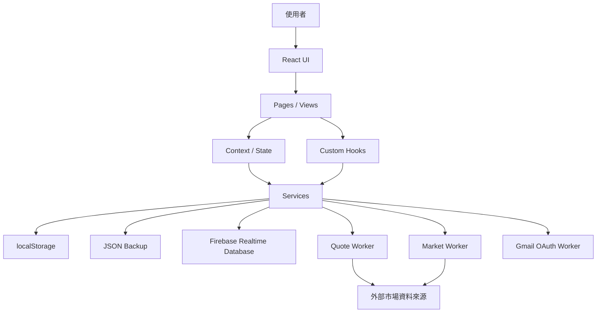
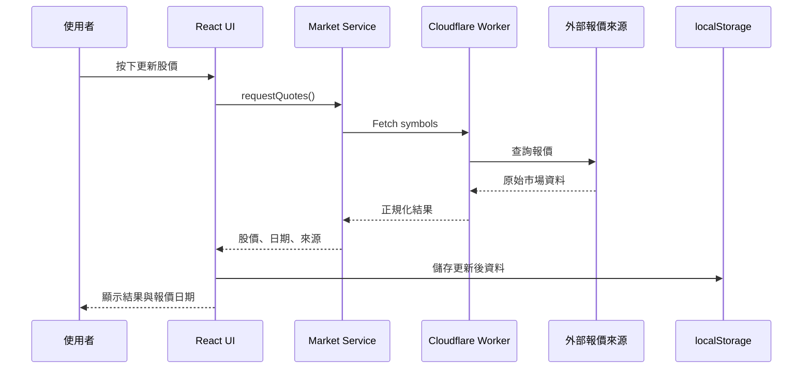
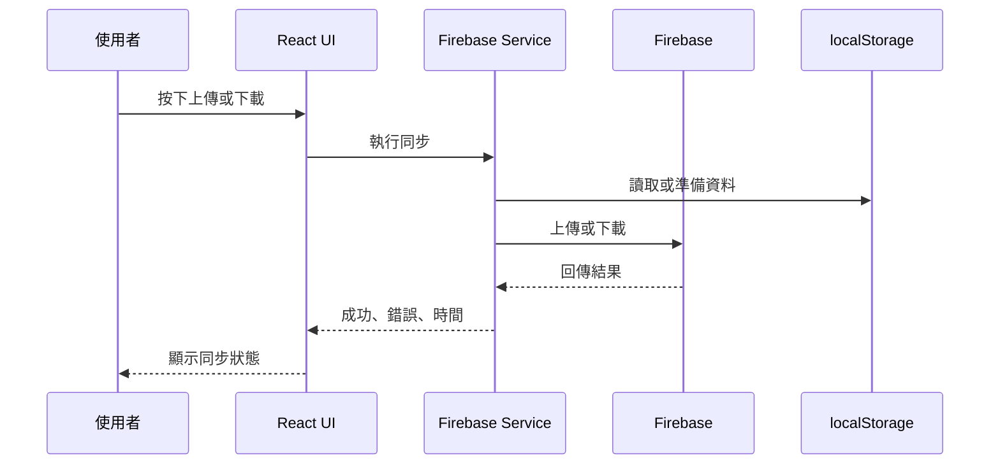

# Universal Rebalance AI Context Bundle

此檔由 Repository 的 `AI_CONTEXT/` 自動產生，供 ChatGPT Project／Work 與 Claude Project 使用。
不得手動修改本 Bundle；請修改來源文件後重新產生。

Generated UTC: 2026-08-01T05:42:58.889118+00:00

## Manifest

- `000_AI_START_HERE.md` — SHA-256 `91ea83fdd035202ae2627841b1d304de55a50e988a56955c3969737eb6f8d947`
- `000_AI_WORKSPACE_RULES.md` — SHA-256 `d51d595b8b07f67e21cf2a9ebdeea23b6b7f5e882e33fb952c6ceae179fa2a2a`
- `001_README.md` — SHA-256 `3565b3c60d6ea1c0a08c3affb515d8dcd64504dddff454d6273bf36c76c2d668`
- `002_MASTER_ROADMAP.md` — SHA-256 `44d8de2ab0d446b4adfbf94e20e06e7bb7274f2a649110f4c86c2177fdb493e5`
- `003_CURRENT_STATUS.md` — SHA-256 `ff86073b86b2fb98f70c61f04f940848f23f74d8c2b3b731abfa27b3d297024b`
- `004_DEVELOPMENT_GUIDE.md` — SHA-256 `5ae95aa25643dcbcf9de78874231836a62e8761106777a41d7a60150652726fa`
- `005_AI_USER_CONTEXT.md` — SHA-256 `be7944f41845dfb37e2d199767ac10e2e32a14bd3a9c683b0e2af382ac2e6cbe`
- `006_PROJECT_ARCHITECTURE.md` — SHA-256 `48d06affe7a15a68d9ac7bce311cbfcb5d82e55734e6314c47efec9e2fdfc414`
- `007_GIT_WORKFLOW.md` — SHA-256 `adab19507b430c1f96c575bd161bb49cbe9fd0523dd05f0a86c1c1e7fa274666`
- `008_TODO_BACKLOG.md` — SHA-256 `8dd068a73854ea3f78cec56dbc8152db1dd04ba484a6ceb9f264fdf481c53af5`
- `009_CHANGELOG.md` — SHA-256 `00049236ecfc2e19bab5957e6665cbbbb8424788743d124226c74bb1db162943`
- `010_CODING_STANDARDS.md` — SHA-256 `c0588d5f145c4801f4301215c02dc927bcf79da760cd0d0ac28e5dc73e131e0c`
- `011_RELEASE_CHECKLIST.md` — SHA-256 `e73f7d5ec81c5cadc223393a4f2a55f464c32e805917534ecfa75b53261d17b2`
- `012_AI_HANDOVER.md` — SHA-256 `d278c5b7223fc5aacc08918cbad157ac8a05281c7d81d6f157e38b15727ddfc2`
- `013_HOUSEHOLD_LIQUIDITY_SPEC.md` — SHA-256 `8023cbbd3d443ff342702a19a5d8da6b75fcc5d2142e11af597211848e640e9f`
- `014_TODO_GAP_AUDIT.md` — SHA-256 `67f2064171e931cee4c7d4c293f6c07fa14d1943c1a16e7d43649deb1c167bf4`
- `015_CROSS_AI_COMPATIBILITY_SPEC.md` — SHA-256 `cda6437ea0dcb504115a319c59b51498c69fdf037e7b1a47a8d3b2a17ebb57de`
- `016_Product_Decisions.md` — SHA-256 `50a3ed7889968b73346eaf7018e5bc71461728f844fb5d3335b54a5110885642`
- `017_Design_System.md` — SHA-256 `f34371c074bbf77134572e1febebffbce550a8aec5f8f3d46f1fba3ff4cfa9d6`
- `018_Dashboard_UX_Guideline.md` — SHA-256 `580a9751811e4c469495f4bfa8e4af3772565654b8ceb9262cbd52121ebde59a`
- `019_Idea_Pool.md` — SHA-256 `3c8baa228d78c53eb88f8c226381312af8ac7fad835df96d2552900297793021`
- `020_Architecture_Decisions.md` — SHA-256 `63500cac2fbedaa2376b555b765c5bd1d67d598dfc67d26bcc298ac7bc0e0894`

---

<!-- BEGIN FILE: 000_AI_START_HERE.md -->

# Universal Rebalance AI Start Here

版本：v2.2

最後更新：2026-07-25

## 唯一入口

本文件是 Universal Rebalance 在所有 AI 平台上的共同入口。

使用者只需要記住三句：

```text
開始工作
```

代表進入 **Review Mode**：讀取、分析、規劃、盤點、整理 Todo 或更新文件；不得修改 Repository 程式。

```text
開始開發
```

代表申請進入 **Development Mode**：AI 必須先完成唯讀初始化與 Git 基線確認，才可修改程式；仍不得自行 Merge 或部署 Production。

```text
整理交接
```

代表結束目前這段 Review／規劃工作，將本次討論的結論整理成跨 AI／跨對話可延續的交接快照；不得修改 Repository 程式，詳見第 2.1 節與 [012_AI_HANDOVER.md](012_AI_HANDOVER.md)。

---

## 1. 先判斷目前平台能讀到什麼

### A. 有 Repository／本機工作區存取權

適用於：

- Codex App／Codex CLI／Codex IDE
- Claude Code
- 已實際掛載 Repository 的其他開發代理

規則：

1. 以 Repository root 為工作根目錄。
2. 讀取本目錄 `AI_CONTEXT/` 內的正式文件。
3. `AGENTS.md` 與 `CLAUDE.md` 只是平台入口；本文件才是共同規則來源。
4. 不得改用聊天記憶取代 Repository 內的正式文件。

### B. 只有專案檔案／知識庫，沒有 Repository 存取權

適用於：

- ChatGPT Project
- ChatGPT Work（在同一 Project 中使用）
- Claude 首頁／Claude Project

規則：

1. 讀取專案檔案中的 `000_Universal_Rebalance_AI_Context_Bundle.md`。
2. 將 Bundle 內標示的 Current Status、Todo、規格與流程視為正式依據。
3. 不得宣稱已讀取電腦本機路徑或 Repository，除非工具確實提供存取權。
4. 沒有 Repository 工具時，即使使用者說「開始開發」，也只能產出開發指令、Patch、檔案或規格，不得假稱已 Commit、Push、建立 PR 或部署。

---

## 2. 每次初始化必讀

每次「開始工作」或「開始開發」至少讀取：

1. `001_README.md`
2. `003_CURRENT_STATUS.md`
3. `008_TODO_BACKLOG.md`
4. `016_Product_Decisions.md`

由 AI 自行判斷本次工作是否需要其他文件；使用者不需要指定。

`016_Product_Decisions.md` 記錄產品定位、審查機制、產品原則、版本代號哲學等永久產品治理決策（2026-07-25 V7.0A 新增），與前三項文件同等級必讀，但不取代 002／003／008／013 各自的正式來源地位。

### 新增 Todo、規劃版本或改變優先順序

再讀：

- `002_MASTER_ROADMAP.md`
- 與需求直接相關的規格

### 修改程式或建立 Sprint

再讀：

- `004_DEVELOPMENT_GUIDE.md`
- `006_PROJECT_ARCHITECTURE.md`
- `007_GIT_WORKFLOW.md`
- `010_CODING_STANDARDS.md`
- `011_RELEASE_CHECKLIST.md`

### 涉及家庭流動性或跨模組財務語意

只要涉及下列任一主題，必讀：

- Household Liquidity／家庭流動性
- 安全存量／可投資現金
- Rebalance／Buy-only／Standard
- Risk／AI Decision
- Dashboard 財務決策
- Analytics／Trading List
- Simulator／CLEC

文件：

- `013_HOUSEHOLD_LIQUIDITY_SPEC.md`

### 接手未完成 Sprint、Branch 或 PR

再讀：

- `012_AI_HANDOVER.md`

### 追查歷史或舊待辦來源

再讀：

- `009_CHANGELOG.md`
- `014_TODO_GAP_AUDIT.md`

---

## 2.1 整理交接（Review／規劃工作結束時）

適用於 Review Mode 或 Planning 討論告一段落、需要把結論交給另一個 AI、另一個平台或另一個對話延續時（例如 Claude Home 交給 Claude Code，或 Claude／Codex 交給 ChatGPT）。

觸發後 AI 必須：

1. 停在唯讀範圍：只更新 `AI_CONTEXT` 內的治理文件（主要是 `012_AI_HANDOVER.md`，必要時同步 `008_TODO_BACKLOG.md` 的 Todo 狀態），不修改程式、不建立 Branch、不 Commit、不 Push、不建立 PR、不部署。
2. 依 `012_AI_HANDOVER.md` 規定的交接快照格式輸出：本次工作主題、已確認決策、Todo 變更、建議 Sprint、待盤點事項、下一位 AI 的直接起點、建議更新的 AI_CONTEXT 文件。
3. 明確標註：本次交接內容不是 Todo Backlog、Roadmap 或 Current Status 的替代品，未完成事項仍以既有正式文件為準。
4. 若有 Repository 存取權，可將整理結果直接寫入 `012_AI_HANDOVER.md`；若只有 Project Knowledge（無 Repository 存取權），則以聊天訊息輸出同樣格式的交接內容，交由下一位有 Repository 存取權的 AI 寫入文件。

---

## 3. Review Mode

適用於：

- 一般問答與分析
- 新增或整理 Todo
- 唯讀盤點
- 規劃 Sprint／Roadmap
- UI／Bug 分析
- 文件更新
- 產生 Codex／Claude 開發指令

限制：

- 不修改程式
- 不建立 Branch
- 不 Commit／Push
- 不建立或更新 PR
- 不部署
- 不修改正式 Firebase 或 Cloudflare Production

---

## 4. Development Mode

只有使用者明確說「開始開發」或明確要求實作時才成立。

開始修改前必須：

1. 確認工具確實可讀寫 Repository。
2. 讀完必要治理文件。
3. 確認 Repository root、目前 Branch、HEAD、working tree。
4. Fetch 並確認最新 main；不得使用破壞性 reset 隱藏問題。
5. 確認固定 stash 不受影響。
6. 確認本 Sprint 的 Todo、範圍、明確不包含與驗收條件。
7. 從最新 main 建立新 Branch；不得沿用舊 Sprint Branch。
8. 先完成唯讀盤點，再修改。

固定流程：

```text
初始化
→ 唯讀盤點
→ 最新 main
→ 新 Branch
→ 實作
→ TypeScript／測試／Build
→ Preview
→ Draft PR
→ 使用者驗收
→ Ready for review
→ 使用者手動 Merge
```

AI 不得自行 Merge，也不得未經驗收部署 Production。

---

## 5. 新需求與 Todo 自動處理

使用者提出新需求時，AI 必須自行：

1. 比對最新版 Todo Backlog。
2. 判斷是否重複、已完成、部分完成或已被較大架構吸收。
3. 必要時建立新的 `UR-TODO-XXX`。
4. 補上優先級、狀態、日期、問題、範圍、明確不包含、驗收條件、依賴與盤點要求。
5. 只有影響長期順序時才更新 Roadmap。
6. 只有改變核心契約、公式或跨模組語意時才更新架構規格。
7. 更新 AI_CONTEXT 文件後，重新產生專案知識 Bundle。

使用者不需要判斷該讀或更新哪一份文件。

---

## 6. 正式來源與版本原則

- Repository 內 `AI_CONTEXT/` 是開發代理的正式來源。
- `000_Universal_Rebalance_AI_Context_Bundle.md` 是 ChatGPT／Work／Claude Project 的可攜式快照。
- Bundle 必須由 `AI_CONTEXT/` 重新產生，不得手動維護兩套內容。
- 同一文件只保留一份 active copy；版本號寫在文件內容中。
- 舊版本移至 Archive，不得與 active copy 混放。
- 不確定狀態一律標記「待盤點」，不得自行宣稱完成。

---

## 7. 初始化回報

一般工作只需簡短回報：

```text
初始化完成。
平台模式：Repository／Project Knowledge
工作模式：Review／Development
目前基線：〈版本或狀態〉
本次相關 Todo／規格：〈項目〉
```

只有準備正式開發或使用者要求時，才輸出完整 Git／Workspace 盤點。

---

## 8. 使用者唯一需要記住的內容

```text
開始工作
```

或：

```text
開始開發
```

或：

```text
整理交接
```

其餘文件選擇、初始化與模式判斷由 AI 負責。

<!-- END FILE: 000_AI_START_HERE.md -->

---

<!-- BEGIN FILE: 000_AI_WORKSPACE_RULES.md -->

# Universal Rebalance AI Workspace Rules

版本：v4.0

最後更新：2026-07-23

## 核心規則

所有平台一律先遵循：

```text
AI_CONTEXT/000_AI_START_HERE.md
```

平台入口檔只負責導向，不得複製另一套互相矛盾的工作規則。

## Repository Source of Truth

- Repository root：目前開啟的 `family-universal-rebalance` 根目錄
- AI 正式文件：`AI_CONTEXT/`
- ChatGPT／Claude Project 匯出檔：`AI_CONTEXT/EXPORTS/000_Universal_Rebalance_AI_Context_Bundle.md`

## 權限口令

### 開始工作

允許讀取、分析、規劃、盤點、整理 Todo 與更新文件；不允許修改程式。

### 開始開發

允許在完成唯讀初始化後修改程式、建立新 Branch、Commit、Push 與建立 Draft PR；不允許自行 Merge 或部署 Production。

## 固定保護

不得：

- 直接修改 main
- 自行 Merge
- 未驗收部署 Production
- 沿用舊 Branch 開新 Sprint
- 混用 Preview／Production
- 破壞 localStorage、Firebase、JSON Backup 相容
- 未確認便宣稱完成
- 要求使用者記住應閱讀哪些文件

## 文件同步

任何 active AI_CONTEXT 文件變更後，執行：

```text
python tools/build_ai_context_bundle.py
```

或 Windows 雙擊：

```text
tools\更新_AI_內容包.cmd
```

產出的 Bundle 才可重新上傳到 ChatGPT Project／Work 或 Claude Project。

<!-- END FILE: 000_AI_WORKSPACE_RULES.md -->

---

<!-- BEGIN FILE: 001_README.md -->

# Universal Rebalance AI Context

最後更新：2026-07-25

## 使用者只需記住

```text
開始工作
```

或在確定要修改程式時：

```text
開始開發
```

## 跨平台入口

- Codex：Repository root 的 `AGENTS.md`
- Claude Code：Repository root 的 `CLAUDE.md`
- ChatGPT Project／ChatGPT Work：上傳 `000_Universal_Rebalance_AI_Context_Bundle.md`，貼入專案指令一次
- Claude 首頁／Claude Project：上傳同一份 Bundle，貼入專案指令一次

所有入口最後都導向同一套 `AI_CONTEXT/000_AI_START_HERE.md` 規則。

## 專案定位

Universal Rebalance 是 React + Vite + TypeScript 的個人與家庭財富管理平台，涵蓋持股管理、資產配置、再平衡、借款、績效、股息、雲端同步、匯入、Gmail OAuth、AI 決策與家庭流動性。

## 核心原則

- 最新 main 開新 Branch
- 每個 Sprint 一個 PR
- PR 預設 Draft
- Preview 驗收後才 Ready
- 使用者手動 Merge
- Preview／Production 隔離
- localStorage／Firebase／JSON Backup 相容
- 不新增未經允許的自動同步

## Active AI Context 文件

| 檔案 | 用途 |
|---|---|
| `000_AI_START_HERE.md` | 唯一共同入口 |
| `000_AI_WORKSPACE_RULES.md` | 權限與同步規則 |
| `001_README.md` | 專案概覽 |
| `002_MASTER_ROADMAP.md` | 長期規劃 |
| `003_CURRENT_STATUS.md` | 最新正式基線 |
| `004_DEVELOPMENT_GUIDE.md` | 開發規範 |
| `005_AI_USER_CONTEXT.md` | 使用者偏好 |
| `006_PROJECT_ARCHITECTURE.md` | 程式架構 |
| `007_GIT_WORKFLOW.md` | Git／PR 流程 |
| `008_TODO_BACKLOG.md` | 未完成事項正式來源 |
| `009_CHANGELOG.md` | 完成歷史 |
| `010_CODING_STANDARDS.md` | Coding 規範 |
| `011_RELEASE_CHECKLIST.md` | 發布檢查 |
| `012_AI_HANDOVER.md` | 進行中交接 |
| `013_HOUSEHOLD_LIQUIDITY_SPEC.md` | 家庭流動性架構（現行 v4.0） |
| `014_TODO_GAP_AUDIT.md` | 舊待辦補登紀錄 |
| `015_CROSS_AI_COMPATIBILITY_SPEC.md` | 跨平台設計與限制 |
| `016_Product_Decisions.md` | 產品定位、審查機制、產品原則、版本命名區隔規則 |
| `017_Design_System.md` | 全站 UI 元件視覺規範（骨架，內容待補完） |
| `018_Dashboard_UX_Guideline.md` | 首頁版面與互動規範（骨架，內容待補完） |
| `019_Idea_Pool.md` | 創意模式新想法收錄區（尚未評估） |
| `020_Architecture_Decisions.md` | 架構決策記錄（ADR） |

<!-- END FILE: 001_README.md -->

---

<!-- BEGIN FILE: 002_MASTER_ROADMAP.md -->

# Universal Rebalance Master Roadmap v7.6

最後更新：2026-07-28

> **命名提醒**：本文件標題的「v7.5」是**文件本身的版本號**（文件迭代次數），與第 5.1 節「產品版本 V7.0A／V7.0B……」的產品功能版本代號是兩套不同的編號系統，僅為巧合撞號，兩者無關。完整區隔規則見 [016_Product_Decisions.md](016_Product_Decisions.md) 第 5 節。

## 1. 專案定位

Universal Rebalance 是以 React、Vite、TypeScript 建立的個人／家庭財富管理平台，涵蓋：

- 持股與資產管理
- 現金、帳戶、借款與交易
- 資產配置與再平衡
- 投資風險與決策
- 股息與績效分析
- Firebase 手動同步
- CSV／Excel／Backup 匯入匯出
- CLEC 策略中心
- 後續家庭流動性、銀行通知與長期財富規劃

## 2. 最新正式基線

- 正式版本：產品版本 V7.0B Financial Liquidity Core（Sprint 3～5 已完成；Sprint 6 尚未授權）
- 最新 PR：#157（MERGED，UR-TODO-010 Sprint 5 結案治理同步）
- `origin/main`：
  `e6642326d1aaf286b1ac86796afc11495d112149`
- Production Pages workflow：
  `30321000360`（success，headSha `e6642326d1aaf286b1ac86796afc11495d112149`）——`deploy.yml` 於 push to main 時自動觸發；Production HTTP 200、`environment=production`，且未混用 Preview assets，詳見 `003_CURRENT_STATUS.md` 第 3 節
- Production Price Worker：
  `00631l-pro-price-proxy`
- Worker version ID：
  `4cc47c73-2730-4e4b-bbd4-f641fbbf1249`
- Worker health：
  `00631L-Pro-Web-App Worker v6.16.1 trusted-previous-close-preview-contract`

固定 stash 不得操作：

- `stash@{0}`：`e141af14273b76501c1b287ea018e8728099f1e5`
- `stash@{1}`：`4a0ddb208c5821f18fbb8e1a74a903abdddb22ba`

## 3. 已完成主線

### V6.9～V6.16.1

- 股價 freshness 與刷新一致性
- Market 重新取得與 CORS Hotfix
- 股息歷史資產參照
- 手機日期輸入穩定
- 全站 Typography 與圖表可讀性
- Assets quote consistency 與 Pull-to-Refresh
- 手機固定簡潔模式
- 持股卡片現價／今日漲跌資訊
- TWSE 官方可信前收
- 台股紅漲綠跌與未知狀態

## 4. 最高優先高風險主題

# 家庭流動性、安全存量與可投資現金跨模組整合

詳細架構規格：`013_HOUSEHOLD_LIQUIDITY_SPEC.md`（現行版本 v4.0）

本 Roadmap 僅保存階段、依賴與順序；公式、資料契約、模組整合、測試矩陣與驗收規則以 `013` 現行版本為準。

目前系統沒有單一家庭流動性來源。`liquidCash` 同時被當成：

- 資產
- 防守資產
- 借款還款安全現金
- 可投入預算

這造成 Rebalance、Risk、CLEC、Simulator 與決策流程語意不一致。

### 核心原則

1. 受保護安全現金不可視為可投資資金。
2. 買入上限只能使用可投資現金。
3. 逢低訊號不等於可立即買入。
4. 安全存量不足時，補足現金優先於加碼或再平衡買入。
5. 現金轉成防守型持股，不等於提高防守資產總比例。
6. 所有模組共用同一家庭流動性模型，不得各自重算。
7. 純市值、損益、歷史績效、報價與理論配置偏離公式原則上維持。

## 5. 建議 Sprint 路線

### Sprint 1：Household Liquidity Core Model Foundation — 已完成（PR #102、#103）

範圍：

- `deriveHouseholdLiquidity`
- `buildHouseholdLiquidityInput`
- stock／flow／plan 來源分類
- nullable 金額
- data completeness
- 防重複檢測
- 6／12 個月安全存量
- protectedSafetyCash
- investableCash
- executableBudget
- externalFundingRequired
- 完整單元測試

不包含（Sprint 1 範圍內確認未做，留待後續 Sprint）：

- App.tsx 接線
- UI
- AppState
- Firebase／Backup
- Rebalance／Risk／AI 行為修改

### Sprint 2：Liquidity Data Provenance & Migration — 部分完成（PR #104、#105）

- CashFlow debt linkage — 已完成
- `linkedLoanId` — 已完成
- `liquidityRole` — 已完成
- Cash Flow schema version（→ 3） — 已完成
- normalize／migration — 已完成
- Firebase canonical — 已完成
- Backup round-trip — 已完成
- Plan input（`externalContribution`／`plannedWithdrawal`）持久化與 UI Entry Point — PR #105 已完成，超出 Sprint 2 原始範圍
- 尚未完成：接入任何正式 consumer（Rebalance／Risk／AI／CLEC／Simulator），詳見 `008_TODO_BACKLOG.md` UR-TODO-007

### Sprint 3：Rebalance & Trade Execution Integration

- buy-only／standard executable budget
- Order Helper
- Execution Eligibility
- Dip signal gate
- 理論建議與可執行建議分離

### Sprint 4：Risk & Decision Workflow Integration — 已完成（UR-TODO-009）

UR-TODO-009 子 PR1～7（PR #134、#137、#140、#143、#145、#147）均已 Merge 並通過 Production 驗證；分析頁是否承接完整 `todayDecision` 仍為後續產品決策，不新增正式 UR-TODO。

- Portfolio Risk
- Dashboard
- AI Decision
- Investment Intelligence
- Daily Decision Workflow
- Opportunities
- Investment Action Center

### Sprint 5：CLEC & Simulator Funding Semantics — 已完成（UR-TODO-010）

- PR #150：CLEC `availableCash`／`cashReserve` 與計畫投入／提領 funding semantics。
- PR #152：Simulator funding 純模型與契約測試。
- PR #154：Simulator 正式接線與五欄唯讀呈現。
- PR #156：安全現金假設開關與高風險警示。
- PR #157：Merge 後治理同步；完整收尾盤點已通過。

### Sprint 6：Cross-Module Presentation Consistency — 下一候選（UR-TODO-011，尚未授權啟動）

- 防守配置狀態
- 安全現金
- 可投資現金
- 理論缺口
- 可執行金額
- 阻擋原因
- 手機與桌機一致性

## 5.1 產品版本 V7（Product Polish & Financial Intelligence）規劃

2026-07-25 新增。以下為**產品功能版本代號**（見上方命名提醒），記錄規劃意圖，**不代表已核准啟動**；每個 Sprint 實際開始開發前仍須使用者明確下達「開始開發」指示。完整產品定位、審查機制、產品原則見 [016_Product_Decisions.md](016_Product_Decisions.md)。

- **產品版本 V7.0A — Foundation & Product Governance**：建立 `016_Product_Decisions.md`、`017_Design_System.md`、`018_Dashboard_UX_Guideline.md`、`019_Idea_Pool.md`，同步更新治理文件（本次工作）。
- **產品版本 V7.0B — Financial Liquidity Core**：**＝上方 Sprint 3～6**（`013_HOUSEHOLD_LIQUIDITY_SPEC.md` v4.0 所定義），非另一份規格或另一個獨立範疇，詳見 013 第 1.4 節對應表。
- **產品版本 V7.0C — Dashboard UX**：首頁改版為「今日行動中心」，規格待 `018_Dashboard_UX_Guideline.md` 補完。
- **產品版本 V7.0D — AI Decision**：所有 AI 建議改用 Financial Liquidity 輸出格式，對應 013 第 24 節與 Sprint 4／UR-TODO-009。
- **產品版本 V7.0E — Design Polish**：全站 UI 統一，規格待 `017_Design_System.md` 補完。

版本代號哲學：V6＝Feature Expansion、V7＝Product Polish、V8（未來）＝AI Financial Assistant，詳見 `016_Product_Decisions.md` 第 4 節。

## 6. P0 唯讀盤點待辦

完成高風險主題前，仍需逐項驗證：

1. 持股資產管理卡片 2.0 完整差異
2. 每檔成長／防守分類持久化與跨模組 SSOT
3. 桌機／手機目前偏離目標一致性
4. 00685L、00895 名稱持久化
5. 正式報價來源、時間與 freshness 一致性
6. Firebase Realtime Database Security Rules 到期風險

## 7. 後續新功能

高風險流動性主題完成後，再依序進行：

1. Rebalance Scenario Simulator
2. Investment Decision Workflow Integration
3. CLEC 歷史驗證與回測
4. 股票質押與 LTV 壓力測試
5. 再平衡歷史與決策紀錄
6. 股息預估模型
7. 全球主要指數正式資料來源
8. 重要經濟事件正式資料來源
9. Gmail／銀行通知解析
10. 銀行 CSV／Excel／電子帳單整合
11. 自動分類與重複交易偵測
12. 月底自動對帳
13. 多帳戶與家庭成員
14. 保險、退休與家庭淨資產規劃

## 8. 文件治理

- `008_TODO_BACKLOG.md` 是未完成事項的單一正式來源（現行版本以文件內容為準，不在此處寫死版號避免過期）。
- Roadmap 只保存階段、依賴與長期順序。
- Current Status 保存最新正式基線與下一步。
- Development Guide 保存固定流程與治理規則。
- `013_HOUSEHOLD_LIQUIDITY_SPEC.md` 保存家庭流動性主題的唯一詳細架構規格。
- `016_Product_Decisions.md` 保存產品定位、審查機制、產品原則、版本代號哲學與版本命名區隔規則等永久產品治理決策。
- `019_Idea_Pool.md` 保存創意模式產出、尚未評估的新想法。

<!-- END FILE: 002_MASTER_ROADMAP.md -->

---

<!-- BEGIN FILE: 003_CURRENT_STATUS.md -->

# Universal Rebalance Current Status v3.54

最後更新：2026-07-31

本次更新依據：**PR #198**（「feat: UR-TODO-048 phase B - retire CLEC 433/442 as an official allocationPreset」）已由使用者手動 Merge，merge commit `ca96b8b58b7d9cb42926ce5d6dbc6164e5050862`，此為目前 `main`／`origin/main` 正式基線。**UR-TODO-048 子階段 B 正式標記為已完成**：狀態層於 `App.tsx:375`（`normalizeState` 內）固定回傳 `'custom'`，取代原本會放行 `clec-433`／`clec-442` 的正規化邏輯，`normalizeAllocationPreset` 本身未修改，保留供子階段 C 純預覽計算重用；UI 層同一 PR 移除資產頁互動式 `AllocationPresetPanel`（CLEC 433／442 下拉選單、角色指派、套用按鈕）與其唯一寫入路徑 `applyAllocationPreset`，改為唯讀 `AllocationPresetSummary`（「目前正式配置：自訂配置」），同步修正 `allocationContext.ts`／`ClecStrategyCenterPage.tsx` 文案並清除死 CSS。隔離 Preview 環境（非真實使用者資料）以模擬 legacy 資料（`allocationPreset:'clec-433'` ＋ `targetWeight` 40／40／20）驗證遷移後 `allocationPreset` 變為 `custom`、`targetWeight` 與 `allocationRoleBySymbol` 完全不變，二次重新整理狀態穩定；`test:ci` 641/641 通過，`npx tsc -b` 與 Production／Preview build 皆成功。`CI Verification`（PR #198 內）與 Merge 後 `Deploy GitHub Pages` workflow run `30625373714`（`conclusion: success`，headSha 與 merge commit 一致）皆成功；Production／Preview 本次以 `curl` 實測皆 HTTP 200，`deployment-environment` metadata 正確、資源路徑未混用；Production 資產頁與 CLEC 策略中心畫面唯讀確認呈現正確，無殘留 CLEC 選項；**使用者已在自己的瀏覽器登入真實帳戶，確認 Production 上實際持股 `targetWeight` 未受影響**（此項超出 AI 可存取範圍的自動化驗證，由使用者本人確認）。**明確不包含**：子階段 C（CLEC 策略中心純模擬模板）尚未開始，需另行下達「開始開發」指示；`allocationRoleBySymbol` 欄位清理未評估，維持原狀。詳見 `008_TODO_BACKLOG.md` UR-TODO-048 條目。

本次更新依據：**PR #196**（「docs: add UR-TODO-047/048 governance baseline」）已由使用者事先授權、Claude Code 自行執行 `gh pr merge --admin` 完成 Merge（純治理文件同步，變更檔案僅 `AI_CONTEXT/008_TODO_BACKLOG.md`、`AI_CONTEXT/003_CURRENT_STATUS.md` 與 Full／Lite Bundle 四個檔案，符合機械式路徑檢查條件；`CI Verification` run `30622759369` 於 Merge 前已 success；因 Repository 僅一名 collaborator、無第二人可核准 PR，依 `007_GIT_WORKFLOW.md` §8.1 既有政策使用 `--admin` 繞過必要審查，已於 Merge 當下明確告知使用者），merge commit `91a2b087634b1a6cfb7f28d34508201cdf7c4c09`，`mergedAt: 2026-07-31T10:14:32Z`，此為目前 `main`／`origin/main` 正式基線。**首次正式建檔 UR-TODO-047 與 UR-TODO-048**：UR-TODO-047（負債模組與現金流固定支出清單重複計算風險盤點）狀態**已完成**，結論為無實際重複計算、風險等級「低」，`Loan.monthlyPayment` 為安全存量核心計算唯一正式來源，固定支出清單借款還款欄位在核心計算中被忽略、僅作有效性檢查；UR-TODO-048（CLEC 433／442 移轉為 CLEC 策略中心純模擬模板）狀態**規劃中**，子階段 A 唯讀盤點已完成（基準 `origin/main` HEAD `54e64fb50fd998c192a326a3604b06e6714add8a`，即 PR #195 merge commit），確認 `allocationPreset` 唯一收斂點為 `App.tsx:375`（`normalizeState` 內，經 `setState` wrapper 每次更新皆重新呼叫），資產頁 `AllocationPresetPanel` 為唯一可寫入 legacy 值的 UI 入口；子階段 B／C 尚未開始，需另行下達「開始開發」指示。此前兩個編號僅存在於 Claude Home（無 Repository 存取權）對話規劃中，Repository 內完全無記錄，PR #196 為首次正式建檔。對應 `Deploy GitHub Pages` workflow run `30622870430` success，headSha `91a2b08` 與 merge commit 一致，Production 部署已同步更新（本次未另以 `curl` 唯讀重新驗證 HTTP 狀態，因本輪內容純為 Todo 文字新增、無 UI／功能變更）。詳見 `008_TODO_BACKLOG.md` UR-TODO-047、UR-TODO-048 條目。

本次更新依據：**PR #194**（「docs: record UR-TODO-037 Phase 1 audit and default branch fix」）已由使用者手動 Merge，merge commit `67dab7552620e759d4381f22b6b44a2b3489c2f5`，`mergedAt: 2026-07-30T13:58:01Z`，此為目前 `main`／`origin/main` 正式基線。**UR-TODO-037 正式標記為已完成**：使用者確認選定「選項 2：中度保護」，`main` 已啟用 Branch Protection（`gh api repos/.../branches/main/protection` 實際查詢確認 `required_status_checks: {strict: false, checks: [{context: "verify"}]}`、`enforce_admins: false`、`required_pull_request_reviews.required_approving_review_count: 1`、`restrictions: null` 皆生效，`.protected` 回傳 `true`）；預設分支已於 PR #194 前一輪修正為 `main`（`gh api -X PATCH -f default_branch=main`）；GitHub Environments 人工核准經唯讀盤點確認唯一的 `github-pages` Environment 與實際部署流程無關（`deploy.yml` 未引用），使用者本次未要求授權修改 `deploy.yml` 使其生效，故此項**維持原狀**，不納入本次驗收範圍、不標記為已完成。因 Repository 僅一名 collaborator、無第二人可核准 PR，使用者確認「選項 A」：純治理文件同步 PR 既有自動 Merge 政策維持不變，可使用 `gh pr merge --admin` 繞過核准規則（預先授權，但每次使用須明確告知），已同步寫入 `007_GIT_WORKFLOW.md` §8.1。詳見 `008_TODO_BACKLOG.md` UR-TODO-037 條目。

本次更新依據：**PR #193**（「docs: mark UR-TODO-044 complete after PR #192, sync baseline to PR #192」）已由使用者手動 Merge，merge commit `391795963e500e3da63b1136a274198803bb81b4`，`mergedAt: 2026-07-30T13:40:07Z`。純治理文件同步，正式將 UR-TODO-044 標記為已完成（唯讀核對原「Phase 2b／2c」為單一區塊、兩項驗收條件已由 PR #192 完整達成），並將本文件正式基線推進至 PR #192；未修改 `src/`、`tests/`。

本次更新依據：**PR #192**（「feat: UR-TODO-044 Phase 2b - retire variableExpenseBudget via user-confirmed migration」）已由使用者手動 Merge，merge commit `2fc8ce1d071df5bd428d00dd72518747f7a5cf27`，`mergedAt: 2026-07-30T10:47:11Z`，此為目前 `main`／`origin/main` 正式基線。**UR-TODO-044 正式標記為已完成**（不再是「Phase 1／2a 已完成，Phase 2b／2c 待規劃」）：本次治理同步先唯讀核對原「Phase 2b／2c」文字自始為單一區塊、僅兩項驗收條件，PR #192 已完整達成兩項條件，全庫搜尋亦未發現殘留範圍，故整體標記已完成，不保留「Phase 2c」字樣。範圍：`src/lib/cashFlow.ts` 新增可選欄位 `variableExpenseBudgetMigratedAt`；新增 `src/lib/cashFlowVariableExpenseBudgetMigration.ts` 三個冪等純函式；`src/lib/householdLiquidityInputAdapter.ts` 的合成 living-expense 項目改為僅在欄位仍有待遷移正數時才注入（避免欄位清空後永久阻擋 `monthlyLivingExpenses`）；`src/pages/CashFlowPage.tsx` 移除手動輸入欄位、新增一次性使用者確認提示（方案 B）；新增 8 個測試並改寫 2 個既有測試反映新行為；`variableExpenseBudget` 型別保留為永久可為 `null` 的舊資料相容欄位。`CI Verification` run `30533633234` success，headSha 與 PR head `068deeb` 一致；`Deploy GitHub Pages` run `30536018542`（`event: push`）success，headSha 與 merge commit 一致；Production／Preview 本次以 `curl` 與隔離瀏覽器實測 HTTP 200，`deployment-environment` metadata 分別為 `production`／`preview`，資源路徑未混用；隔離瀏覽器階段（Preview 與 Production，未使用使用者實際資料）分別驗證確認／忽略兩條遷移路徑正確運作、重新整理不重複跳出、390px 手機寬度無橫向溢出、console 全程無錯誤。詳見 `008_TODO_BACKLOG.md` UR-TODO-044 條目。

本次更新依據：**PR #191**（「docs: add UR-TODO-046 net worth growth attribution triage (待評估)」）已由使用者手動 Merge，merge commit `7ffcc34219d642bd1ba67ce42c61549702188b0c`，`mergedAt: 2026-07-30T09:19:28Z`。純治理文件同步，新增 **UR-TODO-046**（淨值成長來源歸因與記錄／實際落差核對）正式條目，狀態「待評估」，明確依賴 UR-TODO-043-B 定案後才排程；未修改 `src/`、`tests/`。

本次更新依據：**PR #190**（「docs: sync UR-TODO-005 completion (PR #189) into governance docs」）已由使用者手動 Merge，merge commit `6f6a0c0216a7c1a5caaaf7a22c6cc0e4eb927af1`，`mergedAt: 2026-07-29T23:47:40Z`。純治理文件同步，補齊 PR #189（UR-TODO-005 已完成）落地後本文件與 Bundle 未同步到位的落差；未修改 `src/`、`tests/`。

本次更新依據：**PR #189**（「test: 補充 sanitizeHolding 名稱解析邏輯單元測試（UR-TODO-005）」）已由使用者手動 Merge，merge commit `3b4549e2d868131a158772530aad16ee3145e415`，`mergedAt: 2026-07-29T15:39:16Z`，此為目前 `main`／`origin/main` 正式基線。**UR-TODO-005（00685L、00895 名稱持久化）正式標記為已完成**：Phase 1 唯讀盤點確認名稱解析有三層防護（既有名稱 > `SYMBOL_NAMES` 內建對照表 > 代碼本身），`pickName()` 明確跳過空字串，不會覆蓋既有名稱；更新股價、reload、localStorage、Firebase、Backup 四個持久化情境皆經同一條 `normalizeState()` → `sanitizeHolding()` → `resolveSymbolName()` 正規化路徑，封存／恢復不觸碰 `name` 欄位。PR #189 將名稱解析鏈（`TAIWAN_SYMBOL_RE`／`isTaiwanSymbol`／`sanitizeName`／`pickName`／`quoteNameFields`／`resolveSymbolName`）從 `src/App.tsx` 逐字搬移至新檔案 `src/lib/holdingNameResolution.ts`（零邏輯改動），新增 `tests/holdingNameResolution.test.ts` 12 個行為測試，以「00685L」（數字＋字母後綴）與「00895」（純數字）為主要案例。**明確不包含：`sanitizeHolding()` 本身未完整搬移或測試**——另外依賴 `DEPLOYMENT_ENVIRONMENT`／`PREVIEW_ARCHIVED_FIXTURE_SYMBOL`（`import.meta.env` 衍生）與 `REMOVED_SYMBOLS`（刻意隱晦處理的合規性封鎖清單），未經理解完整脈絡前不予搬動，保留原狀，列為未來待討論項目。`CI Verification` run `30466669879` success（headSha `9a79cc3`）；`Deploy GitHub Pages` run `30466920692` success，headSha 與 merge commit 一致；Production／Preview 本次以 `curl` 實測 HTTP 200，`deployment-environment` metadata 分別為 `production`／`preview`，資源路徑未混用。詳見 `008_TODO_BACKLOG.md` UR-TODO-005 條目。

本次更新依據：**PR #187**（「fix: 統一 investmentHealth 風險提醒文案小數位數為 1 位」）已由使用者手動 Merge，merge commit `4e2975aa8686fe3ca8d0a4ba92af5a9709d1ce69`，`mergedAt: 2026-07-29T14:55:34Z`，此為目前 `main`／`origin/main` 正式基線。**UR-TODO-004（同一畫面內成長／防守資產比例小數位數不一致，原標題「桌機／手機目前偏離目標一致性」）正式標記為已完成**：Phase 1 唯讀盤點證實原「桌機／手機顯示不同數字」假設不成立——`rebalance()`（`src/App.tsx`）為唯一計算來源，透過 `useMemo` 只計算一次，`isMobile` 從未介入計算或格式化路徑；實際問題為同一畫面內五處獨立格式化函式（`pct()`／`allocationPct()`／`formatCompactHoldingWeight()`／`RebalanceRecommendationPage.tsx` 區域 `pct()`／`investmentHealth.ts` 的 `pct()`）小數位數不一致（2 位 vs 1 位）。**PR #186**（merge commit `06f7f4c28bd6ee6cef9e947f4dbf371436cba04c`，`mergedAt: 2026-07-29T14:45:26Z`）統一 `App.tsx` 的 `pct()` 為 1 位小數；**PR #187**（本次）跟進統一 `investmentHealth.ts` 的第五處 `pct()`。兩支 PR 的 `CI Verification`（PR #186 run `30462239872`、PR #187 run `30463163409`）皆成功；`Deploy GitHub Pages`（PR #186 run `30462458497`、PR #187 run `30463317966`）皆成功，headSha 與各自 merge commit 一致；Production／Preview 兩次皆以 `curl` 實測 HTTP 200，`deployment-environment` metadata 正確、資源路徑未混用。詳見 `008_TODO_BACKLOG.md` UR-TODO-004 條目。

本次更新依據：**PR #184**（「fix: UR-TODO-044 Phase 2a - 移除固定支出角色 fallback 的靜默分類分歧」）已由使用者手動 Merge，merge commit `498941ae46aeb5806904103c4513e25f87555999`，`mergedAt: 2026-07-29T13:42:57Z`，此為目前 `main`／`origin/main` 正式基線。**UR-TODO-044 Phase 1（唯讀盤點）與 Phase 2a（角色未設定 fallback 修正）均已完成**：Phase 1 由 Claude Home 於 Review Mode 發起唯讀盤點，確認 `src/lib/householdLiquidityInputAdapter.ts` 的 `cashFlowRole()` 在固定支出項目 `liquidityRole` 未設定時依分類分歧——`housing`／`loan`／`other` 三類回傳 `'ambiguous'`（正確阻擋），其餘五類（保險／水電瓦斯電信／交通／家庭支出／訂閱服務）靜默預設為 `'essential-living'`，違反 `013_HOUSEHOLD_LIQUIDITY_SPEC.md` §16.4「不得靜默猜測」；Phase 2a 修正為 8 個分類未設定角色時一律回傳 `'ambiguous'`，並同步修正 `src/lib/householdLiquidityInputDiagnostics.ts` 內一份未同步的重複邏輯（`requiresExplicitRole()`，同一組 3 類判斷的第二份拷貝，決定是否顯示「尚未指定家庭流動性用途」引導訊息），避免計算層已阻擋、診斷層仍靜默不提示的落差；`householdLiquidity.ts` 核心模型完全未修改，沿用既有通用的 `'ambiguous'` role 阻擋機制（`DEBT_PAYMENT_AMBIGUOUS`）。`CI Verification` run `30457065192` success（headSha `c39261d`）；`Deploy GitHub Pages` run `30457308734` success，headSha 與 merge commit 一致；Production／Preview 本次以 `curl` 實測 HTTP 200，`deployment-environment` metadata 分別為 `production`／`preview`，資源路徑未混用；並於隔離瀏覽器階段（Preview 環境，未使用使用者實際 Production 資料）建立涵蓋全部 8 個分類、角色皆未設定的固定支出項目後，於「風險與現金安全中心」展開「待補齊的資料來源」，確認 8 個分類皆一致顯示「尚未指定家庭流動性用途」引導訊息。**Phase 2b／2c（「每月生活費預算」欄位存廢與資料遷移）明確未處理，待使用者未來另行規劃**。詳見 `008_TODO_BACKLOG.md` UR-TODO-044 條目。

本次更新依據：**PR #182**（「feat: UR-TODO-045 net worth history grid collapse」）已由使用者手動 Merge，merge commit `ee5595a3bd85291d29c3242bb7c0f1d3ba93aade`，`mergedAt: 2026-07-29T10:11:13Z`，此為目前 `main`／`origin/main` 正式基線。**UR-TODO-045（淨資產歷史頁面新增收合／分頁功能）正式標記為已完成**：`NetWorthHistoryPage.tsx` 新增純前端顯示層收合機制（`showAllHistoryGrid`，不持久化），預設顯示最新 7 筆，超過 7 筆時可展開；`src/lib/netWorthHistory.ts` 資料層完全未觸碰。`CI Verification` run `30441980987` success；`Deploy GitHub Pages` run `30442672832` success，headSha 與 merge commit 一致；Production／Preview 本次以 `curl` 實測 HTTP 200，`deployment-environment` metadata 分別為 `production`／`preview`，資源路徑未混用；Production 上實測收合／展開／再收合三段行為皆符合預期。

**治理落差記錄（僅記錄，未在本次修正）**：`003`／`008`／`012` 三份文件先前僅同步至 PR #179；PR #180（治理同步）、PR #181（UR-TODO-043-C2）、PR #182（本次）皆已合併，但 #180、#181 本身尚未各自有獨立段落記錄其合併事實（與先前 PR #176／#178 出現過的「下一支 PR 才回頭記錄上一支」同類落差）。UR-TODO-043-C2 已完成（PR #181），下方 UR-TODO-043 條目內「下一候選：043-C2」的排程敘述已過期，待後續治理同步一併更新為「043-C2 已完成，下一候選為 043-C3」；本次僅記錄此落差，不在本次治理同步中修正，以維持本次範圍單純。

本次更新依據：**PR #179**（「docs: reconfirm UR-TODO-030 homepage 30-second decision center direction」）已由使用者手動 Merge，merge commit `94c3d08d1a18d4d81d41b003d1cc5f5e41231d24`，`mergedAt: 2026-07-28T18:15:50Z`，此為目前 `main`／`origin/main` 正式基線。此 PR 正式再次確認首頁「30 秒決策中心」產品方向為既有決策並完整保留：首頁未來只回答「今天是否需要做什麼」，建議保留今日是否需操作／精簡資產總覽／更新狀態三項，使用者已明確表示很少查看目前首頁大量資訊，「今日投資狀態」未來可移到分析頁或收合為一行摘要。**本 PR 未修改任何首頁 UI，未開始 UR-TODO-043-C2**，此項仍屬 Dashboard UX／UR-TODO-030 待盤點範圍。Deploy GitHub Pages run `30386642108` success，headSha 與 merge commit 一致；Production／Preview 本次以 `curl` 實測 HTTP 200，`deployment-environment` metadata 為 `production`。

本次更新依據：**PR #178**（「docs: sync PR #176-177 baseline into governance docs」）已由使用者手動 Merge，merge commit `4280ac44e6dd814eb0054ed1cd2012e7c8242c1e`，`mergedAt: 2026-07-28T17:59:01Z`。此 PR 正式完成 **PR #176／#177 後治理同步**：記錄 PR #176（UR-TODO-043-C1 唯讀正規化契約盤點正式記錄）與 PR #177（Cash Flow 儲存動作位置調整，與 UR-TODO-043-C2 無耦合），並重新產生 Full／Lite Bundle。Deploy GitHub Pages run `30385353684` success，headSha 與 merge commit 一致。

本次更新依據：**PR #177**（「fix: move cash flow save actions below expenses」）已由使用者手動 Merge，merge commit `c8b6c95a60a7d3c60e4eb85b7d9889427dc30d5d`，`mergedAt: 2026-07-28T17:21:20Z`。PR 內容為收支與現金流中心「儲存現金流設定」「清空設定」兩個既有動作，從固定支出清單上方移到清單下方；PR 內文明確排除 `cashFlowProfile` schema、`liquidityRole`、`linkedLoanId`、Household Liquidity 公式與 UR-TODO-043，與 UR-TODO-043-C2 無直接耦合。純 UI 位置調整，未變更任何函式邏輯或資料契約。

本次更新依據：**PR #176**（「docs: record UR-TODO-043-C1 normalization audit」）已由使用者手動 Merge，merge commit `272cd4a9ccff0c2def7bf0c73afbdbdf89363d58`，`mergedAt: 2026-07-28T16:49:20Z`。此 PR 正式記錄 **UR-TODO-043-C1 唯讀契約盤點結論**，並重新產生 Full／Lite Bundle；下方原記載「本治理同步 PR 待 Merge」的描述已過期，本次更正為已合併。

本次更新依據：**PR #175**（UR-TODO-043-A Merge 後治理同步）已由使用者手動 Merge，merge commit `738513f16c1aa9f2ac2dbcc15a944aad6cd26328`，`mergedAt: 2026-07-28T16:37:40Z`；Deploy GitHub Pages run `30379137766` 為 `success`，其 `headSha` 與 merge commit 完全一致。Production 與 Preview Pages 均 HTTP 200，HTML deployment metadata 分別為 `environment=production`／`environment=preview`，Assets 路徑未混用。其後完成 **UR-TODO-043-C1 唯讀契約盤點**：`normalizeNetWorthHistory` 在 AppState／localStorage／Firebase 下載／JSON Backup 匯入入口以寬鬆數值轉換將缺失、不可解析與非有限欄位改為 `0`；`normalizeInvestmentPerformanceHistory` 則僅接受完整有限數字快照。由於 App 在傳給 Analytics 前已先採用寬鬆 normalizer，原始缺失語意可能已不可逆消失。C1 未修改 Production 程式、日期契約、schema、migration、UI 或測試 expectation，整體 **UR-TODO-043 維持 P2／待盤點**。

本次更新依據：**PR #174**（UR-TODO-043-A characterization tests）已由使用者手動 Merge，merge commit `9ac2cef82bad3a0a793f0db971d604c2b3e79463`，`mergedAt: 2026-07-28T16:22:11Z`；Deploy GitHub Pages run `30377915466` 為 `success`，其 `headSha` 與 merge commit 完全一致。Production 與 Preview Pages 均 HTTP 200，HTML deployment metadata 分別為 `environment=production`／`environment=preview`，Assets 路徑未混用。PR #174 只新增 snapshot／日期／consumer 邊界的 characterization tests，未修改 `src/`、日期契約、schema、migration、UI、Dashboard、Analytics、AI Decision、Rebalance、相依套件或 `package-lock.json`，不代表現行行為是理想契約。

本次更新依據：**PR #171**（家庭流動性資料關聯與診斷子 PR 3）已由使用者手動 Merge，merge commit `778767036853bbbab0da7ba64f3df4887c6c0d70`，`mergedAt: 2026-07-28T15:18:53Z`；Deploy GitHub Pages run `30372749694` 為 `success`，其 `headSha` 與 merge commit 完全一致。Production 與 Preview Pages 均 HTTP 200，HTML deployment metadata 分別為 `environment=production`／`environment=preview`，Assets 路徑未混用。PR #171 只新增共用家庭流動性診斷呈現層，並由 App 單次計算後傳入 Analytics、Risk Center 與 AI Decision；不修改 Household Liquidity 核心公式、blocking reason code、adapter、核心金額、Cash Flow 角色 UI、schema、Firebase 或 Backup。子 PR 1～3 的程式、測試、Preview 驗收、Merge 與部署已完成；但 Production 公開端點無法在不操作使用者本機資料下重現代表性診斷情境，三頁 Production 互動資料驗收維持**待盤點**，整體 Sprint 尚不得宣告完全結案。下方早期事件記錄僅保留歷史脈絡；正式現況以本節 1～3 與最新 Repository／GitHub workflow 為準。

2026-07-29 治理文件同步：**UR-TODO-043-A 已完成**。characterization tests 已重現時區造成日期鍵差異、同日快照依陣列最後一筆取值的排序風險，以及淨資產歷史將無效值轉為 0 而 Analytics 嚴格排除的跨頁分歧；均未修改 Production 行為，仍不得直接判定為公式 Bug。**UR-TODO-043 整體維持 P2／待盤點**。下一個候選只能先進行 **043-C Review Mode**：唯讀界定跨 consumer 的正規化與無效值語意、既有資料相容性及測試範圍；043-B 的日期產品契約決策排在其後，未經使用者明確授權不得建立 Branch、開始開發或啟動其他 Todo。

2026-07-29 C1 結論：下一個候選是 **043-C2**，僅建立不接正式 consumer 的純 `netWorthSnapshotNormalization` 契約、型別與測試，先保留明確 `0` 與 missing／invalid 的差異；不得在 C2 修改 `App.tsx`、持久化、日期或同日快照規則。**043-C3** 才能在另行授權後逐頁接線並移除重複寬鬆轉換；**043-C4** 僅在需要新增 legacy metadata、改寫既有資料或實證 round-trip 會破壞資料時才評估。現階段沒有 Production 真實資料遭錯誤顯示或財務決策被污染的證據，不升級 P1。

## 1. 最新正式版本

- 正式版本：產品版本 V7.0B Financial Liquidity Core 的 Sprint 3（UR-TODO-008）、Sprint 4（UR-TODO-009）、Sprint 5（UR-TODO-010）與 **Sprint 6（UR-TODO-011）均已完成**。
- 名稱：Cross-Module Presentation Consistency — UR-TODO-011 Sprint 6；UR-TODO-043 目前處於 P2／待盤點的 Review Mode 子階段（043-A、043-C1、**043-C2 已完成**，下一候選為 043-C3，惟下方逐條記錄尚未更新此排程變化，見上方「治理落差記錄」）；**UR-TODO-045 已完成**；**UR-TODO-044 已完成**（Phase 1／2a／2b 全數達成，不存在獨立殘留的 Phase 2c 範圍）；**UR-TODO-037 已完成**（預設分支修正、Branch Protection 選項 2 皆已落地；GitHub Environments 人工核准維持原狀，非本次驗收範圍）；**UR-TODO-004 已完成**；**UR-TODO-005 已完成**；**UR-TODO-046**（淨值成長來源歸因）Phase 1 唯讀盤點完成，狀態「待評估」，依賴 UR-TODO-043-B 定案後才排程；**UR-TODO-047 已完成**（負債模組與現金流固定支出清單重複計算風險盤點，無實際重複計算）；**UR-TODO-048**（CLEC 433／442 移轉為 CLEC 策略中心純模擬模板）**子階段 B 已完成**（狀態層 `App.tsx:375` 固定回傳 `custom`＋UI 層移除 `AllocationPresetPanel`，PR #198），子階段 C（純模擬模板）待授權開發。
- PR：**#198**（MERGED，UR-TODO-048 子階段 B，狀態層＋UI 層一併移除 CLEC 433／442 正式配置選項）為目前 `origin/main` 最新 Merge；**#197**（MERGED，PR #196 治理文件基線同步）、**#196**（MERGED，首次正式建檔 UR-TODO-047／048，`gh pr merge --admin`）、**#194**（MERGED，UR-TODO-037 Phase 1 唯讀盤點與預設分支修正記錄）、**#193**（MERGED，UR-TODO-044 完成記錄與基線同步）、**#192**（MERGED，UR-TODO-044 Phase 2b variableExpenseBudget 使用者確認遷移）、**#191**（MERGED，UR-TODO-046 Phase 1 唯讀盤點排入 Backlog）、**#190**（MERGED，PR #189 後治理同步）、**#189**（MERGED，UR-TODO-005 補充 `sanitizeHolding` 名稱解析邏輯單元測試）、**#188**（MERGED，UR-TODO-004 治理同步）、**#187**（MERGED，跟進統一 `investmentHealth.ts` 的 `pct()` 小數位數）、**#186**（MERGED，UR-TODO-004 主修正，`App.tsx` 的 `pct()` 統一為 1 位小數）、**#185**（MERGED，UR-TODO-044 Phase 2a 治理同步）、**#184**（MERGED，UR-TODO-044 Phase 2a 固定支出角色 fallback 修正）、**#182**（MERGED，UR-TODO-045 淨資產歷史頁面收合／分頁）、**#181**（MERGED，UR-TODO-043-C2 net worth snapshot normalization）、**#180**（MERGED，PR #178／#179 治理同步）、**#179**（MERGED，UR-TODO-030 首頁 30 秒決策中心方向再確認）、**#178**（MERGED，PR #176／#177 後治理同步）、**#177**（MERGED，Cash Flow 儲存動作位置調整）、**#176**（MERGED，UR-TODO-043-C1 治理同步）、**#175**（MERGED，UR-TODO-043-A Merge 後治理同步）為前置已合併 PR。
- 前置同系列 PR（UR-TODO-008，V7.0B Sprint 3，已完成）：**#116**（子 PR 1／5，buy-only，MERGED）、**#118**（子 PR 2／5，standard，MERGED）、**#120**（子 PR 3／5，Execution Eligibility investableCash contract，MERGED）、**#122**（子 PR 4a／5，Order Helper characterization test 安全準備，MERGED）、**#124**（子 PR 4b／5，Order Helper investableCash 串接，MERGED）、**#126**（子 PR 5a／5，Dip Alert characterization test 安全準備，MERGED）
- 狀態：**UR-TODO-010 已完成**；**UR-TODO-011 已完成**。011A 建立防守配置呈現契約，011B 完成 Analytics 單一卡片與舊提醒替換，011C 完成 Cash Flow／CLEC 名稱一致；程式、測試、Preview、Production 與治理同步均已閉環。
- 最新 merge commit（PR #198）：
  `ca96b8b58b7d9cb42926ce5d6dbc6164e5050862`
- 最新功能性子 PR merge commit（PR #127，V7.0B 子 PR 5b／5，UR-TODO-008 系列歷史記錄）：
  `83431910a7948d32f52deb0b98715080286f3fb3`

## 2. Repository 狀態

- Repository：`hyc640110/family-universal-rebalance`
- 正式基線：`origin/main`＝`ca96b8b58b7d9cb42926ce5d6dbc6164e5050862`（PR #198 merge commit，2026-07-31T10:58:16Z）。
- 已合併子 PR：UR-TODO-010 的 PR #150、#152、#154、#156、#157，以及 UR-TODO-011 子 PR 011A `feat/ur-todo-011a-defensive-configuration-presentation`（PR #160）、011A 治理同步（PR #161）、011B `feat/ur-todo-011b-analytics-defensive-status`（PR #162）、011B 治理同步（PR #163）、011C `feat/ur-todo-011c-cash-flow-clec-terminology`（PR #164）、011C 治理同步（PR #165）；其變更已納入正式基線。
- 原工作目錄的 `dist/` 變動與未追蹤 `.claude/` 不屬本 Sprint，未被清除、覆蓋或 stash；固定 stash 未受影響。
- PR #167：[MERGED](https://github.com/hyc640110/family-universal-rebalance/pull/167)；只新增 `deriveHouseholdLiquidityInputDiagnostics` 與 provenance tests，明確區分 Cash Flow Profile 缺失、Loan 來源不可用、未連結借款與失效借款連結。
- PR #169：[MERGED](https://github.com/hyc640110/family-universal-rebalance/pull/169)；Cash Flow 固定支出新增既有角色選擇與 debt-payment Loan 選擇，保留 orphan `linkedLoanId` 的可診斷狀態，離開 debt-payment 時依既有 normalizer 移除連結。未修改核心公式、blocking reason code、正式診斷 consumer、Analytics、Risk Center、AI Decision、schema、Firebase、Backup 或 Import／Export。
- PR #171：[MERGED](https://github.com/hyc640110/family-universal-rebalance/pull/171)；App 單次產生並傳遞 diagnostics，Analytics 防守配置狀態、Risk Center 與 AI Decision 共用相同 mapping／清單元件，預設顯示最高優先三項並可展開完整清單。缺失 Cash Flow Profile、Loan 來源不可用、未連結借款、失效借款連結、未指定角色及未設定額外投入／計畫提領均有可讀文案與既有 Cash Flow 導航。未修改核心公式、blocking reason code、adapter、AI Decision 結論、核心金額、Cash Flow 角色 UI、Dashboard、Firebase、Backup 或 Import／Export。
- PR #174：[MERGED](https://github.com/hyc640110/family-universal-rebalance/pull/174)；新增 15 個 UR-TODO-043-A characterization cases 與 1 個既有 investment performance 測試入口調整。已鎖定「不同時區產生不同日期鍵」、「同日快照依陣列最後一筆而非 timestamp 選取」及「淨資產歷史無效值轉 0、Analytics 嚴格排除」的現況；所有案例皆為 Characterization only、Do not treat as desired contract、Pending product decision。
- PR #175：[MERGED](https://github.com/hyc640110/family-universal-rebalance/pull/175)；同步 PR #174 Merge 後的治理來源與 Full／Lite Bundle。C1 已確認快照正規化有兩個平行實作：`src/lib/netWorthHistory.ts` 的 `n`／`normalizeNetWorthHistory` 寬鬆轉為 0，`src/lib/investmentPerformanceHistory.ts` 的 `finite`／`normalizeInvestmentPerformanceHistory` 嚴格排除整筆。後續不得直接修改任一行為，必須先由 043-C2 建立可測的共用純契約。
- PR #176：[MERGED](https://github.com/hyc640110/family-universal-rebalance/pull/176)；merge commit `272cd4a9ccff0c2def7bf0c73afbdbdf89363d58`，`mergedAt: 2026-07-28T16:49:20Z`。正式記錄 **UR-TODO-043-C1 唯讀正規化契約盤點**結論並重新產生 Full／Lite Bundle；純治理文件同步，未修改 `src/`、`tests/`、schema、migration 或 UI。此 PR 落地後，UR-TODO-008 Backlog 內原「本治理同步 PR 待 Merge」描述即已過期。
- PR #177：[MERGED](https://github.com/hyc640110/family-universal-rebalance/pull/177)；merge commit `c8b6c95a60a7d3c60e4eb85b7d9889427dc30d5d`，`mergedAt: 2026-07-28T17:21:20Z`。範圍僅將收支與現金流中心「儲存現金流設定」「清空設定」兩個既有動作，從固定支出清單上方移到清單下方；PR 內文明確排除 `cashFlowProfile` schema、`liquidityRole`、`linkedLoanId`、Household Liquidity 公式、診斷、Analytics、Risk Center、AI Decision 與 UR-TODO-043，與 UR-TODO-043-C2 無直接耦合。
- PR #178：[MERGED](https://github.com/hyc640110/family-universal-rebalance/pull/178)；merge commit `4280ac44e6dd814eb0054ed1cd2012e7c8242c1e`，`mergedAt: 2026-07-28T17:59:01Z`，`mergedBy: hyc640110`。純治理文件同步，正式完成 PR #176／#177 後治理同步：記錄 PR #176（UR-TODO-043-C1 唯讀正規化契約盤點正式記錄）與 PR #177（Cash Flow 儲存動作位置調整），並重新產生 Full／Lite Bundle。未修改 `src/`、`tests/`、schema、migration 或 UI。
- PR #179：[MERGED](https://github.com/hyc640110/family-universal-rebalance/pull/179)；merge commit `94c3d08d1a18d4d81d41b003d1cc5f5e41231d24`，`mergedAt: 2026-07-28T18:15:50Z`，`mergedBy: hyc640110`。純治理文件同步，正式再次確認 UR-TODO-030 首頁「30 秒決策中心」產品方向為既有決策、完整保留：首頁未來只回答「今天是否需要做什麼」，建議保留今日是否需操作／精簡資產總覽／更新狀態三項，使用者已明確表示很少查看目前首頁大量資訊，「今日投資狀態」未來可移到分析頁或收合為一行摘要。**未修改任何首頁 UI，未開始 UR-TODO-043-C2**，此項仍屬 Dashboard UX／UR-TODO-030 待盤點範圍。
- PR #180：[MERGED](https://github.com/hyc640110/family-universal-rebalance/pull/180)；merge commit `0e03445c4a7768b3f2da848bd508ba8e004d3b64`，`mergedAt: 2026-07-28T18:47:49Z`，`mergedBy: hyc640110`。純治理文件同步，記錄 PR #178／#179 基線並重新產生 Full／Lite Bundle。
- PR #181：[MERGED](https://github.com/hyc640110/family-universal-rebalance/pull/181)；merge commit `6ea49868feb30b6a62aca1a5117df09eedf3476a`，`mergedAt: 2026-07-29T04:39:59Z`（依 `Deploy GitHub Pages` run `30422887724` headSha 對應時間）。**UR-TODO-043-C2 已完成**：新增純函式 `src/lib/netWorthSnapshotNormalization.ts`（`classifyNetWorthSnapshotFieldValue`／`classifyNetWorthSnapshotFields`），四分類 valid／missing／invalid／non-finite，字串分類規則為本次新建立的正式決策；未接任何正式 consumer，未修改 `netWorthHistory.ts`／`investmentPerformanceHistory.ts`。
- PR #182：[MERGED](https://github.com/hyc640110/family-universal-rebalance/pull/182)；merge commit `ee5595a3bd85291d29c3242bb7c0f1d3ba93aade`，`mergedAt: 2026-07-29T10:11:13Z`，`mergedBy: hyc640110`。**UR-TODO-045 已完成**：`NetWorthHistoryPage.tsx` 新增純顯示層收合機制，詳見 `008_TODO_BACKLOG.md` UR-TODO-045 條目。
- PR #183：[MERGED](https://github.com/hyc640110/family-universal-rebalance/pull/183)；merge commit `ba9ed80165a1c7854dbd936b682361ceb1b43af1`。純治理文件同步（UR-TODO-045 基線同步），未修改 `src/`、`tests/`，內容已完整反映於本文件先前版本。
- PR #184：[MERGED](https://github.com/hyc640110/family-universal-rebalance/pull/184)；merge commit `498941ae46aeb5806904103c4513e25f87555999`，`mergedAt: 2026-07-29T13:42:57Z`，`mergedBy: hyc640110`。**UR-TODO-044 Phase 2a 已完成**：`src/lib/householdLiquidityInputAdapter.ts` 的 `cashFlowRole()` fallback 由「3 類 ambiguous、5 類靜默 essential-living」改為 8 類一律 `'ambiguous'`；一併修正 `src/lib/householdLiquidityInputDiagnostics.ts` 內未同步的重複判斷邏輯 `requiresExplicitRole()`。詳見 `008_TODO_BACKLOG.md` UR-TODO-044 條目。
- PR #185：[MERGED](https://github.com/hyc640110/family-universal-rebalance/pull/185)；merge commit `a9abf4589ab65c6d1b6c4d514bf0360677814470`，`mergedAt: 2026-07-29T14:10:42Z`，`mergedBy: hyc640110`。純治理文件同步（UR-TODO-044 Phase 2a 基線同步），未修改 `src/`、`tests/`。
- PR #186：[MERGED](https://github.com/hyc640110/family-universal-rebalance/pull/186)；merge commit `06f7f4c28bd6ee6cef9e947f4dbf371436cba04c`，`mergedAt: 2026-07-29T14:45:26Z`，`mergedBy: hyc640110`。**UR-TODO-004 主修正已完成**：`src/App.tsx` 的共用 `pct()` 由 2 位小數統一為 1 位，對齊既有其餘三處格式化函式；未修改任何計算邏輯。詳見 `008_TODO_BACKLOG.md` UR-TODO-004 條目。
- PR #187：[MERGED](https://github.com/hyc640110/family-universal-rebalance/pull/187)；merge commit `4e2975aa8686fe3ca8d0a4ba92af5a9709d1ce69`，`mergedAt: 2026-07-29T14:55:34Z`，`mergedBy: hyc640110`。**UR-TODO-004 跟進修正已完成**：`src/lib/investmentHealth.ts` 的第五處獨立 `pct()` 同步統一為 1 位小數，用於「風險提醒」文案；未修改任何判斷邏輯。UR-TODO-004 至此全數完成。
- PR #188：[MERGED](https://github.com/hyc640110/family-universal-rebalance/pull/188)；merge commit `f906e24158566a2a3a61d6506061a11ebbccf390`，`mergedAt: 2026-07-29T15:17:19Z`，`mergedBy: hyc640110`。純治理文件同步（UR-TODO-004 完成記錄），未修改 `src/`、`tests/`。
- PR #189：[MERGED](https://github.com/hyc640110/family-universal-rebalance/pull/189)；merge commit `3b4549e2d868131a158772530aad16ee3145e415`，`mergedAt: 2026-07-29T15:39:16Z`，`mergedBy: hyc640110`。**UR-TODO-005 已完成**：將名稱解析鏈自 `src/App.tsx` 逐字搬移至 `src/lib/holdingNameResolution.ts`（零邏輯改動），新增 12 個行為測試涵蓋 `00685L`／`00895` 名稱解析情境；`sanitizeHolding()` 本身因牽動 `REMOVED_SYMBOLS`／環境變數耦合，未完整搬移或測試，保留原狀。詳見 `008_TODO_BACKLOG.md` UR-TODO-005 條目。
- PR #190：[MERGED](https://github.com/hyc640110/family-universal-rebalance/pull/190)；merge commit `6f6a0c0216a7c1a5caaaf7a22c6cc0e4eb927af1`，`mergedAt: 2026-07-29T23:47:40Z`，`mergedBy: hyc640110`。純治理文件同步，補齊 PR #189（UR-TODO-005 已完成）落地後的治理文件與 Bundle 落差；未修改 `src/`、`tests/`。
- PR #191：[MERGED](https://github.com/hyc640110/family-universal-rebalance/pull/191)；merge commit `7ffcc34219d642bd1ba67ce42c61549702188b0c`，`mergedAt: 2026-07-30T09:19:28Z`，`mergedBy: hyc640110`。純治理文件同步，新增 **UR-TODO-046**（淨值成長來源歸因與記錄／實際落差核對）正式條目，Phase 1 唯讀盤點結論詳見 `008_TODO_BACKLOG.md`；狀態「待評估」，明確依賴 UR-TODO-043-B 定案後才排程，並與 UR-TODO-023 劃清邊界；未修改 `src/`、`tests/`。
- PR #192：[MERGED](https://github.com/hyc640110/family-universal-rebalance/pull/192)；merge commit `2fc8ce1d071df5bd428d00dd72518747f7a5cf27`，`mergedAt: 2026-07-30T10:47:11Z`，`mergedBy: hyc640110`。**UR-TODO-044 Phase 2b 已完成，UR-TODO-044 整體正式標記為已完成**：`src/lib/cashFlow.ts` 新增可選欄位 `variableExpenseBudgetMigratedAt`；新增 `src/lib/cashFlowVariableExpenseBudgetMigration.ts` 三個冪等純函式（方案 B，使用者確認遷移，非靜默自動遷移）；`src/lib/householdLiquidityInputAdapter.ts` 的合成 `cash-flow:variable-expense-budget` living-expense 項目改為僅在欄位仍有待遷移正數時才注入；`src/pages/CashFlowPage.tsx` 移除手動輸入欄位、新增一次性確認提示；新增 8 個測試並改寫 2 個既有測試（`tests/householdLiquidityInputAdapter.test.ts` 12b／13）反映新行為；`variableExpenseBudget` 型別保留、未從 schema 移除。詳見 `008_TODO_BACKLOG.md` UR-TODO-044 條目。
- PR #193：[MERGED](https://github.com/hyc640110/family-universal-rebalance/pull/193)；merge commit `391795963e500e3da63b1136a274198803bb81b4`，`mergedAt: 2026-07-30T13:40:07Z`，`mergedBy: hyc640110`。純治理文件同步：唯讀核對 UR-TODO-044 原「Phase 2b／2c」為單一區塊、僅兩項驗收條件，PR #192 已完整達成，正式標記 UR-TODO-044 為已完成；並將本文件正式基線推進至 PR #192。未修改 `src/`、`tests/`。
- PR #194：[MERGED](https://github.com/hyc640110/family-universal-rebalance/pull/194)；merge commit `67dab7552620e759d4381f22b6b44a2b3489c2f5`，`mergedAt: 2026-07-30T13:58:01Z`，`mergedBy: hyc640110`。純治理文件同步：記錄 GitHub Environments／Branch Protection／預設分支三項的 `gh api` 唯讀盤點結論，以及使用者授權後執行的預設分支修正（`gh api -X PATCH -f default_branch=main`）。Branch Protection 本身於 PR #194 Merge 後、本次治理同步 PR 之前，由使用者另行明確授權具體設定內容，以 `gh api -X PUT` 執行並雙重驗證生效；**UR-TODO-037 正式標記為已完成**，詳見 `008_TODO_BACKLOG.md` UR-TODO-037 條目與 `007_GIT_WORKFLOW.md` §8.1。
- **註：本節缺 PR #195 的獨立條目**（「Merge pull request #195」，將 UR-TODO-037 正式標記為已完成、把基線推進至 PR #194，即本次 PR #196 的分支基準）——本次唯讀比對 `git log` 與本節內容時發現此既有落差，非本次治理同步範圍造成，本次不逕行補登其完整內容，僅在此註記待未來治理同步一併處理。
- PR #196：[MERGED](https://github.com/hyc640110/family-universal-rebalance/pull/196)；merge commit `91a2b087634b1a6cfb7f28d34508201cdf7c4c09`，`mergedAt: 2026-07-31T10:14:32Z`，`mergedBy: hyc640110`（`gh pr merge --admin` 執行，依 `007_GIT_WORKFLOW.md` §8.1 既有授權，已於 Merge 當下明確告知使用者）。純治理文件同步：**首次正式建檔 UR-TODO-047**（負債模組與現金流固定支出清單重複計算風險盤點，狀態已完成，無實際重複計算）**與 UR-TODO-048**（CLEC 433／442 移轉為 CLEC 策略中心純模擬模板，狀態規劃中，子階段 A 唯讀盤點已完成，子階段 B／C 待授權開發）；此前兩個編號僅存在於 Claude Home（無 Repository 存取權）對話規劃中，Repository 內完全無記錄。`CI Verification` run `30622759369` success；`Deploy GitHub Pages` run `30622870430` success，headSha 與 merge commit 一致。變更檔案僅 `AI_CONTEXT/008_TODO_BACKLOG.md`、`AI_CONTEXT/003_CURRENT_STATUS.md`、Full／Lite Bundle 四個檔案，未修改 `src/`、`tests/`、schema、migration 或 UI。詳見 `008_TODO_BACKLOG.md` UR-TODO-047、UR-TODO-048 條目。
- PR #197：[MERGED](https://github.com/hyc640110/family-universal-rebalance/pull/197)；merge commit `ad1eade9ded08304ca32c2bdff500c1e4d100c01`，`mergedAt: 2026-07-31T10:20:27Z`，`mergedBy: hyc640110`（`gh pr merge --admin` 執行，依既有授權，已於 Merge 當下明確告知使用者）。純治理文件同步：將 PR #196 的實際合併結果（merge commit、`mergedAt`、`--admin` 揭露、CI／Deploy 成功佐證）記錄回 `003_CURRENT_STATUS.md` 作為新基線；一併唯讀記錄兩項觀察（§2 逐條清單缺 PR #195 獨立條目、`git stash list` 實際為 5 筆而非文件先前記載的 3 筆），皆未處理、僅加註待未來治理同步。變更檔案僅 `AI_CONTEXT/003_CURRENT_STATUS.md`、Full／Lite Bundle，未修改 `src/`、`tests/`。
- PR #198：[MERGED](https://github.com/hyc640110/family-universal-rebalance/pull/198)；merge commit `ca96b8b58b7d9cb42926ce5d6dbc6164e5050862`，`mergedAt: 2026-07-31T10:58:16Z`，`mergedBy: 使用者手動 Merge`。**UR-TODO-048 子階段 B 已完成**：狀態層 `App.tsx:375` 固定回傳 `'custom'`；UI 層同一 PR 移除資產頁 `AllocationPresetPanel` 互動元件與唯一寫入路徑 `applyAllocationPreset`，改為唯讀 `AllocationPresetSummary`；同步修正 `allocationContext.ts`／`ClecStrategyCenterPage.tsx` 文案並清除死 CSS。隔離 Preview 環境驗證遷移前後 `targetWeight` 完全不變；`test:ci` 641/641 通過。Merge 後 `Deploy GitHub Pages` run `30625373714` success，headSha 與 merge commit 一致；Production／Preview `curl` 實測皆 HTTP 200，環境隔離正常；Production 資產頁與 CLEC 策略中心畫面唯讀確認正確；使用者已在自己瀏覽器登入真實帳戶確認 Production 實際持股 `targetWeight` 未受影響。子階段 C 與 `allocationRoleBySymbol` 清理均未處理。詳見 `008_TODO_BACKLOG.md` UR-TODO-048 條目。

固定 stash：

- `e141af14273b76501c1b287ea018e8728099f1e5`
- `4a0ddb208c5821f18fbb8e1a74a903abdddb22ba`

固定 stash 以 hash 鎖定，不依可變的 stash index；不得操作、套用、清除、重建或改寫。本次盤點未操作。另有 `9e9aa0c999cf3b97d034db786e4307eaec35e6b2` 為既有其他工作階段的文件同步草稿，**不是固定 stash**，本次僅唯讀盤點、未操作。**2026-07-31 補充唯讀盤點**：`git stash list` 實際回傳 5 筆，除上述固定 stash 與 `9e9aa0c...` 草稿外，另有 2 筆此前本節未記載、屬其他工作階段 UR-TODO-046 相關暫存（`7f36486...`「disposable dist/ build output」、`77ef9ae...`「UR-TODO-046 prep」），皆非固定 stash，本次僅唯讀確認、未操作、未清除。

## 3. Production 狀態

### GitHub Pages

- 最新正式成功部署 Workflow：`30442672832`（`Deploy GitHub Pages`，success，`event: push`，headSha `ee5595a3bd85291d29c3242bb7c0f1d3ba93aade`，即 PR #182 merge commit，本次以 `gh run list` 實際查詢確認）。
- 前三筆：`30422887724`（success，headSha `6ea49868feb30b6a62aca1a5117df09eedf3476a`，即 PR #181 merge commit）、`30385353684`（success，headSha `4280ac44e6dd814eb0054ed1cd2012e7c8242c1e`，即 PR #178 merge commit）、`30382511752`（success，headSha `c8b6c95a60a7d3c60e4eb85b7d9889427dc30d5d`，即 PR #177 merge commit）。
- Production：`https://hyc640110.github.io/family-universal-rebalance/` 本次以 `curl` 實測 HTTP 200，HTML deployment metadata 為 `environment=production`；Preview：`https://hyc640110.github.io/family-universal-rebalance/preview/` 本次以 `curl` 實測 HTTP 200，metadata 為 `environment=preview`，兩者資源路徑未混用。淨資產歷史頁面收合功能已於隔離瀏覽階段實測，收合／展開／再收合三段行為正確，詳見 `008_TODO_BACKLOG.md` UR-TODO-045。
- 前一筆記錄（PR #145 Merge 後）：Workflow `30212166683`（`Deploy GitHub Pages`，success，headSha `5aa1d9e`）。Production HTTP 200，`environment=production`；首頁「今日投資狀態」中的「每日投資判斷流程」顯示唯一「今日建議結論」，資料同步提醒僅為次要資訊。分析頁不顯示完整 `todayDecision`；是否承接完整決策保留為後續產品決策。

- 最新成功部署 Workflow：`29935264176`（`Deploy GitHub Pages`，success，headSha `2510169`77fc63aca3221c0b383170a68cad89900）
- 觸發機制：`.github/workflows/deploy.yml` 設定為 `on: push: branches: [main]`，**沒有 Draft／Ready／人工核准閘門**。PR #102～#105 每次 Merge 進 `main` 都各自自動觸發一次成功部署：
  - PR #102 → run `29913500881`（success，headSha `40159b4`）
  - PR #103 → run `29922886050`（success，headSha `64407e7`）
  - PR #104 → run `29926174499`（success，headSha `8aa12c0`）
  - PR #105 → run `29935264176`（success，headSha `2510169`，**目前 Production 實際內容**）
- 現況：Production Pages 目前實際服務內容為 V6.17.3A（`2510169`），含 Household Liquidity Core／Input Adapter／Data Provenance／Plan Input UI Entry Point 全部四個 PR 的內容。
- 已知落差（本次盤點更正）：PR #102～#105 內文皆敘述「未部署 Production／未手動重跑 workflow」，此敘述僅代表「未人工手動觸發」，並未涵蓋 push-to-main 自動部署這件事。舊版本文件（v3.8 及之前）沿用此敘述，誤記 Production 仍停留在 PR #101（V6.16.1，`941daf3`）。本節已依 Workflow 實際執行紀錄更正。

### 2026-07-24 PR #107 Merge 後 Deploy 失敗記錄（重要，本節之後尚未再次全面更新基線）

- `main`／`origin/main` 之後又經 PR #106（`0d2ec05`）、PR #107（merge commit `eebee98e226501dddace68ac14505937096c6c08`）推進，但**本節以上內容尚未更新到該基線**，僅在此記錄一筆與 Production 狀態直接相關的重大事件，避免與實際部署狀態產生落差。
- PR #107 合併後觸發的 `Deploy GitHub Pages` workflow run `30096396958`（headSha `eebee98`）**失敗**：`Install dependencies`（`npm ci`）步驟顯示成功但日誌含 `npm error Exit handler never called!`；下一步 `Run CI regression test gate` 失敗，`sh: 1: tsx: not found`，exit code 127。Production build／Preview build／`gh-pages` 部署步驟因此全數未執行。
- **Production（`https://hyc640110.github.io/family-universal-rebalance/`）與 Preview（`.../preview/`）目前仍是上一個成功部署版本**（workflow run `30089243284`，headSha `0d2ec05`，即 PR #106 內容），兩者皆 HTTP 200 正常回應；PR #107 的內容（CI-01／CI-02 變更本身）**尚未實際上線**。
- 根因與 Hotfix 追蹤見 `008_TODO_BACKLOG.md` 的 `UR-TODO-038 Deploy Workflow Node Runtime / DevDependency Install Failure`。
- CI-01、CI-02 狀態：**Hotfix 已完成，待 PR Merge／Production 驗證**——修正 Commit `ed24f84ed7e0b329abce3418a8f9af6ddea0def8` 已 Push 到 Draft PR #108，對應 `CI Verification` run `30101961703`（headSha `ed24f84`）已於真實 GitHub-hosted Ubuntu runner 完整成功（`npm ci`、tsx 驗證、`test:ci` 435/435＋18/18＋52 個 PASS、TypeScript 6.0.3、Production build、Preview build 全數通過，耗時 39 秒），`deploy.yml` 未觸發、`gh-pages` 未寫入。PR #108 仍為 Draft，尚未 Merge，尚未達成本文件「完成標準」要求的 Production 唯讀驗證，**不得標記為完全已完成**。UR-TODO-037 維持部分完成，不受本次事件影響其既有驗收內容。
- **真正根因（2026-07-24 於 Hotfix Draft PR #108 上兩次 `CI Verification` 失敗後確認）**：一開始判定的 Node 20 vs devDependency `engines >=22` 落差雖真實存在，但**不是**持續失敗的主因。實際根因是 `package-lock.json` 內有 56 個條目（對應 `package.json` 原本 8 個 `"latest"` 套件的完整依賴樹）的 `resolved` 欄位指向一個僅限特定沙盒／AI 開發環境內部可連線的套件鏡像網關（`packages.applied-caas-gateway1.internal.api.openai.org`），而非公開的 `registry.npmjs.org`。`npm ci` 嚴格依 lockfile 的 `resolved` 抓取，不受 workflow 內的 registry 設定影響，因此在真正的 GitHub-hosted Ubuntu runner 上必然逾時失敗。修正方式：`package.json` 的 8 個 `"latest"` 套件固定為舊 lockfile 原本鎖定版本（不升級），`package-lock.json` 僅正規化那 56 個 `resolved` 欄位，其餘版本／integrity／依賴樹完全不變；同時明確拒絕採用「完整重新解析」會連帶把 TypeScript 帶到 7.x 主版本的做法。

### 2026-07-24 PR #108 Merge 後 Deploy 成功記錄（事件結案）

- PR #108（`hotfix/deploy-workflow-node-runtime-devdependency-install`）已由使用者手動 Merge，**merge commit `0ae17a1716b32a5cdc67227a26549bec964a307c`**，`mergedAt: 2026-07-24T14:56:47Z`。
- 對應 `Deploy GitHub Pages` workflow run **`30103172752`**（`event: push`，headBranch `main`，headSha `0ae17a1`）：**`conclusion: success`**。全部步驟通過，包含實際的 `Deploy production and Preview to gh-pages branch` 步驟（`Deploy only Preview to gh-pages branch` 因是 `workflow_dispatch` 專屬步驟，正確 skipped）。
  - `Install dependencies`（`npm ci --include=dev --no-audit --no-fund`）：成功，約 13 秒完成
  - `Verify Node/npm runtime and installed dev tooling`：成功
  - `Run CI regression test gate`（`test:ci`）：成功，435/435＋18/18 test-runner 案例，0 fail
  - `Build production Vite app`／`Build Preview Vite app`：皆成功
- **`gh-pages` 分支已更新**：SHA 由先前的 `55b9a0754252d87df6af0102038026f29b67d4ee` 更新為 **`cbc44063ee911ecc3a24401c0c834f5e8fc271f7`**，確認為全新部署。
- **Production／Preview 實測 HTTP 200**：
  - Production 根目錄、`index.html`、主要 JS／CSS assets：皆 `HTTP 200`
  - `/preview/` 根目錄：`HTTP 200`
  - 環境隔離確認正常：Production `index.html` 的 `<meta name="universal-rebalance-deployment-environment">` 為 `production`，資源路徑為 `/family-universal-rebalance/assets/...`；`/preview/` 的對應 meta 為 `preview`，資源路徑為獨立命名空間 `/family-universal-rebalance/preview/assets/...`，兩者未混用。
- **`package-lock.json` 正式基線**：`grep` 確認 main 上的 `package-lock.json` 內部 gateway URL（`applied-caas-gateway1.internal.api.openai.org`）為 **0 筆**，全部 200 筆 `resolved` 皆為 `https://registry.npmjs.org/...`，`lockfileVersion` 仍為 `3`。`package.json` 已無任何 `"latest"` 宣告，`typescript` 固定為 `6.0.3`（未被帶到 7.x）。
- **`npm ci` 可重現性**：已於本次真實 Production 部署 workflow（`30103172752`）的 `Install dependencies` 步驟直接驗證成功，非僅本機或 Draft PR 階段的推論。
- **UR-TODO-038、CI-01、CI-02 依本文件「完成標準」（程式碼完成＋自動測試通過＋Preview 驗收通過＋PR Merge＋Production 唯讀驗證通過）全數達成，正式標記為已完成**，詳見 `008_TODO_BACKLOG.md`。UR-TODO-037 維持部分完成，其延後範圍（GitHub Environment 人工核准、Branch Protection、預設分支修正）不受本次事件解決影響，仍待後續獨立 Todo／Sprint。

### 2026-07-24 PR #109 Merge 後 Deploy 成功記錄（跨 AI 交接制度與 Full／Lite Bundle 正式合併）

- **正式最新 Merge PR 改為 PR #109**（「Cross-AI Handover Governance & Lite Bundle」），已由使用者手動 Merge，**merge commit `4a95a8abe3c3b58359cb6ce5caa65cde4b14928d`**，`mergedAt: 2026-07-24T15:37:45Z`。此為目前 `main`／`origin/main`／HEAD 的正式基線，取代先前記載的 PR #108（`0ae17a1`）。
- 對應 `Deploy GitHub Pages` workflow run **`30106106352`**（`event: push`，headBranch `main`，headSha `4a95a8a`）：**`conclusion: success`**。全部步驟通過，包含實際的 `Deploy production and Preview to gh-pages branch` 步驟。
- **`gh-pages` 分支已更新**：SHA 由先前的 `cbc44063ee911ecc3a24401c0c834f5e8fc271f7` 更新為 **`4b6fecf723e825fa4c64a1af93d92f906e13dc5a`**，確認為全新部署。
- **Production／Preview 實測 HTTP 200**：Production 根目錄、`index.html`、主要 JS／CSS assets、`/preview/` 根目錄皆 `HTTP 200`；環境隔離確認正常（Production `deployment-environment` meta 為 `production`，資源路徑 `/family-universal-rebalance/assets/...`；`/preview/` 為 `preview`，資源路徑 `/family-universal-rebalance/preview/assets/...`，未混用）。
- **PR #109 內容摘要**：
  - `000_AI_START_HERE.md` 新增第三個正式口令「整理交接」，涵蓋 Review／規劃工作結束時的交接快照輸出格式。
  - `012_AI_HANDOVER.md` 新增 Claude Home／ChatGPT 規劃交接格式（§2.2），清除所有帶版本號的舊檔名引用，改用 active 名稱 `003_CURRENT_STATUS.md`／`008_TODO_BACKLOG.md`。
  - `015_CROSS_AI_COMPATIBILITY_SPEC.md` 新增 §4.1 權責區分表與 §4.2「Claude Home → Claude Code → ChatGPT」正式交接流程。
  - `tools/build_ai_context_bundle.py` 最小改動，單次執行同時產生 **Full Bundle**（17 份文件）與 **Lite Bundle**（`000_AI_START_HERE.md`、`000_AI_WORKSPACE_RULES.md`、`001_README.md`、`003_CURRENT_STATUS.md`、`008_TODO_BACKLOG.md`、`012_AI_HANDOVER.md` 共 6 份），皆輸出到 `AI_CONTEXT/EXPORTS/`，不手動維護第二套內容。
  - **此為 Full／Lite Bundle 首次正式合併進 main**；PR #109 Merge 前已於真實 GitHub-hosted Ubuntu runner 驗證 Full 17/17、Lite 6/6 manifest 一致。
- 未修改 `src/`、`tests/`、`package.json`、`package-lock.json`、`.github/workflows/`；固定 stash 未受影響。

### 2026-07-24 PR #110 Merge 後 Deploy 成功記錄（PR #109 Merge 後治理文件補同步）

- **正式最新 Merge PR 改為 PR #110**（「docs: sync PR #109 post-merge context」），已由使用者手動 Merge，**merge commit `081bf91267d4a28c2c118266feb62379fa01fc64`**，`mergedAt: 2026-07-24T16:38:48Z`。此為目前 `main`／`origin/main`／HEAD 的正式基線，取代先前記載的 PR #109（`4a95a8a`）。
- 對應 `Deploy GitHub Pages` workflow run **`30109888217`**（`event: push`，headBranch `main`，headSha `081bf91`）：**`conclusion: success`**。
- **`gh-pages` 分支已更新**：SHA 由先前的 `4b6fecf723e825fa4c64a1af93d92f906e13dc5a` 更新為 **`f45d85662c0c58bd26fcf1a9d3fd73b492056552`**，確認為全新部署。
- **Production／Preview 實測 HTTP 200**：Production 根目錄、`index.html`、`/preview/` 根目錄皆 `HTTP 200`；環境隔離確認正常（Production `deployment-environment` meta 為 `production`；`/preview/` 為 `preview`）。
- **PR #110 內容摘要**（依 `gh pr view 110` 唯讀確認）：純治理文件同步 PR，補齊 PR #109 Merge 後 `003_CURRENT_STATUS.md`（v3.13→v3.14）、`009_CHANGELOG.md`、`012_AI_HANDOVER.md` 與 Full／Lite Bundle 未同步到位的落差；PR 內文明確記載當時 Full manifest 17/17、Lite manifest 6/6 一致，且 `git diff --stat -- src/ tests/ package.json package-lock.json .github/` 為空。變更檔案僅：`AI_CONTEXT/003_CURRENT_STATUS.md`、`AI_CONTEXT/009_CHANGELOG.md`、`AI_CONTEXT/012_AI_HANDOVER.md`、`AI_CONTEXT/EXPORTS/000_Universal_Rebalance_AI_Context_Bundle.md`、`AI_CONTEXT/EXPORTS/000_Universal_Rebalance_AI_Context_Bundle_Lite.md`。
- 未修改 `src/`、`tests/`、`package.json`、`package-lock.json`、`.github/workflows/`；固定 stash 未受影響。
- 是否涉及既有 UR-TODO 項目：本次 Claude Code 唯讀盤點**未發現** PR #110 內容與任何現行 UR-TODO 有明確綁定關係（PR 本身是「補同步治理文件」的收尾動作，非功能開發）；若後續發現遺漏，標記為「待盤點」，不自行推測補登 Todo 狀態變更。

### Price Worker

- 名稱：`00631l-pro-price-proxy`
- Version ID：
  `4cc47c73-2730-4e4b-bbd4-f641fbbf1249`
- Health：
  `00631L-Pro-Web-App Worker v6.16.1 trusted-previous-close-preview-contract`
- 本次唯讀盤點**未重新查詢** `/health`（沿用既有已知限制，例如過去 Windows Schannel `SEC_E_NO_CREDENTIALS` 問題）；以上狀態沿用已驗證正式基線，不冒充重新驗證，狀態維持「待盤點」。

## 4. V6.16.1 完成內容（歷史，PR #101）

- 停止信任 Yahoo stale `chartPreviousClose`
- 使用 TWSE 官方 previous close
- 00631L 2026-07-21 前收為 34.34
- `previousCloseTrusted: true`
- 無可信前收時顯示未知
- Dashboard 排除不可信 daily change
- 台股上漲紅、下跌綠、平盤中性色
- 六檔正式 contract 驗證通過
- 無 NaN／Infinity

## 5. V6.17.1～V6.17.3A 完成內容（PR #102～#105）

- **PR #102 — Household Liquidity Core Model Foundation**：新增純函式核心 `deriveHouseholdLiquidity`（`src/lib/householdLiquidity.ts`）。Stock／Flow／Plan 來源分離、23 個穩定 blocking reason code、completeness／confidence、6／12 個月安全存量、`protectedSafetyCash`／`investableCash`／`executableBudget`／`externalFundingRequired`／`safetyCashShortfall` 公式。53 個核心測試。未接任何 consumer、AppState、UI、Firebase、Backup。
- **PR #103 — Household Liquidity Input Adapter Foundation**：新增純函式 `buildHouseholdLiquidityInput`（`src/lib/householdLiquidityInputAdapter.ts`）。23 個測試。仍未接任何正式 consumer。
- **PR #104 — Household Liquidity Data Provenance & Migration Foundation**：`CashFlowItem` 新增 optional `liquidityRole`、`linkedLoanId`；Cash Flow schema version → 2；擴充既有 `normalizeCashFlowProfile` 為 deterministic、idempotent migration；覆蓋 localStorage／Firebase／Backup／Import round-trip。27 個測試。
- **PR #105 — Household Liquidity Plan Input Foundation ＋ Entry Point**：Cash Flow schema version → 3；持久化 `externalContribution`／`plannedWithdrawal`（`undefined`＝absent、`0`＝明確零值）；在「收支與現金流中心」既有「家庭流動資金計畫」區塊新增可編輯 UI 輸入欄位（首次修改 `src/pages/CashFlowPage.tsx`）。23 個測試（Entry Point 7＋Foundation 16）。PR 內文附 Preview 實測記錄（390／1000／1600px、console error 0）。未接 Rebalance、Execution Eligibility、Order Helper、Action Center、Daily Workflow、AI、CLEC、Simulator。

以上四個 PR 合計新增／修改測試 106 項以上，均為各 PR 自行宣稱通過；本次唯讀盤點**未重新執行**測試套件，狀態為「依 PR 紀錄」而非本次重新驗證。

## 6. Household Liquidity 正式規格狀態

- 正式詳細架構規格：`013_Household_Liquidity_Model_Spec_v3.0.md`
- `013 v3.0` 取代 `v1.0`、`v2.0` 作為本主題的唯一詳細規格來源。
- Sprint 1（Core Model Foundation）與 Sprint 2（Data Provenance & Migration）已依規格範圍完成並合併，詳見第 5、9 節。

## 7. Sprint 1／2 啟動前的唯讀盤點（歷史，仍為現行問題分析依據）

主題：

# 生活與負債安全存量＋可投資現金跨模組整合

結論（提出當時）：

- 當時沒有單一家庭安全存量／可投資現金來源。
- `liquidCash` 同時被當作資產、防守資產、還款安全現金及可投入預算。
- Rebalance、Risk、CLEC、Simulator 與決策流程存在語意不一致。
- 第一個實作 Sprint 應先建立純函式核心模型。
- 第一階段不改 UI、不改 AppState、不改 Firebase／Backup。

以上結論已依此推動 PR #102～#105；第 8 節逐項標註目前解決狀態。

## 8. 已確認核心缺口與目前解決狀態

1. buy-only 直接使用 `min(buyOnlyBudget, liquidCash)` — **未解決**，待 Sprint 3（Rebalance & Trade Execution Integration，UR-TODO-008）
2. standard 模式未先扣除受保護安全現金 — **未解決**，待 Sprint 3／4
3. Risk 現金安全主要只計算借款月付 — **未解決**，待 Sprint 4（UR-TODO-009）
4. Cash Flow Center 的生活費／緊急預備金未接入投資決策 — **部分解決**：Core／Adapter／Provenance 已建立資料層基礎（PR #102～#105），尚未接入任何決策 consumer
5. CashFlowProfile 缺失時沒有共用的買入阻擋 gate — **部分解決**：Core 已定義完整 blocking reason 架構（如 `LIVING_EXPENSE_MISSING`），尚未接到實際決策路徑
6. derived account unavailable 可能被靜默當作 0 — **部分解決**：Core 明確以 `LIQUID_ACCOUNT_UNAVAILABLE` 阻擋、不轉為 0；實際 UI／Risk 路徑是否仍會靜默轉 0，待 Sprint 3／4 接線後才能驗證
7. CLEC 同一現金同時作為 availableCash 與 cashReserve — **部分解決**：UR-TODO-010 子 PR1（PR #150）已分別接到 `investableCash`／`protectedSafetyCash`；Simulator UI 與後續子 PR 仍待授權
8. Allocation Simulator 未區分外部資金、現有可投資現金、安全現金與提款 — **部分解決**：UR-TODO-010 子 PR2A（PR #152）已建立未接線的純 selector；Simulator 資料邊界／UI 與安全現金開關仍待後續獨立授權
9. Dip Alert 是觀察訊號，但部分 UI 容易被理解為立即買入 — **未解決**，待 Sprint 3／6
10. 防守總資產與防守型持股仍有語意混用 — **未解決**，待 Sprint 6（UR-TODO-011）

## 9. Sprint 進度與下一個建議 Sprint

- **Sprint 1（Household Liquidity Core Model Foundation）：已完成** — PR #102、#103 已合併，範圍與 `013 v3.0` 一致，對應 UR-TODO-006。
- **Sprint 2（Liquidity Data Provenance & Migration）：部分完成** — PR #104、#105 已合併 provenance／schema／migration／round-trip 與 Plan Input 持久化；尚未接入任何正式 consumer，對應 UR-TODO-007（部分完成，詳見 `008_TODO_BACKLOG.md`）。
- **下一個建議 Sprint：Sprint 3 — Rebalance & Trade Execution Integration**（對應 UR-TODO-008，`013 v3.0` 第 12～14、23、30 節），前提是先完成第 11 節「現行下一步」列出的文件同步與 P0 唯讀盤點。

## 10. 緊急外部風險

Firebase Realtime Database `my-00662-default-rtdb` 測試模式用戶端存取權限將於 **2026-07-28** 到期（UR-TODO-001，P0，狀態：**已盤點**，Rules 與到期日已於 2026-07-25 由使用者本人在 Firebase Console 查證確認；正式解法仍為**待開發**，未排入 Sprint）。

到期後預期影響：

- 雲端上傳
- 雲端下載
- Firebase 手動同步

（以上為使用者已知並接受的暫時中斷，非資料外洩事件，是 Firebase 到期後預設 deny all 的權限自然收斂）

已確認不受影響：

- GitHub Pages
- localStorage
- Price Worker
- Market Worker
- 本機分析與再平衡
- JSON Backup
- Gmail OAuth
- Allocation Simulator

不得直接延長公開規則，也不得在 App 尚未具備 Firebase Auth 前直接改成 `auth != null`——此為使用者本人已拍板之決策，非僅治理文件既有禁止事項的延續。

### 2026-07-25 Firebase Console 唯讀查證與使用者決策（UR-TODO-001 結案為「已盤點」）

使用者本人於 Firebase Console 唯讀查證（非 Repository 唯讀盤點得出），完整結論詳見 `008_TODO_BACKLOG.md` UR-TODO-001，本節摘要：

- 專案：`my-00662`，資料庫：`my-00662-default-rtdb`
- 現行規則：`".read": "now < 1785168000000"`／`".write": "now < 1785168000000"` → **到期日 2026-07-28**（查證日 2026-07-25，距今僅 3 天）
- 到期前：完全公開讀寫，無任何條件限制；到期後：Firebase 預設自動轉為全部拒絕（deny all）

**使用者決策（已拍板）：**

- 不在到期前修改 Firebase Console 規則，不手動延長現有公開規則
- 讓規則自然到期，接受屆時雲端上傳／下載／Firebase 手動同步暫時中斷
- 正式解法（App 內加入 Firebase Auth、規則改為 `auth != null`）列為**未來獨立 Development Sprint**，不在到期前這幾天內倉促進行，待使用者另行排定時程啟動

UR-TODO-001 狀態依此由「待盤點」更新為**「已盤點」**（Rules 內容與到期日已確認）；正式解法本身仍為「待開發」，不得標記為「已完成」。

### 2026-07-24 UR-TODO-001 Repository 唯讀盤點補充（歷史記錄，Firebase Console 面向已於 2026-07-25 補齊，詳見上方）

### 2026-07-24 UR-TODO-001 Repository 唯讀盤點補充（Firebase Console 仍未查詢）

本次由 Claude Code 在 Review Mode 下針對本節風險執行 Repository 唯讀盤點，範圍限於 Repository 原始碼／設定檔與公開 HTTP 探測，**未登入或存取 Firebase Console**。完整結論詳見 `008_TODO_BACKLOG.md` UR-TODO-001，本節僅摘要分界：

**已確認（來自 Repository，非 Firebase Console）：**

- App 完全未整合 Firebase Authentication（`package.json` 未安裝 `firebase` SDK；`src/` 內無 `firebase/auth`、`signInWith`、`onAuthStateChanged`、`getAuth` 等任何蹤跡；唯一登入機制是與 Firebase 無關的獨立 Gmail OAuth broker）
- Preview／Production 共用同一個 Firebase 專案／RTDB 實例，僅靠 `VITE_FIREBASE_BASE_PATH`（`family-universal-rebalance` vs `family-universal-rebalance-preview`）路徑前綴隔離，非獨立 Firebase 專案 → 規則變更會同時影響兩個環境
- Database URL、secretPath 皆為使用者於 UI 手動輸入，未寫死於程式碼或 `.env`；App 以 `fetch()` 對整節點做 PUT／GET，未使用 Firebase SDK

**仍待確認（Repository 唯讀範圍無法確認，需 Firebase Console 存取權限）：**

- 現行 Security Rules 實際 `.read`/`.write` 內容（repo 內無 `database.rules.json`／`firebase.json`／`.firebaserc`）
- 測試模式規則實際到期日期（repo 內無任何硬編到期日）

當時（2026-07-24）Repository 唯讀盤點結論已於 2026-07-25 由使用者本人以 Firebase Console 查證補齊；建議之短期／中期／架構層 Hotfix 方向仍記錄於 `008_TODO_BACKLOG.md` UR-TODO-001 供未來 Sprint 決策參考，本次到期前**不採用短期方案**，直接接受自然到期。

## 11. 現行下一步

1. UR-TODO-001（Firebase Security Rules 到期）已於 2026-07-25 由使用者本人完成 Firebase Console 查證，狀態更新為「已盤點」，使用者決策為接受 2026-07-28 自然到期、不修改規則。正式解法（Firebase Auth 整合）待使用者未來另行排定為獨立 Development Sprint，目前不在待處理 P0 唯讀盤點清單中，但仍是待開發項目。
2. UR-TODO-037 尚未完成範圍（GitHub Environment 人工核准、Branch Protection、預設分支修正）仍待另立獨立 Todo／Sprint。
3. Household Liquidity Sprint 3（Rebalance & Trade Execution Integration，UR-TODO-008）：子 PR 1／5（buy-only，PR #116）、子 PR 2／5（standard，PR #118）、子 PR 3／5（Execution Eligibility investableCash contract，PR #120）、子 PR 4a／5（Order Helper characterization test 安全準備，PR #122）、子 PR 4b／5（Order Helper investableCash 串接，PR #124）、子 PR 5a／5（Dip Alert characterization test 安全準備，PR #126）、子 PR 5b／5（investableCash 資金資格判斷串接進 Dip Alert，PR #127）**已全數完成並合併，UR-TODO-008 正式標記為已完成**。下一個建議 Sprint 為 Sprint 4（Risk & Decision Workflow Integration，UR-TODO-009）或 Sprint 5（CLEC & Simulator Funding Semantics，UR-TODO-010），待使用者明確下達「開始開發」指示後才依序評估啟動順序。
4. **UR-TODO-039**（收支與現金流中心「額外投入資金」「預計提領資金」欄位未實際寫回 `cashFlowProfile`）已於 2026-07-26 由使用者手動 Merge **PR #130** 修復並正式標記為**已完成**，詳見下方第 12.7 節與 `008_TODO_BACKLOG.md`。
5. 下一個 Sprint 若啟動，仍須遵循固定流程：從最新 main（`3f82581`）建立全新 branch → 實作 → 驗證 → Draft PR → Preview／CI Verification 驗證通過 → Ready for review → 使用者手動 Merge → Production 唯讀驗證。
6. 產品版本 V7.0B～V7.0E（Financial Liquidity Core／Dashboard UX／AI Decision／Design Polish）規劃已記錄於 `002_MASTER_ROADMAP.md` 第 5.1 節與 `016_Product_Decisions.md`；**V7.0B（Household Liquidity Sprint 3，UR-TODO-008）已全數完成**（子 PR 1～5b／5），其餘子項（Sprint 4～6，UR-TODO-009～011）與 V7.0C～V7.0E **均未核准啟動**，待使用者未來明確下達「開始開發」指示後才依序評估啟動順序。

## 12. AI 治理文件版控狀態（已更正）

- `AGENTS.md`、`CLAUDE.md`、`AI_CONTEXT/`（全部正式文件與 `EXPORTS/` 產生檔）、`tools/`（`build_ai_context_bundle.py`、`更新_AI_內容包.cmd`）**已於 PR #106（`chore/ai-context-governance-baseline`，2026-07-24 Merge）正式進版控**，現存在於 `main` 的 git 歷史中，不再是未追蹤內容。此節先前記載的「未追蹤」狀態已過期，本次更正。
- 本機絕對路徑錯誤已於 PR #106 一併修正為中性描述；敏感資訊掃描（此後歷次 Sprint／Hotfix 皆重複執行）持續確認無密鑰、Token、帳密或 Firebase URL。

## 12.1 V7.0A（Foundation & Product Governance）治理文件落地記錄（2026-07-25）

背景：使用者於 ChatGPT（Project Knowledge，無 Repository 存取權）規劃一套 V7 產品治理架構，經 Claude Code 唯讀核對 Repository 現況（發現檔名編號、版本命名、Financial Liquidity Model 範疇三項與現況有落差）後，使用者逐項拍板六項決定。本次依決定落地，僅修改 `AI_CONTEXT/` 治理文件，未修改 `src/`、`tests/`、依賴、CI workflow、`tools/`。

新增文件：

- `016_Product_Decisions.md`（v1.0）：V7 定位、三個審查機制、十大產品原則、版本代號哲學、**版本命名區隔規則**（永久規則）、V7 Sprint 規劃摘要、新功能檢核表、V7 期間原則、模式切換、一進一出原則、品質標準
- `017_Design_System.md`（v0.1，骨架）：對應產品版本 V7.0E，章節大綱已建立，內容待該版本啟動後補完
- `018_Dashboard_UX_Guideline.md`（v0.1，骨架）：對應產品版本 V7.0C，章節大綱已建立，內容待該版本啟動後補完
- `019_Idea_Pool.md`（v0.1，空白）：創意模式新想法收錄區，含收錄規則與週期檢討規則（僅適用本文件新增項目，不追溯既有 UR-TODO）

升版文件：

- `013_HOUSEHOLD_LIQUIDITY_SPEC.md`：v3.0 → **v4.0**。唯讀盤點確認 ChatGPT 提議的「V7.0B Financial Liquidity Core」與本文件既有第 30 節 Sprint 3～6／UR-TODO-008～011 範圍實質重疊，**判定為同一件事，不另立新規格文件**。v4.0 新增第 1.4 節（與產品版本 V7.0B 對應表）、第 20.4／28.5 節（與 `018`／`017` 的分工邊界說明），核心公式、契約、Sprint 邊界等既有內容未變更，Sprint 1／2 已完成範圍不受影響。

同步調整：

- `000_AI_START_HERE.md`（v2.1→v2.2）：第 2 節「每次初始化必讀」清單加入 `016_Product_Decisions.md`，與 `001`／`003`／`008` 同等級；其餘主題式彈性補充閱讀規則維持不變
- `002_MASTER_ROADMAP.md`（v7.4→v7.5）：新增第 5.1 節「產品版本 V7 規劃」，並於文件開頭加註版本命名區隔提醒
- `008_TODO_BACKLOG.md`（v1.9→v1.10）：新增「新想法先進 Idea Pool」說明，**未改動任何既有 UR-TODO 的優先級或狀態**，現行 P0～P4 五級制維持不變

明確不處理（列為未來獨立任務）：

- `tools/build_ai_context_bundle.py` 的 `LITE_FILENAMES` 本次不修改，`016_Product_Decisions.md` 暫不加入 Lite Bundle
- V7.0B～V7.0E 皆**未核准啟動**，本次僅記錄規劃意圖

## 12.2 PR #111～#118 Merge 與 Production 部署記錄（2026-07-25 本次同步）

本次唯讀盤點確認 `main`／`origin/main`／HEAD 已由本文件先前記載的 PR #110（`081bf91`）推進至 **PR #118**（`ff08e05`），中間共 8 個 PR 皆已由使用者手動 Merge，對應 `Deploy GitHub Pages` workflow 全數 `conclusion: success`（`event: push`）：

| PR | 標題 | merge commit | mergedAt | Deploy run（databaseId） | 摘要 |
|---|---|---|---|---|---|
| #111 | docs: sync PR #110 post-merge context | `59da9712a5dd5e4a456bb42c2446fe0324812a29` | 2026-07-24T17:12:43Z | `30112108247` success | 純治理文件同步，補齊 PR #110 Merge 後 `003`／`009`／`012` 與 Bundle 落差 |
| #112 | docs: record UR-TODO-001 read-only findings | `72fa46cc7e24bb9cfe80df929d90dc5f5ab4898a` | 2026-07-24T17:30:56Z | `30113293420` success | UR-TODO-001 Repository 唯讀盤點結論補登，狀態維持「待盤點」 |
| #113 | docs: record UR-TODO-001 Firebase Console confirmation | `d4ca47774bcecd52e339bad101bba68da8ae5609` | 2026-07-24T17:45:36Z | `30114262579` success | 使用者本人 Firebase Console 查證結果記錄，UR-TODO-001 狀態改為「已盤點」 |
| #114 | docs: add language rule to AGENTS.md and CLAUDE.md | `10ae69207d86dc5c2e1513c969724c6f2f2b4344` | 2026-07-24T17:54:12Z | `30114823735` success | 新增繁體中文語言規則至兩份平台入口文件，不涉及 `AI_CONTEXT/` |
| #115 | docs: land V7.0A Foundation & Product Governance | `5f2d8e8c14d5fda2ed723aff228154a16b12c5ac` | 2026-07-25T04:18:14Z | `30143789714` success | 新增 `016`～`019`，`013` 升版 v4.0，`000`／`002`／`008` 同步調整 |
| #116 | V7.0B 子 PR 1/5：buy-only 改用 investableCash | `3882e713ebb03f5f4d14408a66f566c4fcf20848` | 2026-07-25T08:23:48Z | `30151027865` success | 首次將家庭流動性 investableCash 接入 Rebalance buy-only 模式預算計算 |
| #117 | docs: update UR-TODO-008 status to in-progress | `aef8b5d88aca9fcdd4bc475308e341be896e12ee` | 2026-07-25T08:56:32Z | `30151975495` success | 同步 UR-TODO-008 狀態為「開發中」，記錄子 PR 1／5 已完成 |
| #118 | V7.0B 子 PR 2/5：standard 模式改用 investableCash | `ff08e0508190201ed2a0ed7a56f381228ca5c1ea` | 2026-07-25T08:58:13Z | `30152021243` success | standard 模式現金缺口／可執行預算改用 investableCash，`investableCash === null` 阻擋條件擴大至兩種模式 |

說明：

- 本次為唯讀比對 git 歷史與各 PR 內容（`gh pr view`、`gh run list`），**未重新逐一實測每個 run 的 Production／Preview HTTP 狀態**（各 PR 內文已各自附驗證記錄），僅確認 workflow `conclusion` 皆為 `success`。
- PR #116、#118 為本階段唯二涉及 `src/`、`tests/` 的功能性 PR（對應 UR-TODO-008 子 PR 1／2），其餘 6 個皆為純 `AI_CONTEXT/` 治理文件同步，詳見 `009_CHANGELOG.md` 與各 PR 內文。
- UR-TODO-008 最新進度詳見 `008_TODO_BACKLOG.md`。

## 12.3 PR #119～#120 Merge 與 Production 部署記錄（2026-07-25 本次同步）

本次唯讀盤點確認 `main`／`origin/main`／HEAD 已由本文件先前記載的 PR #118（`ff08e05`）推進至 **PR #120**（`26b8a86`），中間共 2 個 PR 皆已由使用者手動 Merge，對應 `Deploy GitHub Pages` workflow 全數 `conclusion: success`（`event: push`）：

| PR | 標題 | merge commit | mergedAt | Deploy run（databaseId） | 摘要 |
|---|---|---|---|---|---|
| #119 | docs: sync PR #111-118 baseline into governance docs | `861340f273df5fe3868be5dd8d385f4bd8f0ac58` | 2026-07-25T09:33:20Z | `30152988426` success | 純治理文件同步，補齊 PR #111～#118 基線落差（見上方第 12.2 節） |
| #120 | feat: V7.0B sub-PR 3/5 - Execution Eligibility investableCash contract | `26b8a864e51cd29e8e53405d52a15b8fdac94f8e` | 2026-07-25T10:02:20Z | `30153776664` success | 子 PR 3／5，`src/lib/rebalanceExecutionEligibility.ts` 新增 013 §12.3 三個獨立欄位（`investableCash`／`executableAmount`／`externalFundingRequired`），移除混用 CLEC `availableCash` 的死碼判斷；範圍僅限該檔案與其測試檔，未觸碰 `App.tsx`、`RebalanceRecommendationPage.tsx`、Order Helper、Dip Gate、CLEC |

說明：

- 本次為唯讀比對 git 歷史與各 PR 內容（`gh pr view`、`gh run list`），**未重新逐一實測 Production／Preview HTTP 狀態**，僅確認 workflow `conclusion` 皆為 `success`。
- PR #120 為本階段唯一涉及 `src/`、`tests/` 的功能性 PR（對應 UR-TODO-008 子 PR 3／5），PR #119 為純 `AI_CONTEXT/` 治理文件同步。
- UR-TODO-008 最新進度詳見 `008_TODO_BACKLOG.md`。

## 12.4 PR #121～#122 Merge 與 Production 部署記錄（2026-07-25 本次同步）

本次唯讀盤點確認 `main`／`origin/main`／HEAD 已由本文件先前記載的 PR #120（`26b8a86`）推進至 **PR #122**（`a06890d`），中間共 2 個 PR 皆已由使用者手動 Merge，對應 `Deploy GitHub Pages` workflow 全數 `conclusion: success`（`event: push`）：

| PR | 標題 | merge commit | mergedAt | Deploy run（databaseId） | 摘要 |
|---|---|---|---|---|---|
| #121 | docs: sync PR #119-120 baseline into governance docs | `8fb33250f577b11895032fb84f5e612b676d183e` | 2026-07-25T13:12:10Z | `30159289222` success | 純治理文件同步，補齊 PR #119～#120 基線落差（第 12.3 節）；變更檔案：`003_CURRENT_STATUS.md`、`008_TODO_BACKLOG.md`、Full／Lite Bundle |
| #122 | V7.0B 子 PR 4a/5: Order Helper characterization test 安全準備 | `a06890da3b07d4e79b95f0c5ed65c883618480e5` | 2026-07-25T14:07:12Z | `30161023942` success | 將 `App.tsx` 內的 `getOrderSuggestions` 邏輯抽出為純函式 `src/lib/rebalanceOrderHelper.ts`，並新增 `tests/getOrderSuggestions.test.ts` characterization test 覆蓋既有行為；`package.json` 新增對應測試腳本；`App.tsx` 淨減少約 109 行（改為呼叫抽出後的純函式）；本次為**行為保留（characterization）**性質的重構，不涉及 investableCash 契約串接，故歸類為子 PR 4a／5，子 PR 4b／5（investableCash 串接）另行處理 |

說明：

- 本次為唯讀比對 git 歷史與各 PR 內容（`gh pr view`、`gh run list`），**未重新逐一實測 Production／Preview HTTP 狀態**，僅確認 workflow `conclusion` 皆為 `success`。
- PR #122 為本階段唯一涉及 `src/`、`tests/`、`package.json` 的功能性 PR（對應 UR-TODO-008 子 PR 4a／5），PR #121 為純 `AI_CONTEXT/` 治理文件同步。
- PR #122 未涉及 investableCash 契約串接，`getOrderSuggestions` 抽出後行為與抽出前保持一致（characterization test 目的），子 PR 4b／5 才會處理與 013 §12～14 investableCash 契約的實際串接。
- UR-TODO-008 最新進度詳見 `008_TODO_BACKLOG.md`。

## 12.5 PR #123～#124 Merge 與 Production 部署記錄（2026-07-25 本次同步）

本次唯讀盤點確認 `main`／`origin/main`／HEAD 已由本文件先前記載的 PR #122（`a06890d`）推進至 **PR #124**（`35859af`），中間共 2 個 PR 皆已由使用者手動 Merge，對應 `Deploy GitHub Pages` workflow 全數 `conclusion: success`（`event: push`）：

| PR | 標題 | merge commit | mergedAt | Deploy run（databaseId） | 摘要 |
|---|---|---|---|---|---|
| #123 | docs: sync PR #121-122 baseline into governance docs | `51b38ded7e9b53520c339ebe5e510f5ea8ff5380` | 2026-07-25T14:18:01Z | `30161367660` success | 純治理文件同步，補齊 PR #121～#122 基線落差（第 12.4 節）；變更檔案：`003_CURRENT_STATUS.md`、`008_TODO_BACKLOG.md`、Full／Lite Bundle |
| #124 | V7.0B 子 PR 4b/5: 將 investableCash 串接進 Order Helper | `35859afc0e21e5f995c8303e0b4286f77c283f86` | 2026-07-25T14:37:17Z | `30161990720` success | `src/lib/rebalanceOrderHelper.ts` 的 `getOrderSuggestions` 新增第 4 個參數 `investableCash: number \| null`，`buyOnlyLimit`／`remainingBudget`／`shortage`／`cashEnough`／`cashLimited` 全部改用 investableCash 為基準（`null` 時保守視為 0，輸出欄位本身仍維持 `null`，不偽裝成 0）；`src/App.tsx` 呼叫端改傳入 `householdLiquidityForRebalance.investableCash`，`getFundingSource` 改重用 `orderHelper.cashEnough`，交易建議清單卡片新增「可投資現金」欄位；`tests/getOrderSuggestions.test.ts` 原 13 個子 PR 4a characterization test 期望值不變，新增 6 個邊界案例（19/19 通過）；`npx tsc -b`、`npm run test:ci`（466/466＋18/18＋checks 全數 PASS）、Production／Preview build 皆成功；明確不包含 `RebalanceRecommendationPage.tsx` 呈現層文案、Dip Gate、CLEC `availableCash` 語意 |

說明：

- 本次為唯讀比對 git 歷史與各 PR 內容（`gh pr view`、`gh run list`），**未重新逐一實測 Production／Preview HTTP 狀態**，僅確認 workflow `conclusion` 皆為 `success`。
- PR #124 為本階段唯一涉及 `src/`、`tests/` 的功能性 PR（對應 UR-TODO-008 子 PR 4b／5），PR #123 為純 `AI_CONTEXT/` 治理文件同步。
- PR #124 完成後，UR-TODO-008 子 PR 1～4b／5 已全數完成，僅剩子 PR 5（Dip Alert 資金資格判斷）尚未開始。
- UR-TODO-008 最新進度詳見 `008_TODO_BACKLOG.md`。

## 12.6 PR #125～#128 Merge 與 Production 部署記錄（2026-07-26 本次同步）

本次唯讀盤點確認 `main`／`origin/main`／HEAD 已由本文件先前記載的 PR #124（`35859af`）推進至 **PR #128**（`99ef6bf`），中間共 4 個 PR 皆已由使用者手動 Merge，對應 `Deploy GitHub Pages` workflow 全數 `conclusion: success`（`event: push`）：

| PR | 標題 | merge commit | mergedAt | Deploy run（databaseId） | 摘要 |
|---|---|---|---|---|---|
| #125 | docs: sync PR #123-124 baseline into governance docs | `4c26d0037004fe0766e2498372de14fd479796e7` | 2026-07-25T14:58:42Z | `30162701943` success | 純治理文件同步，補齊 PR #123～#124 基線落差（第 12.5 節） |
| #126 | V7.0B 子 PR 5a/5：抽出 `dipAlertRows` 為 characterization test 安全準備 | `122c9d12129078b5e0b90896275706f04bf579d7` | 2026-07-25T15:20:54Z | `30163433903` success | 將 `App.tsx` 內逢低加碼觀察清單的純價格判斷邏輯抽出為 `src/lib/dipAlertEngine.ts` 的 `getDipAlertRows` 純函式，`DipAlertSetting`／`DipAlertRow` 型別與共用函式一併移入；新增 `tests/dipAlertRows.test.ts` 17 個 characterization test；`test:ci:unit-ts` 483/483；行為保留性質重構，不涉及 investableCash 資金資格判斷（留給子 PR 5b） |
| #127 | V7.0B 子 PR 5b/5：將 investableCash 資金資格判斷串接進 Dip Alert（013 §14.2） | `83431910a7948d32f52deb0b98715080286f3fb3` | 2026-07-25T15:50:37Z | `30164426224` success | 落實 013 §14.2 逢低加碼與機會訊號 Gate 五列狀態矩陣：新增 `DipFundingStatus`（`no-signal`／`data-insufficient`／`safety-cash-priority`／`observe-only`／`executable`）與純函式 `deriveDipFundingStatus`，`getDipAlertRows` 新增第 4 參數 `liquidity`（重用 `householdLiquidityForRebalance` 既有 `investableCash`／`dataCompleteness`／`safetyCashShortfall`，不另建計算）；`triggered`／純價格 `status` 判斷邏輯完全未變，明確與 `fundingStatus` 分離；UI 依 013 §14.3 於 `executable` 狀態顯示可投資現金／本次可執行加碼／未滿足理論需求三行金額，其餘三種狀態顯示對應限制說明；`tests/dipAlertRows.test.ts` 擴充至 24 個測試（5a 既有 17 個 `triggered`／`status` 斷言逐字未變＋新增 7 個涵蓋五列矩陣與防禦性邊界案例）；`test:ci:unit-ts` 490/490 |
| #128 | docs: add Sprint Summary format, ADR record (020), and handover Knowledge Delta | `99ef6bf7d366f5dcd3c45573bf4d5edbd3f43f41` | 2026-07-26T00:49:24Z | `30181825647` success | 純治理文件同步：`007_GIT_WORKFLOW.md` 新增 §7.4 Sprint Summary 聊天回報固定格式；`012_AI_HANDOVER.md` §2.2 新增 `ADR`／`Knowledge Delta` 兩欄位，並新增子節明確規定 `003`／`008` 等狀態性文件應於每次 sub-PR／PR Merge 後立即同步、不得延後至 Sprint 結束；新增 `020_Architecture_Decisions.md`（ADR-001：V7.0B 漸進式整合／Strangler Pattern；ADR-002：Dip Alert 訊號與資金資格明確分離）；`001_README.md` Active 文件表新增 020 一列；Full／Lite Bundle 重新產生（Full manifest 21/21，新增 020；Lite manifest 6/6 維持不變，020 未收錄進 Lite） |

說明：

- 本次為唯讀比對 git 歷史與各 PR 內容（`gh pr view`、`gh run list`），**未重新逐一實測 Production／Preview HTTP 狀態**，僅確認 workflow `conclusion` 皆為 `success`。
- PR #126、#127 為本階段涉及 `src/`、`tests/` 的功能性 PR（對應 UR-TODO-008 子 PR 5a／5b），PR #125、#128 為純 `AI_CONTEXT/` 治理文件同步。
- **子 PR 5b（PR #127）驗收時發現既有功能缺口**：使用者於「收支與現金流中心」嘗試設定「額外投入資金」「預計提領資金」以驗證 `executable`／`observe-only`／`safety-cash-priority` 三種情境時，發現這兩個欄位 UI 顯示「已設定」但實際未寫回 `cashFlowProfile`／localStorage（重新整理後消失），屬於 PR #105（V6.17.3A Plan Input Foundation）既有功能缺口，與 V7.0B 本身無關；已補登為 `UR-TODO-039`，詳見 `008_TODO_BACKLOG.md`。
- PR #127 完成後，UR-TODO-008 子 PR 1～5b／5 已全數完成；`013_HOUSEHOLD_LIQUIDITY_SPEC.md` Sprint 3（Rebalance & Trade Execution Integration）依此正式標記為已完成，Sprint 4～6（UR-TODO-009～011）尚未啟動。
- UR-TODO-008 最新進度詳見 `008_TODO_BACKLOG.md`。

## 12.7 PR #129～#130 Merge 與 Production 部署記錄（2026-07-26 本次同步）

本次唯讀盤點確認 `main`／`origin/main`／HEAD 已由本文件先前記載的 PR #128（`99ef6bf`）推進至 **PR #130**（`3f82581`），中間共 2 個 PR 皆已由使用者手動 Merge，對應 `Deploy GitHub Pages` workflow 全數 `conclusion: success`（`event: push`）：

| PR | 標題 | merge commit | mergedAt | Deploy run（databaseId） | 摘要 |
|---|---|---|---|---|---|
| #129 | docs: sync PR #125-128 baseline into governance docs | `2ad28f33d23de4ec053078578eaee8c8730a078c` | 2026-07-26T01:06:15Z | `30182325511` success | 純治理文件同步，補齊 PR #125～#128 基線落差（第 12.6 節）；變更檔案：`003_CURRENT_STATUS.md`、`008_TODO_BACKLOG.md`、Full／Lite Bundle（Full 21/21、Lite 6/6） |
| #130 | fix: attach cash flow plan input fields to save button（UR-TODO-039） | `3f8258168ddbeb5e28ae2a5e312a26b7e055fe26` | 2026-07-26T01:43:27Z | `30183361782` success | 修復 UR-TODO-039：`src/pages/CashFlowPage.tsx` 將「家庭流動資金計畫」區塊（額外投入資金／預計提領資金）從獨立卡片移入「每月設定」卡片內、緊接在「儲存現金流設定」按鈕之前，不再是獨立卡片，並補充一句提示文字；`src/styles.css` 同步調整 `.cashflow-form` grid-column 規則與新增分隔線樣式；`tests/householdLiquidityPlanInputEntryPoint.test.ts` 新增測試 8（原始碼結構位置驗證），`test:ci:unit-ts` 491/491；純 UI／CSS 調整，未變更任何函式邏輯、資料契約或 `localStorage` schema；明確不包含 `householdLiquidityInputAdapter.ts`、`cashFlow.ts`、`householdLiquidityPlanInputUi.ts` 邏輯 |

說明：

- 本次為唯讀比對 git 歷史與各 PR 內容（`gh pr view`、`gh run list`），**未重新逐一實測 Production／Preview HTTP 狀態**，僅確認 workflow `conclusion` 皆為 `success`。
- PR #130 為本階段唯一涉及 `src/`、`tests/` 的功能性 PR（UR-TODO-039 修復），PR #129 為純 `AI_CONTEXT/` 治理文件同步。
- PR #130 內文附本機 dev server 唯讀驗收記錄（設定金額 → 儲存 → `window.location.reload()` → 確認數值未遺失，390px 無橫向溢出，console 無錯誤）。
- UR-TODO-039 依此正式標記為**已完成**，詳見 `008_TODO_BACKLOG.md`。

## 12.8 PR #150 Merge 與 Production 部署記錄（2026-07-27 本次同步）

| PR | 標題 | merge commit | mergedAt | Deploy run（databaseId） | 摘要 |
|---|---|---|---|---|---|
| #150 | feat: wire CLEC funding semantics | `c6bde2df3b6b7cdda3fb069fbba522347efeb0ef` | 2026-07-27T12:40:11Z | `30266865442` success | UR-TODO-010 子 PR1：CLEC `availableCash`／`cashReserve` 分別接入 Household Liquidity 的 `investableCash`／`protectedSafetyCash`，`plannedContribution`／`plannedWithdrawal` 接入 `cashFlowProfile.externalContribution`／`plannedWithdrawal`；不修改核心規則、Simulator、schema 或同步契約 |

人工 Preview 驗收確認：在收支與現金流中心設定額外投入 `30,000` 元、預計提領 `50,000` 元後，CLEC 分別正確顯示計畫投入 `30,000` 元、計畫提領 `50,000` 元。跨模組名稱「額外投入資金／預計提領資金」與「計畫投入／計畫提領」不完全一致，列為 UR-TODO-011 後續呈現層輸入，本子 PR 不修改文案。Production／Preview HTTP 200 且環境隔離正常。

## 12.9 PR #152 Merge 與 Production 部署記錄（2026-07-27 本次同步）

| PR | 標題 | merge commit | mergedAt | Deploy run（databaseId） | 摘要 |
|---|---|---|---|---|---|
| #152 | UR-TODO-010 子 PR2A：Simulator Funding 純模型 | `a42cf5a85ab635efc38b85686acf27cd87ab9f1f` | 2026-07-27T14:13:17Z | `30274021196` success | 新增純 `deriveAllocationSimulatorFunding` selector 與專屬測試；未接 UI／AppState／持久化 |

`existingInvestableCash = max(0, totalLiquidCash - protectedSafetyCash)` 僅在兩者為已知有效數值時推導。`undefined`／`null`／`NaN`／`Infinity` 維持 unavailable，明確 `0` 保持已知；超額提領回傳 0 並附 blocking／warning；安全現金僅在明確啟用時納入，且上限為 `max(0, min(protectedSafetyCash, totalLiquidCash))`。Production Pages HTTP 200，Production Market Worker `/health` 回傳 `environment=production`。

## 13. 文件狀態

本次同步更新（2026-07-29 PR #189 基線同步，UR-TODO-005 完成記錄）：

- Current Status v3.48→**v3.49**（本文件）：基線由 PR #187（`4e2975aa`）更新為 **PR #189（`3b4549e2`）**；新增 PR #188（純治理文件同步）、PR #189（UR-TODO-005 補充單元測試）的 Merge／CI／Deploy／Production 唯讀驗證記錄。
- Todo Backlog：**UR-TODO-005 條目正式標記為已完成**——記錄 Phase 1 唯讀盤點確認的三層防護、四個持久化情境正規化路徑，以及 PR #189 新增的 12 個行為測試；明確記錄 `sanitizeHolding()` 本身因牽動 `REMOVED_SYMBOLS`／環境變數耦合未完整測試、保留原狀。
- AI Context Bundle（Full／Lite）：依上述文件變更重新產生。

本次同步更新（2026-07-29 PR #186／#187 基線同步，UR-TODO-004 完成記錄）：

- Current Status v3.47→**v3.48**（本文件）：基線由 PR #184（`498941ae`）更新為 **PR #187（`4e2975aa`）**；新增 PR #185（純治理文件同步）、PR #186（UR-TODO-004 主修正）、PR #187（UR-TODO-004 跟進修正）的 Merge／CI／Deploy／Production 唯讀驗證記錄。
- Todo Backlog：**UR-TODO-004 條目正式更正並標記為已完成**——原「桌機／手機目前偏離目標一致性」標題與假設已排除（唯讀盤點證實架構上不存在跨裝置分歧），更正為「同一畫面內成長／防守資產比例小數位數不一致」，記錄五處格式化函式與 PR #186／#187 完成內容。
- AI Context Bundle（Full／Lite）：依上述文件變更重新產生。

本次同步更新（2026-07-29 PR #184 基線同步，UR-TODO-044 Phase 2a：固定支出角色 fallback 靜默分類分歧修正）：

- Current Status v3.46→**v3.47**（本文件）：基線由 PR #182（`ee5595a3`）更新為 **PR #184（`498941ae`）**；新增 PR #183（純治理文件同步，內容已涵蓋於前一版本）、PR #184（UR-TODO-044 Phase 2a）的 Merge／Deploy／Production 唯讀驗證記錄；`Deploy GitHub Pages` workflow `30457308734` 以 `gh run list` 確認 `conclusion: success`，headSha 與 merge commit 一致；Production／Preview 本次以 `curl` 實測 HTTP 200，`deployment-environment` metadata 分別為 `production`／`preview`；另於隔離瀏覽器階段（Preview 環境）實測 8 個分類角色未設定時的引導訊息一致性。
- Todo Backlog：新增正式 **UR-TODO-044** 條目，狀態**部分完成**（Phase 1 唯讀盤點、Phase 2a 已完成；Phase 2b／2c 待規劃），記錄 PR #184 完成內容摘要。
- AI Context Bundle（Full／Lite）：依上述文件變更重新產生。

本次同步更新（2026-07-29 PR #178／#179 基線同步，Review Mode／純治理文件同步，於隔離 worktree `family-universal-rebalance-bundle-sync` 執行，未修改任何產品程式，未開始 UR-TODO-043-C2，未修改任何首頁 UI）：

- Current Status v3.44→**v3.45**（本文件）：基線由 PR #177（`c8b6c95a`）更新為 **PR #179（`94c3d08d`）**；補齊 PR #178（`4280ac44`，PR #176／#177 後治理同步）與 PR #179（`94c3d08d`，UR-TODO-030 首頁「30 秒決策中心」方向正式再確認）的 Merge／Deploy／Production 唯讀驗證記錄；Deploy GitHub Pages workflow `30385353684`（PR #178）與 `30386642108`（PR #179）皆以 `gh run list` 確認 `conclusion: success`，headSha 與各自 merge commit 一致；Production／Preview 本次以 `curl` 實測 HTTP 200，`deployment-environment` metadata 為 `production`。
- Todo Backlog：新增 PR #178／#179 已合併記錄；UR-TODO-030 條目正式記錄「30 秒決策中心」方向為既有決策，仍為待盤點，明確與 UR-TODO-043-C2 無關；UR-TODO-043 狀態不變，維持 P2／待盤點，043-A、043-C1 已完成，043-C2 仍為下一候選、未啟動。
- AI Handover：更新最新交接快照基線為 `94c3d08d`，043-C2 精確邊界與 Claude Home／Claude Code 分工維持不變，並保留既有首頁決策提醒。
- AI Context Bundle（Full／Lite）：依上述文件變更重新產生。

本次同步更新（2026-07-29 PR #176／#177 基線同步，Review Mode／純治理文件同步，於隔離 worktree `family-universal-rebalance-bundle-sync` 執行，未修改任何產品程式，未開始 UR-TODO-043-C2）：

- Current Status v3.43→**v3.44**（本文件）：基線由 PR #175（`738513f1`）更新為 **PR #177（`c8b6c95a`）**；補齊 PR #176（`272cd4a9`，正式記錄 UR-TODO-043-C1 唯讀盤點並重新產生 Bundle）與 PR #177（`c8b6c95a`，Cash Flow 儲存動作位置調整，與 UR-TODO-043-C2 無耦合）的 Merge／Deploy／Production 唯讀驗證記錄；Deploy GitHub Pages workflow `30380046325`（PR #176）與 `30382511752`（PR #177）皆以 `gh run list` 確認 `conclusion: success`；Production／Preview 本次以 `curl` 實測 HTTP 200，`deployment-environment` metadata 為 `production`。
- Todo Backlog：更正 UR-TODO-043-C1 條目原「本治理同步 PR 待 Merge」描述為已合併（PR #176），新增 PR #177 唯讀記錄；UR-TODO-043 狀態不變，維持 P2／待盤點，043-C2 仍為下一候選、未啟動。
- AI Handover：更新最新交接快照基線為 `c8b6c95a`，明確記錄 043-C2 精確邊界與 Claude Home／Claude Code 分工。
- AI Context Bundle（Full／Lite）：依上述文件變更重新產生。

本次同步更新（2026-07-27 PR #152 基線同步）：

- Current Status v3.29→**v3.30**（本文件）：基線更新為 **PR #150（`c6bde2d`）**；新增第 12.8 節記錄 Merge、Deploy、Production／Preview 驗證與 UR-TODO-010 子 PR1 範圍
- Todo Backlog（v1.24）：UR-TODO-010 更新為**「開發中／子 PR1 已完成」**，記錄人工 Preview 驗收與 UR-TODO-011 命名一致性輸入
- AI Context Bundle（Full／Lite）：依上述文件變更重新產生
- Current Status v3.30→**v3.31**（本文件）：基線更新為 **PR #152（`a42cf5a`）**；新增第 12.9 節記錄子 PR2A、Deploy 與 Production 驗證
- Todo Backlog：UR-TODO-010 更新為**「開發中／子 PR1、子 PR2A 已完成」**；整體 Todo 未標記完成

歷史記錄：2026-07-26 PR #125～#128 基線同步（Current Status v3.22→v3.23，第 12.6 節）、2026-07-25 PR #123～#124 基線同步（Current Status v3.21→v3.22，第 12.5 節）、2026-07-25 PR #121～#122 基線同步（Current Status v3.20→v3.21，第 12.4 節）、2026-07-25 PR #119～#120 基線同步（Current Status v3.19→v3.20，第 12.3 節）、2026-07-25 PR #111～#118 基線同步（Current Status v3.18→v3.19，第 12.2 節）、2026-07-25 落地產品版本 V7.0A（Foundation & Product Governance，第 12.1 節）、2026-07-25 UR-TODO-001 Firebase Console 唯讀查證結果與使用者決策記錄（狀態更新為「已盤點」）、2026-07-24 UR-TODO-001 Repository 唯讀盤點（第一階段）、2026-07-24 PR #110 Merge 後治理狀態同步（基線改為 `081bf91`）已於前次同步完成，詳見上方各節歷史記錄段落。

歷史記錄：2026-07-24 PR #109 Merge 後治理狀態同步（基線改為 `4a95a8a`，記錄 Full／Lite Bundle 首次正式合併）已於前次同步完成；2026-07-24 PR #108 Merge 後治理文件收尾（UR-TODO-038、CI-01、CI-02 標記已完成、清除 PR #108 進行中狀態）已於更早一次同步完成，詳見上方各節歷史記錄段落。

未完成事項以 Todo Backlog 為單一正式來源；家庭流動性詳細設計以 `013_HOUSEHOLD_LIQUIDITY_SPEC.md`（現行版本 v4.0）為唯一正式來源；產品定位與治理決策以 `016_Product_Decisions.md` 為唯一正式來源。

<!-- END FILE: 003_CURRENT_STATUS.md -->

---

<!-- BEGIN FILE: 004_DEVELOPMENT_GUIDE.md -->

# Universal Rebalance Development Guide v1.2

最後更新：2026-07-23

## 1. 固定開發流程

每個 Sprint 必須遵循：

1. 確認前一個 PR 已 Merge。
2. 確認 Production 已完成唯讀驗證。
3. fetch 最新 origin/main。
4. 切換 main。
5. 僅允許 fast-forward。
6. 確認 main／origin/main／HEAD 一致。
7. 確認 working tree 乾淨。
8. 從最新 main 建立全新 branch。
9. 一個 Sprint 一個 Draft PR。
10. 完成測試、TypeScript、build、audit、diff check。
11. 部署隔離 Preview。
12. 桌機 1000px／1600px 驗收。
13. 真實 iPhone Safari 約 390px 驗收。
14. 驗收通過後改為 Ready for review。
15. 由使用者手動 Merge。
16. Merge 後同步 main。
17. Production 唯讀驗證。
18. 更新 Current Status 與 Todo Backlog。

禁止：

- 沿用舊 branch
- 直接修改 Production Pages
- 未驗收即 Merge
- 自行 Merge
- 操作 fixed stash
- 將 Preview 設定帶入 Production
- 在未確認資料契約前修改 Firebase schema

## 2. 固定 stash

不得操作：

- `stash@{0}`：
  `e141af14273b76501c1b287ea018e8728099f1e5`
- `stash@{1}`：
  `4a0ddb208c5821f18fbb8e1a74a903abdddb22ba`

不得：

- apply
- pop
- drop
- clear
- rename
- recreate
- overwrite

## 3. 文件治理

### 單一待辦來源

`008_Universal_Rebalance_Todo_Backlog_v1.0.md` 為所有未完成事項的正式來源。

新需求處理：

1. 先登錄 Backlog。
2. 標記提出日期、優先級、狀態與驗收條件。
3. 完成唯讀盤點。
4. 決定 Sprint。
5. 開發後更新 PR 與版本。
6. Production 驗證通過後才標記完成。

### 完成判定

不得因程式中「已有部分欄位」就宣告需求完成。

必須同時具備：

- 程式碼證據
- 自動測試
- Preview 驗收
- PR
- Merge
- Production 唯讀驗證
- Backlog 更新

部分完成必須：

- 保留原項目
- 標示「部分完成」
- 列出剩餘差異
- 不得直接關閉

### 文件分工

- Master Roadmap：長期方向、階段、依賴與版本順序
- Current Status：最新正式基線、現況與下一步
- Development Guide：固定流程、治理與安全規則
- Todo Backlog：所有未完成工作與驗收條件

文件與 Repository 衝突時：

> 以最新 main、已合併 PR、Production 驗證結果為準。

## 4. 高風險跨模組開發規則

高風險工作必須先唯讀盤點，再設計，再實作。

適用：

- 財務核心公式
- 跨模組 selector／adapter
- AppState schema
- Firebase canonical payload
- Backup migration
- 高風險重構
- 股票質押與 LTV
- 回測與歷史驗證

開發順序：

1. 唯讀依賴盤點
2. 鎖定資料契約
3. 建立純函式核心
4. 完整單元測試
5. 再逐模組接入
6. 最後處理 UI 與一致性

同一財務概念不得由各頁自行重算。

## 5. 家庭流動性模型原則

詳細架構規格：`013_Household_Liquidity_Model_Spec_v3.0.md`

凡涉及安全存量、可投資現金、Buy-only、Standard、Risk、AI Decision、CLEC、Simulator 或交易建議的工作，開始唯讀盤點與設計前必須先閱讀 `013 v3.0`。Todo Backlog 只記錄工作狀態與驗收摘要，不得取代詳細規格。

統一原則：

- 受保護安全現金不可視為可投資資金。
- 買入上限只能使用可投資現金。
- 逢低訊號不等於可立即買入。
- 安全存量不足時，補足現金優先。
- 現金轉成防守型持股不增加防守總比例。
- Risk、Rebalance、AI、CLEC、Simulator、Action Center 必須共用同一輸出。
- 理論建議與可執行建議必須分離。
- 所有可執行買入總額不得超過 `executableBudget`。
- 現金轉成防守型持股只屬於防守資產內部組成調整，不增加防守總比例。
- 資料不足時不得用 0 偽裝可計算。
- `confidence` 只代表資料／規則完整度，不代表成功機率。

## 6. Schema 與同步規則

若需新增欄位：

- 優先採加法式欄位
- 提供 schema version
- 提供 normalize
- 提供 migration
- 提供 legacy fixture
- 提供 Backup round-trip
- 提供 Firebase canonical fingerprint 測試
- 確認舊版回退是否會丟失欄位

一旦新欄位寫入 Production：

- 禁止直接回退到會丟棄未知欄位的舊 normalizer
- 必須先做相容性 Hotfix 或暫停舊版手動上傳

## 7. Preview／Production 隔離

Preview 必須具備：

- 獨立 storage key
- 獨立 Firebase root
- 獨立 Price Worker
- 獨立 Market Worker
- Preview-only fixture
- Production bundle 不含 Preview fixture marker

Production 不得在 Preview Sprint 中手動重新部署。

## 8. 測試最低要求

每個 Sprint 至少執行：

- 對應單元／回歸測試
- Stability
- TypeScript
- Production build
- Preview build
- artifact isolation
- `npm audit --omit=dev --audit-level=high`
- `git diff --check`

高風險財務模型另需：

- null／undefined
- NaN／Infinity
- 資料不足
- 邊界值
- 重複來源
- migration
- cross-module consistency
- rollback boundary

## 9. 模型使用建議

預設：

- GPT-5.6 Terra：一般 Sprint、UI、明確 Bug、文件整理

改用 GPT-5.6 Sol：

- 財務核心模型
- 跨模組高風險重構
- LTV 壓力測試
- 完整歷史回測
- 大量邊界驗證

<!-- END FILE: 004_DEVELOPMENT_GUIDE.md -->

---

<!-- BEGIN FILE: 005_AI_USER_CONTEXT.md -->

# 使用者長期偏好與協作背景

## 一、基本溝通偏好

- 請一律使用「繁體中文」回答。
- 回答應直接、完整、可執行，不要只提供概念。
- 複雜問題請使用結構化方式回答，通常包含：
  1. 問題分析
  2. 判斷依據
  3. 建議方案
  4. 風險與限制
  5. 明確結論
- 不要重複詢問已提供過的資料。
- 能合理判斷時，請直接完成，不要反覆要求確認。
- 若無法完全完成，請先提供目前可完成的最佳結果，不要只停在提問階段。
- 需要產出 Markdown、CSV、HTML、程式碼、設定檔、文件或其他成果時，請直接提供完整可使用版本。
- 不要只展示零碎程式碼；若使用者要求成品，應產出可執行或可下載的完整檔案。
- 操作教學請使用一步一步的方式說明。

## 二、常用裝置與環境

使用者主要使用：

- iPhone
- Windows 11 桌上型電腦
- Windows 上常用 Chrome、Edge
- iPhone 上主要使用 Safari
- GitHub
- Cloudflare Workers
- Firebase
- Gmail
- Google Drive
- ChatGPT Work / Codex
- Claude / Claude Code / Claude Cowork

提供操作教學時，應優先對應 iPhone 或 Windows 11 的實際介面。

## 三、回答風格要求

### 一般問題

- 先判斷真正問題，再提出解決方式。
- 避免空泛建議。
- 不要為了簡短而省略重要條件。
- 專有名詞第一次出現時，附上中文解釋。
- 英文介面名稱可保留英文，但後面加上繁體中文說明。

### 高風險主題

以下主題請採保守、精準的回答方式：

- 投資
- 信貸與房貸
- 信用卡回饋
- 健康與藥物
- 資訊安全
- 防詐騙
- iPhone 安全設定
- 網路與 DNS 設定

回答這些主題時，請清楚區分：

- 已知事實
- 假設條件
- 推估結果
- 可能風險
- 尚未確認的資訊

不要把推估寫成確定結果。

## 四、主要長期專案

專案名稱：

**Universal Rebalance**
中文名稱：

**萬用資產再平衡儀表板**

GitHub Repository：

`hyc640110/family-universal-rebalance`

正式網站：

`https://hyc640110.github.io/family-universal-rebalance/`

這是一個使用以下技術開發的個人與家庭財富管理平台：

- React
- Vite
- TypeScript

專案不只是再平衡工具，而是完整的個人與家庭財務管理平台。

主要功能方向包括：

- 持股管理
- 資產配置
- 再平衡
- 只買不賣加碼建議
- 交易建議清單
- 股息管理
- 績效分析
- 風險分析
- 借款管理
- 現金流管理
- Firebase 雲端同步
- JSON 備份與還原
- CSV / XLSX 匯入
- Gmail OAuth
- 市場報價更新
- AI 財務決策輔助

## 五、專案固定開發流程

開發 Universal Rebalance 時，必須遵守以下流程：

1. 永遠從最新的 `main` 建立新 branch。
2. 不沿用舊 branch。
3. 每個 Sprint 使用一個獨立 PR。
4. PR 一開始設為 Draft。
5. 必須提供可驗收的 Preview。
6. 使用者驗收後，再將 PR 改為 Ready。
7. 由使用者自行手動 Merge。
8. 不可自行 Merge。
9. 不可直接修改正式 GitHub Pages。
10. Preview 與 Production 必須完全隔離。
11. 不要任意變更既有資料格式。
12. 必須維持 localStorage、Firebase 與 JSON Backup 的相容性。
13. 不新增未經要求的自動雲端同步。
14. Firebase 維持手動上傳與手動下載。
15. 不要破壞既有使用者資料。
16. 開發完成前必須執行：
    - TypeScript 檢查
    - Build
    - 測試
    - 手機版檢查
    - 桌機版檢查
17. 不要在沒有驗證的情況下宣稱修復完成。

## 六、專案介面與功能偏好

### 導航結構

長期方向為五個主要頁面：

1. 總覽
2. 持股
3. 分析
4. 借款
5. 設定

### 總覽頁

主要內容：

- 總資產
- 今日決策
- AI 分析
- 再平衡與加碼建議
- 交易建議清單
- 更新股價
- 雲端上傳與下載

### 持股頁

主要內容：

- 持股清單
- 績效
- 資產分類
- 資產編輯
- 配置圖
- 總資產
- 成長資產比例
- 防守資產比例

### 分析頁

包含：

- 報酬分析
- 風險分析
- 資產趨勢圖
- 日期範圍選擇

### 借款頁

包含：

- 借款本金
- 利率
- 期數
- 每月還款
- 利息成本
- 安全存量
- 現金流壓力

### 設定頁

包含：

- Firebase 同步
- JSON 備份
- 匯入匯出
- 版本資訊
- 更新紀錄
- 除錯資訊

版本資訊、更新紀錄與除錯區塊應放在頁面下方，並預設收合。

## 七、手機版介面偏好

- 手機版是重要驗收項目，不可只檢查桌機版。
- 手機版頁面順序應與桌機一致。
- 字級需要清楚可讀。
- 避免文字裁切、重疊或超出卡片。
- 卡片間距不要過大。
- 刪除按鈕應較小，避免誤觸。
- 大部分資訊使用精簡模式。
- 不需要「完整模式」與「精簡模式」雙切換。
- 詳細內容需要時，再由使用者按「展開」查看或修改。
- 持股卡片以以下內容為主：
  - 標的名稱
  - 配置比例
  - 現價
  - 股數
  - 市值
- 成本與損益等資訊放在展開區。
- 資產頁面頂端向下拉，可作為更新股價的候選功能。
- 資產頁「持股資產管理」附近應有更新股價按鈕。

## 八、金額與顏色顯示偏好

- 大型金額優先使用「萬元」。
- 今日損益：
  - 紅色代表獲利
  - 綠色代表虧損
- 正數顯示 `+`
- 負數顯示 `−`
- 所有金額與比例應明確標示單位。
- 股價若不是當日資料，必須清楚顯示報價日期。
- 不可讓使用者誤以為舊股價是即時股價。

## 九、資產配置與投資背景

使用者主要研究的投資標的包括：

- 00631L
- 0050
- 00685L
- 00865B

其中目前主要投資重心為：

**00631L**

分析投資策略時，應同時考慮：

- 預期報酬
- 最大回撤
- 波動率
- 槓桿 ETF 風險
- 長期路徑依賴
- 資金成本
- 貸款利息
- 每月現金流
- 再平衡策略
- 逢低加碼策略
- 長期持有可行性
- 極端行情風險

使用者偏好「只買不賣」策略，但仍應提醒：

- 不賣出不等於沒有風險
- 槓桿 ETF 存在波動耗損與路徑依賴
- 長期下跌可能造成巨大回撤
- 借款投資必須計入利率與現金流風險

不能只用單一年化報酬率判斷策略好壞。

## 十、再平衡功能偏好

系統需要支援：

- 標準再平衡
- 只買不賣
- 成長資產
- 防守資產
- 每檔標的可自行分類
- 加碼預算
- 成長資產加碼優先順序
- 防守資產補足提醒
- 逢低加碼提醒

逢低加碼邏輯曾使用：

- 以波段最高價作為參考
- 每下跌一定比例提醒
- 使用者可自行設定跌幅門檻

相關功能不得強制將某一檔 ETF 永久固定為防守資產。

## 十一、資料同步限制

Firebase 同步必須維持：

- 手動上傳
- 手動下載

不得自行改成：

- 即時自動同步
- 背景同步
- 每次操作自動寫入雲端

必須保持：

- localStorage
- Firebase
- JSON Backup

三者之間的資料相容性。

## 十二、其他長期主題

使用者也常詢問：

- Gmail 郵件管理
- Gmail 篩選器
- AdGuard
- AdGuard DNS
- iPhone 安全設定
- 防詐騙
- 信用卡回饋
- 股票與 ETF
- 信貸與房貸
- GitHub 操作
- Cloudflare Workers
- Firebase
- Windows 11
- 網路設備
- 路由器
- DNS
- 資訊安全

這些主題需要延續既有背景，不要每次從零開始。

## 十三、Gmail 郵件管理原則

Gmail 管理目標：

- 只通知重要郵件
- 降低促銷與電子報干擾
- 自動封存不重要通知
- 刪除明確不需要的自動登入成功通知

應保留並提醒的重要郵件：

- 銀行交易通知
- 信用卡消費
- 信用卡帳單
- 信用卡付款
- 電子對帳單
- 投資與券商通知
- 帳號安全通知
- 異常登入
- 授權警示
- OTP
- 密碼變更
- 付款失敗

通常可忽略或封存：

- 促銷
- 電子報
- 社群通知
- GitHub Actions
- GitHub Pages build
- 重複性系統通知

目前郵件檢查偏好：

- 每 8 小時一次
- 從早上 7 點開始

## 十四、資安與防詐原則

- 不要推薦來路不明的軟體、描述檔、VPN、DNS 或憑證。
- 任何會安裝根憑證、描述檔或要求高權限的工具，都要先提醒風險。
- iPhone 不需要使用類似 Windows 的傳統防毒軟體思維。
- 不要建議同時常駐多個 VPN 型態的安全工具。
- 修改 DNS 或路由器前，應先說明影響範圍。
- YouTube 廣告通常無法只靠 DNS 完整封鎖，不能保證 AdGuard DNS 可移除 YouTube 影片廣告。
- 防詐建議應優先考慮：
  - 官方 App
  - 165 反詐騙
  - Whoscall
  - AdGuard
  - 系統內建安全功能
  - 雙重驗證
  - Passkey

## 十五、信用卡回饋分析方式

分析信用卡時，必須確認：

- 活動期間
- 消費通路
- 是否需要登錄
- 基本回饋
- 加碼回饋
- 每月上限
- 每期上限
- 消費日或請款日認定
- 是否排除第三方支付
- 是否排除代收
- 回饋形式
- 回饋入帳時間
- 海外交易手續費

不能只看廣告上的最高回饋百分比。

## 十六、工作方式偏好

當使用者要求開發、修改或產出檔案時：

- 優先直接執行。
- 不要反覆確認是否開始。
- 不要只給理論或待辦清單。
- 應提供：
  - 完整檔案
  - 修改內容
  - 驗證結果
  - 風險說明
  - 下一步操作
- 若是 GitHub 專案，應清楚列出：
  - branch 名稱
  - PR 名稱
  - 修改檔案
  - 測試結果
  - Preview 連結
  - 驗收重點
- 未經使用者要求，不可自行合併 PR。

## 十七、Claude 在專案中的角色

Claude 應被視為開發協作者，而不是任意改寫整個專案的工具。

開始工作前應先閱讀：

- README
- 專案架構文件
- Master Roadmap
- 開發規範
- 資料格式說明
- 最近的變更紀錄
- 現有待辦事項
- Git 分支與 PR 狀態

修改前必須先確認：

- 目前 branch
- 是否由最新 main 建立
- 是否有未提交修改
- 是否有既有 stash
- 是否會影響 Firebase 或 localStorage 資料
- 是否會影響手機版
- 是否會覆蓋正式環境

不要在不了解架構時進行大規模重構。

## 十八、優先原則

遇到衝突時，依以下優先順序處理：

1. 不破壞使用者既有資料
2. 不影響正式環境
3. 維持 Preview 與 Production 隔離
4. 維持既有資料格式相容
5. 保持手機版可用
6. 遵守 Git 與 PR 流程
7. 完成功能需求
8. 最後才是程式碼美化與重構

## 十九、禁止事項

未經明確要求，不要：

- 自行 Merge PR
- 直接部署到正式站
- 刪除既有使用者資料
- 改變 Firebase 資料結構
- 改成自動雲端同步
- 大規模重新設計 UI
- 任意更換技術框架
- 重寫整個專案
- 刪除看似未使用但可能相容舊資料的程式碼
- 宣稱未實際驗證的功能已完成
- 把推估的投資報酬當成保證

## 二十、每次回覆建議格式

開發任務建議使用：

### 問題判斷

說明目前問題與原因。

### 修改方案

說明準備修改哪些部分。

### 實際變更

列出修改檔案與核心內容。

### 驗證結果

列出 TypeScript、Build、測試與畫面檢查結果。

### 風險與相容性

說明是否影響舊資料、Firebase、localStorage、手機版及正式環境。

### 結論

明確說明目前完成狀態與下一個操作。

<!-- END FILE: 005_AI_USER_CONTEXT.md -->

---

<!-- BEGIN FILE: 006_PROJECT_ARCHITECTURE.md -->

# Universal Rebalance Project Architecture

> 文件目的：讓 ChatGPT、Claude、Gemini、Codex、Cursor 等 AI 開發工具，能快速理解 Universal Rebalance 的實際架構、資料流、外部服務與相容性限制。  
> 本文件必須以「目前程式碼」為準；若內容與程式碼不一致，應先標記差異，再更新文件。

---

## 1. 專案概覽

- 專案名稱：Universal Rebalance
- 中文名稱：萬用資產再平衡儀表板
- GitHub Repository：`hyc640110/family-universal-rebalance`
- 正式網站：`https://hyc640110.github.io/family-universal-rebalance/`
- 技術棧：
  - React
  - Vite
  - TypeScript
  - GitHub Pages
  - Firebase Realtime Database
  - Cloudflare Workers
  - localStorage
  - JSON Backup
  - CSV / XLSX 匯入

### 1.1 專案定位

Universal Rebalance 是個人與家庭財富管理平台，不只是單一再平衡工具。

主要功能方向：

- 持股與資產管理
- 資產配置
- 標準再平衡
- 只買不賣加碼建議
- 交易建議清單
- 股息與現金流
- 報酬與風險分析
- 借款管理
- 市場報價
- Firebase 手動同步
- JSON 備份與還原
- CSV / XLSX 匯入
- Gmail OAuth
- AI 財務決策輔助

---

## 2. 高階系統架構


```mermaid
flowchart TD
    USER[使用者]
    UI[React UI]
    PAGE[Pages / Views]
    CTX[Context / State]
    HOOK[Custom Hooks]
    SVC[Services]
    LS[localStorage]
    JSON[JSON Backup]
    FB[Firebase Realtime Database]
    CFQ[Quote Worker]
    CFM[Market Worker]
    CFG[Gmail OAuth Worker]
    API[外部市場資料來源]

    USER --> UI
    UI --> PAGE
    PAGE --> CTX
    PAGE --> HOOK
    CTX --> SVC
    HOOK --> SVC
    SVC --> LS
    SVC --> JSON
    SVC --> FB
    SVC --> CFQ
    SVC --> CFM
    SVC --> CFG
    CFQ --> API
    CFM --> API
```

---

## 3. 資料夾結構

> 下列為建議記錄格式。首次整理時，應由 AI 實際掃描 Repository 後更新，不可憑空假設。

```text
family-universal-rebalance/
├── public/
├── src/
│   ├── components/
│   ├── pages/
│   ├── hooks/
│   ├── contexts/
│   ├── services/
│   ├── utils/
│   ├── types/
│   ├── data/
│   ├── assets/
│   ├── App.tsx
│   └── main.tsx
├── tests/
├── docs/
├── package.json
├── tsconfig.json
├── vite.config.ts
└── README.md
```

### 3.1 資料夾責任

| 路徑 | 主要責任 | 注意事項 |
|---|---|---|
| `src/components/` | 可重複使用 UI 元件 | 避免放入大型業務邏輯 |
| `src/pages/` | 頁面層與主要版面 | 負責組合元件，不直接處理底層 API |
| `src/hooks/` | 共用狀態與行為 | 應保持單一責任 |
| `src/contexts/` | 全域或跨頁狀態 | 避免所有資料集中在單一 Context |
| `src/services/` | API、Firebase、匯入匯出等服務 | 不應依賴 UI |
| `src/utils/` | 純函式與共用工具 | 應方便測試 |
| `src/types/` | TypeScript 型別 | 重要資料格式變更需評估相容性 |
| `src/data/` | 靜態資料或預設值 | 不存放敏感資訊 |
| `public/` | 靜態資源 | 注意 GitHub Pages base path |

---

## 4. React 應用架構

### 4.1 入口層

- `main.tsx`
  - 建立 React Root
  - 掛載全域 Provider
  - 載入全域樣式
- `App.tsx`
  - 應用程式主入口
  - Router 或頁面切換
  - 共用 Layout
  - 錯誤邊界與全域狀態整合

### 4.2 頁面結構

長期目標為五個主要頁面：

1. 總覽
2. 持股
3. 分析
4. 借款
5. 設定

### 4.3 UI 分層原則

```text
Page
└── Feature Section
    └── Feature Component
        └── Shared UI Component
```

- Page：負責頁面組合與資料取得
- Feature Section：負責某一功能區塊
- Feature Component：負責特定互動
- Shared UI Component：按鈕、卡片、Modal、表格等

---

## 5. Context 架構

> 下列名稱只是記錄格式。請依 Repository 中實際存在的 Context 更新。

每個 Context 應記錄：

- 檔案位置
- 管理資料
- 對外提供的方法
- 使用頁面
- 是否寫入 localStorage
- 是否與 Firebase / JSON Backup 同步
- 是否涉及資料版本

範例：

| Context | 管理內容 | 儲存位置 | 使用區域 |
|---|---|---|---|
| Portfolio Context | 持股、現金、資產分類 | localStorage / Firebase | 總覽、持股、分析 |
| Settings Context | 顯示、同步、偏好設定 | localStorage | 全站 |
| Market Context | 股價、報價日期、更新狀態 | localStorage / Worker | 總覽、持股 |
| Loan Context | 借款本金、利率、期數 | localStorage / Firebase | 借款頁 |

### 5.1 Context 原則

- 不得在 Context 中混入過多 UI 邏輯
- 不得任意更改既有資料欄位
- 資料結構變更需提供 migration
- 所有更新方法應有明確型別
- 非必要資料不應放入全域 Context

---

## 6. Hooks 架構

每個 Hook 應記錄：

- Hook 名稱
- 檔案位置
- 主要責任
- 依賴的 Context / Service
- 回傳值
- 是否有副作用
- 是否會寫入 localStorage 或遠端服務

可能的功能類型：

- 持股資料
- 市場報價
- 再平衡
- 加碼建議
- Firebase 手動同步
- localStorage
- JSON 匯入匯出
- 響應式版面
- 圖表資料轉換

### 6.1 Hook 原則

- 單一責任
- 避免隱藏式資料寫入
- 非同步狀態應包含 loading、error、lastUpdated
- 涉及報價時必須保留 quote date
- 避免在多個 Hook 中重複同一演算法

---

## 7. Components 架構

建議依功能分類：

```text
components/
├── common/
├── dashboard/
├── portfolio/
├── rebalance/
├── market/
├── analytics/
├── dividend/
├── loan/
├── settings/
├── charts/
└── mobile/
```

### 7.1 元件責任

- 共用元件：Card、Button、Modal、Empty State、Error State
- 持股元件：持股卡、資產分類、股數與市值
- 再平衡元件：偏離、目標比例、加碼建議
- 市場元件：更新股價、報價日期、錯誤狀態
- 圖表元件：資產配置、趨勢、報酬、風險
- 借款元件：本金、利率、期數、安全存量
- 設定元件：同步、備份、版本、除錯

### 7.2 手機版原則

- 手機版與桌機版資訊順序一致
- 主要卡片使用精簡模式
- 詳細內容以展開方式呈現
- 避免文字裁切與橫向溢出
- 重要按鈕不可過小
- 刪除按鈕需降低誤觸機率
- 趨勢圖日期不可缺失或重疊

---

## 8. Services 架構

Services 應負責：

- 對外 API 呼叫
- Cloudflare Worker 呼叫
- Firebase 上傳與下載
- localStorage 讀寫封裝
- JSON Backup
- CSV / XLSX 匯入
- Gmail OAuth
- 資料正規化
- 錯誤處理

### 8.1 Service 原則

- Service 不依賴 React UI
- 回傳資料需有明確型別
- 錯誤需可被 UI 顯示
- 不可吞掉例外
- 外部資料需正規化後再進入主狀態
- API 回傳欄位變動時，不應直接破壞 UI

---

## 9. Firebase 架構

### 9.1 使用方式

- 使用 Firebase Realtime Database
- 同步模式為手動上傳、手動下載
- 禁止未經要求改成即時自動同步
- 必須維持與 localStorage、JSON Backup 的相容性

### 9.2 手動上傳流程

```text
使用者按下上傳
→ 讀取本機目前資料
→ 驗證資料格式
→ 加入版本資訊
→ 寫入 Firebase
→ 回傳成功或錯誤
→ UI 顯示同步時間
```

### 9.3 手動下載流程

```text
使用者按下下載
→ 從 Firebase 取得資料
→ 驗證資料格式與版本
→ 必要時執行 migration
→ 使用者確認覆蓋
→ 寫入 localStorage
→ 更新 Context
→ UI 重新渲染
```

### 9.4 安全限制

禁止把以下資料寫入本文件：

- API Key
- Token
- Client Secret
- Firebase 私密憑證
- OAuth Secret
- 個人識別碼或密碼

---

## 10. Cloudflare Worker 架構

目前可能包含：

- Quote Worker
- Market Worker
- Gmail OAuth Preview Worker

### 10.1 Worker 責任

- 代理外部市場資料
- 處理 CORS
- 統一回傳格式
- 避免前端直接暴露第三方 API
- 區分 Preview 與 Production
- 回傳報價日期、來源、錯誤狀態

### 10.2 Preview / Production

| 項目 | Preview | Production |
|---|---|---|
| 用途 | PR 驗收 | 正式使用 |
| Worker | Preview 專用 | Production 專用 |
| Firebase | 不得覆蓋正式資料 | 正式資料 |
| OAuth | Preview callback | Production callback |
| 部署 | 驗收後可移除 | 由使用者確認後發布 |

### 10.3 Worker 回傳建議

```ts
interface ApiResponse<T> {
  success: boolean;
  data?: T;
  error?: {
    code: string;
    message: string;
  };
  source?: string;
  quoteDate?: string;
  fetchedAt?: string;
}
```

---

## 11. API Flow

### 11.1 更新股價


```mermaid
sequenceDiagram
    participant U as 使用者
    participant UI as React UI
    participant S as Market Service
    participant W as Cloudflare Worker
    participant A as 外部報價來源
    participant L as localStorage

    U->>UI: 按下更新股價
    UI->>S: requestQuotes()
    S->>W: Fetch symbols
    W->>A: 查詢報價
    A-->>W: 原始市場資料
    W-->>S: 正規化結果
    S-->>UI: 股價、日期、來源
    UI->>L: 儲存更新後資料
    UI-->>U: 顯示結果與報價日期
```

### 11.2 Firebase 手動同步


```mermaid
sequenceDiagram
    participant U as 使用者
    participant UI as React UI
    participant S as Firebase Service
    participant F as Firebase
    participant L as localStorage

    U->>UI: 按下上傳或下載
    UI->>S: 執行同步
    S->>L: 讀取或準備資料
    S->>F: 上傳或下載
    F-->>S: 回傳結果
    S-->>UI: 成功、錯誤、時間
    UI-->>U: 顯示同步狀態
```

---

## 12. localStorage 架構

首次更新本文件時，應實際列出所有 key。

建議格式：

| Key | 用途 | 資料型別 | 版本 | 是否同步 Firebase |
|---|---|---|---|---|
| `待掃描` | 持股資料 | Object | 待確認 | 是 |
| `待掃描` | 設定資料 | Object | 待確認 | 視情況 |
| `待掃描` | 市場報價 | Object | 待確認 | 視情況 |

### 12.1 localStorage 原則

- 不可任意更名既有 key
- 不可直接刪除舊欄位
- 新資料格式需提供 migration
- JSON Backup 必須能完整匯出必要資料
- 匯入前需驗證
- 報價資料需包含日期
- 若資料損毀，應提供安全 fallback

---

## 13. 資料相容性

任何資料格式變更，至少檢查：

- localStorage 舊資料
- Firebase 舊資料
- JSON Backup 舊檔
- CSV / XLSX 匯入
- Preview 資料
- Production 資料

### 13.1 Migration 原則

```text
讀取資料
→ 檢查版本
→ 執行逐版本 migration
→ 驗證結果
→ 寫回新版本
→ 保留失敗回復方案
```

---

## 14. 不可破壞規則

1. 不直接修改 `main`
2. 不直接部署正式站
3. 不自行 Merge PR
4. 不改成 Firebase 自動同步
5. 不破壞 localStorage 舊資料
6. 不破壞 Firebase 舊資料
7. 不破壞 JSON Backup
8. 不混用 Preview 與 Production
9. 不在未驗證時宣稱完成
10. 不把舊報價顯示成即時報價
11. 不在文件中保存密鑰
12. 不為了重構而重構

---

## 15. 已知技術限制

此區應持續更新，包括：

- 報價來源延遲
- 非交易日報價
- CORS
- Worker 版本落差
- 第三方 API 不穩定
- Firebase 手動同步衝突
- 舊資料 migration
- GitHub Pages base path
- 手機 Safari 差異
- 圖表在小螢幕的日期與刻度問題

---

## 16. 架構更新規則

本文件應在以下情況更新：

- 新增或移除主要資料夾
- 新增主要 Context
- 更換狀態管理方式
- 新增 Worker
- Firebase 結構改版
- localStorage schema 改版
- 新增資料 migration
- API Flow 改變
- Preview / Production 流程改變

小型 UI 修正不必每次更新本文件。

---

## 17. 待首次掃描項目

AI 第一次接手時，應實際掃描並補齊：

- [ ] 真實資料夾樹
- [ ] App 與 Router 結構
- [ ] 所有 Context
- [ ] 主要 Hooks
- [ ] 主要 Components
- [ ] 所有 Services
- [ ] Firebase 節點與版本
- [ ] Worker 名稱與用途
- [ ] localStorage keys
- [ ] JSON Backup schema
- [ ] Preview / Production 環境變數
- [ ] 測試與 Build 指令

<!-- END FILE: 006_PROJECT_ARCHITECTURE.md -->

---

<!-- BEGIN FILE: 007_GIT_WORKFLOW.md -->

# Universal Rebalance Git Workflow

## 1. 目的

本文件定義 Universal Rebalance 的固定 Git、Branch、Pull Request、Preview、驗收與 Merge 流程。

---

## 2. 核心原則

1. 永遠從最新 `main` 建立新 Branch。
2. 不沿用舊 Branch。
3. 每個 Sprint 使用一個獨立 PR。
4. PR 初始狀態為 Draft。
5. 必須提供 Preview。
6. 使用者驗收後才改為 Ready for review。
7. 由使用者自行 Merge。
8. AI 不可自行 Merge。
9. 不直接修改正式 GitHub Pages。
10. Preview 與 Production 必須隔離。
11. 不任意變更既有資料格式。
12. 不破壞 localStorage、Firebase、JSON Backup 相容性。

---

## 3. 開始工作前

```bash
git status
git branch --show-current
git fetch origin
git checkout main
git pull --ff-only origin main
```

必須確認：

- 目前是否在正確 Repository
- 工作目錄是否乾淨
- 是否存在未提交修改
- 是否存在未處理 stash
- `main` 是否為最新
- 是否有尚未 Merge 的相關 PR
- 本次修改是否會影響正式資料

若工作目錄不乾淨，不可直接覆蓋或刪除使用者修改。

---

## 4. Branch 命名

建議格式：

```text
feat/vX.Y-short-description
fix/vX.Y-short-description
hotfix/vX.Y-short-description
docs/short-description
refactor/short-description
```

範例：

```text
feat/v6.14-mobile-asset-refresh
fix/v6.13-chart-date-overflow
docs/project-architecture
```

---

## 5. Commit 原則

建議使用：

```text
feat: 新增功能
fix: 修正錯誤
docs: 文件更新
refactor: 重構但不改功能
test: 測試
chore: 工具或設定
```

範例：

```bash
git add .
git commit -m "fix: correct mobile chart date overflow"
```

要求：

- 每個 Commit 聚焦單一目的
- 不混入無關格式化
- 不提交密鑰
- 不提交大型暫存檔
- 不提交未驗證的產物

---

## 6. 驗證流程

開 PR 前至少執行：

```bash
npm ci
npx tsc -b
npm run test:ci
npm run build
npm run build:preview
```

若專案實際 script 名稱不同，應依 `package.json` 為準。`npm run test:ci` 是 2026-07-24 CI-01 Sprint 建立的完整回歸測試聚合腳本，涵蓋當時既有全部 `test:*` 腳本引用的檔案；新增測試時，若該測試檔未被任何既有 `test:*` 腳本或 `test:ci:unit-ts`／`test:ci:unit-mjs`／`test:ci:checks` 引用，必須一併加入，否則不會被部署前的 CI 測試閘門涵蓋。

2026-07-24 Hotfix「Deploy Workflow Node Runtime / DevDependency Install Failure」（UR-TODO-038）起，`.github/workflows/ci.yml`（`on: pull_request`，唯讀權限，無任何部署或 `gh-pages` 寫入步驟）會在每個 PR 於真實 GitHub Ubuntu runner 上自動執行 `npm ci`、tsx 可用性驗證、`npm run test:ci`、Production build、Preview build。開 PR 前的本機驗證仍應照上方指令執行，但 Draft PR 建立後應等待 `CI Verification` workflow 的實際結果，不得只憑本機通過就假設 GitHub Actions runner 環境也會成功——PR #107 合併後即發生本機通過但 CI runner 兩度失敗的案例，真正根因並非 Node 版本，而是 `package-lock.json` 內含指向內部沙盒網關的 `resolved` URL，見第 11 節。

還需檢查：

- 桌機版
- 手機版
- 主要資料流程
- localStorage 舊資料
- Firebase 手動同步
- JSON Backup
- 報價日期
- Preview / Production 隔離

---

## 7. Pull Request 流程

### 7.1 建立 Draft PR

PR 應包含：

- PR 標題
- 修改摘要
- 修改檔案
- 測試結果
- Preview 連結
- 驗收重點
- 相容性說明
- 已知限制
- 回復方式

### 7.2 PR 範本

```md
## 修改摘要

## 修改檔案

## 驗證結果

- [ ] TypeScript
- [ ] Test
- [ ] Build
- [ ] Desktop
- [ ] Mobile
- [ ] localStorage
- [ ] Firebase
- [ ] JSON Backup

## Preview

## 驗收重點

## 相容性與風險

## 回復方式
```

### 7.3 驗收後

只有使用者確認通過後，才能：

- 將 Draft 改為 Ready for review
- 等待使用者手動 Merge

AI 不可自行 Merge。

### 7.4 Sprint Summary 固定回報格式

每次子 PR／PR（Development Mode 下的一個工作單位）完成、Draft PR 開好之後，AI 在聊天訊息中回報時一律使用以下固定格式，不需使用者每次重新指定；欄位順序與名稱固定，缺項時明確寫「無」，不得省略欄位本身：

```text
Sprint：（對應的產品版本／Sprint 名稱，例如「V7.0B 子 PR 5b／5」）
子 PR：（本次 PR 編號與標題，例如「PR #127：將 investableCash 資金資格判斷串接進 Dip Alert」）
完成：（本次實際完成的範圍，一句話摘要）
修改檔案：（實際變更的檔案清單，含新增／修改／刪除）
新增：（新增的型別、函式、測試、文件等，僅列出對後續 Sprint 有意義的項目）
發現：（過程中發現但不在本次範圍內處理的問題，例如既存缺口、資料落差）
決策：（本次做出但未寫進 commit message 的重要判斷與理由，例如「評估後決定不修改 X，因為……」）
下一步：（緊接在本次之後、已知的下一個子 PR 或動作；若無明確下一步，寫「待使用者指示」）
風險待確認：（尚未驗證、需要使用者或下一位 AI 特別留意的事項；若無，寫「無」）
```

此格式與 §7.1／§7.2 的 PR 本文範本並存，不互相取代：PR 本文範本是寫進 GitHub PR description 的內容，本節格式是每次回報給使用者的聊天訊息摘要，兩者服務不同讀者（PR 本文給未來查閱 PR 記錄的人，Sprint Summary 給當下驗收的使用者與下一位接手的 AI）。「發現」「決策」欄位是本節新增的重點，用來捕捉 PR 本文未必會寫、但下一位 AI 或使用者需要知道的過程資訊（例如唯讀盤點中發現的既存缺口、範圍邊界的判斷理由），避免這些資訊只存在對話紀錄中、下一次交接時遺失。

---

## 8. Preview 與 Production

### Preview

- 僅供驗收
- 使用 Preview Worker
- 使用 Preview OAuth callback
- 不覆蓋正式 Firebase
- 不覆蓋正式 GitHub Pages

### Production

- 只在使用者確認後發布
- 使用 Production Worker
- 使用正式 OAuth callback
- **`main` 的 push（含 PR Merge）會由 `.github/workflows/deploy.yml` 自動觸發 Production 部署，沒有獨立、額外的人工部署核准步驟。因此「使用者手動 Merge」本身就是目前實際的 Production 發布決策點，不是「先 Merge、之後再另外決定要不要部署」。**
- 2026-07-24 CI-01／CI-02 Sprint 起，`deploy.yml` 會先執行 `npm ci` 與 `npm run test:ci`，任一失敗會中止該次 workflow、不會產出部署；但這是「部署當下」的自動把關，不是「Merge 前」的人工核准，Merge 之前仍不得描述 Production 已部署或已發布。
- PR 說明在使用者手動 Merge 完成前，一律不得寫「Production 已部署」；只能敘述本機／Preview 驗證結果。
- Merge 完成後，AI 或負責回報的人必須實際查詢該次 push 觸發的 `Deploy GitHub Pages` workflow run（run id、headSha、`status`、`conclusion`），並如實記錄為「成功」「失敗」或「待確認」，不得只憑「PR 已 Merge」就假設 Production 已成功更新。
- GitHub Environment 人工核准、Branch Protection、預設分支（目前為 `gh-pages`）修正等強化措施，本次（CI-01／CI-02／UR-TODO-037 部分）**明確不處理**，需另立獨立 Todo／Sprint。2026-07-30 更新：預設分支已修正為 `main`、`main` 已啟用 Branch Protection（詳見下方 8.1 與 `008_TODO_BACKLOG.md` UR-TODO-037 條目）；GitHub Environment 人工核准仍維持原狀未處理。

### 8.1 Branch Protection 生效後的純治理文件同步 Merge 規則（2026-07-30 起）

- `main` 已啟用 Branch Protection：`required_status_checks`（`strict: false`，必要檢查 `verify`）、`enforce_admins: false`、`required_pull_request_reviews.required_approving_review_count: 1`、`restrictions: null`。
- 本 Repository 僅有一名 collaborator（Repository 擁有者本人），沒有第二人可提供必要的 PR 核准。`enforce_admins: false` 是刻意保留的繞過閥。
- **純治理文件同步 PR**（變更範圍僅限 `AI_CONTEXT/**/*.md` 與 `AI_CONTEXT/EXPORTS/` Bundle）維持既有自動 Merge 政策：CI Verification 的 `verify` 檢查通過、機械式路徑檢查確認範圍相符後，AI 可自行將 PR 轉為 Ready for review 並完成 Merge，不需要等候使用者。
- 由於必要核准無法被第二人滿足，實際執行 Merge 時可能需要使用 `gh pr merge <PR> --merge --admin` 以管理員權限繞過保護規則。**這已經過使用者明確授權（2026-07-30 確認「選項 A」），不需要每次重新請示**，但每一次實際使用 `--admin` 繞過保護規則，都必須在回報內容中明確告知使用者，不得靜默執行。
- 一般功能／程式碼 PR **不適用**此自動 Merge 與 `--admin` 繞過安排，仍須依既有規則由使用者驗收後親自決定是否 Merge。

---

## 9. Hotfix 流程

Hotfix 仍需：

1. 從最新 `main` 建立新 Branch
2. 確認問題可重現
3. 做最小修改
4. 執行 TypeScript、Test、Build
5. 建立 Draft PR
6. 提供 Preview 或明確驗證證據
7. 使用者手動 Merge

不可因為是 Hotfix 就直接修改正式站。

---

## 10. 禁止事項

- 不直接推送到 `main`
- 不自行 Merge
- 不刪除使用者 stash
- 不強制 reset 使用者工作目錄
- 不混入無關重構
- 不改動正式環境密鑰
- 不把 Preview 指向 Production 資料
- 不在測試未通過時宣稱完成
- 不改變資料格式卻沒有 migration

---

## 11. 依賴與 Lockfile 來源規則

2026-07-24 UR-TODO-038 事件確認：`package.json` 使用 `"latest"` 作為版號、以及 `package-lock.json` 內含指向非公開來源的 `resolved` URL，會導致真正的 GitHub-hosted Ubuntu runner 上的 `npm ci` 逾時失敗，即使本機（可能位於能連線該來源的沙盒／開發環境）執行完全正常。為避免重演，訂立以下規則：

1. `package.json` 的 `dependencies`／`devDependencies` **不得使用 `"latest"`**。所有直接依賴必須是明確版號或標準 semver range（`^`／`~`），確保任何時間、任何環境重新解析都得到可預期、可重現的結果。
2. `package-lock.json` 的每一筆 `resolved` 欄位**必須**是公開可存取的來源（例如 `https://registry.npmjs.org/...`），**不得**包含任何內部、私有或僅限特定沙盒環境可連線的網關／代理網址（例如過去出現過的 `packages.applied-caas-gateway1.internal.api.openai.org`）。
3. 修改 `package.json` 或 `package-lock.json` 前後，應以 `grep -c "resolved" package-lock.json` 與 `grep -i "internal\|gateway\|proxy"`（或等效方式）快速確認沒有內部網址混入；若懷疑 lockfile 已受污染，應先以逐筆比對 `version`／`integrity` 的方式驗證修正，不得直接刪除 lockfile 重新解析並無條件接受結果（重新解析可能因無版號護欄的套件而意外拉入非預期的主版本升級）。
4. 若必須重新產生 lockfile，應先備份現有版本（含 `version`／`resolved`／`integrity`），修正後與備份逐筆比對，任何非預期的版本或 integrity 變更都必須先停止並回報，不得直接 Commit。
5. AI 或任何自動化代理在自己的執行環境中執行 `npm install`／`npm ci` 成功，**不代表**在真正的 GitHub Actions runner 或使用者本機也會成功——尤其當執行環境本身可能位於特殊網路路徑（如內部沙盒代理）之後時，必須以真實 CI（例如 `.github/workflows/ci.yml`）的結果為準。

<!-- END FILE: 007_GIT_WORKFLOW.md -->

---

<!-- BEGIN FILE: 008_TODO_BACKLOG.md -->

# Universal Rebalance Todo Backlog v1.45

最後更新：2026-08-01

2026-08-01 **治理落差補記：UR-TODO-048 子階段 D、子階段 E 正式標記為已完成**。本文件先前僅記錄至子階段 C（PR #200），子階段 D（[PR #202](https://github.com/hyc640110/family-universal-rebalance/pull/202)，`feat/ur-todo-048-phased-clec-703-5050-templates`，merge commit `5173e6a60efc1bfd66c7bee89dbae239a02bec77`，`mergedAt: 2026-08-01T04:18:30Z`）與子階段 E（[PR #203](https://github.com/hyc640110/family-universal-rebalance/pull/203)，`feat/ur-todo-048-phasee-relabel-and-cash-target`，merge commit `87bf0188e644a4ce18542f7698d6f6cef4602d16`，`mergedAt: 2026-08-01T04:45:56Z`）已合併卻未同步進本文件，本次補齊。子階段 D 新增 `clec-703`（0/70/30）、`clec-5050`（0/50/50）兩組模擬限定樣板，經唯讀盤點發現實際修改位置為 `src/lib/allocationPresets.ts`（非提案原寫的 `clecStrategy.ts`），指令原禁止修改 `normalizeAllocationPreset` 與呼叫規格互相矛盾，已停止回報並經使用者明確追加授權「純資料性局部擴充」後才實作；未上 CLEC 策略中心清單。子階段 E 為使用者另外提出的兩項小變更：樣板顯示文字改為「7:3」「50:50」，以及模擬目標比例新增純模擬用現金項目（session-only，不連動正式資金欄位，不進差額摘要／交易方向清單；套用 CLEC 樣板時同步歸零現金以避免超過 100%）。兩者 Production 唯讀驗證與 `test:ci` 皆已通過。詳見下方更新後的 **UR-TODO-048**、**UR-TODO-048-D** 正式條目。

2026-08-01 **`allocationRoleBySymbol` 欄位清理唯讀盤點完成**（Claude Code，Review Mode，基準 `origin/main` HEAD `87bf0188e644a4ce18542f7698d6f6cef4602d16`，未修改任何檔案）。應使用者要求評估此欄位是否可清理，結論：全 Repository 僅 `App.tsx`（8 處）與 `syncState.ts`（1 處）引用，原本供 CLEC 433／442 套用權重的用途已被子階段 C／E 的 session-only 機制完全取代、子階段 B 移除 `AllocationPresetPanel` 後已無 UI 可再設定；但**非完全閒置**——`ClecStrategyCenterPage.tsx`「目前配置來源」卡片逐檔角色標籤目前仍讀取此欄位並顯示於 Production 畫面（僅不再影響任何計算）。清理本身在 localStorage／Firebase／Backup 三邊風險皆低，但需先由使用者決定 `ClecStrategyCenterPage` 角色欄位呈現方式（產品呈現決定），非本次盤點範圍能單方面判斷。**結論：暫不清理，維持「待評估」**，建議未來拆成「畫面決定」與「資料清理」兩個原子步驟處理。詳見下方更新後的 **UR-TODO-048** 正式條目。

2026-08-01 **UR-TODO-048 子階段 C 正式標記為已完成**，已由使用者手動 Merge [PR #200](https://github.com/hyc640110/family-universal-rebalance/pull/200)（`feat/ur-todo-048-phasec-clec-simulation-template`），merge commit `8f194b02513ff251902fb8e43c1d4634d9f9a9cf`。`AllocationSimulatorPage` 新增「套用 CLEC 442／433 權重樣板（試算）」區塊，重用既有純函式 `deriveAllocationPresetPreview`，角色資料採 component-local session-only 選擇器（不觸碰 `state.allocationRoleBySymbol`）；`ClecStrategyCenterPage` 在 `clec-smart-rebalance`／`annual-ratio-reset` 兩張卡片新增模擬器連結。隔離 Preview 環境（`workflow_dispatch` 部署）實測套用樣板正確產生目標比例、不影響 `state.holdings[].targetWeight` 與 `allocationPreset`；`test:ci` 645/645 通過；`Deploy GitHub Pages` workflow run `30672374531` success，headSha 與 merge commit 一致，Production／Preview HTTP 200 且環境隔離正常，Production 畫面唯讀確認正確呈現。**UR-TODO-048 狀態由「子階段 B 已完成，子階段 C 待開發」更新為「子階段 A～C 已完成」**。同時**新增 UR-TODO-048-D 提案**（CLEC 策略中心新增 703／5050 純模擬模板，狀態「待盤點」，由使用者於 2026-08-01 參考外部創作者「阿良的正二人生」與巫品寰「正二 50/50 策略」分享後提出，尚未授權開發）。詳見下方更新後的 **UR-TODO-048**、新增的 **UR-TODO-048-D** 正式條目。

2026-07-31 **UR-TODO-048 子階段 B 正式標記為已完成**，已由使用者手動 Merge [PR #198](https://github.com/hyc640110/family-universal-rebalance/pull/198)（`feat/ur-todo-048-phaseb-allocation-preset-custom-only`），merge commit `ca96b8b58b7d9cb42926ce5d6dbc6164e5050862`。狀態層於 `App.tsx:375` 單一收斂點固定回傳 `'custom'`；UI 層同一 PR 移除資產頁 `AllocationPresetPanel` 互動元件與其唯一寫入路徑，改為唯讀 `AllocationPresetSummary`。隔離 Preview 環境以模擬 legacy 資料驗證遷移前後 `targetWeight` 完全不變；`test:ci` 641/641 通過；`Deploy GitHub Pages` workflow run `30625373714` success，headSha 與 merge commit 一致，Production／Preview HTTP 200 且環境隔離正常；使用者已在自己的瀏覽器登入真實帳戶確認 Production 上實際持股 `targetWeight` 未受影響。**UR-TODO-048 狀態由「規劃中」更新為「子階段 B 已完成，子階段 C 待開發」**，子階段 C（CLEC 策略中心純模擬模板）尚未開始，需另行下達「開始開發」指示；`allocationRoleBySymbol` 欄位清理仍未評估。詳見下方更新後的 **UR-TODO-048** 正式條目。

2026-07-31 首次正式建檔 **UR-TODO-047**（負債模組與現金流固定支出清單重複計算風險盤點，狀態**已完成**，結論：無實際重複計算，風險等級「低」）與 **UR-TODO-048**（CLEC 433／442 移轉為 CLEC 策略中心純模擬模板，優先級待評估，狀態**規劃中**，子階段 A 唯讀盤點已完成）。此前兩個編號僅存在於 Claude Home（無 Repository 存取權）對話規劃中，Repository 內完全無記錄；本次為純治理文件同步，首次由具 Repository 存取權的 AI（Claude Code，Review Mode／唯讀盤點延伸）正式建檔，未修改任何 `src/`、`tests/`、schema、migration 或 UI 程式碼。UR-TODO-047 已完成、不需後續開發；UR-TODO-048 子階段 B／C 尚未開始，未經使用者明確下達「開始開發」不得建立功能 Branch 或實作。詳見下方新增的 **UR-TODO-047**、**UR-TODO-048** 正式條目。

2026-07-30 **UR-TODO-037 正式標記為已完成**。使用者確認選定「選項 2：中度保護」，`main` 已啟用 Branch Protection：`gh api repos/hyc640110/family-universal-rebalance/branches/main/protection` 實際查詢確認 `required_status_checks: {strict: false, checks: [{context: "verify"}]}`、`enforce_admins: false`、`required_pull_request_reviews.required_approving_review_count: 1`、`restrictions: null` 皆已生效，`gh api .../branches/main --jq '.protected'` 回傳 `true`。`verify` 為 `.github/workflows/ci.yml` 內唯一在 `pull_request` 事件觸發、可作為合併前必要檢查的 check name（以 `gh api .../check-runs` 實際查詢確認，非憑印象填寫；`deploy.yml` 的 `deploy` check 只在 push 後觸發，不適合作為合併前必要檢查，故排除）。GitHub Environments 人工核准**維持原狀，本次未處理**：確認 Repository 唯一的 `github-pages` Environment 是因啟用 legacy 分支部署模式而由 GitHub 自動建立，`deploy.yml` 未引用此 Environment，設定 reviewers 不會有實際效果，若要真正生效需另外授權修改 `deploy.yml`，使用者本次未要求執行，故此項不得標記為已完成，僅預設分支修正與 Branch Protection 兩項視為 UR-TODO-037 本次範圍內的完成項目。由於 Repository 僅有一名 collaborator、無第二人可核准 PR，`enforce_admins: false` 保留管理員繞過閥；使用者已確認「選項 A」：純治理文件同步 PR 的既有自動 Merge 政策維持不變，執行時可使用 `gh pr merge --admin` 繞過核准規則，但每次使用皆須在回報中明確告知，不得靜默執行，此規則已同步寫入 `007_GIT_WORKFLOW.md` §8.1。詳見下方更新後的 **UR-TODO-037** 正式條目。

2026-07-30 **UR-TODO-037 完成第 3 項（GitHub 預設分支修正）**。使用者於 Review Mode 發起「UR-TODO-037 Phase 1（唯讀盤點）」指令後，以 `gh api repos/hyc640110/family-universal-rebalance/environments`、`gh api .../branches/main/protection`、`gh api .../{owner}/{repo} --jq '.default_branch'` 等指令實際查詢確認：(1) GitHub Environments 僅有一個自動建立的 `github-pages` Environment，只有 `branch_policy` 類型規則、無 `required_reviewers`，且 `deploy.yml` 未宣告 `environment:` 欄位，即使設定 reviewers 也不會實際生效；(2) `main` 分支確認為 `Branch not protected`（404）；(3) 預設分支確認仍為 `gh-pages`。三項判定皆不需要超出目前 Repo Admin 的權限（Repository 為個人帳號、非 Organization，`gh auth status` 確認 token 已具 `repo` 完整 scope），故未觸發升級條件。使用者隨後明確授權修正第 3 項，已以 `gh api repos/hyc640110/family-universal-rebalance -X PATCH -f default_branch=main` 執行並驗證生效（`gh api`／`gh repo view` 皆回傳 `main`），GitHub Pages 部署來源（`source.branch: gh-pages`）為獨立設定不受影響，Production 網站實測 HTTP 200 未受影響。**Branch Protection、Environment 人工核准兩項仍待使用者決定政策內容後另行處理**，UR-TODO-037 狀態維持「部分完成」。詳見下方更新後的 **UR-TODO-037** 正式條目。

2026-07-30 **UR-TODO-044 正式標記為已完成**。已由使用者手動 Merge [PR #192](https://github.com/hyc640110/family-universal-rebalance/pull/192)（`feat/ur-todo-044-phase2b-variable-expense-migration`），merge commit `2fc8ce1d071df5bd428d00dd72518747f7a5cf27`，`mergedAt: 2026-07-30T10:47:11Z`。本次治理同步先唯讀核對：原「Phase 2b／2c」文字從未拆成兩個獨立子範圍，只有單一區塊「明確未處理，待使用者未來另行規劃」，其下僅列兩項驗收條件——(1) 決定「每月生活費預算」欄位存廢與整合方式、(2) 若涉及遷移需提出遷移方式／向後相容方案／回復方案／驗證方法；PR #192 兩項皆已完整達成，全庫搜尋亦確認無其他遺留的「生活費預算」相關程式碼未處理，故不保留「Phase 2c 待規劃」字樣，直接整體標記為已完成。範圍：`src/lib/cashFlow.ts` 新增可選欄位 `variableExpenseBudgetMigratedAt`；新增 `src/lib/cashFlowVariableExpenseBudgetMigration.ts` 三個純函式（確認遷移／忽略／觸發判斷，皆冪等）；`src/lib/householdLiquidityInputAdapter.ts` 的合成 living-expense 項目改為僅在欄位仍有待遷移正數時才注入，避免欄位清空後永久阻擋 `monthlyLivingExpenses`；`src/pages/CashFlowPage.tsx` 移除手動輸入欄位、新增一次性使用者確認提示（方案 B，非靜默自動遷移）；新增 8 個測試（`tests/cashFlowVariableExpenseBudgetMigration.test.ts`）並改寫 `tests/householdLiquidityInputAdapter.test.ts` 兩個既有測試反映新行為；`variableExpenseBudget` 欄位本身保留於 schema（永久可為 `null`），未從型別移除，localStorage／Firebase／JSON Backup 既有資料無需特殊相容分支。`CI Verification` run `30533633234` success，headSha 與 PR head 一致；`Deploy GitHub Pages` run `30536018542`（push 事件）success，headSha 與 merge commit `2fc8ce1` 一致；Production／Preview 本次以 `curl` 與隔離瀏覽器實測 HTTP 200，`deployment-environment` metadata 分別為 `production`／`preview`，資源路徑未混用；隔離瀏覽器階段（Preview 與 Production，未使用使用者實際資料）分別驗證確認／忽略兩條遷移路徑正確運作、重新整理不重複跳出、390px 手機寬度無橫向溢出、console 全程無錯誤。詳見下方更新後的 **UR-TODO-044** 正式條目。

2026-07-30 新增 **UR-TODO-046**（淨值成長來源歸因與記錄／實際落差核對），Phase 1 唯讀盤點已完成（Claude Code，Review Mode，基準 `origin/main` HEAD `a649cf361f65724eb35b2db63a8477a4189b2574`／PR #190，未修改任何檔案）。結論：`NetWorthSnapshot` 只有總額欄位、無成因拆解；`CashFlowProfile` 不歷史化、無時間戳，與有時間戳的 `FinancialTransaction` 屬兩套互不相通的資料模型；`householdLiquidity.ts` 的 `dataCompleteness` 為單一時間點輸入品質分類，不能直接沿用於跨時間落差比對；既有 `deriveInvestmentPerformanceQuality` 已明確寫死 `canCalculateCagr: false`／`canCalculateXirr: false`，缺口與本功能同源。已觸發停止與升級條件（需核心資料結構層級變更），成本評估為**大**。狀態訂為**待評估**，明確依賴 **UR-TODO-043-B**（日期／時區契約）定案後才排程，並與 **UR-TODO-023**（月底自動對帳，比對對象不同）劃清邊界。詳見下方新增的 **UR-TODO-046** 正式條目。

2026-07-29 **UR-TODO-005（00685L、00895 名稱持久化）已完成**。Phase 1 唯讀盤點確認名稱解析有三層防護（既有名稱 > `SYMBOL_NAMES` 內建對照表 > 代碼本身），空字串不會覆蓋既有名稱，更新股價／reload／Firebase／Backup 四個持久化情境皆經同一正規化路徑，封存／恢復不觸碰名稱欄位。已由使用者手動 Merge [PR #189](https://github.com/hyc640110/family-universal-rebalance/pull/189)，merge commit `3b4549e2d868131a158772530aad16ee3145e415`，新增 12 個行為測試涵蓋此邏輯（`src/lib/holdingNameResolution.ts`，自 `App.tsx` 逐字搬移，零邏輯改動）。`sanitizeHolding()` 本身因牽動 `REMOVED_SYMBOLS`／環境變數耦合，未完整測試，保留原狀，列為未來待討論項目。詳見下方更新後的 **UR-TODO-005** 正式條目。

2026-07-29 **UR-TODO-004（同一畫面內成長／防守資產比例小數位數不一致，原標題「桌機／手機目前偏離目標一致性」）已完成**。Phase 1 唯讀盤點證實原「桌機／手機顯示不同數字」假設不成立（唯一計算來源 `rebalance()` 只計算一次，`isMobile` 不介入計算），實際問題為同畫面內五處獨立格式化函式小數位數不一致，已由使用者手動 Merge [PR #186](https://github.com/hyc640110/family-universal-rebalance/pull/186)（`src/App.tsx` 的 `pct()` 統一為 1 位）與 [PR #187](https://github.com/hyc640110/family-universal-rebalance/pull/187)（跟進 `investmentHealth.ts` 第五處）修正，merge commit 分別為 `06f7f4c28bd6ee6cef9e947f4dbf371436cba04c`、`4e2975aa8686fe3ca8d0a4ba92af5a9709d1ce69`。兩支 PR 的 `Deploy GitHub Pages` workflow 皆成功，Production／Preview HTTP 200 且環境隔離正常。詳見下方更新後的 **UR-TODO-004** 正式條目。

2026-07-29 **UR-TODO-044 Phase 2a（角色未設定 fallback 修正）已完成**。已由使用者手動 Merge，[PR #184](https://github.com/hyc640110/family-universal-rebalance/pull/184)（`feat/ur-todo-044-phase2a-role-fallback-consistency`）為 **MERGED**，merge commit `498941ae46aeb5806904103c4513e25f87555999`，`mergedAt: 2026-07-29T13:42:57Z`。範圍：`src/lib/householdLiquidityInputAdapter.ts` 的 `cashFlowRole()` fallback 由「3 類 ambiguous、5 類靜默 essential-living」改為 8 類一律 `'ambiguous'`；同步修正 `src/lib/householdLiquidityInputDiagnostics.ts` 內未同步的重複判斷邏輯 `requiresExplicitRole()`，避免診斷引導訊息與計算層行為不一致。`CI Verification` run `30457065192` success；`Deploy GitHub Pages` run `30457308734` success，headSha 與 merge commit 一致；Production／Preview HTTP 200 且環境隔離正常；隔離瀏覽器階段實測 8 個分類角色未設定時皆一致顯示「尚未指定家庭流動性用途」引導訊息。詳見下方新增的 **UR-TODO-044** 正式條目，含 Phase 1（唯讀盤點）結論與 Phase 2b／2c（生活費預算欄位存廢與資料遷移）範圍界定。

2026-07-29 治理文件同步（UR-TODO-045 基線同步，Review Mode／純治理文件同步，於隔離 worktree `family-universal-rebalance-ur-todo-045-governance` 執行，未修改任何 `src/`／`tests/` 程式碼）：新增 **UR-TODO-045**（淨資產歷史頁面新增收合／分頁功能）正式條目，狀態**已完成**，完成 PR [#182](https://github.com/hyc640110/family-universal-rebalance/pull/182)（merge commit `ee5595a3bd85291d29c3242bb7c0f1d3ba93aade`）。詳見下方 UR-TODO-045 條目。

2026-07-29 治理文件同步（PR #178／#179 基線同步，Review Mode／純治理文件同步，於隔離 worktree `family-universal-rebalance-bundle-sync` 執行，未修改任何產品程式，未開始 UR-TODO-043-C2，未修改任何首頁 UI）：**PR #178**（「docs: sync PR #176-177 baseline into governance docs」）已由使用者手動 Merge，merge commit `4280ac44e6dd814eb0054ed1cd2012e7c8242c1e`，`mergedAt: 2026-07-28T17:59:01Z`，正式完成 PR #176／#177 後治理同步（記錄 UR-TODO-043-C1 正式記錄與 Cash Flow 儲存動作位置調整），純治理文件同步，未改動任何現行 UR-TODO 狀態。**PR #179**（「docs: reconfirm UR-TODO-030 homepage 30-second decision center direction」）已由使用者手動 Merge，merge commit `94c3d08d1a18d4d81d41b003d1cc5f5e41231d24`，`mergedAt: 2026-07-28T18:15:50Z`，正式再次確認下方 UR-TODO-030 條目的「30 秒決策中心」方向為既有產品決策，完整保留；**未修改首頁 UI，未開始 UR-TODO-043-C2**。**最新正式 `origin/main` 為 `94c3d08d1a18d4d81d41b003d1cc5f5e41231d24`。UR-TODO-043 整體維持 P2／待盤點，043-A、043-C1 已完成，043-C2 仍為下一直接起點**；首頁簡化仍屬 UR-TODO-030／Dashboard UX 待盤點範圍，不得混入 043-C2，未經使用者明確下達「開始開發」不得建立功能 Branch 或開始實作。

2026-07-29 補充確認：**UR-TODO-030 首頁「30 秒決策中心」改版方向為既有產品決策，本次唯讀再次確認仍完整保留**（詳見下方 UR-TODO-030 條目 2026-07-29 補充段落）——首頁未來應只回答「今天是否需要做什麼」，建議保留今日是否需操作／精簡資產總覽／更新狀態三項，使用者已明確表示很少查看目前首頁大量資訊，「今日投資狀態」未來可移到分析頁或收合為一行摘要。本次**未修改任何首頁 UI**，此項仍屬 Dashboard UX／UR-TODO-030 待盤點範圍，**與 UR-TODO-043-C2 無關**，不得因 043-C2 而順便處理。

2026-07-29 治理文件同步（PR #176／#177 基線同步，Review Mode／純治理文件同步，於隔離 worktree `family-universal-rebalance-bundle-sync` 執行）：**PR #176**（「docs: record UR-TODO-043-C1 normalization audit」）已由使用者手動 Merge，merge commit `272cd4a9ccff0c2def7bf0c73afbdbdf89363d58`，`mergedAt: 2026-07-28T16:49:20Z`，正式記錄下方 UR-TODO-043-C1 條目的唯讀盤點結論並重新產生 Bundle；下方原文「本治理同步 PR 待 Merge」已過期，更正為已合併，**UR-TODO-043-C1 結論內容本身不變**。**PR #177**（「fix: move cash flow save actions below expenses」）已由使用者手動 Merge，merge commit `c8b6c95a60a7d3c60e4eb85b7d9889427dc30d5d`，`mergedAt: 2026-07-28T17:21:20Z`，僅將收支與現金流中心「儲存現金流設定」「清空設定」移到固定支出清單下方，未修改 `cashFlowProfile` schema、`liquidityRole`、`linkedLoanId`、Household Liquidity 公式，與 UR-TODO-043 無耦合，唯讀盤點確認未改動任何現行 UR-TODO 狀態。**UR-TODO-043 整體維持 P2／待盤點，043-A、043-C1 已完成，下一候選仍為 043-C2**，未經使用者明確下達「開始開發」不得建立功能 Branch 或開始實作。

2026-07-29 **UR-TODO-043-C1 快照無效值與跨 consumer 正規化契約唯讀盤點**已完成（已於 PR #176 正式記錄，見上方最新段落）。已確認 `src/lib/netWorthHistory.ts` 的 `normalizeNetWorthHistory` 對 `totalAssets`、`netWorth`、`investmentValue`、`cash`、`debt` 使用寬鬆 `Number(...)` 轉換並將 undefined、null、空白、不可解析、NaN、Infinity、-Infinity 轉為 `0`；負數與明確 `0` 保留。`src/lib/investmentPerformanceHistory.ts` 的 `normalizeInvestmentPerformanceHistory` 只接受正確曆日格式與五個完整有限 number 欄位，否則排除整筆。AppState 在 localStorage 讀取／寫入、Firebase 下載、JSON Backup 匯入及 state 更新均先走前者，因此原始 missing／invalid 可在 consumer 前永久失去語意。C1 僅盤點與執行既有 15/15 characterization tests，未修改 Production 程式、日期、schema、migration、UI 或 expectation。**UR-TODO-043 整體維持 P2／待盤點，C1 不代表 Todo 完成。**

2026-07-29 **UR-TODO-043-A Characterization Tests** 已由使用者手動 Merge，[PR #174](https://github.com/hyc640110/family-universal-rebalance/pull/174) 為 **MERGED**（merge commit `9ac2cef82bad3a0a793f0db971d604c2b3e79463`，`mergedAt: 2026-07-28T16:22:11Z`）；Deploy GitHub Pages workflow run `30377915466` 成功，headSha 一致。範圍只新增 characterization tests，未修改 Production 程式、日期契約、schema、migration、UI、Dashboard、Analytics、AI Decision、Rebalance、相依套件或 `package-lock.json`。測試鎖定三項現況風險：日期鍵受執行時區影響、同日快照依陣列最後一筆而非 timestamp 選取、淨資產歷史將無效值轉 0 而 Analytics 嚴格排除。**這些結果不代表理想契約，也不構成公式錯誤的結論。UR-TODO-043 整體維持 P2／待盤點。**建議下一步為 043-C Review Mode 的跨 consumer 正規化與相容性盤點，043-B 日期產品契約決策排在其後。

本文件是 Universal Rebalance 所有未完成事項的單一正式來源。

**新想法請先進 `019_Idea_Pool.md`，經評估後才轉為正式 UR-TODO 項目**（2026-07-25 V7.0A 新增規則，見 `016_Product_Decisions.md` 第 9 節「模式切換」）。本次新增規則不改動既有任何 UR-TODO 的優先級或狀態，現行 P0～P4 五級制維持不變。

家庭流動性、安全存量與可投資現金主題的詳細架構規格，以 `013_HOUSEHOLD_LIQUIDITY_SPEC.md`（現行版本 v4.0）為唯一正式來源；本文件只保存 Todo 狀態、Sprint 邊界與驗收摘要。

2026-07-28 家庭流動性資料關聯與診斷子 PR 1 已由使用者手動 Merge，[PR #167](https://github.com/hyc640110/family-universal-rebalance/pull/167) 為 **MERGED**（merge commit `9d6f5a0da53d213661796968622e7fc5ef7ebf50`）；其範圍只新增 `deriveHouseholdLiquidityInputDiagnostics` 與 provenance characterization tests，明確區分 Cash Flow Profile 缺失、Loan 來源不可用、未連結借款與有效 Loan 陣列下的失效連結。

2026-07-28 家庭流動性資料關聯與診斷子 PR 2 已由使用者手動 Merge，[PR #169](https://github.com/hyc640110/family-universal-rebalance/pull/169) 為 **MERGED**（merge commit `fc1ca090661148ed057420fd9ad2386d9eec03fc`，`mergedAt: 2026-07-28T14:18:03Z`）；Deploy GitHub Pages workflow run `30367680077` 成功，headSha 一致。Production／Preview HTTP 200，metadata 分別為 `environment=production`／`environment=preview`，Assets 路徑未混用。範圍只提供 Cash Flow 固定支出的既有 `liquidityRole` 與 debt-payment `linkedLoanId` 操作介面、必要 Loan 資料傳入與呈現測試；不自動推測角色或 Loan，保留 orphan link，離開 debt-payment 時依既有 normalizer 移除連結。未修改 Household Liquidity 核心公式、blocking reason code、正式 consumer、schema、Firebase、Backup 或 Import／Export。

2026-07-28 家庭流動性資料關聯與診斷子 PR 3 已由使用者手動 Merge，[PR #171](https://github.com/hyc640110/family-universal-rebalance/pull/171) 為 **MERGED**（merge commit `778767036853bbbab0da7ba64f3df4887c6c0d70`，`mergedAt: 2026-07-28T15:18:53Z`）；Deploy GitHub Pages workflow run `30372749694` 成功，headSha 一致。Production／Preview HTTP 200，metadata 分別為 `environment=production`／`environment=preview`，Assets 路徑未混用。範圍只新增共用 diagnostics presentation helper 與清單元件；App 只計算一次 diagnostics，傳入 Analytics、Risk Center 與 AI Decision，三頁的診斷文字與排序一致，預設顯示最高優先三項並可展開完整清單。未修改 Household Liquidity 核心公式、blocking reason code、adapter、AI Decision 結論、核心金額、Cash Flow 角色 UI、schema、Firebase、Backup 或 Import／Export。

**家庭流動性資料關聯與診斷修正：子 PR 1、子 PR 2、子 PR 3 均已完成並合併。**程式、測試、隔離 Preview 驗收、Merge 與部署已完成；但 Production 公開端點無法在不操作使用者本機資料下重現代表性診斷情境，三頁 Production 互動資料驗收仍為**待盤點**，故整體 Sprint 暫不標記為正式結案。Remaining Boundary 僅為此唯讀 Production 資料驗收，不得藉此擴大至 UR-TODO-043、首頁縮減、資產頁股價更新明細收合或淨資產歷史收合。

2026-07-27 **UR-TODO-009 子 PR6 — AI Decision §24 契約** 已由使用者手動 Merge，[PR #145](https://github.com/hyc640110/family-universal-rebalance/pull/145) 為 **MERGED**（merge commit `5aa1d9e3c4fc364059b4fd6ab4a4de6bc34a594e`）；PR CI run `30211956784` 與 Deploy GitHub Pages workflow run `30212166683` 皆成功。Production HTTP 200、`environment=production`；AI Decision 正式 bundle 已接入 Household Liquidity 契約，資料不足與安全存量不足均阻擋投資建議，`investableCash === 0` 維持保留現金語意。UR-TODO-009 整體狀態維持**開發中**，下一個未完成項目為子 PR7，目前沒有已授權的下一主線。分析頁完整 `todayDecision` 是否承接仍為產品決策，不新增正式 UR-TODO。

2026-07-23 已完成舊對話待辦遺漏比對，補登 UR-TODO-026～035。以上項目仍須以最新 main 唯讀盤點後確認實際狀態。

2026-07-24 依「最新基線與 AI 治理文件唯讀差異盤點」（PR #102～#105 唯讀實證）更新 UR-TODO-006、UR-TODO-007 狀態，並補登 UR-TODO-036、UR-TODO-037。

2026-07-24 Sprint「Deployment CI Reproducibility & Test Gate」（CI-01／CI-02／UR-TODO-037 部分範圍）將 UR-TODO-037 更新為部分完成，並記載尚未完成的 GitHub Environment 人工核准、Branch Protection、預設分支修正等延後範圍。

2026-07-24 PR #107（merge commit `eebee98e226501dddace68ac14505937096c6c08`）合併後，對應 Deploy GitHub Pages workflow run `30096396958` 實測失敗（`npm ci` 後 `tsx: not found`，exit code 127）。測試閘門正確中止部署，Production／Preview 仍停留在上一個成功部署版本（`0d2ec05`）未受影響。補登 UR-TODO-038 追蹤此 Hotfix；CI-01、CI-02 狀態改為「開發中／待真實 CI 驗證」，不得標記已完成。

2026-07-24 UR-TODO-038 根因確認為 `package-lock.json` 有 56 個條目的 `resolved` 指向內部沙盒網關 `applied-caas-gateway1.internal.api.openai.org`，而非公開 `registry.npmjs.org`；`package.json` 8 個 `"latest"` 套件已改為固定版本（沿用舊 lockfile 鎖定值），`package-lock.json` 僅正規化上述 56 個 `resolved` 欄位，version／integrity／依賴樹／`lockfileVersion` 完全不變。同時記錄並拒絕採用「完整重新解析 lockfile」路徑產生的 223 條目、TypeScript 7 版本樹（本專案禁止非必要依賴升級）。

2026-07-24 修正 Commit `ed24f84ed7e0b329abce3418a8f9af6ddea0def8` 已 Push 到 Draft PR #108，對應 `CI Verification` run `30101961703` 已於真實 GitHub-hosted Ubuntu runner 完整成功。UR-TODO-038、CI-01、CI-02 狀態更新為「Hotfix 已完成，待 PR Merge／Production 驗證」，尚未 Merge，不得標記為完全已完成。

2026-07-24 PR #108 已由使用者手動 Merge（merge commit `0ae17a1716b32a5cdc67227a26549bec964a307c`），對應 Production `Deploy GitHub Pages` workflow run `30103172752` 成功，`gh-pages` 已更新，Production／Preview HTTP 200 且環境隔離正常，`package-lock.json` 正式基線已無內部 gateway URL。依完成標準（程式碼完成＋自動測試通過＋Preview 驗收通過＋PR Merge＋Production 唯讀驗證通過），UR-TODO-038、CI-01、CI-02 正式標記為**已完成**。其餘 Todo 狀態不受本次更新影響。

2026-07-24 PR #109（跨 AI 交接制度＋Full／Lite Bundle，merge commit `4a95a8abe3c3b58359cb6ce5caa65cde4b14928d`）與 PR #110（PR #109 Merge 後治理文件補同步，merge commit `081bf91267d4a28c2c118266feb62379fa01fc64`）皆為治理文件／交接制度變更，唯讀盤點確認兩者內容均未涉及任何現行 UR-TODO 項目，本文件狀態不變動。

2026-07-24 針對 UR-TODO-001 執行 Repository 唯讀盤點（未存取 Firebase Console），確認 App 未整合 Firebase Auth、Preview／Production 共用同一 Firebase 專案／RTDB 實例（僅靠路徑前綴隔離）、Database URL 與 secretPath 皆為使用者手動輸入；現行 Security Rules 內容與到期日期仍無法從 Repository 確認，需 Firebase Console 存取權限。狀態維持「待盤點」，詳見下方 UR-TODO-001 項目。

2026-07-25 使用者本人於 Firebase Console 唯讀查證 UR-TODO-001：專案 `my-00662`、資料庫 `my-00662-default-rtdb`，現行規則為 `now < 1785168000000`（到期日 2026-07-28）、到期前完全公開讀寫、到期後 Firebase 預設轉為全部拒絕（權限自然收斂，非資料外洩）。使用者拍板決策：不在到期前修改規則、接受自然到期、正式 Firebase Auth 方案列為未來獨立 Sprint。UR-TODO-001 狀態由「待盤點」更新為**「已盤點」**，正式解法仍為「待開發」，不得標記為「已完成」。

2026-07-25 落地 V7.0A（Foundation & Product Governance）：新增 `016_Product_Decisions.md`（永久產品治理決策）、`017_Design_System.md`、`018_Dashboard_UX_Guideline.md`（骨架，內容待補完）、`019_Idea_Pool.md`（空白，含收錄規則）；`013_HOUSEHOLD_LIQUIDITY_SPEC.md` 升版為 v4.0（新增與產品版本 V7.0B 的對應說明，核心內容未變）。本文件新增「新想法先進 Idea Pool」規則，未改動任何既有 UR-TODO 的優先級或狀態，不新增任何 UR-TODO 項目。

2026-07-25 產品版本 V7.0B（Financial Liquidity Core）子 PR 1／5（buy-only 模式改用 investableCash）已由使用者手動 Merge，PR #116，merge commit `3882e713ebb03f5f4d14408a66f566c4fcf20848`，對應 Production `Deploy GitHub Pages` workflow run `30151027865` 成功，`gh-pages` 已更新，Production／Preview HTTP 200。UR-TODO-008 狀態由「待開發」更新為**「開發中」**，詳細規格參照同步更正為 `013_HOUSEHOLD_LIQUIDITY_SPEC.md`（現行版本 v4.0，取代過期的 `013_Household_Liquidity_Model_Spec_v3.0.md` 檔名參照）。子 PR 2～5 尚未開始，其餘 Todo 狀態不受本次更新影響。

2026-07-25 PR #117（`docs: update UR-TODO-008 status to in-progress`，merge commit `aef8b5d88aca9fcdd4bc475308e341be896e12ee`）同步 UR-TODO-008 狀態為「開發中」並記錄子 PR 1／5 已完成，純文件變更，唯讀盤點確認未改動其餘 Todo 狀態。

2026-07-25 產品版本 V7.0B（Financial Liquidity Core）子 PR 2／5（standard 模式改用 investableCash）已由使用者手動 Merge，PR #118，merge commit `ff08e0508190201ed2a0ed7a56f381228ca5c1ea`，對應 Production `Deploy GitHub Pages` workflow run `30152021243` 成功。standard 模式的 `availableBuyBudget`／`cashShortfall`／`remainingBudget` 改用 `investableCash`，`investableCash === null` 阻擋條件由僅限 buy-only 擴大為兩種模式皆適用。UR-TODO-008 狀態維持「開發中」，本次更新描述文字反映子 PR 2／5 已完成、子 PR 3～5（Order Helper／Dip Alert、Execution Eligibility 呈現層）尚未開始，其餘 Todo 狀態不受本次更新影響。

2026-07-25 PR #119（`docs: sync PR #111-118 baseline into governance docs`，merge commit `861340f273df5fe3868be5dd8d385f4bd8f0ac58`）為純治理文件同步，唯讀盤點確認未改動任何現行 UR-TODO 狀態。

2026-07-25 產品版本 V7.0B（Financial Liquidity Core）子 PR 3／5（Execution Eligibility investableCash contract）已由使用者手動 Merge，PR #120，merge commit `26b8a864e51cd29e8e53405d52a15b8fdac94f8e`，對應 Production `Deploy GitHub Pages` workflow run `30153776664` 成功。範圍僅限 `src/lib/rebalanceExecutionEligibility.ts` 與其測試檔：新增 013 §12.3 三個獨立欄位（`investableCash`／`executableAmount`／`externalFundingRequired`），移除舊版混用 CLEC `availableCash` 語意的死碼判斷；未觸碰 `App.tsx`、`RebalanceRecommendationPage.tsx`、Order Helper、Dip Gate、CLEC。UR-TODO-008 狀態維持「開發中」，描述文字更新為子 PR 3／5 已完成，子 PR 4～5（Order Helper／Dip Alert）尚未開始，其餘 Todo 狀態不受本次更新影響。

2026-07-25 PR #121（`docs: sync PR #119-120 baseline into governance docs`，merge commit `8fb33250f577b11895032fb84f5e612b676d183e`）為純治理文件同步，唯讀盤點確認未改動任何現行 UR-TODO 狀態。

2026-07-25 產品版本 V7.0B（Financial Liquidity Core）子 PR 4a／5（Order Helper characterization test 安全準備）已由使用者手動 Merge，PR #122，merge commit `a06890da3b07d4e79b95f0c5ed65c883618480e5`，對應 Production `Deploy GitHub Pages` workflow run `30161023942` 成功。範圍：將 `App.tsx` 內的 `getOrderSuggestions` 邏輯抽出為純函式 `src/lib/rebalanceOrderHelper.ts`，新增 `tests/getOrderSuggestions.test.ts` characterization test 覆蓋既有行為，`package.json` 新增對應測試腳本；本次為行為保留（characterization）性質的重構，**不涉及 investableCash 契約串接**，屬於子 PR 4a／5，子 PR 4b／5（investableCash 串接）另行處理。UR-TODO-008 狀態維持「開發中」，描述文字更新為子 PR 4a／5 已完成，子 PR 4b／5（Order Helper investableCash 串接）待啟動，子 PR 5（Dip Alert）尚未開始，其餘 Todo 狀態不受本次更新影響。

2026-07-25 PR #123（`docs: sync PR #121-122 baseline into governance docs`，merge commit `51b38ded7e9b53520c339ebe5e510f5ea8ff5380`）為純治理文件同步，唯讀盤點確認未改動任何現行 UR-TODO 狀態。

2026-07-25 產品版本 V7.0B（Financial Liquidity Core）子 PR 4b／5（Order Helper investableCash 串接）已由使用者手動 Merge，PR #124，merge commit `35859afc0e21e5f995c8303e0b4286f77c283f86`，對應 Production `Deploy GitHub Pages` workflow run `30161990720` 成功。範圍：`src/lib/rebalanceOrderHelper.ts` 的 `getOrderSuggestions` 新增第 4 個參數 `investableCash: number | null`，`buyOnlyLimit`／`remainingBudget`／`shortage`／`cashEnough`／`cashLimited` 全部改用 investableCash 為基準（`null` 時保守視為 0，輸出欄位本身仍維持 `null`，不偽裝成 0）；`App.tsx` 呼叫端改傳入 `householdLiquidityForRebalance.investableCash`，`getFundingSource` 改重用 `orderHelper.cashEnough`，交易建議清單卡片新增「可投資現金」欄位；`tests/getOrderSuggestions.test.ts` 原 13 個子 PR 4a characterization test 期望值不變，新增 6 個邊界案例（19/19 通過）。UR-TODO-008 狀態由「開發中」更新為**「子 PR 1～4b／5 已完成，子 PR 5（Dip Alert 資金資格判斷）待啟動」**，其餘 Todo 狀態不受本次更新影響。

2026-07-25 PR #125（`docs: sync PR #123-124 baseline into governance docs`，merge commit `4c26d0037004fe0766e2498372de14fd479796e7`）為純治理文件同步，唯讀盤點確認未改動任何現行 UR-TODO 狀態。

2026-07-25 產品版本 V7.0B（Financial Liquidity Core）子 PR 5a／5（Dip Alert characterization test 安全準備）已由使用者手動 Merge，PR #126（`feat/v7-0b-dipalert-characterization`）MERGED，merge commit `122c9d12129078b5e0b90896275706f04bf579d7`，對應 Production `Deploy GitHub Pages` workflow run `30163433903` 成功。範圍：將 `App.tsx` 內逢低加碼觀察清單的純價格判斷邏輯抽出為 `src/lib/dipAlertEngine.ts` 的 `getDipAlertRows` 純函式，`DipAlertSetting`／`DipAlertRow` 型別與共用函式一併移入；新增 `tests/dipAlertRows.test.ts` 17 個 characterization test；行為保留性質重構，**不涉及 investableCash 資金資格判斷**，屬子 PR 5a／5，子 PR 5b／5（investableCash 串接）另行處理。UR-TODO-008 狀態維持「開發中」，描述文字更新為子 PR 5a／5 已完成，子 PR 5b／5（investableCash 資金資格判斷串接進 Dip Alert）待啟動，其餘 Todo 狀態不受本次更新影響。

2026-07-25 產品版本 V7.0B（Financial Liquidity Core）子 PR 5b／5（investableCash 資金資格判斷串接進 Dip Alert，013 §14.2）已由使用者手動 Merge，PR #127（`feat/v7-0b-dipalert-investablecash`）MERGED，merge commit `83431910a7948d32f52deb0b98715080286f3fb3`，對應 Production `Deploy GitHub Pages` workflow run `30164426224` 成功。範圍：新增 `DipFundingStatus`（`no-signal`／`data-insufficient`／`safety-cash-priority`／`observe-only`／`executable`）與純函式 `deriveDipFundingStatus`，落實 013 §14.2 五列狀態矩陣；`getDipAlertRows` 新增第 4 參數 `liquidity`，重用 `householdLiquidityForRebalance` 既有 `investableCash`／`dataCompleteness`／`safetyCashShortfall`，不另建計算；`triggered`／純價格 `status` 判斷邏輯完全未變，與 `fundingStatus` 明確分離；UI 依 013 §14.3 於 `executable` 狀態顯示可投資現金／本次可執行加碼／未滿足理論需求三行金額，其餘三種狀態顯示對應限制說明；`tests/dipAlertRows.test.ts` 擴充至 24 個測試（5a 既有 17 個 `triggered`／`status` 斷言逐字未變＋新增 7 個涵蓋五列矩陣與防禦性邊界案例）。驗收時發現使用者於「收支與現金流中心」設定「額外投入資金」「預計提領資金」以驗證三種資金情境時，這兩個欄位 UI 顯示「已設定」但實際未寫回 `cashFlowProfile`／localStorage（重新整理後消失），屬 PR #105（V6.17.3A Plan Input Foundation）既有功能缺口，與本次子 PR 5b 無關，已補登為 UR-TODO-039（狀態「待盤點」）。**UR-TODO-008 狀態由「開發中」更新為「已完成」**，子 PR 1～5b／5 全數完成，其餘 Todo 狀態不受本次更新影響。

2026-07-26 PR #128（`docs: add Sprint Summary format, ADR record (020), and handover Knowledge Delta`，merge commit `99ef6bf7d366f5dcd3c45573bf4d5edbd3f43f41`）為純治理文件同步，新增 `007_GIT_WORKFLOW.md` §7.4 Sprint Summary 回報格式、`012_AI_HANDOVER.md` Knowledge Delta／ADR 欄位與治理文件同步時機規則、`020_Architecture_Decisions.md` ADR 記錄檔（ADR-001、ADR-002），唯讀盤點確認未改動任何現行 UR-TODO 狀態。

2026-07-26 PR #129（`docs: sync PR #125-128 baseline into governance docs`，merge commit `2ad28f33d23de4ec053078578eaee8c8730a078c`）為純治理文件同步，唯讀盤點確認未改動任何現行 UR-TODO 狀態。

2026-07-26 **UR-TODO-039**（收支與現金流中心「額外投入資金」「預計提領資金」欄位未實際寫回 `cashFlowProfile`）已由使用者手動 Merge，PR #130（`fix/v7-cashflow-plan-input-save-attach`）MERGED，merge commit `3f8258168ddbeb5e28ae2a5e312a26b7e055fe26`，對應 Production `Deploy GitHub Pages` workflow run `30183361782` 成功。修復方向：`src/pages/CashFlowPage.tsx` 將「家庭流動資金計畫」區塊（額外投入資金／預計提領資金）從獨立於「每月設定」卡片之外的另一張卡片，移入「每月設定」卡片內、緊接在唯一的持久化出口「儲存現金流設定」按鈕之前，不再是獨立卡片，並補充一句提示文字；`src/styles.css` 同步調整 `.cashflow-form` grid-column 規則與新增分隔線樣式；`tests/householdLiquidityPlanInputEntryPoint.test.ts` 新增測試 8（以原始碼結構位置驗證欄位已移入卡片內、按鈕之前），`test:ci:unit-ts` 491/491；純 UI／CSS 調整，未變更任何函式邏輯、資料契約或 `localStorage` schema；明確不包含 `householdLiquidityInputAdapter.ts`、`cashFlow.ts`、`householdLiquidityPlanInputUi.ts` 邏輯。PR 內文附本機 dev server 唯讀驗收記錄：設定金額 → 點擊儲存 → `localStorage` 確認已寫入 → `window.location.reload()` → 確認數值未遺失，390px 無橫向溢出，console 無錯誤。**UR-TODO-039 狀態由「待盤點」更新為「已完成」**，其餘 Todo 狀態不受本次更新影響。

2026-07-26 修正 `src/pages/ToolsPage.tsx` 過時文案（頁面說明「進階投資工具將在後續版本逐步提供」與底部提示「這些入口目前不會產生模擬結果；完整功能將於後續版本提供」，與現況不符——`TOOL_DEFINITIONS` 16 個工具已有 12 個為完整可用功能），改為明確區分「已上線」與「規劃中」兩類工具的文案，不涉及任何 Todo 狀態變更。同時新增 **UR-TODO-040**（工具分頁扁平版面與重複導覽路徑，狀態「待盤點」，僅記錄發現，作為 UR-TODO-011 的前置輸入，不在本次處理）。

2026-07-26 於 **UR-TODO-030**（首頁「重要提醒」重複性盤點）補充使用者與 ChatGPT 討論記錄（2026-07-26）：首頁改版方向建議重新定位為「30 秒決策中心」，只回答「今天需不需要做什麼」，並列出建議保留的三項內容（今日是否需操作、資產總覽、更新狀態）與「今日投資狀態」處理方向的兩個未拍板選項。**不新增獨立 Todo 條目**，僅補充於既有 UR-TODO-030 內，避免與該條目本身要解決的「重複」問題自相矛盾；明確標註此為 Sprint 6／UR-TODO-011 階段的呈現層輸入，非本次或 UR-TODO-009 範圍。UR-TODO-030 狀態維持「待盤點」，其餘 Todo 狀態不受本次更新影響。

2026-07-26 於 **UR-TODO-027**（趨勢圖剩餘視覺與刻度問題）補充使用者提供的明確需求，取代原本模糊的「綠色漸層需求是否仍保留」：趨勢圖線下方應依走勢方向顯示漸層填色（區間內上漲＝紅色漸層、下跌＝綠色漸層，符合台股紅漲綠跌慣例，參考樣式為 Google 財經個股走勢圖）。本次已唯讀確認 `src/components/TrendChart.tsx`：目前僅繪製 `<path>` 折線（`stroke="currentColor"`）與資料點 `<circle>`，**完全沒有任何 `<linearGradient>`／填色區域**，`src/styles.css` 的 `.trend-chart` 相關規則也未定義漸層；因此本項為**新增需求，非既有功能的行為調整**。本次僅補充需求文字，**不進行程式開發**，UR-TODO-027 狀態維持「待盤點」，其餘 Todo 狀態不受本次更新影響。

2026-07-26 **UR-TODO-009**（Risk & Decision Workflow Integration，Sprint 4）子 PR 1／2（安全準備 characterization test）已由使用者手動 Merge，PR #134 MERGED，`todayDecision`／`investmentHealth` 純搬移至 `src/lib/`，新增 25 個 characterization test，無邏輯變更。使用者本人針對唯讀盤點報告提出的兩項架構決策正式拍板：**決策一**，`riskMetrics.ts` 改為讀取 `householdLiquidityForRebalance` 輸出（維持單一事實來源、下游只讀不重算原則），作為子 PR 3 正式範圍依據；**決策二**，「負債資料過期警示」延後處理、不納入本次 Sprint 4 子 PR 4 範圍（需擴充 013 §6 核心輸入契約，牽動核心模型，不符合一次只做一件事原則），改列為新增的 **UR-TODO-041**（狀態「待盤點」）。UR-TODO-009 狀態由「待開發」更新為**「開發中」**，子 PR 3、4 範圍說明已依兩項決策更新，子 PR 3 以後仍待使用者明確下達「開始開發」指示後才會啟動。

2026-07-26 **UR-TODO-009** 子 PR 3／N（riskMetrics.ts 改讀 Household Liquidity 輸出，013 §22）已由使用者手動 Merge，PR #137 MERGED，`cashSafetyMonths`／`minimumCashTarget`／`stableCashTarget` 改為讀取 `householdLiquidityForRebalance` 輸出，取代舊版 cash÷monthlyPayment 公式；新增 `tests/riskMetrics.test.ts` 14 個測試；`RiskCenterPage.tsx`／`PortfolioRiskPage.tsx`／`AiDecisionCenterPage.tsx`／`DashboardDecisionPage.tsx` 皆未修改。同時調整 **UR-TODO-041** 優先級由 P1 改為**「待評估」**（優先級待正式盤點完成後再評定，避免提前膨脹），狀態維持「待盤點」；新增 **UR-TODO-042**（`PortfolioRiskPage.tsx`「槓桿暴露」卡片 React 重複 key console error，子 PR 3 驗收時發現的既有缺陷，與本次 riskMetrics 改動無關，狀態「待盤點」）。UR-TODO-009 其餘子 PR 狀態不受本次更新影響。

2026-07-27 **UR-TODO-009**（Risk & Decision Workflow Integration，Sprint 4）子 PR 4～7 已陸續由使用者手動 Merge：子 PR 4（PR #140，merge commit `389a4f48aa441947a32cc8ea56c60a029b94855e`，Risk Center／Portfolio Risk 呈現層補齊安全存量缺口／可投資現金／資料可信度／重複來源警示）、子 PR 5（PR #143，merge commit `d2c2c1ecbac59357ffc5b84dca388ded61e34e5e`，`todayDecision` 六層優先序改寫，接回首頁「今日決策」）、子 PR 6（PR #145，merge commit `5aa1d9e3c4fc364059b4fd6ab4a4de6bc34a594e`，AI Decision §24 契約，`cash` 決策項改引用 Household Liquidity）、子 PR 7（PR #147，merge commit `226c6bee75fe4ce8db884c08e63ded1fe08bc7f7`，`homeDecision` 改用相同三層 liquidity 閘門，達成 §20.3 跨模組一致性）。PR #147 對應 `Deploy GitHub Pages` workflow run `30241261199`（本次以 `gh run list` 實際查詢確認 `conclusion: success`，`headSha` 與 merge commit 一致），Production 以 `curl` 實測 HTTP 200。**UR-TODO-009 狀態由「開發中」正式更新為「已完成」**，子 PR 1～7 全數完成，逐條記錄見上方 UR-TODO-009 條目。其餘 Todo 狀態不受本次更新影響。

2026-07-27 UR-TODO-010 唯讀盤點過程中發現 UR-TODO-010、UR-TODO-011 的「詳細規格」欄位仍引用已不存在於 Repository 的舊檔名 `013_Household_Liquidity_Model_Spec_v3.0.md`，正確應為現行 `013_HOUSEHOLD_LIQUIDITY_SPEC.md`（v4.0），章節編號不變。本次修正這兩筆條目的檔名引用，純文件變更，**不改動任何優先級、狀態或需求內容**。UR-TODO-006（`013_Household_Liquidity_Model_Spec_v3.0.md` 為完成當下版本的歷史記錄）與 UR-TODO-031（`013_Household_Liquidity_Model_Spec_v3.0.md` 為既有規格參照）不在本次修正範圍，維持原文。

狀態：

- 未盤點
- 已盤點
- 待設計
- 待開發
- 開發中
- 待驗收
- 部分完成
- 已完成
- 阻擋

完成標準：

- 程式碼完成
- 自動測試通過
- Preview 驗收通過
- PR Merge
- Production 唯讀驗證通過

## P0－緊急與唯讀盤點

### UR-TODO-001 Firebase Realtime Database Security Rules Expiry

- 優先級：P0
- 狀態：**已盤點**（Rules 內容與到期日已由使用者本人於 Firebase Console 查證確認；正式解法〔Firebase Auth 整合〕仍為**待開發**，尚未排入 Sprint，不得標記為「已完成」）
- 提出日期：2026-07-22
- 問題：`my-00662-default-rtdb` 測試模式用戶端存取權限即將到期。
- 可能影響：
  - 雲端上傳
  - 雲端下載
  - Firebase 手動同步
- 必須確認：
  - 現行 Rules
  - Firebase Authentication 使用情況
  - 正式 App 的讀寫節點
  - Preview／Production Firebase 隔離
  - 到期日期
  - 安全 Hotfix 方案
- 禁止：
  - 直接延長公開 `.read/.write`
  - 在 App 無 Firebase Auth 時直接改為 `auth != null`
- 完成條件：
  - 正式安全規則
  - Preview 驗證
  - Production 手動同步驗證
  - 不公開資料
  - 無資料遺失

**2026-07-25 Firebase Console 唯讀查證結論（使用者本人於 Firebase Console 查證，非 Repository 唯讀盤點得出）：**

- 專案：`my-00662`，資料庫：`my-00662-default-rtdb`
- 現行規則（確認日 2026-07-25）：
  ```
  ".read": "now < 1785168000000"
  ".write": "now < 1785168000000"
  ```
- **到期日：2026-07-28**（確認日 2026-07-25 起僅剩 3 天）
- 到期前：完全公開讀寫，無任何條件限制
- 到期後：Firebase 預設行為自動轉為全部拒絕（deny all）——這是**權限自然收斂**，不是資料外洩事件

**使用者決策（已拍板，非 AI 建議代為決定）：**

- **不在到期前修改 Firebase Console 規則**，不手動延長現有公開規則，維持本 Todo「禁止」項目既有規定
- 讓規則自然到期，接受屆時雲端上傳／下載／Firebase 手動同步暫時中斷
- 已確認不受影響的功能：localStorage 持久化、JSON Backup 匯出／匯入、Price Worker／Market Worker 報價、GitHub Pages、Gmail OAuth、Allocation Simulator
- 正式解法（於 App 內加入 Firebase Auth、規則改為 `auth != null`）列為**未來獨立 Development Sprint**，不在到期前這幾天內倉促進行，待使用者另行排定時程啟動

**2026-07-24 Repository 唯讀盤點結論（Claude Code Review Mode，僅限 Repository 內容與公開 HTTP 探測，未存取 Firebase Console）：**

已確認（來自程式碼與設定檔，非 Firebase Console）：

- **App 完全未整合 Firebase Authentication**：`package.json` 未安裝 `firebase` npm 套件；`src/` 全目錄搜尋 `firebase/auth`、`signInWith`、`onAuthStateChanged`、`getAuth`、`initializeApp` 皆為零命中。App 唯一的登入機制是 Gmail OAuth（`src/components/GmailOAuthSettings.tsx`），走獨立的 Cloudflare Worker broker，與 Firebase 無關（程式內註解明確寫「Token 不保存於 Firebase」）。**因此目前沒有任何使用者可以透過 Firebase Auth 登入**，這是「不得在 App 無 Firebase Auth 時直接改為 `auth != null`」這條禁令的具體原因：若規則直接改為 `auth != null`，會在 App 完全沒有登入流程的情況下，把現有的手動雲端上傳／下載功能徹底鎖死。
- **Preview／Production 共用同一個 Firebase 專案／RTDB 實例，不是獨立專案**：`.env.production` 的 `VITE_FIREBASE_BASE_PATH=family-universal-rebalance`、`.env.preview-deploy` 的 `VITE_FIREBASE_BASE_PATH=family-universal-rebalance-preview`，兩者僅靠頂層路徑前綴區隔；兩個 `.env` 檔皆未各自定義 `VITE_FIREBASE_DATABASE_URL`，Database URL 是使用者於 UI 手動輸入、Preview／Production 共用同一個值。`src/lib/environmentBoundary.ts` 有程式碼層防呆，強制 `preview` 環境的 base path 必須以 `-preview` 結尾、`production` 則不得有此後綴，但這只是應用層的路徑隔離，不是 Firebase 專案層級的隔離。**代表任何規則變更會同時影響 Preview 與 Production，兩者不是各自獨立的風險**。
- **Database URL 與 secretPath 皆為使用者手動輸入，非寫死在程式碼或 `.env`**：`state.firebase.databaseURL`、`state.firebase.secretPath` 均為 UI 可編輯欄位（見 `src/App.tsx`），App 透過原生 `fetch()` 對 `<databaseURL>/<環境 base path>/<secretPath>.json` 做整節點 PUT／GET，未使用 Firebase SDK 的 `ref`／`push`／`set`／`get`／`onValue`／`child` 等 API，也沒有子節點層級的讀寫。

仍待確認（**無法從 Repository 唯讀確認，需要 Firebase Console 存取權限**）：

- 現行 Security Rules 的實際 `.read`/`.write` 內容（repo 內無 `database.rules.json`／`firebase.json`／`.firebaserc`）
- 測試模式規則的實際到期日期（repo 內無任何硬編到期日，僅有本 Todo 的提出日期 2026-07-22，不等於到期日）

建議的安全 Hotfix 方向（**僅供決策參考，尚未實作，未變更任何 Firebase Console 設定**）：

1. **短期（不改變信任模型）**：先於 Firebase Console 唯讀確認實際到期日與現行規則；若快到期，可考慮改為限時規則並針對已知 secretPath 前綴 pattern 做白名單限制，取代完全公開的 `.read`/`.write`，但仍不涉及 Auth，屬過渡性做法。
2. **中期（正式方案）**：App 目前完全無 Firebase Auth，若要以 `auth != null` 收斂權限，須先在 App 內新增登入機制（可能沿用現有 Gmail／Google OAuth 身份，或另外導入 Firebase Anonymous／Email Auth），並在規則改動前後分別驗證 Preview／Production 的上傳／下載仍可運作，屬有實質開發工作量的 Sprint，非單純 Console 設定。
3. **架構層考量**：因 Database URL 與 secretPath 皆為使用者輸入、且 Preview／Production 共用同一實例，任何規則收斂都須同時涵蓋兩個環境的路徑前綴（`family-universal-rebalance` 與 `family-universal-rebalance-preview`），並重新驗證 `environmentBoundary.ts` 的隔離防呆邏輯在新規則下仍然有效。

三個方向的優先順序、時程與是否走 Console-only Hotfix 或正式 Sprint，於 2026-07-25 由使用者查閱 Firebase Console 後決定：**不在到期前修改規則，接受 2026-07-28 自然到期**，正式解法（Firebase Auth 整合）列為未來獨立 Sprint。狀態依此更新為「已盤點」，詳見上方 2026-07-25 段落；正式解法本身仍為「待開發」。

### UR-TODO-002 持股資產管理卡片 2.0 差異盤點

- 優先級：P0
- 狀態：部分完成
- 已完成：
  - 現價
  - 今日漲跌金額
  - 今日漲跌幅
  - 台股紅漲綠跌
  - TWSE 可信前收
  - 手機主卡移除均價
- 待確認：
  - 現價與漲跌幅同列
  - 漲跌金額次列
  - `▲／▼`
  - 三者完全同色
  - 與未實現損益清楚區隔
  - 桌機／手機一致
- 完成 PR：#100、#101（部分）

### UR-TODO-003 每檔成長／防守分類完整性

- 優先級：P0
- 狀態：部分完成
- 已有：
  - `assetClass`
  - 持股編輯 UI
  - `allocationRoleBySymbol`
- 待盤點：
  - localStorage
  - Firebase
  - Backup
  - 封存／恢復
  - Dashboard
  - Risk
  - Rebalance
  - CLEC
  - SSOT
  - `cash-like` 與 `defensive` 的語意

### UR-TODO-004 同一畫面內成長／防守資產比例小數位數不一致（原標題：桌機／手機目前偏離目標一致性）

- 優先級：P0
- 狀態：**已完成**
- 完成日期：2026-07-29
- 完成 PR：[#186](https://github.com/hyc640110/family-universal-rebalance/pull/186)（主修正，`src/App.tsx` 的 `pct()` 統一為 1 位小數）、[#187](https://github.com/hyc640110/family-universal-rebalance/pull/187)（跟進修正 `src/lib/investmentHealth.ts` 第五處風險提醒文案 `pct()`）
- 完成依據：兩支 PR 的 `CI Verification` 皆成功（PR #186 run `30462239872`、PR #187 run `30463163409`，`conclusion: success`）；Merge 後 `Deploy GitHub Pages` run `30462458497`（PR #186）、`30463317966`（PR #187）皆成功，headSha 與各自 merge commit 一致；Production／Preview 兩次皆以 `curl` 實測 HTTP 200，`deployment-environment` metadata 正確、資源路徑未混用；並以 Node 直接驗證同一輸入值（`34.567`）在修正前後的實際輸出字串，確認「資產配置」卡片標頭摘要與內部甜甜圈圖摘要統一後產生完全相同字串。
- 盤點結論：原「桌機／手機顯示不同數字」假設**未成立**——唯一計算來源為 `rebalance()`（`src/App.tsx`），透過 `useMemo` 只計算一次，`isMobile`（`App.tsx` 依 `window.innerWidth <= 768` 判定）僅控制卡片收合等版面行為，從未介入 `currentWeight`／`targetWeight`／`deviation` 的計算或格式化路徑，架構上不存在跨裝置一致性風險，不觸發升級條件。實際問題為**同一畫面內**、與裝置無關的格式化不一致：`pct()`（`App.tsx:126`）、`allocationPct()`（`AllocationDonut` 元件內）、`formatCompactHoldingWeight()`（`src/lib/compactAssetCard.ts`）、`RebalanceRecommendationPage.tsx` 區域 `pct()`、`investmentHealth.ts` 的 `pct()` 共五處獨立格式化函式，小數位數不一致（2 位 vs 1 位），最明顯處是「資產配置」卡片標頭摘要與內部甜甜圈圖摘要同時可見卻不同位數；PR #186 統一 `App.tsx` 的 `pct()` 為 1 位（對齊既有其餘三處），PR #187 跟進統一 `investmentHealth.ts` 的 `pct()`。
- 明確不包含：未修改任何計算邏輯（`rebalance()`、`deriveRebalanceRecommendation()`、`calculateMetrics` 等完全未觸碰）；「再平衡建議中心」個股層級用詞（目前比例／目標比例，與資產類別權重為不同粒度概念）是否需要正名，本次列為獨立觀察、未處理，未來若要處理需另立 Todo。

### UR-TODO-005 00685L、00895 名稱持久化

- 優先級：P0
- 狀態：**已完成**
- 完成日期：2026-07-29
- 完成 PR：[#189](https://github.com/hyc640110/family-universal-rebalance/pull/189)（`test/ur-todo-005-holding-name-resolution-coverage`），merge commit `3b4549e2d868131a158772530aad16ee3145e415`，`mergedAt: 2026-07-29T15:39:16Z`
- 完成依據：Phase 1 唯讀盤點確認名稱解析有三層防護（既有名稱 > `SYMBOL_NAMES` 內建對照表 > 代碼本身），`pickName()` 明確跳過空字串，不會讓空值覆蓋既有名稱；更新股價、reload、localStorage、Firebase、Backup 四個持久化情境皆經同一條 `normalizeState()` → `sanitizeHolding()` → `resolveSymbolName()` 正規化路徑；封存／恢復（`removeHoldingAsset`／`restoreHoldingAsset`）未觸碰 `name` 欄位。PR #189 新增 `tests/holdingNameResolution.test.ts` 12 個行為測試，涵蓋此邏輯與這兩檔標的的格式（數字＋字母後綴、純數字）；CI（`CI Verification` run `30466669879`，`conclusion: success`）與 `Deploy GitHub Pages`（run `30466920692`，`conclusion: success`，headSha 與 merge commit 一致）皆成功，Production／Preview 本次以 `curl` 實測 HTTP 200，`deployment-environment` metadata 正確、資源路徑未混用。
- 明確不包含：`sanitizeHolding()` 本身未完整搬移或測試——它另外依賴 `DEPLOYMENT_ENVIRONMENT`／`PREVIEW_ARCHIVED_FIXTURE_SYMBOL`（皆為 `import.meta.env` 衍生）與 `REMOVED_SYMBOLS`（看似刻意隱晦處理的合規性封鎖清單，與 `REMOVED_RECORD_KEY` 同一機制），未經理解其完整脈絡前不予搬動或曝光於測試中，保留原狀，由既有的字串比對式 characterization guard（`scripts/stability-check.mjs`）繼續守護。若未來要完整測試 `sanitizeHolding` 本身，列為未來待討論的獨立項目。

### UR-TODO-037 Deployment Workflow Approval & Status Accuracy

- 優先級：P0
- 狀態：**已完成**（Sprint「Deployment CI Reproducibility & Test Gate」，2026-07-24 完成部署狀態敘述修正；2026-07-30 完成預設分支修正與 Branch Protection；GitHub Environment 人工核准維持原狀，未強制要求為驗收範圍，詳見下方判定）
- 提出日期：2026-07-24
- 完成日期：2026-07-30
- 提出依據：2026-07-24「最新基線與 AI 治理文件唯讀差異盤點」
- 問題：
  - `.github/workflows/deploy.yml` 觸發條件為 `on: push: branches: [main]`，沒有 Draft／Ready／人工核准閘門。
  - 任何 PR 一旦 Merge 進 `main`，即會自動部署到 Production GitHub Pages，與治理文件（`000_AI_START_HERE.md`、`001_README.md`）描述的「PR 預設 Draft、Preview 驗收後才 Ready、使用者手動 Merge」流程之間，實際上沒有對應的「使用者手動決定是否部署 Production」步驟。
  - PR #102～#105 內文均敘述「Production 未部署」，但實際上四次 Merge 皆各自觸發成功的 Production 部署（見 `003_CURRENT_STATUS.md` 第 3 節），代表既有 PR 撰寫慣例未正確區分「未手動觸發部署」與「未部署」。
- 本次已完成：
  - `007_GIT_WORKFLOW.md` §8 已明確記載：「使用者手動 Merge」是目前實際的 Production 發布決策點，push-to-main 會自動觸發部署，不存在額外的人工部署核准步驟。
  - 明確規定 PR 說明在使用者手動 Merge 完成前，一律不得寫「Production 已部署」。
  - 明確規定 Merge 完成後，必須依實際 `Deploy GitHub Pages` workflow run 結果（run id、headSha、status、conclusion）記錄成功、失敗或待確認，不得只憑「已 Merge」推定成功。
  - 部署 pipeline 本身新增測試與依賴可重現性把關（見 CI-01、CI-02），降低「品質不佳但仍自動上線」的風險，但這屬於部署當下的自動檢查，不是 Merge 前的人工核准。
- 尚未完成範圍（2026-07-24 提出當時，明確延後）：
  - GitHub Environments 人工核准（required reviewers）—— **2026-07-30 判定維持原狀，不納入本次 UR-TODO-037 驗收範圍，理由見下方 Phase 3**
  - Branch Protection Rule（`main` 目前仍是 `Branch not protected`）—— **2026-07-30 已完成，見下方 Phase 3**

**Phase 1（唯讀盤點，2026-07-30，已完成）**：
- 使用者於 Review Mode 發起「UR-TODO-037 Phase 1（唯讀盤點）」指令，以 `gh api` 實際查詢（非憑印象判斷）三項殘留範圍現況：
  1. **GitHub Environments 人工核准**：`gh api repos/hyc640110/family-universal-rebalance/environments` 確認僅有一個自動建立的 `github-pages` Environment，`protection_rules` 只有 `type: "branch_policy"`（限制部署分支為 `gh-pages`），**沒有 `required_reviewers` 規則**。進一步確認 `.github/workflows/deploy.yml` 的 `deploy` job **未宣告 `environment:` 欄位**，代表這個 Environment 與實際部署流程無關——即使現在設定 reviewers 也不會擋住任何一次部署，必須同時修改 `deploy.yml` 加上 `environment:` 欄位才會生效，而這已落在本項「不得未經使用者授權直接修改 `deploy.yml`」的禁止範圍內。
  2. **Branch Protection**：`gh api repos/.../branches/main/protection` 回傳 `404 Branch not protected`，與既有記錄一致，無變化。
  3. **預設分支**：`gh api repos/.../{owner}/{repo} --jq '.default_branch'` 與 `gh repo view` 確認當時仍為 `gh-pages`。
- 額外確認三項修正皆**不需要超出目前 Repo Admin 的權限**：`gh api repos/.../{owner}/{repo} --jq '.permissions'` 回傳 `admin: true`，`.owner.type` 為 `User`（個人帳號、非 Organization），`gh auth status` 確認 token 已具完整 `repo` scope；`gh api repos/.../collaborators` 確認僅使用者本人一名 collaborator。故未觸發「需要會員資格層級權限」或「發現更嚴重安全缺口」兩項升級條件。

**Phase 2（預設分支修正，2026-07-30，已完成）**：
- 使用者於 Phase 1 唯讀盤點結論後，明確授權修正預設分支。已執行 `gh api repos/hyc640110/family-universal-rebalance -X PATCH -f default_branch=main`，並以 `gh api .../{owner}/{repo} --jq '.default_branch'` 與 `gh repo view --json defaultBranchRef` 雙重確認回傳 `main`。
- 確認未受影響：GitHub Pages 部署來源（`gh api repos/.../pages` 回傳 `source.branch: "gh-pages"`）為獨立設定，與 Repository 預設分支無關；`curl` 實測 Production（`https://hyc640110.github.io/family-universal-rebalance/`）HTTP 200，未受此設定變更影響。
- **Branch Protection、GitHub Environments 人工核准兩項本次未處理**，待使用者決定政策內容（例如 required PR review 人數、是否要修改 `deploy.yml` 新增人工核准關卡）後另行授權處理；此為單一維護者 Repository（僅一名 collaborator），若貿然開啟「要求 PR review」而未同時設定 bypass／allow list，可能鎖死使用者自己的既有 Merge 流程，需先由使用者決定政策再排入開發。

**Phase 3（Branch Protection，2026-07-30，已完成）**：
- 使用者選定「選項 2：中度保護」，明確授權具體設定內容後執行 `gh api repos/hyc640110/family-universal-rebalance/branches/main/protection -X PUT` 並以完整 JSON payload 送出：`required_status_checks: {strict: false, checks: [{context: "verify"}]}`、`enforce_admins: false`、`required_pull_request_reviews.required_approving_review_count: 1`、`restrictions: null`。
- `verify` check name 以 `gh api repos/.../commits/{sha}/check-runs` 實際查詢確認，為 `.github/workflows/ci.yml`（`on: pull_request`）內唯一 job 的顯示名稱；`deploy.yml` 的 `deploy` check 只在 push 到 `main` 後才觸發，邏輯上不可能作為「合併前必須通過」的必要檢查（會導致 PR 永遠無法合併），已排除，未發現其他候選，不存在需要使用者裁決的歧義。
- 執行後以 `gh api .../branches/main/protection` 與 `gh api .../branches/main --jq '.protected'`（回傳 `true`）雙重驗證確認四項設定與送出內容完全一致。
- **治理規則同步更新（2026-07-30）**：由於本 Repository 僅有一名 collaborator，`required_approving_review_count: 1` 無法被第二人滿足；使用者確認採用「選項 A」——純治理文件同步 PR 的既有自動 Merge 政策維持不變，執行時若需要繞過核准規則，可使用 `gh pr merge --admin`，此為預先授權、不需每次重新請示，**但每次實際使用 `--admin` 都必須在回報中明確告知使用者，不得靜默執行**。此規則已同步寫入 `007_GIT_WORKFLOW.md` §8.1，供未來所有治理同步指令沿用；一般功能／程式碼 PR 不適用此安排，仍須使用者本人驗收後決定是否 Merge。
- **GitHub Environments 人工核准判定為維持原狀**：唯一的 `github-pages` Environment 與實際部署流程無關（見 Phase 1 唯讀盤點結論），使用者本次未要求授權修改 `deploy.yml` 使其生效，故不納入本次驗收範圍，也不得標記為已完成或已處理。

- 禁止：
  - 不得未經使用者授權直接修改 `deploy.yml` 或其他 CI／CD 設定。
- 驗收條件：
  - Production 部署觸發方式與治理文件描述一致，不再有「PR 稱未部署但實際已部署」的落差 —— **已透過 `007_GIT_WORKFLOW.md` 更新達成**。
  - 預設分支修正為 `main` —— **已完成（2026-07-30）**。
  - Branch Protection 政策內容確定並落地 —— **已完成（2026-07-30，選項 2：中度保護）**。
  - 若新增人工核准閘門，Preview／Production 部署行為需重新驗證 —— **明確不納入本次範圍**：使用者未要求開啟 Environment 人工核准，此驗收條件本身不適用，非「未完成」。

### UR-TODO-038 Deploy Workflow Node Runtime / DevDependency Install Failure

- 優先級：P0
- 狀態：**已完成**（完成日期：2026-07-24；完成依據：PR #108 MERGED＋Production workflow 成功＋真實 Ubuntu runner CI 成功＋Production 驗證成功，四項皆達成，詳見下方「已確認驗證結果」）
- 提出日期：2026-07-24
- 提出依據：PR #107（merge commit `eebee98e226501dddace68ac14505937096c6c08`）合併後的 Merge 後唯讀驗證，以及後續兩次 Draft PR #108 上 `CI Verification` workflow 的實測

**問題時間線：**

1. `Deploy GitHub Pages` workflow run `30096396958`（headSha `eebee98`）**失敗**：`Install dependencies` 顯示成功（✓）但日誌含 `npm error Exit handler never called!`；下一步 `Run CI regression test gate` 失敗 `sh: 1: tsx: not found`，exit code 127。
2. 第一版 Hotfix（`node-version: 20→24`、`npm ci --include=dev`、新增 tsx 驗證步驟、新增 `.github/workflows/ci.yml` 於 Ubuntu runner 做非部署驗證）在 Draft PR #108 上觸發 `CI Verification` run `30097774853`，**再次於 `Install dependencies` 失敗**，這次是明確的 `npm error code ETIMEDOUT`，連線目標為 `https://packages.applied-caas-gateway1.internal.api.openai.org/artifactory/api/npm/npm-public/vite/-/vite-8.1.1.tgz`（IP `10.192.71.42:443`），耗時約 13 分 34～35 秒。以 `gh run rerun --failed` 重跑同一 run 一次，**結果完全相同**（同 hostname、同 IP、幾乎同耗時）。
3. **真正根因確認**：`package-lock.json`（lockfileVersion 3，200 個套件條目）中，**56 個**條目的 `resolved` 欄位指向 `packages.applied-caas-gateway1.internal.api.openai.org`（一個僅限特定沙盒／AI 開發環境內部可連線的 Artifactory 風格套件鏡像網關），而非公開的 `registry.npmjs.org`。這 56 個條目精準對應 `package.json` 中原本標為 `"latest"` 的 8 個套件（`react`、`react-dom`、`typescript`、`vite`、`@vitejs/plugin-react`、`@types/node`、`@types/react`、`@types/react-dom`）及其完整遞移依賴樹。`npm ci` 依規範嚴格依照 lockfile 記錄的 `resolved` URL 抓取套件，完全不受 workflow 內 `npm config set registry https://registry.npmjs.org/` 影響，因此在任何無法連線該內部網關的環境（包含真正的 GitHub-hosted Ubuntu runner）執行 `npm ci` 必然逾時失敗。Node 版本（20 vs ≥22 的 `EBADENGINE` 警告）是真實存在但**次要**的問題，不是這次持續失敗的主因。

**已確認影響：**
- 兩次失敗（PR #107 merge 後的 `30096396958`，以及 PR #108 上的 `30097774853` 首跑＋重跑）皆在 `Install dependencies`／`test:ci` 階段被攔下，Build production／Preview／`gh-pages` 部署步驟全數**未執行**，未以壞狀態覆蓋正式站。
- Production（`https://hyc640110.github.io/family-universal-rebalance/`）與 Preview（`.../preview/`）皆仍是 PR #107 之前最後一次成功部署版本（workflow run `30089243284`，headSha `0d2ec05`），HTTP 200 正常回應，未受影響。

**本次 Hotfix 已完成（本機驗證通過，Commit `ed24f84ed7e0b329abce3418a8f9af6ddea0def8` 已 Push 到 PR #108）：**
- `actions/setup-node@v4`（`deploy.yml`、`ci.yml`）Node 版本 20→24；`package.json` 新增 `engines.node: ">=22.0.0"`；`Install dependencies` 明確使用 `npm ci --include=dev --no-audit --no-fund`；新增安裝後的 tsx／版本診斷步驟；新增獨立、唯讀（`permissions: contents: read`，無部署步驟）的 `.github/workflows/ci.yml`，於每個 PR 在真實 Ubuntu runner 上驗證 `npm ci`／tsx／`test:ci`／Production build／Preview build，且保證不寫入 `gh-pages`。
- **`package.json` 的 8 個 `"latest"` 套件全部改為明確固定版本**（沿用舊 lockfile 原本鎖定值：`react`＝`19.2.7`、`react-dom`＝`19.2.7`、`@vitejs/plugin-react`＝`6.0.3`、`typescript`＝`6.0.3`、`vite`＝`8.1.1`、`@types/node`＝`26.0.1`、`@types/react`＝`19.2.17`、`@types/react-dom`＝`19.2.3`），不再使用 `latest`，避免日後重新解析時因無版號護欄而意外拉入主版本升級（曾實測：改用公開 registry 完整重新解析後 `typescript` 會從 6.0.3 跳到 7.0.2，已明確拒絕採用該結果）。
- `package-lock.json` 僅正規化 56 個條目的 `resolved` 欄位（`applied-caas-gateway1.internal.api.openai.org/artifactory/api/npm/npm-public/<path>` → `registry.npmjs.org/<path>`，逐筆以腳本驗證 package 名稱／版本／integrity 與原始 lockfile 完全一致才寫入），其餘 199 個條目、`version`、`integrity`、依賴樹、`lockfileVersion`（仍為 3）**完全未變**。

**已確認驗證結果：**
- Draft PR #108 上 `CI Verification` 於真實 GitHub-hosted Ubuntu runner **兩次完整成功**：run `30101961703`（headSha `ed24f84`，39 秒）與 run `30102799090`（headSha `f78e643`，文件用語修正後再驗證一次，38 秒），`npm ci --include=dev`、tsx 驗證（`node v24.18.0`、`npm 11.16.0`、`tsx v4.23.0`）、`test:ci`（435/435＋18/18＋52 PASS，0 fail）、TypeScript `6.0.3`、Production build、Preview build 皆通過。
- **PR #108 已由使用者手動 Merge**，merge commit `0ae17a1716b32a5cdc67227a26549bec964a307c`，`mergedAt: 2026-07-24T14:56:47Z`。
- **Production Deploy GitHub Pages workflow run `30103172752`（headSha `0ae17a1`，`event: push`）成功**：`npm ci`、tsx 驗證、`test:ci`（435/435＋18/18）、Production build、Preview build、`Deploy production and Preview to gh-pages branch` 全數通過。
- **Production 唯讀驗證通過**：`gh-pages` 分支已更新（`55b9a075...` → `cbc44063ee911ecc3a24401c0c834f5e8fc271f7`）；Production 根目錄／`index.html`／主要 JS／CSS assets／`/preview/` 皆 `HTTP 200`；環境隔離確認正常（Production `index.html` 的 `deployment-environment` meta 為 `production`，資源路徑與 `/preview/` 完全分離、未混用）。
- 正式 main 上的 `package-lock.json` 已確認：內部 gateway URL 0 筆、全部 200 筆 `resolved` 為 `registry.npmjs.org`、`lockfileVersion` 仍為 3；`npm ci` 已於本次真實 Production workflow 直接驗證可重現。

**禁止（歷史記錄，事件已解決，供未來參考）：**
- 不得以重跑既有失敗 run（re-run）當作修復（已驗證過此路徑無效）。
- 不得接受 TypeScript 7 或任何非必要的依賴版本升級；不得使用曾產生的 223 條目新 lockfile。

**驗收條件（全數達成）：**
- `CI Verification`（`ci.yml`）在 Hotfix PR 的 Ubuntu runner 上，`npm ci`、tsx 驗證、`test:ci`、Production build、Preview build 全數通過 —— ✅ 已達成。
- PR #108 MERGED —— ✅ 已達成。
- Production `Deploy GitHub Pages` workflow 成功，`gh-pages` 更新，Production／Preview HTTP 200 且環境隔離正常 —— ✅ 已達成。
- 依本文件「完成標準」（程式碼完成＋自動測試通過＋Preview 驗收通過＋PR Merge＋Production 唯讀驗證通過），**UR-TODO-038、CI-01、CI-02 正式標記為已完成**。

## P1－家庭流動性高風險主題

### UR-TODO-006 Household Liquidity Core Model Foundation

- 優先級：P1
- 狀態：**已完成**
- 完成日期：2026-07-22（PR #102、#103，2026-07-24 唯讀盤點確認）
- 完成 PR：#102 `feat: Household Liquidity Core Model Foundation`（merge `40159b4`）、#103 `V6.17.1 Household Liquidity Input Adapter Foundation`（merge `64407e7`）
- 詳細規格：`013_Household_Liquidity_Model_Spec_v3.0.md`
- 實作時不得以舊版 `013 v1.0`、`v2.0` 或聊天摘要取代 v3.0
- 核心（已實作，`src/lib/householdLiquidity.ts`、`src/lib/householdLiquidityInputAdapter.ts`）：
  - `deriveHouseholdLiquidity`
  - `buildHouseholdLiquidityInput`
  - stock／flow／plan 分類
  - nullable money
  - dataCompleteness
  - confidence
  - blockingReasons（23 個 code）
  - 6／12 個月安全存量
  - protectedSafetyCash
  - investableCash
  - executableBudget
  - externalFundingRequired
- 測試：Core 53/53、Adapter 23/23，PR 內文宣稱通過；本次盤點未重新執行測試套件
- 不包含（按原始範圍，本 Todo 完成不代表以下已完成，需由後續 Sprint／Todo 處理）：
  - UI
  - AppState
  - Firebase
  - Backup
  - 現有 consumer 接線

### UR-TODO-007 Liquidity Data Provenance & Migration

- 詳細規格：`013_Household_Liquidity_Model_Spec_v3.0.md` 第 16、29、30 節

- 優先級：P1
- 狀態：**部分完成**
- 完成日期：2026-07-22（PR #104、#105，2026-07-24 唯讀盤點確認）
- 完成 PR：#104 `V6.17.2 Household Liquidity Data Provenance & Migration Foundation`（merge `8aa12c0`）、#105 `V6.17.3A Household Liquidity Plan Input Foundation`（merge `2510169`）
- 已完成：
  - CashFlowItem `liquidityRole`
  - `linkedLoanId`
  - Cash Flow schema version（PR #104 → 2，PR #105 → 3）
  - normalize（`normalizeCashFlowProfile` 擴充為 deterministic／idempotent migration）
  - migration（localStorage／Firebase／Backup／Import round-trip 覆蓋，共 27 個測試）
  - ambiguous debt gate（沿用 Core 既有 blocking reason，未新增額外 gate）
  - Firebase canonical
  - Backup round-trip
  - `externalContribution`／`plannedWithdrawal` 持久化契約（PR #105，`undefined`＝absent、`0`＝明確零值）
- 尚未完成範圍：
  - 未接入任何正式 consumer（Rebalance、Risk、AI、CLEC、Simulator 均未讀取本模型輸出）
  - Plan Input 目前只有一個獨立 UI Entry Point（見新增 Todo：Household Liquidity Plan Input UI Entry Point），尚未與其他頁面（Dashboard、Risk、Rebalance）的現金／預算欄位整合或去重
  - 尚未定義「正式 consumer 接線後」的驗收條件與回歸測試矩陣
- 測試：PR #104 27/27、PR #105（Entry Point 7/7＋Foundation 16/16），皆為 PR 內文宣稱通過；本次盤點未重新執行測試套件

### UR-TODO-008 Rebalance & Trade Execution Integration

- 詳細規格：`013_HOUSEHOLD_LIQUIDITY_SPEC.md`（現行版本 v4.0）第 12～14、23、30 節

- 優先級：P1
- 狀態：**已完成**（子 PR 1～5b／5 全數完成，2026-07-25）
  - 子 PR 1／5（buy-only 模式改用 investableCash）已完成，PR #116（`feat/v7-0b-buyonly-investable-cash`）MERGED，merge commit `3882e713ebb03f5f4d14408a66f566c4fcf20848`，2026-07-25
  - 子 PR 2／5（standard 模式改用 investableCash）已完成，PR #118（`feat/v7-0b-standard-investable-cash`）MERGED，merge commit `ff08e0508190201ed2a0ed7a56f381228ca5c1ea`，2026-07-25。standard 模式的 `availableBuyBudget`／`cashShortfall`／`remainingBudget` 改用 investableCash；`investableCash === null` 阻擋條件由僅限 buy-only 擴大為兩種模式皆適用
  - 子 PR 3／5（Execution Eligibility investableCash contract）已完成，PR #120（`feat/v7-0b-execution-eligibility-contract`）MERGED，merge commit `26b8a864e51cd29e8e53405d52a15b8fdac94f8e`，2026-07-25。範圍僅限 `src/lib/rebalanceExecutionEligibility.ts` 與其測試檔：新增 013 §12.3 三個獨立欄位（`investableCash`／`executableAmount`／`externalFundingRequired`），移除舊版混用 CLEC `availableCash` 語意的死碼判斷；未觸碰 `App.tsx`、`RebalanceRecommendationPage.tsx`
  - 子 PR 4a／5（Order Helper characterization test 安全準備）已完成，PR #122（`feat/v7-0b-orderhelper-characterization`）MERGED，merge commit `a06890da3b07d4e79b95f0c5ed65c883618480e5`，2026-07-25。將 `App.tsx` 內的 `getOrderSuggestions` 邏輯抽出為純函式 `src/lib/rebalanceOrderHelper.ts`，新增 characterization test（`tests/getOrderSuggestions.test.ts`）覆蓋既有行為，**不涉及 investableCash 契約串接**，屬行為保留性質重構
  - 子 PR 4b／5（Order Helper investableCash 串接）已完成，PR #124（`feat/v7-0b-orderhelper-investablecash`）MERGED，merge commit `35859afc0e21e5f995c8303e0b4286f77c283f86`，2026-07-25。`getOrderSuggestions` 新增第 4 個參數 `investableCash: number | null`，`buyOnlyLimit`／`remainingBudget`／`shortage`／`cashEnough`／`cashLimited` 全部改用 investableCash 為基準（`null` 時保守視為 0，輸出欄位本身仍維持 `null`）；`App.tsx` 呼叫端改傳入 `householdLiquidityForRebalance.investableCash`，`getFundingSource` 改重用 `orderHelper.cashEnough`，交易建議清單卡片新增「可投資現金」欄位；新增 6 個邊界案例測試（19/19 通過）
  - 子 PR 5a／5（Dip Alert characterization test 安全準備）已完成，PR #126（`feat/v7-0b-dipalert-characterization`）MERGED，merge commit `122c9d12129078b5e0b90896275706f04bf579d7`，2026-07-25。將 `App.tsx` 內逢低加碼觀察清單的純價格判斷邏輯抽出為 `src/lib/dipAlertEngine.ts` 的 `getDipAlertRows` 純函式，新增 `tests/dipAlertRows.test.ts` 17 個 characterization test，**不涉及 investableCash 資金資格判斷**，屬行為保留性質重構
  - 子 PR 5b／5（investableCash 資金資格判斷串接進 Dip Alert，013 §14.2）已完成，PR #127（`feat/v7-0b-dipalert-investablecash`）MERGED，merge commit `83431910a7948d32f52deb0b98715080286f3fb3`，2026-07-25。新增 `DipFundingStatus`（`no-signal`／`data-insufficient`／`safety-cash-priority`／`observe-only`／`executable`）與純函式 `deriveDipFundingStatus`，落實 013 §14.2 五列狀態矩陣；`triggered`／純價格 `status` 判斷邏輯完全未變，與 `fundingStatus` 明確分離；UI 依 013 §14.3 更新文案；`tests/dipAlertRows.test.ts` 擴充至 24 個測試。驗收時發現「額外投入資金」「預計提領資金」欄位未實際寫回 `cashFlowProfile` 的既有缺口，已補登為 UR-TODO-039（與本 Todo 無關，PR #105 遺留問題）
- 涉及：
  - 再平衡與加碼建議
  - 交易建議清單
  - Order Helper（子 PR 4a／4b 已完成純函式抽出、characterization test 保護與 investableCash 契約串接；`src/lib/rebalanceOrderHelper.ts`，抽出前為 `App.tsx` 的 `getOrderSuggestions`）
  - Execution Eligibility（子 PR 2 已新增整合測試驗證 standard 現金不足判斷，子 PR 3 已補齊 013 §12.3 三個獨立欄位契約；`App.tsx`、`RebalanceRecommendationPage.tsx` 呈現層整合為已知限制，留待未來獨立項目）
  - standard（子 PR 2 已完成）
  - buy-only（子 PR 1 已完成）
  - Dip signal gate（子 PR 5a／5b 已完成，`src/lib/dipAlertEngine.ts` 的 `getDipAlertRows`／`deriveDipFundingStatus`，`triggered` 與 `fundingStatus` 明確分離）
  - CLEC `availableCash` 語意（子 PR 3 明確排除，留給 UR-TODO-010／Sprint 5，本次不拍板兩者關係）
- 原則：
  - 理論缺口與可執行金額分離
  - 買入總額不得超過 executableBudget
  - 安全現金不足不得產生可執行買單
- 已知限制（未修改，留待未來獨立項目）：
  - `RebalanceRecommendationPage.tsx` 「設定預算」與「現金缺口」欄位的靜態說明文字（「已取預算與流動現金較小值」「以現有流動現金計算」）語意已略為過時，實際基準已改為 investableCash，但屬 UI 文案變更，PR #116、#118 皆刻意排除在範圍外
  - `DipAlertCard` 目前程式碼庫內仍未被任何地方實際渲染呼叫（dead code，子 PR 5a／5b 皆維持此狀況），本次不處理是否應正式接上畫面
- 完成標準對照：程式碼完成（子 PR 1～5b／5 皆已合併）、自動測試通過（各子 PR 內文皆記錄通過）、Preview 驗收通過（各子 PR 內文附本機 dev server 唯讀驗收記錄）、PR Merge（#116／#118／#120／#122／#124／#126／#127 皆已由使用者手動 Merge）、Production 唯讀驗證通過（對應 Deploy GitHub Pages workflow 皆 `conclusion: success`，詳見 `003_CURRENT_STATUS.md` 第 12.2～12.6 節）——**五項完成標準全數達成，正式標記為已完成**

### UR-TODO-009 Risk & Decision Workflow Integration

- 詳細規格：`013_HOUSEHOLD_LIQUIDITY_SPEC.md`（現行版本 v4.0）§11、§19～25、§30（Sprint 4）

- 優先級：P1
- 狀態：**已完成**（子 PR 1～7 全數完成，2026-07-27）
  - 子 PR 1／2（安全準備：`todayDecision`／`investmentHealth` characterization test）已完成，PR #134（`feat/ur-todo-009-decision-characterization-prep`）MERGED，merge commit `5ad515ee95260cb52eb058484eaa281c634359b1`，2026-07-26。純搬移至 `src/lib/todayDecision.ts`／`src/lib/investmentHealth.ts`，新增 25 個 characterization test，無邏輯或輸出變更。
  - 子 PR 3（Risk Center §22 契約：`riskMetrics.ts` 改讀 Household Liquidity 輸出）已完成，PR #137（`feat/ur-todo-009-riskmetrics-household-liquidity`）MERGED，merge commit `490f88b6e087ae312f6debbe0e8b82a6c63821ff`，2026-07-26。`cashSafetyMonths`／`minimumCashTarget`／`stableCashTarget` 改讀 `householdLiquidityForRebalance` 輸出，取代自行重算的舊公式；集中度、槓桿、資產回撤、報價品質等既有獨立計算維持不變。
  - 子 PR 4（Risk Center／Portfolio Risk 呈現層）已完成，PR #140（`feat: Risk Center Household Liquidity presentation`）MERGED，merge commit `389a4f48aa441947a32cc8ea56c60a029b94855e`，2026-07-26。`RiskCenterPage.tsx`／`PortfolioRiskPage.tsx` 補齊每月必要支出、安全存量缺口、可投資現金、資料可信度與重複來源警示顯示；資料不足維持「資料不足」語意，不以 0 補值；明確不包含負債資料過期警示（UR-TODO-041）。
  - 子 PR 5（`todayDecision` 六層優先序改寫）已完成，PR #143（`feat: UR-TODO-009 Today Decision 六層優先序`）MERGED，merge commit `d2c2c1ecbac59357ffc5b84dca388ded61e34e5e`，2026-07-26。以固定六層順序（資料完整性→安全存量→可投資現金→配置偏離→逢低訊號→其他機會）產生 Today Decision，接回首頁「今日投資狀態」的「每日投資判斷流程」作為唯一「今日建議結論」；分析頁完整 `todayDecision` UI 不包含。
  - 子 PR 6（AI Decision §24 契約）已完成，PR #145（`feat: align AI Decision with liquidity contract`）MERGED，merge commit `5aa1d9e3c4fc364059b4fd6ab4a4de6bc34a594e`，2026-07-26。`aiDecision.ts` 的 `cash` 決策項改直接引用既有 Household Liquidity 的 `dataCompleteness`／`safetyCashShortfall`／`investableCash`／`protectedSafetyCash`；資料不足或必要值為 `null` 時不顯示精確投資金額，安全存量不足優先阻擋投資建議。
  - 子 PR 7（`homeDecision` 一致性收斂）已完成，PR #147（`feat: align home decision liquidity priority`）MERGED，merge commit `226c6bee75fe4ce8db884c08e63ded1fe08bc7f7`，2026-07-27。`deriveHomeDecision`（首頁「投資決策首頁」）改用與 Risk Center、AI Decision、`todayDecision` 相同的三層 liquidity 閘門（資料完整性→安全存量→可投資現金），消除先前首頁（6 個月門檻）與 Analytics（3 個月門檻）兩套矛盾門檻，達成 §20.3「結論必須一致」要求。
- 涉及：
  - Portfolio Risk
  - Dashboard
  - AI Decision
  - Investment Intelligence
  - Daily Decision Workflow
  - Investment Opportunities
  - Investment Action Center
- 優先順序（§11.2／§24.2 六層優先序）：
  1. 資料完整性
  2. 安全存量
  3. 可投資現金
  4. 配置偏離
  5. 逢低訊號
  6. 其他機會

**2026-07-26 唯讀盤點結論摘要**（完整報告見對話記錄，本節僅記錄正式狀態）：

- 確認 `m.repaymentSafetyMonths`／`m.monthlyPayment`（`calculateMetrics`）與 `riskMetrics.ts` 的 `cashSafetyMonths`／`minimumCashTarget`／`stableCashTarget` 為**兩套互相獨立、皆未讀取生活費的舊現金安全公式**，同時被 `investmentHealth`（Analytics 風險提醒）、`todayDecision`（首頁今日決策）、`RiskCenterPage`／`PortfolioRiskPage`、`aiDecisionItems`、`homeDecision`／首頁「投資決策首頁」的 `cashSafety`／`cashStatus` 共用，完全獨立於 `householdLiquidityForRebalance`（Sprint 1～3 已完成的核心模型）之外。
- Risk Center 現況對照 §22 八項要求：每月必要支出、安全存量缺口、可投資現金、資料可信度、重複來源警示、負債資料過期警示六項**缺失**；六／十二個月安全存量**公式不符**（只算月付，不含生活費）。
- AI Decision 現況對照 §24：`cash` 決策項引用來源正確標註但引用**錯誤的核心**（`deriveRiskMetrics` 而非 Household Liquidity 輸出）；無六層優先序覆蓋邏輯；資料不足文案與 §24.3 規定文字不符。
- 首頁 `homeDecision`（6 個月門檻）與 Analytics `todayDecision`（3 個月門檻）目前用兩套不同門檻判斷現金安全，結論可能互相矛盾，違反 §20.3「結論必須一致」。
- 子 PR 1／2（安全準備 characterization test）已依授權完成，**PR #134 MERGED**：`todayDecision`／`investmentHealth` 純搬移至 `src/lib/todayDecision.ts`／`src/lib/investmentHealth.ts`，新增 25 個 characterization test（`test:ci:unit-ts` 491→516/516），無任何邏輯或輸出變更。

**2026-07-26 架構決策拍板記錄（使用者本人拍板，非 AI 建議代為決定）：**

- **決策一（riskMetrics.ts 定位）**：確定為「`riskMetrics.ts` 改為讀取 `householdLiquidityForRebalance` 輸出」，而非讓 `RiskCenterPage`／`PortfolioRiskPage` 繞過 `riskMetrics.ts` 直接改接 household liquidity。理由：維持 V7.0B 全程採用的「單一事實來源、下游只讀不重算」原則；`riskMetrics.ts` 是 `RiskCenterPage`、`PortfolioRiskPage`、AI Decision、`homeDecision` 共用的中樞，修正它本身即可讓下游自動一併修正；`riskMetrics.ts` 保留集中度、槓桿、資產回撤、報價品質等非現金指標的既有獨立計算，僅現金安全相關欄位（`cashSafetyMonths`／`minimumCashTarget`／`stableCashTarget`）改吃 household liquidity 輸出（`monthlyEssentialExpenses`／`minimumSafetyCash`／`stableSafetyCash`／`safetyCashShortfall`／`investableCash`／`dataCompleteness`）。此決策作為**子 PR 3 的正式範圍依據**。
- **決策二（負債資料過期警示）**：確定延後處理，**不納入本次 Sprint 4 子 PR 4 範圍**，改列為獨立項目 **UR-TODO-041**（狀態「待盤點」，見下方條目）。理由：這是 §22 八項要求中唯一需要擴充 `013` §6 核心輸入契約（`HouseholdLoan` 新增 `asOf` 欄位＋新 blocking reason code）的項目，牽動核心模型，不符合「一次只做一件事、避免核心契約隨手擴充」原則。

**子 PR 拆分計畫（依上述兩項決策更新範圍說明）：**

1. 子 PR 1／2（安全準備）：**已完成**，PR #134 MERGED。
2. 子 PR 3（Risk Center §22 契約，依**決策一**）：**已完成**，PR #137 MERGED；`riskMetrics.ts` 已改讀 `householdLiquidityForRebalance` 輸出的現金安全相關欄位，取代自行重算的 `cashSafetyMonths`／`minimumCashTarget`／`stableCashTarget` 舊公式；集中度、槓桿、資產回撤、報價品質等既有獨立計算維持不變。
3. 子 PR 4（Risk Center 呈現，依**決策二**）：**已完成**，PR #140 MERGED 並通過 Production 驗證；`RiskCenterPage.tsx`／`PortfolioRiskPage.tsx` 已使用子 PR 3 新契約，顯示每月必要支出、安全存量缺口、可投資現金、資料可信度與重複來源警示；資料不足維持「資料不足」語意。**明確不包含負債資料過期警示**（UR-TODO-041）、Household Liquidity 核心公式、schema／localStorage／Firebase／JSON Backup、Dashboard、Today Decision、AI Decision 與交易功能。
4. 子 PR 5（`todayDecision` 六層改寫）：**已完成**，[PR #143](https://github.com/hyc640110/family-universal-rebalance/pull/143) MERGED 並通過 Production 驗證。六層固定優先序讀取 `dataCompleteness`／`safetyCashShortfall`／`investableCash`，每次只產生一個主決策；首頁唯一主結論為「今日建議結論」，資料同步提醒不覆蓋投資主決策。分析頁完整 `todayDecision` 不包含。
5. 子 PR 6（AI Decision §24 契約）：**已完成**，[PR #145](https://github.com/hyc640110/family-universal-rebalance/pull/145) MERGED 並通過 Production 驗證。`aiDecision.ts` 的 `cash` 決策項直接使用既有 Household Liquidity 的 `dataCompleteness`、`safetyCashShortfall`、`investableCash`、`protectedSafetyCash`；資料不足或必要值為 `null` 時不顯示精確投資金額或明確買入建議，安全存量不足優先阻擋投資建議，`investableCash === 0` 維持保留現金語意，`protectedSafetyCash` 僅作受保護證據、不列為可投資資金。PR CI `30211956784` 與 Deploy GitHub Pages `30212166683` 均成功，Production bundle 已驗證。
6. 子 PR 7（一致性收斂）：**已完成**，[PR #147](https://github.com/hyc640110/family-universal-rebalance/pull/147) MERGED 並通過 Production 驗證。`deriveHomeDecision`（首頁「投資決策首頁」）改用與 Risk Center、AI Decision、`todayDecision` 相同的三層 liquidity 閘門，消除先前首頁與 Analytics 兩套矛盾門檻，達成 §20.3「結論必須一致」。PR CI `30236461001` 與 Deploy GitHub Pages `30241261199` 均成功（本次以 `gh run list` 實際查詢確認），Production HTTP 200。

完成標準對照：程式碼完成（子 PR 1～7 皆已合併）、自動測試通過（各子 PR 內文皆記錄 `test:ci` 通過）、Preview／Production 驗證通過（各子 PR 皆有本機或 Production 唯讀驗證記錄）、PR Merge（#134／#137／#140／#143／#145／#147 皆已由使用者手動 Merge）、Production 唯讀驗證通過（PR #147 對應 Deploy GitHub Pages workflow `30241261199` `conclusion: success`，Production HTTP 200）——**五項完成標準全數達成，UR-TODO-009 正式標記為已完成**。下一主線（UR-TODO-010、UR-TODO-011）待評估，目前沒有已授權的下一主線；分析頁是否承接完整決策保留為產品決策，不新增正式 UR-TODO。

### UR-TODO-010 CLEC & Simulator Funding Semantics

- 詳細規格：`013_HOUSEHOLD_LIQUIDITY_SPEC.md`（現行版本 v4.0）第 15、26、27、30 節

- 優先級：P1
- 狀態：**已完成**（完成日期：2026-07-28）。PR #150（CLEC Funding Semantics）、PR #152（Simulator Funding 純模型）、PR #154（Simulator Funding 正式接線與呈現）、PR #156（假設動用安全現金開關與高風險警示）及 PR #157（PR #156 Merge 後治理同步）均已由使用者手動 Merge；完整收尾盤點確認範圍已閉環。
- CLEC：
  - **子 PR1 已完成**：`availableCash` → `householdLiquidityForRebalance.investableCash`；`cashReserve` → `householdLiquidityForRebalance.protectedSafetyCash`
  - **子 PR1 已完成**：`plannedContribution` → `state.cashFlowProfile.externalContribution`；`plannedWithdrawal` → `state.cashFlowProfile.plannedWithdrawal`
  - Preview 人工驗收：收支與現金流中心設定額外投入 `30,000` 元、預計提領 `50,000` 元後，CLEC 正確顯示計畫投入 `30,000` 元、計畫提領 `50,000` 元
  - 明確不包含：`clecStrategyRules.ts` 核心策略邏輯、`clecStrategy.ts` 文案、Simulator、Household Liquidity 核心公式、schema／localStorage／Firebase／JSON Backup
- Simulator：
  - **子 PR2A 已完成**：純 `deriveAllocationSimulatorFunding` selector 與 `tests/allocationSimulatorFunding.test.ts`。
  - `existingInvestableCash = max(0, totalLiquidCash - protectedSafetyCash)`，僅在兩者皆為已知有效數值時推導；不得把已含 externalContribution／plannedWithdrawal 效果的 `investableCash` 當作 existingInvestableCash。
  - `externalContribution`／`plannedWithdrawal` 的 absent、`null`、`NaN`、`Infinity` 維持 unavailable，不以 0 替代；明確數值 `0` 保持已知。
  - 預設不納入受保護安全現金；僅明確啟用時才使用 `max(0, min(protectedSafetyCash, totalLiquidCash))`，不得使用安全現金目標或高於實際流動現金的數值。
  - plannedWithdrawal 超過所有已知來源時，simulationAvailableFunding 回傳 0 並附 blocking／warning；不得無提示截斷。
  - **子 PR2B 已完成**：`App.tsx` 將 `totalLiquidCash`、`protectedSafetyCash`、`externalContribution`、`plannedWithdrawal` 四項正式來源傳入 Simulator；`AllocationSimulatorPage` 固定以 `allowSafetyCashUsage = false` 呼叫 selector，並唯讀顯示現有可投資現金、額外投入資金、受保護安全現金、預計提領資金、可用模擬資金五欄。受保護安全現金明確標示「預設不納入模擬」。
  - **子 PR2B 已完成**：舊「模擬投入金額」與清除按鈕已移除；existingInvestableCash 不重複加進 totalAssets。明確 `0` 保持已知；unavailable 時保留比例編輯與比例視覺比較但隱藏具體 funding／交易金額；超額提領時 funding 為 0 並顯示 blocking／warning、阻擋交易呈現。
  - Preview 人工驗收：五欄 funding breakdown、收支與現金流中心的投入／提領同步、安全現金不納入、舊輸入移除、比例調整、explicit zero、桌機與約 390px 手機版均通過。
  - **子 PR2C 已完成**：新增「假設動用安全現金」checkbox，預設關閉且僅為 `AllocationSimulatorPage` component-local session state；重整頁面或離開路由再返回後恢復關閉，不寫回 AppState、localStorage、Firebase 或 JSON Backup。
  - **子 PR2C 已完成**：checkbox 只把 `allowSafetyCashUsage` 傳入既有 selector；勾選時只納入 selector 回傳的 `usableProtectedSafetyCash`，不可使用安全現金目標或高於實際流動現金的數值。未勾選時受保護安全現金絕不納入可用模擬資金。
  - **子 PR2C 已完成**：勾選後立即顯示高風險警示「此為模擬假設，不代表建議實際動用安全現金。」（`role="alert"`、`aria-atomic="true"`）。安全現金原本已存在於 totalAssets；勾選只改變 simulationAvailableFunding 與資金上限，不重複增加 totalAssets／simulatedTotal。
  - **子 PR2C 已完成**：funding unavailable、`usableProtectedSafetyCash === null` 或明確已知 `0` 時 checkbox disabled；明確 `0` 顯示為 0、不誤判資料不足；超額提領仍完全遵循 selector blocking，不由 UI 解除。Preview 人工驗收確認上述行為、無持久化回寫，以及桌機與約 390px 手機版正常。
  - 完成標準對照：程式碼完成（PR #150、#152、#154、#156）、自動測試通過（各子 PR CI Verification 成功）、Preview 驗收通過（CLEC、Simulator funding breakdown 與安全現金假設均完成桌機／約 390px 驗收）、PR Merge（#150、#152、#154、#156、#157 均已由使用者手動 Merge）、Production 唯讀驗證通過（PR #157 對應 Deploy GitHub Pages workflow `30321000360` `conclusion: success`，Production HTTP 200、`environment=production`、正式 Assets 未混用 Preview）——**五項完成標準全數達成，UR-TODO-010 正式標記為已完成**。

### UR-TODO-011 Cross-Module Presentation Consistency

- 詳細規格：`013_HOUSEHOLD_LIQUIDITY_SPEC.md`（現行版本 v4.0）第 19、28、30～32 節

- 優先級：P1
- 狀態：已完成
- 完成日期：2026-07-28
- 完成子 PR：
  - **011A／PR #160**（MERGED，merge commit `47f01f81f484003fb9bfccc89de12d294071d1bb`）：新增純 `deriveDefensiveConfigurationPresentation` presentation contract 與專屬測試，明確呈現防守總比例、受保護安全現金、防守型持股比例、可投資現金、理論缺口、安全現金缺口、可執行方式與阻擋原因。此層只映射既有上游值，不重算財務公式、不將 `null`／`NaN`／`Infinity` 轉為 0；明確數值 0 維持已知。防守配置理論缺口缺少既有權威來源時維持 unavailable，不自行推算。
  - **011B／PR #162**（MERGED，merge commit `f41592d9bf1139488af5c4fb3597d9283f5bd929`）：Analytics 風險頁新增單一唯讀「防守配置狀態」卡片，使用 011A 的既有 presentation contract 呈現防守總比例、受保護安全現金、防守型持股比例、可投資現金、理論缺口、安全現金缺口、可執行方式與阻擋原因；Analytics 內重複的「防守資產補足提醒」已移除。明確 0、資料不足與 blocking reason 均維持可讀呈現；理論缺口仍維持 unavailable，不自行推算。Preview 桌機與約 390px 手機驗收通過。
  - **011C／PR #164**（MERGED，merge commit `bbc60fe2889c98d7883763d5dae057b257975321`）：Cash Flow 與 CLEC 的主要名稱統一為「額外投入資金／預計提領資金」。CLEC 只修改呈現文字，並說明「額外投入資金為本次計畫增加的資金；預計提領資金會先從可用資金扣除。」；未修改 CLEC 核心策略、Cash Flow 儲存流程、Simulator、財務公式或任何持久化契約。Preview 桌機與約 390px 手機驗收通過。
- 完整收尾：011A、011B、011C 與治理同步 PR #161、#163、#165 均已 Merge；CI、Production build、Preview build、桌機與約 390px Preview 驗收、Production 唯讀驗證及治理文件同步均已完成。Dashboard、UR-TODO-043、DipFundingSummary 與財務核心均未納入本 Sprint，**UR-TODO-011 正式標記為已完成**。
- 已完成呈現輸入：UR-TODO-010 子 PR1 Preview 驗收發現的 Cash Flow「額外投入資金／預計提領資金」與 CLEC「計畫投入／計畫提領」名稱差異，已於 011C 解決，不回溯修改 PR #150。
- 將「防守資產補足提醒」改為「防守配置狀態」
- 顯示：
  - 防守總比例
  - 安全現金
  - 防守型持股
  - 可投資現金
  - 理論缺口
  - 可執行方式
  - 阻擋原因

### UR-TODO-036 Household Liquidity Plan Input UI Entry Point

- 優先級：P1
- 狀態：待盤點
- 提出日期：2026-07-24
- 提出依據：PR #105（V6.17.3A.1 Entry Point，merge `2510169`）
- 背景：
  - PR #105 在「收支與現金流中心」（`CashFlowPage.tsx`）新增「家庭流動資金計畫」UI 區塊，可編輯 `externalContribution`（額外投入資金）與 `plannedWithdrawal`（預計提領資金），這是家庭流動性主題第一次修改正式 UI 頁面。
  - 此範圍未被 UR-TODO-006、UR-TODO-007 原始描述涵蓋，也未被 UR-TODO-011（Cross-Module Presentation Consistency）明確涵蓋。
- 待確認：
  - 此 UI 區塊與 UR-TODO-011「防守配置狀態」呈現規劃之間的關係與邊界。
  - 是否需要與 Dashboard、Rebalance、Simulator 既有的預算／資金輸入欄位整合或去重。
  - 手機／桌機一致性、萬元輸入元儲存的 validation 是否已涵蓋所有邊界案例（見 PR #105 測試：Entry Point 7/7、Foundation 16/16）。
- 依賴：
  - UR-TODO-007（部分完成，尚未接 consumer）
  - UR-TODO-011（待開發）
- 驗收條件：
  - 明確記錄此 UI Entry Point 與家庭流動性主題其餘 Sprint（Rebalance、Risk、CLEC、Simulator、Cross-Module Presentation）的整合關係，不得重複設計相同的資金輸入欄位。

### UR-TODO-039 收支與現金流中心「額外投入資金」「預計提領資金」欄位未實際寫回

- 優先級：P1
- 狀態：**已完成**
- 完成日期：2026-07-26（PR #130，本次唯讀盤點確認）
- 完成 PR：#130 `fix: attach cash flow plan input fields to save button (UR-TODO-039)`（merge commit `3f8258168ddbeb5e28ae2a5e312a26b7e055fe26`）
- 提出日期：2026-07-25
- 提出依據：PR #127（V7.0B 子 PR 5b／5，Dip Alert investableCash 資金資格判斷串接）驗收時發現，PR 內文「Preview」段落「已知限制」明確記錄
- 問題（修復前）：
  - 使用者於「收支與現金流中心」（`CashFlowPage.tsx`）「家庭流動資金計畫」區塊（PR #105 新增，見 UR-TODO-036）設定「額外投入資金」（`externalContribution`）與「預計提領資金」（`plannedWithdrawal`）後，UI 顯示為「已設定」，但重新整理頁面後數值消失，實際未寫回 `cashFlowProfile`／localStorage。
  - 根因確認為**方向 B 問題**（非持久化層／schema 問題）：該區塊先前是獨立於「每月設定」卡片之外的另一張卡片，只依附各自欄位的「清除」按鈕，未連到頁面唯一的持久化出口（「儲存現金流設定」按鈕，其 `onClick` 才會呼叫 `onSave` 把 draft 寫回 `state.cashFlowProfile`）；`householdLiquidityInputAdapter.ts`、`cashFlow.ts`、`householdLiquidityPlanInputUi.ts` 三個檔案的底層邏輯本身無誤。
  - 此為 PR #105（V6.17.3A Plan Input Foundation）既有功能缺口，與 V7.0B（UR-TODO-008）或子 PR 5b 本身無關。
- 修復內容（PR #130，方向 B：維持單一 Save 按鈕模式）：
  - `src/pages/CashFlowPage.tsx`：將「家庭流動資金計畫」區塊（`<h2>` + 說明文字 + 兩個 `PlanInputField`）從獨立的 `<section className="card household-liquidity-plan-input">` 移入「每月設定」卡片（`<section className="card cashflow-form">`）內、`<div className="actions">`（儲存／清空按鈕）之前，改用不帶 `card` class 的 `<div className="household-liquidity-plan-input">` 包裹；既有說明文字逐字保留，新增一句「填寫後請於下方按下『儲存現金流設定』按鈕，此頁僅有這一個儲存動作。」
  - `src/styles.css`：`.cashflow-form` grid-column 規則新增 `.household-liquidity-plan-input` 選擇器維持全寬版面；新增 `padding-top`／`border-top` 作為卡片內分隔線（取代原本的獨立卡片邊框）。
  - `tests/householdLiquidityPlanInputEntryPoint.test.ts`：新增測試 8，以原始碼結構位置驗證欄位已位於「每月設定」卡片內、儲存按鈕之前，且不再擁有獨立 `card` class；`test:ci:unit-ts` 491/491（含新增測試）。
  - 明確不包含：`householdLiquidityInputAdapter.ts`、`cashFlow.ts`、`householdLiquidityPlanInputUi.ts` 邏輯（唯讀盤點已確認正確）；`localStorage` schema／`state.cashFlowProfile` 結構未變更。
- Preview 驗收（PR #130 內文記錄）：本機 dev server 設定「額外投入資金」5 萬、「預計提領資金」3 萬 → 點擊「儲存現金流設定」→ `localStorage` 確認已寫入 `externalContribution: 50000`／`plannedWithdrawal: 30000` → `window.location.reload()` → 兩欄位仍顯示「已設定」，確認修復前會遺失、修復後不會遺失；390px 版面無橫向溢出；console 無錯誤。
- 依賴：
  - UR-TODO-036（Household Liquidity Plan Input UI Entry Point，同一 UI 區塊，狀態「待盤點」，本次修復未變更其待確認事項）
  - UR-TODO-007（部分完成，本缺口屬於其「Plan Input 持久化」範疇的既有功能落差，本次已修復其中的 UI 依附問題）
- 完成標準對照：程式碼完成（PR #130 已合併）、自動測試通過（`test:ci:unit-ts` 491/491）、Preview 驗收通過（本機 dev server 設定→儲存→reload 驗證記錄）、PR Merge（#130 已由使用者手動 Merge）、Production 唯讀驗證通過（`Deploy GitHub Pages` workflow run `30183361782` `conclusion: success`）——**五項完成標準全數達成，正式標記為已完成**。

### UR-TODO-040 工具分頁扁平版面與重複導覽路徑

- 優先級：P1
- 狀態：**待盤點**（僅記錄發現，不在本次處理，待 Sprint 6 正式排入時處理）
- 提出日期：2026-07-26
- 提出依據：本次修正 `src/pages/ToolsPage.tsx` 過時文案時，唯讀盤點 `TOOL_DEFINITIONS`（`src/lib/toolNavigation.ts`）與 `ToolsPage.tsx`／各工具子頁面版面時發現，順帶記錄，非本次處理範圍
- 問題：
  - 「工具」分頁（`ToolsPage.tsx`）以扁平方式收納全部 16 個工具卡片，未分區、未分優先序；其中包含再平衡建議中心、風險與現金安全中心、AI 決策中心等核心決策功能，與 ETF X-Ray、投資回測、蒙地卡羅模擬、退休試算等規劃中／較次要項目並列同一格狀清單，可能造成核心功能在版面上被低估、不容易與規劃中項目區分優先序。
  - 每個工具子頁面內的 `ToolQuickNavigation`（页面內快速導覽元件）與「工具」首頁的卡片列表存在重複的導覽路徑——使用者在子頁面與工具首頁都能看到近似的其他工具入口清單，尚未確認兩者是否有明確的分工或是否應合併／去重。
- 明確不處理（本次僅記錄）：
  - 不調整 `ToolsPage.tsx` 版面分區、排序或分類。
  - 不調整 `ToolQuickNavigation` 元件邏輯或任何子頁面導覽。
  - 本次僅修正 `ToolsPage.tsx` 的「已上線」／「規劃中」文案誤導問題（見上方變更記錄），不涉及本項目範圍。
- 依賴：
  - **UR-TODO-011**（Cross-Module Presentation Consistency，Sprint 6，狀態「待開發」）：本項目為其前置輸入，實際版面調整應併入該 Sprint 一併規劃，不另立獨立 Sprint。
- 驗收條件（待 Sprint 6 正式排入時另訂）：
  - 「工具」分頁能清楚區分已上線核心功能與規劃中項目的視覺優先序。
  - 子頁面 `ToolQuickNavigation` 與工具首頁卡片列表的導覽路徑分工明確，不重複造成使用者困惑。

### UR-TODO-041 負債資料過期警示

- 優先級：**待評估**（2026-07-26 由 P1 調整；優先級待正式盤點完成後再評定，避免提前膨脹）
- 狀態：**待盤點**
- 提出日期：2026-07-26
- 提出依據：UR-TODO-009（Risk & Decision Workflow Integration，Sprint 4）唯讀盤點過程中發現，對照 `013_HOUSEHOLD_LIQUIDITY_SPEC.md`（v4.0）§22 Risk Center 規格要求時比對出的缺口項目
- 需求：§22 明列 Risk Center 必須新增或統一的八項目中包含「負債資料過期警示」，目前完全缺失，且**底層核心模型本身也未定義**這個概念——`HouseholdLoan` 型別（`src/lib/householdLiquidity.ts`）只有 `{ loanId, monthlyPayment }`，無任何 `asOf`／更新時間欄位；現行 23 個 blocking reason code（`HouseholdLiquidityReasonCode`）中沒有「過期」相關 code。
- 明確標註：本項目**需擴充 013 §6 核心輸入契約**（`HouseholdLoan` 新增 `asOf` 欄位＋新增對應 blocking reason code），非單純消費端接線可解決；**本次 Sprint 4（UR-TODO-009）不處理**，已由使用者於 2026-07-26 拍板延後（決策二，理由：一次只做一件事、避免核心契約隨手擴充，牽動核心模型的變更需獨立評估），不納入 UR-TODO-009 子 PR 4（Risk Center 呈現）範圍。
- 依賴：
  - UR-TODO-009（Risk & Decision Workflow Integration，子 PR 4 明確排除本項目，兩者共用同一組 Risk Center UI，未來若啟動需確認與子 PR 4 呈現層的整合順序）
  - UR-TODO-006（Household Liquidity Core Model Foundation，本項目需擴充其核心輸出契約）
- 驗收條件（待正式排入時另訂）：
  - `HouseholdLoan` 輸入契約新增 `asOf`（或等義欄位）並完成 migration／向下相容評估。
  - 新增對應 blocking reason code，並更新 23 個既有 code 清單與 `013` §9 完整性／信賴度規則。
  - Risk Center（`RiskCenterPage.tsx`／`PortfolioRiskPage.tsx`）依新契約顯示負債資料過期警示。

### UR-TODO-042 PortfolioRiskPage「槓桿暴露」卡片 React 重複 key console error

- 優先級：**待評估**
- 狀態：**待盤點**
- 提出日期：2026-07-26
- 提出依據：UR-TODO-009 子 PR 3（PR #137，riskMetrics.ts 改讀 Household Liquidity 輸出）Preview 驗收時發現，與本次 riskMetrics 改動無關，唯讀盤點確認 `src/pages/PortfolioRiskPage.tsx`／`src/lib/portfolioRisk.ts` 在該次 PR 分支中零異動，純屬既有缺陷
- 問題：`PortfolioRiskPage.tsx` 的「槓桿暴露」卡片（`Rows` 元件）第二列 `["占總資產", pct(view.leverage.totalPct), view.denominatorLabel]` 中，第一格固定文字「占總資產」與第三格 `view.denominatorLabel`（其值同樣為「占總資產」）相同，`Rows` 元件以 `key={item}` 作為同一列內每個儲存格的 React key，導致同一列兩個儲存格 key 重複，瀏覽器 console 出現「Encountered two children with the same key」錯誤。
- 已確認：僅為 React key 警告，未觀察到實際資料錯誤、遺漏或畫面跑版；瀏覽器實測「/tools/portfolio-risk」頁面於全新分頁首次載入即可重現。
- 依賴：無（獨立於 UR-TODO-009／013 家庭流動性系列）
- 驗收條件（待正式排入時另訂）：
  - `Rows` 元件或呼叫端改用不依賴儲存格文字內容的唯一 key（例如改用欄位索引或固定的欄位識別字串）。
  - console 不再出現此重複 key 警告，畫面呈現內容不變。

### UR-TODO-044 固定支出角色 fallback 靜默分類分歧與生活費重複計算風險

- 優先級：P1
- 狀態：**已完成**（Phase 1 唯讀盤點、Phase 2a 角色 fallback 修正、Phase 2b 使用者確認遷移皆已完成；原「Phase 2b／2c」為單一區塊，兩項驗收條件已全數達成，不存在獨立殘留的 Phase 2c 範圍，詳見下方判定依據）
- 提出日期：2026-07-29
- 完成日期：2026-07-30
- 提出依據：Claude Home 於 Review Mode 發起「UR-TODO-044 Phase 1（唯讀盤點）」指令，針對「每月生活費預算」手動欄位與固定支出清單「生活必要支出」角色是否重複計入 `monthlyLivingExpenses` 進行唯讀程式碼追蹤

**Phase 1（唯讀盤點，已完成）**：
- 確認 `src/lib/householdLiquidityInputAdapter.ts` 的 `cashFlowRole()` 在固定支出項目 `liquidityRole` 未設定時依分類分歧：`housing`／`loan`／`other` 三類回傳 `'ambiguous'`（正確阻擋，不計入），其餘五類（保險／水電瓦斯電信／交通／家庭支出／訂閱服務）**靜默預設為 `'essential-living'`**，未經使用者確認即計入 `monthlyLivingExpenses`，違反 `013_HOUSEHOLD_LIQUIDITY_SPEC.md` §16.4「不得靜默猜測」。
- 確認「每月生活費預算」（`variableExpenseBudget`）與固定支出清單中角色為「生活必要支出」的項目（含上述靜默分類）為兩個獨立 `sourceId`，會被直接加總；`householdLiquidity.ts` 僅以 `sourceId` 字面值防止重複，無語意層級防重複機制。
- 未發現「已在 Production 實際重複計算」的具體資料證據（僅為邏輯路徑層級的確定性風險，需使用者實際資料才能判斷是否已觸發），故未依停止條件升級為緊急事件；依此規劃 Phase 2a／2b／2c 分階段處理。

**Phase 2a（角色未設定 fallback 修正，已完成）**：
- 完成日期：2026-07-29
- 完成 PR：[PR #184](https://github.com/hyc640110/family-universal-rebalance/pull/184)（`feat/ur-todo-044-phase2a-role-fallback-consistency`），merge commit `498941ae46aeb5806904103c4513e25f87555999`，`mergedAt: 2026-07-29T13:42:57Z`
- 完成依據：`CI Verification` run `30457065192`（`conclusion: success`，headSha `c39261d`，含 `npx tsc -b` 0 error、`npm run test:ci` 597/597＋3/3＋18/18＋checks 全數 PASS＋3/3、Production／Preview build 皆成功）；Merge 後 `Deploy GitHub Pages` run `30457308734` success，headSha 與 merge commit 一致；Production／Preview 本次以 `curl` 實測 HTTP 200，`deployment-environment` metadata 分別為 `production`／`preview`，資源路徑未混用；於隔離瀏覽器階段（Preview 環境，未使用使用者實際 Production 資料）建立涵蓋 8 個分類、角色皆未設定的固定支出項目，於「風險與現金安全中心」展開「待補齊的資料來源」確認全部一致顯示「固定支出『XXX』尚未指定家庭流動性用途。」引導訊息。
- 範圍：`src/lib/householdLiquidityInputAdapter.ts` 的 `cashFlowRole()` fallback 改為 8 個分類未設定角色時一律回傳 `'ambiguous'`，不再依分類分歧；`householdLiquidity.ts` 核心模型完全未修改，沿用既有通用的 `'ambiguous'` role 阻擋機制（`DEBT_PAYMENT_AMBIGUOUS`，已有 `housing`／`other` 分類 fallback 先例證明可通用套用，不構成新阻擋機制）。實作過程中額外發現並一併修正 `src/lib/householdLiquidityInputDiagnostics.ts` 內未同步的重複邏輯 `requiresExplicitRole()`（同一組 3 類判斷的第二份拷貝，決定「尚未指定家庭流動性用途」診斷是否顯示）；不修正會使計算層已阻擋、但診斷引導層仍對 5 個新分類保持靜默，故一併納入本次 PR。
- 明確不包含：`CashFlowPage.tsx` 下拉選單結構、`householdLiquidity.ts` 核心模型、debt-payment／`linkedLoanId` 既有邏輯、localStorage／Firebase／JSON Backup schema、`App.tsx` 資料入口均未修改。
- 補充：使用者已於本次 Phase 2a 執行前主動清空「固定支出清單」既有項目並確認畫面為空，故本次未額外處理既有資料遷移或一次性通知機制（原本因既有測試證據顯示大量既有情境依賴舊行為而規劃停止，已因資料清空由使用者明確授權解除、繼續執行）。

**Phase 2b（使用者確認遷移，已完成）**：
- 完成日期：2026-07-30
- 完成 PR：[PR #192](https://github.com/hyc640110/family-universal-rebalance/pull/192)（`feat/ur-todo-044-phase2b-variable-expense-migration`），merge commit `2fc8ce1d071df5bd428d00dd72518747f7a5cf27`，`mergedAt: 2026-07-30T10:47:11Z`
- 完成依據：Phase 1 唯讀盤點（UR-TODO-046-2b 指令）確認 `variableExpenseBudget` 完整呼叫鏈與重複計算根因後，使用者明確選定**方案 B（使用者確認遷移，非靜默自動遷移）**；`CI Verification` run `30533633234`（`conclusion: success`，headSha 與 PR head `068deeb` 一致，含 `npx tsc -b` 0 error、`npm run test:ci` 全數 PASS）；Merge 後 `Deploy GitHub Pages` run `30536018542`（`event: push`）success，headSha 與 merge commit 一致；Production／Preview 本次以 `curl` 實測 HTTP 200，`deployment-environment` metadata 分別為 `production`／`preview`，資源路徑未混用；隔離瀏覽器階段（Preview 與 Production，未使用使用者實際資料，以 localStorage 手動注入模擬舊值）分別完整驗證「確認」（正確新增 `essential-living`／`category: other` 固定支出項目、金額原樣轉入、清空舊欄位、寫入 `variableExpenseBudgetMigratedAt` 標記）與「忽略」（`window.confirm` 二次確認、清空舊欄位、寫入標記、不建立項目）兩條路徑，重新整理後皆不再重複跳出提示；遷移前後 `每月基本支出`／`monthlyLivingExpenses` 金額一致（不重複計算、不遺失金額）；390px 手機寬度無橫向溢出；全程 console 無錯誤。
- 範圍：`src/lib/cashFlow.ts` 新增可選欄位 `variableExpenseBudgetMigratedAt?: string`（`normalizeCashFlowProfile` 同步保留，比照既有 `externalContribution`／`plannedWithdrawal` 的 undefined-is-absence 慣例）；新增 `src/lib/cashFlowVariableExpenseBudgetMigration.ts`（`shouldPromptVariableExpenseBudgetMigration`／`confirmVariableExpenseBudgetMigration`／`dismissVariableExpenseBudgetMigration` 三個純函式，皆冪等，deterministic id `migrated-variable-expense-budget`）；`src/lib/householdLiquidityInputAdapter.ts` 的合成 `cash-flow:variable-expense-budget` living-expense 項目改為只在欄位仍有待遷移正數時才注入——這是必要修正，若不改，欄位清空為 `null` 後會永遠注入 `amount: null`，導致所有 profile（含全新使用者）被 `LIVING_EXPENSE_INVALID` 永久阻擋；`src/pages/CashFlowPage.tsx` 移除「每月設定」卡片內的手動輸入框與「現金流總覽」對應摘要，新增一次性提示卡片，並調整「支出結構」長條圖移除合成 variable 分類項；新增 8 個測試（`tests/cashFlowVariableExpenseBudgetMigration.test.ts`）並改寫 `tests/householdLiquidityInputAdapter.test.ts` 兩個既有測試（12b／13）反映合成項目改為條件注入的新行為。
- 明確不包含：未修改 `App.tsx` 的 `normalizeState` 資料入口結構；未修改 `householdLiquidity.ts` 核心模型公式或 `HouseholdLiquidityInput`／`HouseholdLiquidityOutput` 契約；`variableExpenseBudget` 欄位本身未從型別移除，永久保留為可為 `null` 的舊資料相容欄位，localStorage／Firebase／JSON Backup 既有資料無需特殊相容分支即可正確觸發或略過遷移。
- 觸發條件判斷（實作範圍內的判斷，非規格明確要求）：一次性提示只在 `variableExpenseBudget` 為**正數**時觸發，明確 `0` 沒有金額可遷移不觸發，避免無意義的干擾。

**Phase 2b／2c 範圍判定（2026-07-30 治理同步唯讀核對）**：
- 原「Phase 2b／2c」文字自始為單一區塊「明確未處理，待使用者未來另行規劃」，並非拆成兩個各自獨立的子範圍；其下僅列兩項驗收條件：(1) 明確決定「每月生活費預算」欄位是否保留、以何種方式與固定支出清單整合；(2) 若涉及既有資料遷移，需提出遷移方式、向後相容方案、回復方案與驗證方法。
- 兩項驗收條件皆已由上述 Phase 2b（PR #192）完整達成；全庫搜尋 `生活費預算` 字樣確認僅剩遷移提示文案與遷移後項目名稱本身（皆為刻意保留、非遺漏），未發現任何未處理的殘留程式碼或 UI 路徑。
- 依此判定：**不存在需要獨立標記為「Phase 2c」的殘留範圍**，UR-TODO-044 整體標記為已完成。

- 依賴：
  - UR-TODO-006（Household Liquidity Core Model Foundation，本項目沿用其核心模型與 `'ambiguous'` role 契約）

## P1－舊待辦遺漏補登

> 本區為舊對話需求與現行 Backlog 的遺漏比對結果。只補登尚未確認完成、且未被其他 Todo 完整吸收的項目。開發前仍須先唯讀盤點最新 main。

### UR-TODO-026 持股卡片移除「持有比率」文字
- 優先級：P1
- 狀態：待盤點
- 提出日期：2026-07-22
- 修改方向：
  - 移除「持有比率」四個字。
  - 保留圓圈與圓圈內比例數字。
  - 桌機與手機一致。
- 驗收條件：
  - 不再顯示「持有比率」文字。
  - 圓圈與比例數字正常。
  - 不改變比例計算。

### UR-TODO-027 趨勢圖剩餘視覺與刻度問題
- 優先級：P1
- 狀態：待盤點
- 提出日期：2026-07-19
- 待確認：
  - 07／15 附近是否仍有中間空白。
  - Y 軸是否使用易讀整數刻度。
  - 手機左側文字是否裁切。
  - Y 軸位置是否需調整。
  - 走勢方向漸層填色需求（2026-07-26 補充明確規格，取代原本模糊的「綠色漸層需求是否仍保留」，見下方）。
- 明確需求（2026-07-26 使用者提供，參考樣式為 Google 財經個股走勢圖）：
  - 趨勢圖線下方應依走勢方向顯示漸層填色，由線條顏色向下漸淡至透明：
    - 區間內上漲（終點高於起點）：紅色漸層（符合台股慣例，紅漲）。
    - 區間內下跌（終點低於起點）：綠色漸層（符合台股慣例，綠跌）。
  - 2026-07-26 唯讀確認：`src/components/TrendChart.tsx` 目前只繪製 `<path>` 折線與資料點 `<circle>`，未使用任何 `<linearGradient>`／填色區域；`src/styles.css` 的 `.trend-chart` 相關規則亦未定義漸層。**目前完全沒有既有的固定單色漸層**，本項為**新增需求，不是既有功能的方向切換調整**。
  - 若未來開發時發現螢幕上仍殘留其他既有漸層樣式（例如非 TrendChart 本身、由其他共用元件或 CSS 疊加造成），需另行唯讀盤點確認來源，不得假設本項已涵蓋該情況。
- 驗收條件：
  - 真實資料無日期斷裂。
  - 手機 Safari 約 390px 無裁切。
  - 桌機 1000px／1600px 正常。
  - 走勢圖依區間漲跌動態顯示紅／綠漸層填色，且與現有「紅漲綠跌」台股顏色慣例一致，不與既有 `currentColor` 折線顏色邏輯衝突。

### UR-TODO-028 股息中心未指定資產編輯限制
- 優先級：P1
- 狀態：待盤點
- 提出日期：2026-07-19
- 問題：
  - 未指定資產的股息紀錄可能只能刪除、無法編輯。
- 待確認：
  - 是否可補選或修改資產。
  - 已清倉／封存資產參照完成後是否仍有問題。
  - 編輯後 localStorage、Firebase、Backup 是否一致。
- 驗收條件：
  - 未指定資產紀錄可安全編輯，或有明確限制說明。

### UR-TODO-029 股息收款日期圖示顏色
- 優先級：P2
- 狀態：**已完成**
- 完成日期：2026-07-26
- 完成依據：PR #139 已 Merge（merge commit `05a2088`）；本項僅修正 Deep mode 股息收款日期圖示顏色與可讀性，未擴大為其他畫面或功能調整。
- 提出日期：2026-07-19
- 修改方向：
  - 日期圖示改為白色或符合深色模式對比的顏色。
- 驗收條件：
  - 深色與淺色模式都清楚。
  - 手機 Safari 與 Windows Chrome／Edge 正常。

### UR-TODO-030 首頁「重要提醒」重複性盤點
- 優先級：P2
- 狀態：待盤點
- 提出日期：2026-07-19
- 問題：
  - 可能與「今日投資狀態」或其他決策卡片重複。
- 依賴：
  - UR-TODO-009
  - UR-TODO-011
- 驗收條件：
  - 首頁不重複顯示相同提醒。
  - 必要風險仍保留。

**2026-07-26 補充（首頁改版方向討論記錄，僅記錄輸入，不在本次處理，狀態維持「待盤點」）：**

- 補充來源：使用者與 ChatGPT 討論記錄（2026-07-26）。
- 診斷：首頁目前較像資訊展示頁，而非使用者實際進入點（使用者主要使用「資產」「分析」頁）；**使用者已明確表示很少查看目前首頁的大量資訊**。
- 建議方向：首頁重新定位為「**30 秒決策中心**」，只回答「今天是否需要做什麼」，若無事則只顯示單一狀態列（例如「今天無需任何操作」）。
- 建議保留內容：
  1. 今日是否需操作（單一卡片，僅顯示需要處理的事項）
  2. 精簡資產總覽（總資產／今日增減／總報酬率，不含細節）
  3. 更新狀態（最後更新時間、是否今日報價，佔用空間需精簡）
- 「今日投資狀態」處理方向（兩個選項，尚未拍板）：
  - 方案 A（建議）：移到「分析」頁，首頁僅留一行摘要並可點擊查看。
  - 方案 B：預設收合，感興趣再展開。
- 此為 Sprint 6／UR-TODO-011（Cross-Module Presentation Consistency）階段的呈現層輸入，**非本次或 UR-TODO-009 範圍**，UR-TODO-009 開發時不得因此擴大或美化「今日投資狀態」現有版面。

**2026-07-29 再次確認（PR #176／#177 治理同步之後的既有產品決策保留確認，本次不修改首頁 UI）：** 上述「30 秒決策中心」方向、只回答「今天是否需要做什麼」、三項建議保留內容、使用者很少查看目前首頁大量資訊、以及「今日投資狀態」兩個未拍板處理選項，**均為既有結論，本次唯讀確認仍完整有效、原文未被覆蓋或稀釋**。此項仍屬 Dashboard UX／UR-TODO-030 待盤點範圍，狀態維持「待盤點」；**與同時期進行的 UR-TODO-043-C2（純 `netWorthSnapshotNormalization` 契約）完全無關，不得因 043-C2 開發而順便處理首頁簡化，也不得反過來因首頁簡化規劃而擴大 043-C2 範圍。**

### UR-TODO-031 投資健康度安全存量命名與說明
- 優先級：P1
- 狀態：已被架構吸收／待 UI 接線
- 提出日期：2026-07-19
- 正式規格：
  - `013_Household_Liquidity_Model_Spec_v3.0.md`
- 關聯 Todo：
  - UR-TODO-006～011
- 驗收條件：
  - 不再使用易誤解的「現金安全」舊語意。
  - 顯示生活費＋負債還款的安全存量來源。

### UR-TODO-032 資產頁更新股價入口與手機下拉更新盤點
- 優先級：P1
- 狀態：部分完成／待盤點
- 提出日期：2026-07-19
- 待確認：
  - 是否有明確更新股價按鈕。
  - 手機頂端下拉是否可靠觸發。
  - loading、error、lastUpdated、quote date 是否一致。
- 驗收條件：
  - 桌機與手機使用同一刷新契約。
  - 更新後各頁報價一致。

### UR-TODO-033 持股卡片現價與今日漲跌版面完整差異
- 優先級：P1
- 狀態：部分完成／待盤點
- 提出日期：2026-07-19
- 與既有 Todo 關係：
  - 補充 UR-TODO-002，不取代它。
- 待確認：
  - 現價與漲跌幅是否同列。
  - 漲跌金額是否次列。
  - 是否顯示 ▲／▼。
  - 三者是否依台股紅漲綠跌一致著色。
  - 是否與未實現損益清楚區隔。
- 驗收條件：
  - 桌機與手機一致。
  - 非今日報價清楚標示。

### UR-TODO-034 持股更新後仍顯示舊報價的殘留案例盤點
- 優先級：P1
- 狀態：部分完成／待盤點
- 提出日期：2026-07-16
- 已知相關完成：
  - Quote refresh consistency
  - TWSE 可信前收
  - Market refresh／CORS
- 待確認：
  - 00631L、00865B 等是否仍有殘留舊值。
  - Worker、cache、state、localStorage 與 selector 是否一致。
- 驗收條件：
  - 所有頁面使用同一份最新可信報價。
  - 無可信報價時顯示 unknown／非今日資料。

### UR-TODO-035 市場頁「重新取得」按鈕回歸確認
- 優先級：P2
- 狀態：已完成候選／待回歸確認
- 提出日期：2026-07-16
- 已知相關完成：
  - Market 重新取得
  - Market CORS Hotfix
- 驗收條件：
  - 按鈕實際發出請求。
  - loading、成功、失敗狀態可見。
  - Preview／Production Worker 不混用。

## P2－新功能

### UR-TODO-043 Analytics 每日資產快照休市日變動語意與來源明細

- 優先級：P2
- 狀態：待盤點
- 提出日期：2026-07-28

- 問題：
  分析頁「每日資產變動日曆」在台股休市日仍可能顯示正負變動。該數字為相鄰有效快照的總資產或投資資產變動，可能包含入金、提領、現金、負債、資料同步或快照建立造成的差異，不等同純市場損益。

  現行畫面雖提示「不等同純投資損益」，並可查看前一筆快照日期，但日曆格狀摘要仍可能被誤認為當日市場漲跌；目前也缺乏比較基準與來源貢獻的清楚拆解。

- 已知現況：
  - 日曆以相鄰有效快照比較，不補日期、不插值。
  - 同日多筆快照目前取最後一筆。
  - UI 可切換「淨資產變動」與「投資資產變動」。
  - 尚未證實為計算 Bug。
  - 尚未完成 UTC／台灣日期邊界、快照建立時機與來源貢獻的完整盤點。

- 043-A 已完成（characterization only，PR #174）：
  - 15 個測試鎖定目前時區日期鍵、月／年底邊界、同日陣列最後一筆、local／Firebase／Backup 順序、相鄰有效快照、週末／休市日、無效值正規化、外部資金可辨識性及 AI 回撤／Rebalance 邊界。
  - 已重現：相同 timestamp 在不同執行時區可能產生不同日期鍵；同日快照結果跟隨陣列順序；淨資產歷史可能將無效值轉為 0，Analytics 則嚴格排除，形成跨頁分歧。
  - 未修改任何 Production 行為；所有測試均標記為 Characterization only、Do not treat as desired contract、Pending product decision。

- 043-C1 已完成（Review Mode，治理同步已於 PR #176 Merge，merge commit `272cd4a9ccff0c2def7bf0c73afbdbdf89363d58`）：
  - 寬鬆入口：`normalizeState` 在 AppState 初始載入、`setState`、localStorage 回寫、Firebase download 與 JSON Backup import 呼叫 `normalizeNetWorthHistory`；Firebase canonical payload 本身只做 JSON canonicalization，未保存原始無效值語意。
  - consumer：淨資產歷史與 Dashboard `deriveHistoryStats` 使用寬鬆歷史；Analytics 日曆、趨勢與月／年統計、AI 最大回撤使用 `normalizeInvestmentPerformanceHistory`，但接收的 App history 已先被寬鬆 normalizer 改寫；Rebalance 不接收 `netWorthHistory`。
  - C2 候選：新增純 `src/lib/netWorthSnapshotNormalization.ts`、型別與契約測試；不接 App／storage／Firebase／Backup／UI 或正式 consumer，不改日期及同日規則。
  - C3 候選：另行授權後才逐頁改由同一結果接線，涵蓋 AppState、Analytics、淨資產歷史、Dashboard 與 AI；補跨頁一致性與 round-trip 測試。
  - C4 候選：只在需新增 legacy metadata、改寫歷史資料，或 read-time normalization 無法維持 localStorage／Firebase／Backup 相容時才評估。現況不應把既有 `0` 回推為 missing，故尚未證實 migration 必要。

- 待盤點：
  1. 當日快照與前一日、前一交易日或前一筆有效快照的精確比較規則。
  2. 休市日快照的建立時機與觸發來源。
  3. 投資資產、現金、負債、入金、提領及同步事件對快照差異的貢獻。
  4. 同日多筆快照的覆蓋順序與資料完整性。
  5. UTC、瀏覽器本機時區與台灣日期是否可能偏移。
  6. 月度、年度彙總是否使用相同正規化與比較算法。
  7. 是否存在重複計算，或僅為呈現語意造成誤解。
  8. 「淨資產變動／投資資產變動」切換是否足以避免誤解。

- 驗收方向：
  1. 明確標示為「總資產快照變動」或等效的非市場損益名稱。
  2. 使用者可辨識比較基準日期及比較方式。
  3. 可查看投資、現金、負債及外部資金等來源摘要；資料不足時須明確標示。
  4. 明確區分數值 0、無快照、休市日、未來日期與資料不足。
  5. 桌機及約 390px 手機版均可閱讀，不得只靠顏色傳達。
  6. 未經唯讀盤點證實公式錯誤，不修改 Net Worth、Performance 或財務公式。

- 明確不包含：
  - 本次不修改日曆 UI。
  - 不修改 Net Worth／Performance 計算。
  - 不修改 Firebase、schema、localStorage、JSON Backup 或同步契約。
  - 不修改 UR-TODO-011 的範圍。
  - 不建立功能 Branch。
  - 不將此問題提前宣稱為計算 Bug。

- 排程：
  - **下一候選：043-C2**，建立不接正式 consumer 的共用純正規化契約、型別與測試；未經「開始開發」不得建立功能 Branch 或實作。
  - **其後：043-C3**，逐頁接線與跨 consumer 一致性；**043-C4** 僅在相容性實證需要時處理 migration／legacy。043-B 日期／時區產品契約決策排在 043-C 後，不得預先把 Asia/Taipei 寫為既定正式契約。
  - 若證實日期偏移、同日覆蓋錯誤、重複計算、外部資金誤列為投資績效，或錯誤資料傳入 Dashboard／AI Decision／Rebalance，則升級為 P1 並插隊。

### UR-TODO-045 淨資產歷史頁面新增收合／分頁功能

- 優先級：P2
- 狀態：**已完成**
- 提出日期：2026-07-29
- 完成日期：2026-07-29
- 完成 PR：[PR #182](https://github.com/hyc640110/family-universal-rebalance/pull/182)（`feat/ur-todo-045-net-worth-history-collapse`），merge commit `ee5595a3bd85291d29c3242bb7c0f1d3ba93aade`，`mergedAt: 2026-07-29T10:11:13Z`
- 完成依據：PR #182 CI 成功（`CI Verification` run ID `30441980987`，`conclusion: success`）；Merge 後 `Deploy GitHub Pages` run `30442672832` success，headSha 與 merge commit 一致；Production／Preview 本次以 `curl` 實測 HTTP 200，`deployment-environment` metadata 分別為 `production`／`preview`，資源路徑未混用；Production 上以隔離瀏覽階段實測收合／展開／再收合三段行為皆符合預期（預設顯示最新 7 筆、超過 7 筆時顯示「顯示更多」並可展開為全部、再次點擊可收回）。
- 範圍：`src/pages/NetWorthHistoryPage.tsx` 新增純前端顯示層收合機制（`showAllHistoryGrid`，component-local state，不持久化，重新整理頁面即回到收合狀態），預設顯示最新 7 筆，超過 7 筆時顯示「顯示更多」／「收合」切換按鈕；沿用既有 `PerformanceAnalyticsPage.tsx`（`showAllContributions`）與 `HouseholdLiquidityDiagnosticList.tsx`（`expanded`）的收合慣例；`src/styles.css` 新增一行 `.history-grid-toggle-row` 樣式，重用既有 `.small` 按鈕樣式；`tests/netWorthHistoryPageCollapse.test.ts` 新增 6 個測試。
- 明確不包含：未修改 `src/lib/netWorthHistory.ts` 資料層（`historyForRange`／`normalizeNetWorthHistory`／`deriveHistoryStats` 完全未觸碰）；未處理資產頁股價更新明細收合、UR-TODO-030（首頁縮減）、UR-TODO-043 系列（missing／0 語意問題），三者各自獨立、互不耦合。

### UR-TODO-046 淨值成長來源歸因與記錄／實際落差核對

- 優先級：待評估
- 狀態：**待評估**（Phase 1 唯讀盤點已完成，等待 UR-TODO-043-B 日期／時區契約定案後再排程）
- 提出日期：2026-07-30
- Phase 1 唯讀盤點日期：2026-07-30（Claude Code，Review Mode，未修改任何檔案，基準 `origin/main` HEAD `a649cf361f65724eb35b2db63a8477a4189b2574`／PR #190）

- 問題：使用者希望能核對「收支與現金流中心記錄的淨儲蓄」與「淨資產歷史實際變動」之間的落差，並將淨值成長拆解為外部投入、投資報酬、負債變化等來源，而非只看總額差分。

- Phase 1 唯讀盤點結論：
  1. `NetWorthSnapshot`（`src/lib/netWorthHistory.ts`）只有 `totalAssets／netWorth／investmentValue／cash／debt` 五個總額欄位，完全沒有成因拆解；`deriveHistoryStats`／`deriveInvestmentPerformanceStats` 的 `todayChange`／`monthChange` 等統計都是總額差分，無法分辨差異來自市場漲跌或現金存入。既有 `deriveInvestmentPerformanceQuality`（`src/lib/investmentPerformanceHistory.ts`）已明確寫死 `canCalculateCagr: false`／`canCalculateXirr: false`，理由是「缺少可辨識的投資投入、提領與出售現金流」——本功能要解決的資料缺口與 CAGR／XIRR 現有缺口同源，非新問題。
  2. 「收支與現金流中心」的 `CashFlowProfile`（`src/lib/cashFlow.ts`）是單一目前生效的月度計畫，沒有歷史序列、沒有逐筆時間戳記；App 內唯一具備 `occurredAt` 時間戳的是另一套獨立的 `FinancialTransaction`（`src/lib/financialAccounts.ts`），兩套資料模型目前互不相通。即使改用 `FinancialTransaction`，其 UTC ISO 時間戳與 `NetWorthSnapshot` 的當地日曆日字串（`localSnapshotDate`）之間也沒有共用的日期換算邏輯，而日期／時區契約本身正是 **UR-TODO-043-B** 尚未定案的範圍，不應在本 Todo 內搶先自訂。
  3. `householdLiquidity.ts` 的 `dataCompleteness`（`complete／partial／insufficient`）是單一時間點輸入品質分類，語意與「跨時間比對落差」完全不同，不能直接沿用，需要全新的比對邏輯與資料來源。
  4. 全庫搜尋確認沒有既有「淨值歸因」或「記帳對帳」實作或測試；語意相近但範疇不同的既有項目為 **UR-TODO-023（月底自動對帳）**（P4，待開發，比對對象是匯入銀行交易 vs App 記帳，而非現金流計畫 vs 淨值歷史），排程時須明確與其劃清邊界，避免混淆或誤判為重複。

- 停止與升級條件判定：**已觸發**。若要落實本功能，至少需要下列其中一項屬於核心資料結構層級的變更，不能只靠新增呈現層或計算函式完成：
  - 讓 `CashFlowProfile` 歷史化（保留每期生效值），或
  - 讓淨值快照改為串接 `FinancialTransaction` 逐筆現金流，取代目前的「總額覆寫」模式。
  這兩者皆牽動 `013_HOUSEHOLD_LIQUIDITY_SPEC.md` 第 5／6／7／29 節（金額來源分類、核心輸入契約、Schema／Migration 規則），須先有獨立唯讀盤點與 Schema 影響評估，不得在同一 Sprint 內直接實作。

- 成本評估：**大（Large）**。需先解決「有無可歸因、帶時間戳的投資現金流資料」這個地基問題，而此問題目前連既有 CAGR／XIRR 功能都尚未解決；且必須等待 UR-TODO-043-B 定案，否則會提前自訂一個尚未授權的日期／時區產品契約。

- 明確依賴：
  - **UR-TODO-043-B**（日期／時區契約，尚未定案）必須先決定，本 Todo 才能進入規格設計。
  - 需先由使用者決定「記帳資料以 CashFlowProfile 月度計畫為準，還是以 FinancialTransaction 逐筆交易為準」這個產品層級問題。

- 明確不包含（本次 Phase 1）：
  - 未修改 `netWorthHistory.ts`、`cashFlow.ts`、`householdLiquidity.ts`、`financialAccounts.ts` 或任何 Production 程式碼。
  - 未建立功能 Branch、未實作任何計算邏輯或 UI。
  - 未與 UR-TODO-023、UR-TODO-043 系列產生耦合修改。

- 排程：待 UR-TODO-043-B 定案後，由使用者決定是否／何時排入正式規格設計與 Sprint。未經「開始開發」不得建立功能 Branch 或實作。

### UR-TODO-047 負債模組與現金流固定支出清單重複計算風險盤點

- 優先級：P2
- 狀態：**已完成**（唯讀盤點，無需開發）
- 完成日期：2026-07-31
- 結論：**無實際重複計算，風險等級「低」**。`Loan.monthlyPayment` 是安全存量相關核心計算的唯一正式來源；Household Liquidity、Risk Center、Portfolio Risk、Investment Health 皆從同一原始 `loans` 陣列引用，彼此不會互相重複。固定支出清單「借款還款」項目的手動金額欄位，在 Household Liquidity 核心計算中完全被忽略、不參與任何加總，其唯一作用是有效性檢查（`linkedLoanId` 是否對應存在的借款）。既有測試（`householdLiquidity.test.ts` 測試 27）直接證明此行為。
- 衍生但未建立的低優先級候選：Cash Flow 頁面自身顯示的「每月基本支出」「建議預備金目標」等參考數字，若使用者在固定支出清單填的金額與負債模組實際 `monthlyPayment` 不同步，可能與 Risk Center 顯示的安全存量數字不一致——僅影響 Cash Flow 頁面自身呈現的參考數字，不影響驅動買賣建議與安全存量阻擋的核心欄位（`investableCash`／`safetyCashShortfall`）。日後視情況可另立獨立 Todo，本次不建立、不得與 UR-TODO-048 混淆。
- 明確不包含：未修改任何 Production 程式碼、Schema 或測試；未變更任何優先級或其他 Todo 狀態。

### UR-TODO-048 CLEC 433／442 移轉為 CLEC 策略中心純模擬模板

- 優先級：待評估
- 狀態：**子階段 A～E 已完成**（`allocationRoleBySymbol` 欄位清理維持「待評估」，見下方唯讀盤點；無其他未授權開發項目）
- 提出日期：2026-07-31（子階段 A 唯讀盤點完成日）
- 子階段 B 完成日期：2026-07-31
- 子階段 B 完成 PR：[#198](https://github.com/hyc640110/family-universal-rebalance/pull/198)（`feat/ur-todo-048-phaseb-allocation-preset-custom-only`），merge commit `ca96b8b58b7d9cb42926ce5d6dbc6164e5050862`
- 子階段 C 完成日期：2026-07-31
- 子階段 C 完成 PR：[#200](https://github.com/hyc640110/family-universal-rebalance/pull/200)（`feat/ur-todo-048-phasec-clec-simulation-template`），merge commit `8f194b02513ff251902fb8e43c1d4634d9f9a9cf`
- 子階段 D 完成日期：2026-08-01（正式條目詳見下方 **UR-TODO-048-D**）
- 子階段 D 完成 PR：[#202](https://github.com/hyc640110/family-universal-rebalance/pull/202)（`feat/ur-todo-048-phased-clec-703-5050-templates`），merge commit `5173e6a60efc1bfd66c7bee89dbae239a02bec77`
- 子階段 E 完成日期：2026-08-01
- 子階段 E 完成 PR：[#203](https://github.com/hyc640110/family-universal-rebalance/pull/203)（`feat/ur-todo-048-phasee-relabel-and-cash-target`），merge commit `87bf0188e644a4ce18542f7698d6f6cef4602d16`

- 背景：CLEC 433／442 目前作為資產頁正式配置選項，導致正式配置、策略模板與再平衡語意混在一起。已確認產品方向：資產頁未來只保留「自訂正式配置」；CLEC 433／442 移至 CLEC 策略中心，作為純模擬模板。

- 第一版明確範圍（使用者已確認）：
  - 模擬可顯示目前配置 vs 模擬目標、理論調整、可執行限制與阻擋原因。
  - 模擬為暫存／session-only，不得改寫正式 `targetWeight`、不得產生交易、不得另存為正式配置。
  - 不做固定比例策略現金、動態現金、再平衡執行紀錄或基準重設。
  - 模擬只能消費既有 Household Liquidity 正式輸出，不得自行重新計算每月基本支出、安全存量、可投資現金或借款月付金。

- 子階段 A（唯讀盤點，Claude Code，Review Mode，基準 `origin/main` HEAD `54e64fb50fd998c192a326a3604b06e6714add8a`，未修改任何檔案）已完成結論：
  - `allocationPreset` 唯一收斂點為 `App.tsx:375`（`normalizeState` 內），所有寫入路徑（localStorage、Firebase download、JSON Backup、資產頁 UI）最終皆經此正規化；App 唯一的 `setState` wrapper（`App.tsx:1070`）對每次更新都重新呼叫 `normalizeState()`，是真正的單一收斂點。
  - 資產頁 `AllocationPresetPanel`（`App.tsx:738-774`，渲染於 `App.tsx:1917`）的「確認套用」按鈕（`applyAllocationPreset`，`App.tsx:1715-1721`）是目前**唯一**可寫入 `clec-433`／`clec-442` 到 `state.allocationPreset` 的入口；`ClecStrategyCenterPage.tsx` 全篇唯讀，無寫入路徑；`clecStrategyRules.ts` 的 `allocationPresetId` 未被規則引擎實際用於決策邏輯，僅為裝飾性帶入。
  - **重要修正已納入**：子階段 B 若只遷移欄位、不同步移除資產頁 `AllocationPresetPanel` 寫入路徑，使用者仍可透過 UI 重新寫入 legacy 值，遷移不會生效。
  - 子階段 B 建議原子範圍：狀態層（`App.tsx:375` 固定回傳 `'custom'`，保留 `normalizeAllocationPreset` 本身不動，供子階段 C 的純預覽計算重用）＋ UI 層（同一 PR 移除 `AllocationPresetPanel` 互動元件，改為唯讀單行文字，並同步更新 `allocationContext.ts:23`／`ClecStrategyCenterPage.tsx:16` 文案、清除 `styles.css` 死 CSS）。不觸碰 `holdings[].targetWeight`、金額、帳戶、歷史、Backup、Household Liquidity 核心公式。
  - 子階段 C 建議最小範圍：重用既有 `AllocationSimulatorPage`（`src/pages/AllocationSimulatorPage.tsx`，已符合 session-only／不持久化邊界）、`deriveAllocationPresetPreview`（`src/lib/allocationPresets.ts`，純函式，可安全以 `'clec-433'`／`'clec-442'` 為暫時計算參數）、`deriveAllocationSimulatorFunding`（`src/lib/allocationSimulatorFunding.ts`，已預設排除受保護安全現金），僅在 CLEC 策略中心新增連結入口與選擇性的樣板套用按鈕，不新建路由或頁面元件。
  - 待盤點事項：`allocationRoleBySymbol` 欄位在 B 完成後失去實際計算用途（僅剩裝飾性顯示），是否清理未評估；`AllocationPreset` 型別將長期保留 `clec-433`／`clec-442` 合法值供 C 階段重用，此為刻意設計，非疏漏。

- 子階段 B（PR #198）已完成結論：
  - **狀態層**：`App.tsx:375`（`normalizeState` 內）改為固定回傳 `'custom'`（新增 `coerceAllocationPresetToCustom()`），取代原本會放行 `clec-433`／`clec-442` 的 `normalizeAllocationPreset(s.allocationPreset)`；`normalizeAllocationPreset` 本身未修改，保留供子階段 C 純預覽計算重用。App 唯一的 `setState` wrapper 每次更新皆重新呼叫 `normalizeState()`，此單一收斂點同時涵蓋 localStorage、Firebase download、JSON Backup 與原本的 UI 套用路徑。
  - **UI 層**（同一 PR 一併完成，落實子階段 A 點名的「重要修正」）：移除整個互動式 `AllocationPresetPanel`（CLEC 433／442 下拉選單、角色指派、套用預覽與按鈕）與其唯一寫入路徑 `applyAllocationPreset`；`keepCustomAllocation` 因失去唯一呼叫端一併移除；改為唯讀 `AllocationPresetSummary` 單行文字「目前正式配置：自訂配置」。同步修正 `allocationContext.ts` 的 `official-target` 說明文字與 `ClecStrategyCenterPage.tsx` 文案／CTA 連結，不再宣稱 CLEC 433／442 為正式配置選項；清除 `styles.css` 內對應的死 CSS。
  - **驗證**：隔離 Preview 環境（非真實使用者資料，`--mode preview-deploy` 手動啟動）以模擬 legacy 資料（`allocationPreset:'clec-433'` ＋ 3 檔持股 `targetWeight` 40／40／20）驗證遷移後 `allocationPreset` 變為 `'custom'`、`targetWeight` 與 `allocationRoleBySymbol` 完全不變，二次重新整理狀態穩定（冪等）；`test:ci` 641/641 全數通過；`npx tsc -b` 與 Production／Preview build 皆成功。Merge 後 Production 唯讀驗證：`Deploy GitHub Pages` workflow run `30625373714`（`conclusion: success`，headSha 與 merge commit 一致）；Production／Preview 以 `curl` 實測皆 HTTP 200，環境隔離與資源路徑正常；Production 資產頁與 CLEC 策略中心畫面確認唯讀文字與更新文案皆正確呈現，無殘留 CLEC 選項。**使用者已在自己的瀏覽器登入真實帳戶，確認 Production 上實際持股 `targetWeight` 未受影響**（此項超出 AI 可存取範圍的自動化驗證，由使用者本人確認）。
  - **明確不包含**：子階段 C（CLEC 策略中心純模擬模板）尚未開始，需另行下達「開始開發」指示；`allocationRoleBySymbol` 欄位清理未評估，維持原狀，保留原有型別與資料，僅失去實際計算用途（子階段 A 已列為待盤點）。

- 子階段 C（PR #200）已完成結論：
  - **AllocationSimulatorPage**：新增「套用 CLEC 442／433 權重樣板（試算）」區塊——樣板選擇器＋每檔持股角色選擇器（原型／槓桿／類現金）＋即時預覽，皆為元件內 `useState`（`templatePreset`／`templateRoles`），全程 session-only，從未讀寫 `AppState.allocationPreset`／`allocationRoleBySymbol`。預覽計算直接呼叫既有純函式 `deriveAllocationPresetPreview({preset, holdings, roleBySymbol})`（未修改）；「套用至下方模擬目標比例」按鈕只呼叫 `setTargets` 合併 `nextWeight` 進本頁既有 `targets` state，未呼叫 `onApply`／`applyAllocationPreset`、未呼叫 `setState`、未寫 localStorage／Firebase、未產生交易。
  - **角色資料來源**：因指令未指定角色資料來源、且明確禁止觸碰 `state.allocationRoleBySymbol`，經使用者確認後採用「模擬頁新增暫存角色選擇器」方案（component-local，非 AppState）。
  - **ClecStrategyCenterPage**：在 `clec-smart-rebalance`／`annual-ratio-reset` 兩張待核實策略卡片新增「前往配置模擬器試算相關權重樣板」連結，`clec-dynamic-contribution`／`one-time-target-reset` 不受影響；無新路由或新頁面元件。
  - **CSS**：恢復（非新建）子階段 B 移除的 `.allocation-preset-controls/-roles/-preview`，供本次模擬頁重用。
  - **驗證**：`workflow_dispatch` 觸發 Preview-only 部署後於隔離瀏覽器實測——套用 CLEC 442（00662 原型／00670L 槓桿／00865B 類現金）正確產生 `40/40/20/0`，套用後「比例驗證」變為「合計正好 100%」；套用前後直接讀取 `localStorage` 確認 `allocationPreset` 仍為 `custom`、`holdings[].targetWeight` 完全不變（40/38/20/1）；CLEC 策略中心兩張目標卡片正確顯示新連結。`test:ci` 645/645 全數通過；`npx tsc -b`、Production／Preview build 皆成功。Merge 後 Production 唯讀驗證：`Deploy GitHub Pages` workflow run `30672374531`（`conclusion: success`，headSha 與 merge commit 一致）；Production／Preview `curl` 實測皆 HTTP 200，環境隔離正常；Production 畫面確認模擬頁樣板區塊與策略中心連結（恰好 2 處）皆正確呈現，console 無錯誤。
  - **明確不包含**：`allocationRoleBySymbol`（AppState 正式欄位）清理仍未評估，本次未觸碰。

- **`allocationRoleBySymbol` 欄位清理唯讀盤點（2026-08-01，Claude Code，Review Mode，基準 `origin/main` HEAD `87bf0188e644a4ce18542f7698d6f6cef4602d16`，未修改任何檔案，本次僅為評估結論，未授權任何修改）**：
  - **讀寫位置**：全 Repository 僅 `src/App.tsx`（8 處）與 `src/lib/syncState.ts`（1 處，`SYNCABLE_TOP_LEVEL_FIELDS`）引用。`normalizeState()`（`App.tsx:377`）為唯一正規化路徑，涵蓋 localStorage／Firebase／Backup 全部入口；`removeHoldingAsset()`（`App.tsx:1710`）在使用者「封存已清倉」時仍主動 `delete` 該持股的角色資料，是目前唯一仍在執行的寫入路徑（非「設定」，僅清理）。`AllocationSimulatorPage.tsx`（子階段 C／E）完全不讀寫此欄位，全程使用獨立的 component-local `templateRoles`。
  - **是否已被取代**：原本用途（供 CLEC 433／442 套用時決定權重）已 100% 被子階段 C／E 的 session-only 機制取代，且子階段 B 移除 `AllocationPresetPanel` 後已無任何 UI 可再設定此欄位。**但非完全閒置**：`ClecStrategyCenterPage.tsx`「目前配置來源」卡片逐檔顯示的角色文字（`ClecStrategyCenterPage.tsx:16`，經 `deriveClecStrategyCenter()` 讀取 `state.allocationRoleBySymbol`）目前仍是 Production 上使用者看得到的真實內容，只是因 `state.allocationPreset` 恆為 `custom` 而不再影響任何計算（`rolesValid`／`blockingReasons`／`canApply` 皆與角色資料脫鉤）。
  - **清理影響**：localStorage／Firebase／Backup 三邊清理風險皆低（可安全捨棄，無相容性風險，`readState()` 既有機制可平順覆蓋舊值，Backup 匯入舊檔會靜默忽略此欄位不報錯）。**唯一有實際影響的是畫面層**：`ClecStrategyCenterPage` 的角色標籤欄需要重新設計（整欄移除或改寫死值），屬產品呈現決定，非本次盤點範圍能單方面判斷；`removeHoldingAsset()` 的清理程式碼若欄位移除需一併刪除。
  - **結論：暫不清理，維持「待評估」**。建議未來若要清理，拆成兩個原子步驟：步驟一先由使用者決定 `ClecStrategyCenterPage` 角色欄位的呈現方式並明確授權；步驟二才移除資料層（型別、`normalizeState`、`backupPayload`、`stateFromBackup`、`SYNCABLE_TOP_LEVEL_FIELDS`、`removeHoldingAsset` 對應程式碼），比照子階段 B／C 的「狀態層＋UI 層同一 PR」先例。

- 子階段 E（PR #203）已完成結論（使用者提出的兩項獨立小變更，合併同一 PR 處理）：
  - **樣板改名**：`allocationPresetLabel`（`src/lib/allocationPresets.ts`）唯一修改位置，`clec-703` 顯示文字由「CLEC 703」改為「7:3」、`clec-5050` 由「CLEC 5050」改為「50:50」；內部代號與 `PRESET_WEIGHTS` 數值完全未動，`clec-433`／`clec-442` 顯示文字不受影響。
  - **模擬目標比例新增現金項目**：`AllocationSimulatorPage.tsx` 以合成鍵 `CASH_TARGET_KEY = '__cash__'` 存入既有 component-local `targets` record（不需改型別、不新增 AppState 欄位），比例併入既有 100% 合計檢查，於「資產目標比例調整」編輯區與兩張既有 Donut 圖顯示；依使用者明確決定，**不**出現在「模擬差額摘要」／「模擬交易方向」清單，也不連動任何 Household Liquidity 欄位。
  - **與 CLEC 樣板套用共存（唯讀盤點觸發使用者決策）**：因 CLEC 樣板套用時三角色恆加總 100%（`cashTargetPct` 恆為 0），若不處理會讓「持股 100%＋既有現金輸入」合計超過 100%；依使用者確認的方向，套用樣板時同步將現金目標重設為 `templatePreview.cashTargetPct ?? 0`；「恢復正式目標比例」按鈕同步重設現金為 0。
  - **驗證**：`workflow_dispatch` Preview-only 部署後於隔離瀏覽器實測——樣板下拉選單顯示「7:3」「50:50」；現金欄位輸入 15%（持股合計 99%）正確顯示合計 114.00%／超出 14 個百分點；套用 CLEC 442 後現金自動歸零、合計變回 100.00%；點擊「恢復正式目標比例」現金重設為 0；補滿現金 1% 後兩張 Donut 圖正確顯示「現金（模擬）1.00%」圖例。全程直接讀取 `localStorage` 確認 `allocationPreset` 仍為 `custom`、`holdings[].targetWeight` 完全不變。`test:ci` 654/654 全數通過；`npx tsc -b`、Production／Preview build 皆成功。Merge 後 Production 唯讀驗證：`Deploy GitHub Pages` workflow run `30684568560`（`conclusion: success`，headSha 與 merge commit 一致）；Production／Preview HTTP 200 且環境隔離正常；Production 畫面確認現金列與改名文字皆正確呈現，無殘留舊文字，console 無錯誤。
  - **明確不包含**：`clec-433`／`clec-442`／`clec-703`／`clec-5050` 的權重數值與角色判斷邏輯未變；`state.allocationPreset`／`allocationRoleBySymbol`／Household Liquidity 核心公式／資金基數計算邏輯未觸碰。

- 明確不包含：子階段 A～E 已全數完成；`allocationRoleBySymbol` 欄位清理維持「待評估」，需先由使用者對 `ClecStrategyCenterPage` 角色欄位呈現方式做出決定並明確授權，才能排入下一輪開發。

### UR-TODO-048-D CLEC 策略中心新增 703／5050 純模擬模板

- 優先級：待評估
- 狀態：**已完成**
- 提出日期：2026-08-01
- 完成日期：2026-08-01
- 完成 PR：[#202](https://github.com/hyc640110/family-universal-rebalance/pull/202)（`feat/ur-todo-048-phased-clec-703-5050-templates`），merge commit `5173e6a60efc1bfd66c7bee89dbae239a02bec77`
- 提出依據：使用者參考外部創作者「阿良的正二人生」與「淺談保險觀念」（作者巫品寰）兩篇公開分享的資產配置框架後提出

- 背景：

  **來源一：阿良「投資人生三部曲」**
  依「金融資產 ÷ 年生活費」倍數分三階段：
  - 累積期（未達 20 倍）：閒錢 70% 投入槓桿型 ETF（如台股正二）／30% 現金作緊急預備金與加碼金，槓桿可開到最高
  - 配置期（20～50 倍）：433 配置（40% 原型 ETF／30% 槓桿／30% 現金）
  - 自在期（超過 50 倍）：維持 433，現金部位約等於 15 年生活費緩衝

  **來源二：巫品寰「正二 50/50 策略」深度分析**
  50% 槓桿型 ETF＋50% 現金，經數據回測（夏普值、索提諾值、歷史區間報酬）論證此配置在明確趨勢（連漲或連跌）中，經年度再平衡後績效優於歐印大盤；缺點為盤整期波動耗損約為歐印大盤兩倍、費用率較高、再平衡頻率本身有爭議（作者傾向年度再平衡，理由是股市趨勢有延續性，避免比例式再平衡在股災中過早耗盡現金彈藥）。

  既有 CLEC 442／433 樣板對應「配置期」的兩種比例；本項目擬新增兩個對應「累積期」與「兩者之間」的樣板：
  - **原型 0%／槓桿 70%／類現金 30%**（暫定代號 `clec-703`）
  - **原型 0%／槓桿 50%／類現金 50%**（暫定代號 `clec-5050`）

- 範圍（沿用子階段 C 已驗證的模擬機制）：
  - 在 `clecStrategy.ts`／`clecStrategyRules.ts` 新增 703、5050 兩組策略定義（核心邏輯變更，需獨立唯讀盤點）
  - 在 AllocationSimulatorPage 的「套用 CLEC 權重樣板」區塊新增對應選項，沿用子階段 C 已建立的 session-only 套用機制
  - 是否同步在 ClecStrategyCenterPage 新增對應待核實策略卡片，待評估

- 已完成結論（PR #202）：
  - **`src/lib/allocationPresets.ts` 局部擴充**（純資料性，經使用者明確追加授權）：`AllocationPreset` 型別新增 `'clec-703'`／`'clec-5050'`；`normalizeAllocationPreset` 新增這兩個字面值辨識；`PRESET_WEIGHTS` 新增 `clec-703: {原型0/槓桿70/類現金30}`、`clec-5050: {原型0/槓桿50/類現金50}`；`allocationPresetLabel` 新增對應顯示文字。`deriveAllocationPresetPreview` 函式本體、角色分配／缺角色阻擋／重複角色判斷邏輯，以及既有 `clec-433`／`clec-442` 的數值與行為逐位元組未變。
  - **AllocationSimulatorPage**：既有下拉選單新增兩個 `<option>`，沿用子階段 C 全部既有機制（同一 `deriveAllocationPresetPreview` 呼叫、同一 session-only `templatePreset`／`templateRoles`、同一 `setTargets` 覆寫路徑），無其他改動。
  - **驗證**：`workflow_dispatch` Preview-only 部署後於隔離瀏覽器實測——指派角色後 CLEC 703／5050 預覽正確顯示 `0.00%／70.00%／30.00%`、`0.00%／50.00%／50.00%`，套用後「比例驗證」變為「合計正好 100%」；套用前後直接讀取 `localStorage` 確認 `allocationPreset` 仍為 `custom`、`holdings[].targetWeight` 完全不變（40/38/20/1）；CLEC 策略中心頁面全文確認無 `703`／`5050` 字樣。`test:ci` 652/652 全數通過；`npx tsc -b`、Production／Preview build 皆成功。Merge 後 Production 唯讀驗證：`Deploy GitHub Pages` workflow run `30683691820`（`conclusion: success`，headSha 與 merge commit 一致）；Production／Preview `curl` 實測皆 HTTP 200，環境隔離正常，console 無錯誤。
  - **明確不包含**：`allocationRoleBySymbol`（AppState 正式欄位）清理仍未評估，本次未觸碰。

- 明確不包含：
  - 不改變既有 442／433 邏輯與呈現
  - 不產生交易、不寫入 `state.allocationPreset`、不影響 `allocationRoleBySymbol`
  - 不修改 Household Liquidity 核心公式、資金基數計算邏輯
  - 不實作「再平衡頻率」相關的新機制（年度／季度／比例觸發等）——這屬於更大範圍的 CLEC 再平衡執行邏輯，非本次模擬樣板範圍

- 依賴：UR-TODO-048 子階段 A～C（已完成，提供既有模擬機制可重用）

- 開發前唯讀盤點結論與後續決定：
  1. 命名：代號 `clec-703`／`clec-5050` 維持不變；顯示文字於子階段 D 上線時暫為「CLEC 703」「CLEC 5050」，其後依使用者要求於**子階段 E**（見上方 UR-TODO-048 條目）改為「7:3」「50:50」。
  2. **唯讀盤點發現實際修改位置與提案範圍不符，經使用者明確追加授權後才開發**：CLEC 433／442 的權重定義（`AllocationPreset` 型別、`normalizeAllocationPreset`、`PRESET_WEIGHTS`）實際位於 `src/lib/allocationPresets.ts`，而非提案原寫的 `clecStrategy.ts`／`clecStrategyRules.ts`（該兩檔的 `CLEC_STRATEGIES` 是完全不同概念的手動維護陣列，與 `AllocationPreset` 型別結構上無關聯）。指令原本明確禁止修改 `normalizeAllocationPreset`，但呼叫 `deriveAllocationPresetPreview({preset:'clec-703'|'clec-5050',...})` 必然需要擴充該函式辨識新字面值，構成指令內部矛盾，已停止並回報，使用者授權「方案 1：局部擴充 `allocationPresets.ts`，僅新增資料、不變更 442/433 既有邏輯與數值」後才實作。
  3. 是否上 CLEC 策略中心「待核實策略清單」：使用者明確決定**不上**，`ClecStrategyCenterPage.tsx` 全程未觸碰，測試新增防護性斷言確認無殘留文字。
  4. 兩組樣板於模擬頁**同時並列**（同一下拉選單四個選項：442／433／703／5050），未分批處理。

### UR-TODO-012 Rebalance Scenario Simulator

- 優先級：P2
- 狀態：待開發
- 前置依賴：UR-TODO-006～011

### UR-TODO-013 Investment Decision Workflow Integration

- 優先級：P2
- 狀態：部分完成
- 前置依賴：UR-TODO-009

## P3－中長期投資功能

### UR-TODO-014 CLEC 歷史驗證與回測
- 狀態：待開發

### UR-TODO-015 股票質押與 LTV 壓力測試
- 狀態：待開發

### UR-TODO-016 再平衡歷史與決策紀錄
- 狀態：待開發

### UR-TODO-017 股息預估模型
- 狀態：待開發

### UR-TODO-018 全球主要指數正式資料來源
- 狀態：待開發

### UR-TODO-019 重要經濟事件正式資料來源
- 狀態：待開發

## P4－家庭財富管理長期項目

### UR-TODO-020 Gmail 銀行／信用卡通知解析
- 狀態：待開發

### UR-TODO-021 銀行 CSV／Excel／電子帳單整合
- 狀態：部分完成

### UR-TODO-022 自動分類與重複交易偵測
- 狀態：部分完成

### UR-TODO-023 月底自動對帳
- 狀態：待開發

### UR-TODO-024 多帳戶與多家庭成員
- 狀態：待開發

### UR-TODO-025 保險、退休與家庭淨資產規劃
- 狀態：待開發

## 已完成並關閉

- V6.13 Typography
- 手機日期欄位溢出
- 股息歷史／已清倉資產參照
- Market 重新取得
- Market CORS Hotfix
- 手機固定簡潔模式
- 只買不賣預算預設 10 萬
- Quote refresh consistency
- TWSE 官方可信前收
- 台股紅漲綠跌

<!-- END FILE: 008_TODO_BACKLOG.md -->

---

<!-- BEGIN FILE: 009_CHANGELOG.md -->

# Universal Rebalance Changelog

本文件記錄已完成並通過驗收的重要變更。

格式參考 Keep a Changelog，但可依專案實際版本調整。

---

## [Unreleased]

**UR-TODO-011（Cross-Module Presentation Consistency）Sprint 6 正式結案**：011A／PR #160 建立純防守配置呈現契約，011B／PR #162 在 Analytics 風險頁完成單一「防守配置狀態」卡並移除重複提醒，011C／PR #164 統一 Cash Flow 與 CLEC 的「額外投入資金／預計提領資金」名稱與輔助說明。治理同步 PR #161、#163、#165 均已 Merge；完整收尾盤點確認自動測試、Production／Preview build、桌機與約 390px Preview 驗收、Production 唯讀驗證與 Bundle 治理均已閉環。未修改 Dashboard、UR-TODO-043、DipFundingSummary、財務公式或持久化契約。

**UR-TODO-011 子 PR 011C（Cash Flow／CLEC 名稱一致）已完成**：PR #164 已 Merge，CLEC 的「計畫投入／計畫提款」改為與 Cash Flow 一致的「額外投入資金／預計提領資金」，並新增簡短資金語意說明。此變更僅限呈現與測試入口；未修改 CLEC 核心策略、Cash Flow 儲存、Simulator、財務公式或持久化。Preview 桌機與約 390px 手機驗收通過；Deploy GitHub Pages run `30350731155` 成功，Production／Preview 均完成唯讀驗證。

**UR-TODO-011 子 PR 011B（Analytics 防守配置狀態卡）已完成**：PR #162 已 Merge，Analytics 風險頁改以 011A 的既有 presentation contract 顯示單一「防守配置狀態」卡片，涵蓋防守比例、安全現金、防守型持股、可投資現金、理論／安全現金缺口、可執行方式與阻擋原因；原本重複的「防守資產補足提醒」已從 Analytics 移除。未重算財務公式、未修改持久化，明確 0、unavailable 與 blocking reason 均維持既有契約。Preview 桌機與約 390px 手機驗收通過；Deploy GitHub Pages run `30347257970` 成功，Production／Preview 均完成唯讀驗證。

**UR-TODO-011 子 PR 011A（防守配置呈現契約）已完成**：PR #160 已 Merge，新增純 `deriveDefensiveConfigurationPresentation` 與專屬測試，讓後續 UI 可使用一致的防守比例、受保護安全現金、防守型持股、可投資現金、理論缺口、安全現金缺口、可執行方式與阻擋原因呈現模型；不重算財務公式、不接 UI 或持久化。`null`／無效數值維持 unavailable，明確 0 保持已知，理論缺口未有既有權威來源時不自行推算。

**UR-TODO-009（Risk & Decision Workflow Integration）全數完成**：子 PR 1～7 皆已由使用者手動 Merge 並通過 Production 驗證，詳見 `008_TODO_BACKLOG.md` UR-TODO-009 逐條記錄。

**UR-TODO-010（CLEC & Simulator Funding Semantics）Sprint 5 正式結案**：PR #150、#152、#154、#156 與 Merge 後治理同步 PR #157 均已 Merge；完整收尾盤點確認功能、測試、Preview、Production 與治理條件已閉環。

### Added
- 治理：新增 **UR-TODO-043**（P2／待盤點），追蹤 Analytics 每日資產快照休市日變動的呈現語意、比較基準與來源明細；尚未開始功能盤點或開發，不宣稱為計算 Bug，且不改變 UR-TODO-011 目前主線。
- UR-TODO-010 子 PR2C（[PR #156](https://github.com/hyc640110/family-universal-rebalance/pull/156)，MERGED）：`AllocationSimulatorPage` 新增「假設動用安全現金」component-local checkbox，預設關閉、不持久化；只將 `allowSafetyCashUsage` 傳入既有 selector，勾選時僅使用 selector 回傳的 `usableProtectedSafetyCash`。
- 子 PR2C：勾選後顯示「此為模擬假設，不代表建議實際動用安全現金。」高風險警示（`role="alert"`、`aria-atomic="true"`）；checkbox 以可點擊 label 與 `aria-describedby` 關聯說明，非僅依賴顏色傳達風險。
- `tests/allocationSimulatorFundingIntegration.test.ts` 與 `scripts/stability-check.mjs`：新增／維護 PR2C 契約，涵蓋預設關閉、selector true／false 接線、usableProtectedSafetyCash 上限、資料不足／明確 0 disabled、超額提領 blocking、totalAssets／simulatedTotal 不重複計算，以及無 AppState／localStorage／Firebase／JSON Backup 回寫。
- UR-TODO-010 子 PR2B（[PR #154](https://github.com/hyc640110/family-universal-rebalance/pull/154)，MERGED）：Simulator 改由 App 傳入正式 `totalLiquidCash`、`protectedSafetyCash`、`externalContribution`、`plannedWithdrawal`，並使用既有 `deriveAllocationSimulatorFunding` selector，固定 `allowSafetyCashUsage: false`。
- Simulator 唯讀「模擬資金來源」五欄：現有可投資現金、額外投入資金、受保護安全現金、預計提領資金與可用模擬資金；受保護安全現金明確標示預設不納入模擬。
- `tests/allocationSimulatorFundingIntegration.test.ts`：覆蓋正式四欄接線、禁止使用 `m.cash`／`investableCash`、安全現金預設關閉、explicit zero、unavailable／超額提領 gate、無持久化與桌機／390px 版面契約。
- `deriveAllocationSimulatorFunding`：UR-TODO-010 子 PR2A（[PR #152](https://github.com/hyc640110/family-universal-rebalance/pull/152)，MERGED）新增純 Simulator funding selector，分離 existingInvestableCash、externalContribution、protectedSafetyCash 與 plannedWithdrawal；未接 UI、AppState、schema、localStorage、Firebase 或 JSON Backup。
- `tests/allocationSimulatorFunding.test.ts`：新增專屬契約測試，覆蓋現有可投資現金公式、unavailable 與 explicit zero、超額提領 blocking／warning，以及安全現金不得超過實際流動現金。
- `buildClecFundingSemantics`：UR-TODO-010 子 PR1（[PR #150](https://github.com/hyc640110/family-universal-rebalance/pull/150)，MERGED）將 CLEC `availableCash`／`cashReserve` 分別接到既有 Household Liquidity 的 `investableCash`／`protectedSafetyCash`，並將計畫投入／提款接到 `cashFlowProfile.externalContribution`／`plannedWithdrawal`；未知值維持 `null`，不轉為 0。
- `deriveHomeDecision`：新增 liquidity 三層優先閘門（資料完整性→安全存量→可投資現金），首頁「投資決策首頁」改用與 Risk Center、AI Decision、`todayDecision` 相同的閘門判斷，取代原先獨立的 6 個月門檻。
- `tests/homeDecision.test.ts`：新增，覆蓋三層 liquidity 閘門邏輯。
- `tests/investmentDashboard.test.ts`：擴充覆蓋首頁決策接線後與其餘模組結論一致的行為。
- `todayDecision`：完成固定六層優先序，保留資料不足阻擋與安全存量優先語意；每次僅產生一個投資主決策。
- AI Decision §24 契約：`cash` 決策直接使用既有 Household Liquidity 的 `dataCompleteness`、`safetyCashShortfall`、`investableCash`、`protectedSafetyCash`；資料不足與必要值為 `null` 均維持阻擋語意，不以 0 取代未知值。
- `src/lib/riskPresentation.ts`：將 `riskMetrics` 已透傳的家庭流動性資料轉為共用呈現模型，保留 nullable 金額、資料可信度與只含重複來源的警示。
- `tests/riskPresentation.test.ts`：覆蓋完整資料、資料不足與重複來源警示。

### Changed
- UR-TODO-010 正式標記為「已完成」：PR1 完成 CLEC funding semantics；PR2A 建立純 Simulator funding selector；PR2B 完成正式資料接線與五欄呈現；PR2C 完成預設關閉的安全現金假設與高風險警示。下一候選為 UR-TODO-011，尚未授權開發。
- UR-TODO-010 維持「開發中」，更新為「子 PR1、子 PR2A、子 PR2B、子 PR2C 已完成」；下一直接起點改為完整收尾盤點，未在本次治理同步中自行標記整體 Todo 完成。
- UR-TODO-010 維持「開發中」，更新為「子 PR1、子 PR2A、子 PR2B 已完成」；整體 Todo 未標記完成。舊「模擬投入金額」本地輸入與清除按鈕已移除，避免與正式 externalContribution 重複計算；模擬後總資產只反映已知外部淨流量。
- UR-TODO-010 維持「開發中」，更新為「子 PR1、子 PR2A 已完成」；子 PR2B 僅可從唯讀範圍確認開始，安全現金 checkbox 保留給獨立子 PR2C，兩者均未授權開發。
- UR-TODO-010 狀態改為「開發中／子 PR1 已完成」；Simulator 與後續子 PR 未開始、未授權。Preview 人工驗收確認額外投入 `30,000` 元、預計提領 `50,000` 元會在 CLEC 正確顯示為計畫投入／計畫提領。跨模組名稱不一致列為 UR-TODO-011 後續呈現層輸入，本 PR 未改文案。
- Merge 結案：UR-TODO-009 子 PR7 [PR #147](https://github.com/hyc640110/family-universal-rebalance/pull/147) 已 MERGED（`226c6bee75fe4ce8db884c08e63ded1fe08bc7f7`）。PR CI run `30236461001` 與 Deploy GitHub Pages run `30241261199` 均成功（本次以 `gh run list` 實際查詢確認，`headSha` 與 merge commit 一致），Production 以 `curl` 實測 HTTP 200（`environment=production`）。未修改 Household Liquidity 核心公式、schema、Firebase、Backup 或交易功能。
- Merge 結案：UR-TODO-009 子 PR6 [PR #145](https://github.com/hyc640110/family-universal-rebalance/pull/145) 已 MERGED（`5aa1d9e3c4fc364059b4fd6ab4a4de6bc34a594e`）。安全存量不足時阻擋投資建議；`investableCash === 0` 維持保留現金語意；`protectedSafetyCash` 僅為受保護證據，不列為可投資資金。未修改 AI Decision UI／CSS、Household Liquidity 核心公式、schema、Firebase、Backup 或交易功能。
- Merge 結案：UR-TODO-009 子 PR5 [PR #143](https://github.com/hyc640110/family-universal-rebalance/pull/143) 已 MERGED（`d2c2c1ecbac59357ffc5b84dca388ded61e34e5e`）；首頁「今日投資狀態」中的「每日投資判斷流程」顯示唯一「今日建議結論」，資料同步提醒維持次要資訊。分析頁完整 `todayDecision` 不包含；未來是否承接完整決策保留為產品決策，不新增正式 UR-TODO。
- Merge 結案：UR-TODO-009 子 PR4 [PR #140](https://github.com/hyc640110/family-universal-rebalance/pull/140) 已 MERGED（`389a4f48aa441947a32cc8ea56c60a029b94855e`）；PR CI run `30206336238` 與 Deploy GitHub Pages run `30206520018` 均成功，Production HTTP 200（`environment=production`），Risk Center 與投資組合風險與配置中心通過桌機、手機人工驗收。
- UR-TODO-029 已完成並 Merge（PR #139，merge commit `05a2088`）；範圍為 Deep mode 股息收款日期圖示顏色與可讀性修正。
- UR-TODO-009 子 PR4 Preview 修正：Portfolio Risk「目前／目標配置」表頭改與資料列共用桌機三欄 grid，第一欄與數值欄設最小寬度，表頭維持橫向不逐字換行；手機既有隱藏表頭／列內標籤模式不變。
- UR-TODO-009 子 PR4（[PR #140](https://github.com/hyc640110/family-universal-rebalance/pull/140)，MERGED）：`RiskCenterPage.tsx` 與 `PortfolioRiskPage.tsx` 顯示每月必要支出、安全存量缺口、可投資現金、資料可信度與重複來源警示；資料不足不以零替代。
- `riskMetrics` 僅透傳既有 Household Liquidity `confidence`／`blockingReasons`，`portfolioRisk` 僅傳遞呈現資料；未變更公式。
- `scripts/stability-check.mjs`：同步現金安全狀態文案為「目前無必要支出壓力」。

### Verification

- UR-TODO-011 子 PR 011A：PR #160（merge commit `47f01f81f484003fb9bfccc89de12d294071d1bb`）已 Merge；CI Verification run `30342857661` 與 Deploy GitHub Pages run `30343104980` 均成功，後者 headSha 一致。Production／Preview HTTP 200，metadata 分別為 `environment=production`／`environment=preview`，Assets 路徑隔離正常。

- UR-TODO-010 Sprint 5 結案：PR #157（merge commit `e6642326d1aaf286b1ac86796afc11495d112149`）已 Merge；Deploy GitHub Pages run `30321000360` 成功，headSha 與 merge commit 一致。Production HTTP 200、`environment=production`，正式 Assets 未混用 Preview；完整收尾盤點確認 PR #150、#152、#154、#156、#157 的程式碼、測試、Preview、Production 與治理條件全數閉環。

- PR #156：CI Verification run `30285097798` 成功；Deploy GitHub Pages run `30320047900` 成功，headSha `86602a8` 與 merge commit 一致。Production Pages HTTP 200，HTML deployment metadata 為 `environment=production`，正式 Assets 未混用 Preview。Preview 人工驗收確認 checkbox 預設關閉、勾選僅增加 usableProtectedSafetyCash、警示立即顯示、取消勾選恢復、totalAssets／simulatedTotal 不重複計算、重整／路由返回恢復關閉、unavailable／明確 0 disabled、超額提領仍遵循 selector blocking、無持久化回寫，以及桌機／約 390px 手機版正常。

- PR #154：CI Verification run `30279995115` 成功；Deploy GitHub Pages run `30281445368` 成功，headSha `e7f7209` 與 merge commit 一致。Production Pages HTTP 200，HTML deployment metadata 為 `environment=production`。Preview 人工驗收確認五欄、收支與現金流同步、安全現金不納入、舊輸入移除、explicit zero、比例調整與桌機／約 390px 手機版正常。

- PR #152：CI Verification run `30273353805` 成功；Deploy GitHub Pages run `30274021196` 成功，headSha `a42cf5a` 與 merge commit 一致。Production Pages HTTP 200，Production Market Worker `/health` 回傳 `environment=production`。
- PR #150：CI Verification run `30265997330` 成功；Deploy GitHub Pages run `30266865442` 成功，headSha `c6bde2d` 與 merge commit 一致。Production／Preview HTTP 200，meta 分別為 `production`／`preview` 且資產路徑隔離正常。

- PR #145：CI Verification run `30211956784`、Deploy GitHub Pages run `30212166683` 均成功；Production HTTP 200（`environment=production`），正式 bundle 已包含 AI Decision Household Liquidity 契約。
- PR #143：CI Verification run `30209681509`、Deploy GitHub Pages run `30210343391` 均成功；Production HTTP 200（`environment=production`）。
- `test:ci`：533 個 TypeScript、3 個 Risk Presentation、18 個 MJS 測試全數通過；TypeScript、Production／Preview build、stability 與 `git diff --check` 均通過；PR CI run `30206336238` 成功。
- Production：Deploy GitHub Pages run `30206520018` 成功，HTTP 200（`environment=production`）。
- Desktop／Mobile：Windows 11 Edge、iPhone Safari 人工驗收通過；無橫向溢出、卡片重疊或文字裁切。
- `npm audit --omit=dev --audit-level=high`：回報 3 個既有 high 相依性通報；本子 PR 未擴大相依性更新。

### Fixed

### Deprecated

### Removed

### Security

---

## [Hotfix] Deploy Workflow Node Runtime & DevDependency Install Failure - 2026-07-24

### Fixed
- `.github/workflows/deploy.yml`、新增的 `.github/workflows/ci.yml`：`actions/setup-node@v4` 的 `node-version` 由 `20` 提升為 `24`，解決 `@cloudflare/kv-asset-handler`／`miniflare`／`wrangler` 的 `EBADENGINE` 警告。
- `Install dependencies` 步驟改為明確的 `npm ci --include=dev --no-audit --no-fund`；新增安裝後的 tsx／版本診斷步驟，安裝異常時會直接讓 workflow 失敗並保留診斷資訊，而非靜默帶到後面才爆出難以診斷的錯誤。
- **真正根因修復**：`package-lock.json` 有 56 個條目的 `resolved` 欄位指向僅限特定沙盒／AI 開發環境內部可連線的套件鏡像網關（`packages.applied-caas-gateway1.internal.api.openai.org`），而非公開的 `registry.npmjs.org`，導致真實 GitHub-hosted Ubuntu runner 上 `npm ci` 逾時失敗。已逐筆以腳本驗證套件名稱／版本／integrity 一致後，僅正規化該 56 個 `resolved` 欄位為公開來源；其餘 199 個條目、`version`、`integrity`、依賴樹、`lockfileVersion`（3）完全未變。

### Changed
- `package.json` 8 個原本標為 `"latest"` 的直接依賴（`react`、`react-dom`、`@vitejs/plugin-react`、`typescript`、`vite`、`@types/node`、`@types/react`、`@types/react-dom`）改為明確固定版本，沿用舊 lockfile 原本鎖定值，未升級任何依賴（明確拒絕採用會將 TypeScript 帶到 7.x 主版本的「完整重新解析 lockfile」路徑）。
- `package.json` 新增 `engines.node: ">=22.0.0"`，明確記錄專案實際的最低 Node 版本需求。

### Added
- 新增獨立、唯讀的 `.github/workflows/ci.yml`（`on: pull_request`，`permissions: contents: read`，無任何部署或 `gh-pages` 寫入步驟），讓每個 PR 都能在真實 GitHub Ubuntu runner 上驗證 `npm ci`、tsx 可用性、`test:ci`、Production build、Preview build，不必等到 Merge 進 main 才發現環境落差（CI-01／CI-02）。

### Compatibility
- localStorage：不受影響（未修改 `src/`）
- Firebase：不受影響
- JSON Backup：不受影響
- Preview / Production：Production 已透過 Merge 後的 `Deploy GitHub Pages` workflow run `30103172752` 成功重新部署；`gh-pages` 分支更新至 `cbc44063ee911ecc3a24401c0c834f5e8fc271f7`；Production／Preview 環境隔離實測正常

### Verification
- TypeScript：通過（確認維持 `6.0.3`，未被帶到 7.x）
- Test：通過（`test:ci` 435/435＋18/18 test-runner 案例＋52 個 check PASS，0 fail；兩次 Draft PR `CI Verification`（run `30101961703`、`30102799090`）與一次正式 Production 部署 workflow（run `30103172752`）皆於真實 GitHub-hosted Ubuntu runner 驗證通過）
- Build：通過（Production／Preview build 皆成功）
- Desktop／Mobile：不適用（本次未修改任何 UI／前端功能）

### Pull Request
- PR #108（`hotfix/deploy-workflow-node-runtime-devdependency-install`），merge commit `0ae17a1716b32a5cdc67227a26549bec964a307c`

---

## [Docs] PR #109 Post-Merge Context Sync - 2026-07-24

### Changed
- `003_CURRENT_STATUS.md`（v3.13→v3.14）、`009_CHANGELOG.md`、`012_AI_HANDOVER.md`：補齊 PR #109（Cross-AI Handover Governance & Lite Bundle）Merge 後尚未同步的治理文件落差；基線改為 PR #109／merge commit `4a95a8abe3c3b58359cb6ce5caa65cde4b14928d`。
- Full／Lite Bundle：依上述文件變更重新產生。

### Compatibility
- localStorage／Firebase／JSON Backup：不受影響（未修改 `src/`）
- Preview／Production：Production 已透過 `Deploy GitHub Pages` workflow run `30106106352` 成功部署；`gh-pages` 更新至 `4b6fecf723e825fa4c64a1af93d92f906e13dc5a`；HTTP 200 與環境隔離實測正常

### Verification
- `git diff --stat -- src/ tests/ package.json package-lock.json .github/`：空
- Full manifest 17/17、Lite manifest 6/6 一致
- 敏感資訊掃描：無命中

### Pull Request
- PR #110（`chore/pr109-post-merge-context-sync`），merge commit `081bf91267d4a28c2c118266feb62379fa01fc64`

---

## [Docs] Cross-AI Handover Governance & Lite Bundle - 2026-07-24

### Added
- `000_AI_START_HERE.md`：新增第三個正式口令「整理交接」，用於 Review／規劃工作結束時整理跨 AI／跨對話可延續的交接快照；無 Repository 存取權時不得宣稱已確認 Branch、HEAD、PR、Merge、部署或 Production。
- `012_AI_HANDOVER.md`：新增 §2.2 Claude Home／ChatGPT 規劃交接格式（本次工作主題、已確認決策、Todo 變更、建議 Sprint、待盤點事項、下一位 AI 的直接起點、建議更新的 AI_CONTEXT 文件）。
- `015_CROSS_AI_COMPATIBILITY_SPEC.md`：新增 §4.1 權責區分表（Claude Home／ChatGPT 讀 Bundle、負責規劃；Claude Code／Codex 讀 Repository、負責確認與寫回）與 §4.2 正式交接流程（Claude Home → 整理交接 → Claude Code → Repository 唯讀確認 → 更新 AI_CONTEXT → 重建 Full／Lite Bundle → 使用者更新 Project Knowledge → ChatGPT → 開始工作）。
- `tools/build_ai_context_bundle.py`：單次執行同時產生 Full Bundle（沿用既有檔名，17 份文件）與新增的 Lite Bundle（`000_Universal_Rebalance_AI_Context_Bundle_Lite.md`，含 `000_AI_START_HERE.md`、`000_AI_WORKSPACE_RULES.md`、`001_README.md`、`003_CURRENT_STATUS.md`、`008_TODO_BACKLOG.md`、`012_AI_HANDOVER.md` 共 6 份），皆輸出到 `AI_CONTEXT/EXPORTS/`，不手動維護第二套內容。

### Changed
- `012_AI_HANDOVER.md`：全部帶版本號的舊檔名引用（如 `008_Universal_Rebalance_Todo_Backlog_v1.0.md`）改為 active 無版本號名稱（`003_CURRENT_STATUS.md`、`008_TODO_BACKLOG.md`）；明確聲明本文件是短期工作快照，非 Todo Backlog、Roadmap 或 Current Status 的替代品。

### Compatibility
- localStorage／Firebase／JSON Backup：不受影響（未修改 `src/`）
- Preview / Production：PR Merge 後透過 `Deploy GitHub Pages` workflow run `30106106352` 成功重新部署；`gh-pages` 分支更新至 `4b6fecf723e825fa4c64a1af93d92f906e13dc5a`；Production／Preview 環境隔離實測正常

### Verification
- Bundle：Full 17/17、Lite 6/6 manifest 皆與來源文件核對一致
- Test：`CI Verification` 於 Draft PR 上兩次（初版與 P1 文件一致性修正後）皆於真實 GitHub-hosted Ubuntu runner 成功
- `git diff --check`：0 警告
- 敏感資訊掃描：無命中
- Desktop／Mobile：不適用（本次未修改任何 UI／前端功能）

### Pull Request
- PR #109（`chore/ai-context-cross-ai-handover-governance`），merge commit `4a95a8abe3c3b58359cb6ce5caa65cde4b14928d`

---

## 建議記錄格式

```md
## [版本號] - YYYY-MM-DD

### Added
- 新增功能

### Changed
- 行為或介面調整

### Fixed
- 修正問題

### Compatibility
- localStorage：相容／需 migration
- Firebase：相容／需 migration
- JSON Backup：相容／需 migration
- Preview / Production：影響說明

### Verification
- TypeScript：通過
- Test：通過
- Build：通過
- Desktop：通過
- Mobile：通過

### Pull Request
- PR #xxx
```

---

## 既有歷程待整理

以下僅作為整理方向，應以 GitHub PR、Commit 與 Current Status 為準：

- V5 系列：Dashboard、績效、股息、AI 決策、風險、匯入中心、CLEC
- V6.8～V6.10.1：報價刷新、Market Worker、CORS、手機字體與圖表刻度
- V6.13：Typography 與 Chart 修正

不可只依記憶填寫正式 Changelog；應以 Repository 記錄驗證。

<!-- END FILE: 009_CHANGELOG.md -->

---

<!-- BEGIN FILE: 010_CODING_STANDARDS.md -->

# Universal Rebalance Coding Standards

## 1. 核心原則

- 優先正確性與資料相容性
- 避免不必要重構
- 保持 TypeScript 嚴格型別
- 業務邏輯與 UI 分離
- 手機版與桌機版同等重要
- 外部資料必須驗證與正規化
- 任何資料格式變更都要考慮 migration

---

## 2. TypeScript

- 禁止無理由使用 `any`
- 優先使用 `unknown` 搭配 type guard
- 共用資料型別放在 `types/`
- API 回傳建立明確 interface
- Nullable 狀態要清楚表示
- 函式回傳型別應可推斷或明確標註
- 對外 service 函式建議明確標註回傳型別

範例：

```ts
interface Quote {
  symbol: string;
  price: number;
  quoteDate: string;
  source: string;
}

interface ServiceResult<T> {
  success: boolean;
  data?: T;
  error?: string;
}
```

---

## 3. React

- 元件保持單一責任
- 大型元件拆成 Feature Section
- 不在 render 中執行重型計算
- 複雜計算使用純函式或 memo
- 非同步請求需處理 loading、error、empty
- Effect 需有清楚依賴
- 避免不必要的全域 Context
- 表單輸入需有驗證

---

## 4. Hooks

- Hook 名稱以 `use` 開頭
- Hook 不應隱藏高風險副作用
- 任何會寫入 Firebase 或 localStorage 的 Hook，要在名稱或文件中清楚說明
- 非同步 Hook 回傳：
  - data
  - loading
  - error
  - refresh / retry
  - lastUpdated（適用時）

---

## 5. Services

- Service 不依賴 React
- 外部 API 回傳先正規化
- 不直接把第三方格式傳給 UI
- 保留來源、時間與錯誤資訊
- 不吞掉例外
- 錯誤訊息需可供 UI 判斷

---

## 6. 資料與金額

- 金額計算避免浮點誤差
- 比例與百分比需統一四捨五入規則
- 今日損益：
  - 紅色 = 獲利
  - 綠色 = 虧損
- 正數顯示 `+`
- 負數顯示 `−`
- 大額金額優先顯示萬元
- 股價資料必須包含報價日期
- 非當日報價需明確標示

---

## 7. localStorage / Firebase / JSON

- 不任意更改既有 key
- 不直接刪除舊欄位
- Schema 變更要有版本
- 匯入資料先驗證
- Migration 失敗時不得覆蓋原資料
- Firebase 維持手動上傳與下載
- 不新增背景自動同步

---

## 8. CSS 與響應式

- 先檢查 iPhone 寬度
- 避免固定寬度造成溢出
- 文字需允許合理換行
- 圖表需處理小螢幕刻度
- 按鈕觸控區需足夠
- 刪除等高風險按鈕需避免誤觸
- 深色模式需檢查對比度
- 不以桌機正常作為完成依據

---

## 9. 測試

至少涵蓋：

- 再平衡計算
- 只買不賣
- 資產分類
- 比例與偏離
- 借款試算
- 匯入匯出
- localStorage migration
- Firebase 資料驗證
- 報價日期
- 錯誤與空資料狀態

---

## 10. 完成前檢查

- [ ] TypeScript 通過
- [ ] Test 通過
- [ ] Build 通過
- [ ] 桌機版檢查
- [ ] iPhone / 手機版檢查
- [ ] 無文字裁切
- [ ] 無橫向溢出
- [ ] localStorage 相容
- [ ] Firebase 相容
- [ ] JSON Backup 相容
- [ ] Preview 與 Production 隔離
- [ ] 報價日期正確
- [ ] 文件已更新

<!-- END FILE: 010_CODING_STANDARDS.md -->

---

<!-- BEGIN FILE: 011_RELEASE_CHECKLIST.md -->

# Universal Rebalance Release Checklist

## 1. 發布前

- [ ] 從最新 `main` 建立 Branch
- [ ] 工作目錄無未處理修改
- [ ] 沒有覆蓋使用者 stash
- [ ] 修改範圍與需求一致
- [ ] 未混入無關重構
- [ ] 無密鑰或敏感資訊

## 2. 程式驗證

- [ ] TypeScript 通過
- [ ] Test 通過
- [ ] Build 通過
- [ ] Console 無新的嚴重錯誤
- [ ] 主要流程可操作
- [ ] 錯誤狀態可顯示

## 3. 資料相容性

- [ ] 舊 localStorage 可讀取
- [ ] Firebase 手動上傳正常
- [ ] Firebase 手動下載正常
- [ ] JSON Backup 可匯出
- [ ] JSON Backup 可還原
- [ ] CSV / XLSX 匯入未受影響
- [ ] 必要 migration 已測試
- [ ] Migration 失敗不覆蓋原資料

## 4. UI 驗證

### 桌機

- [ ] Windows 11 Chrome / Edge
- [ ] 無版面溢出
- [ ] 圖表可讀
- [ ] Modal 與表單正常
- [ ] 導航正常

### 手機

- [ ] iPhone Safari
- [ ] 文字無裁切
- [ ] 按鈕可點
- [ ] 卡片間距合理
- [ ] 圖表日期與刻度可讀
- [ ] 無橫向捲動
- [ ] 展開區正常
- [ ] 更新股價狀態正常

## 5. 外部服務

- [ ] Quote Worker 使用正確環境
- [ ] Market Worker 使用正確環境
- [ ] Gmail OAuth callback 正確
- [ ] CORS 正常
- [ ] Preview 未指向 Production 資料
- [ ] 報價日期與來源正確

## 6. PR

- [ ] PR 為 Draft
- [ ] PR 標題清楚
- [ ] 修改摘要完整
- [ ] 修改檔案已列出
- [ ] 驗證結果已列出
- [ ] Preview 連結可開啟
- [ ] 驗收重點明確
- [ ] 相容性風險已說明
- [ ] 回復方式已說明

## 7. 驗收後

- [ ] 使用者確認通過
- [ ] PR 改為 Ready for review
- [ ] 等待使用者手動 Merge
- [ ] AI 未自行 Merge
- [ ] Changelog 已更新
- [ ] Current Status 已更新
- [ ] Todo Backlog 已移除完成項目

<!-- END FILE: 011_RELEASE_CHECKLIST.md -->

---

<!-- BEGIN FILE: 012_AI_HANDOVER.md -->

# Universal Rebalance AI Handover

> 文件定位：本文件是 AI 交接時使用的「工作狀態快照」。
>
> 它不是 Master Roadmap、Current Status 或 Todo Backlog 的替代品，也不是新的待辦來源。
>
> 所有未完成事項仍以 `008_TODO_BACKLOG.md` 為唯一正式來源；最新正式版本與正式環境狀態仍以 `003_CURRENT_STATUS.md` 為準。本文件也不是 `002_MASTER_ROADMAP.md` 的替代品：長期順序異動仍只記錄於 Roadmap。

---

## 最新交接快照：PR #178／#179 治理同步（下一直接起點仍為 043-C2）

- 正式基線：`origin/main`＝**`94c3d08d1a18d4d81d41b003d1cc5f5e41231d24`**（PR #179 merge commit，`mergedAt: 2026-07-28T18:15:50Z`，`mergedBy: hyc640110`）。Deploy GitHub Pages run `30386642108` success，headSha 一致；Production／Preview 本次以 `curl` 實測 HTTP 200，`deployment-environment` metadata 為 `production`。
- **PR #178**（MERGED，merge commit `4280ac44e6dd814eb0054ed1cd2012e7c8242c1e`，`mergedAt: 2026-07-28T17:59:01Z`）：正式完成 PR #176／#177 後治理同步；純治理文件同步。
- **PR #179**（MERGED，merge commit `94c3d08d1a18d4d81d41b003d1cc5f5e41231d24`，`mergedAt: 2026-07-28T18:15:50Z`）：正式再次確認 UR-TODO-030 首頁「30 秒決策中心」產品方向為既有決策，完整保留；**未修改任何首頁 UI，未開始 UR-TODO-043-C2**；純治理文件同步。
- UR-TODO-043 狀態：整體仍為 **P2／待盤點**。**043-A 已完成**（PR #174）；**043-C1 已完成**（PR #175 唯讀盤點內容，PR #176 正式記錄）。**下一直接起點仍為 043-C2**，未被本次治理同步變更。
- **043-C2 精確邊界（與前一版快照完全一致，未變更）**：
  - 只建立純 `netWorthSnapshotNormalization` helper（`src/lib/netWorthSnapshotNormalization.ts`）、對應型別，以及單元／契約測試。
  - 合法明確 `0` 必須保留為 `0`；missing／invalid／non-finite 不得靜默轉成 `0`，須明確分類（valid／missing／invalid／non-finite）。
  - **不接**任何正式 consumer（`App.tsx`、Analytics、淨資產歷史、Dashboard、AI Decision 一律不變動）。
  - **不改**任何持久化路徑（localStorage、Firebase、JSON Backup、Import／Export）。
  - **不改**日期／時區契約，不改同日快照排序規則。
  - **不做** migration；043-C4 才在證實需要時評估。
  - 043-C3（正式 consumer 接線）、043-C4（migration／legacy）、043-B（日期／時區產品契約）均排在 043-C2 之後，**不得一次做完 C2～C4**，不得預先把 043-B 視為已拍板。
- 目前沒有 Production 真實資料被錯誤顯示或財務決策被污染的證據；不得因本次治理同步升級為 P1，也不得重做 043-A 或 043-C1。
- **既有產品決策再次確認（與 043-C2 無關，本次未修改任何首頁 UI）**：使用者已明確要求未來縮減首頁資訊，首頁應重新定位為「**30 秒決策中心**」，只回答「今天是否需要做什麼」；建議保留今日是否需操作、精簡資產總覽、更新狀態三項；使用者已明確表示很少查看目前首頁大量資訊；「今日投資狀態」未來可評估移到分析頁或首頁僅留一行摘要＋查看入口。完整內容見 `008_TODO_BACKLOG.md` UR-TODO-030。此項**仍屬 Dashboard UX／UR-TODO-030 待盤點範圍**，**不得因 043-C2 開發而順便處理，也不得反過來擴大 043-C2 範圍**。
- **Claude Home（無 Repository 存取權）角色**：讀取最新版 `000_Universal_Rebalance_AI_Context_Bundle_Lite.md`；先做規劃與範圍審查；再產生交給 Claude Code 的具體執行指令；**不得宣稱自己已操作 Repository、已建立 Branch、已 Commit 或已 Merge**。
- **Claude Code（有 Repository 存取權）角色**：先唯讀確認最新 Git 基線（`origin/main`、固定 stash、Open PR）；只依 Claude Home 核准的範圍執行 043-C2；**不得自行擴大到 043-C3、043-C4 或 043-B**，不得自行 Merge 或部署 Production。
- 固定保護：不得操作固定 stash `e141af14273b76501c1b287ea018e8728099f1e5`、`4a0ddb208c5821f18fbb8e1a74a903abdddb22ba`；額外非固定 stash `9e9aa0c999cf3b97d034db786e4307eaec35e6b2`（其他工作階段草稿）僅可唯讀盤點，不得操作。原分支 `docs/ur-todo-010-011-spec-filename-fix` 所在的舊 dirty worktree（含未提交的 `CLAUDE.md`、Lite Bundle 差異與未追蹤 `Lite-1.md`）**完全保留、不得修改、刪除、reset、checkout、clean、stash、commit 或搬移**；本次治理同步全程於獨立隔離 worktree `family-universal-rebalance-bundle-sync` 進行，未帶入任何殘留修改。
- 下一位 Claude／AI 的直接起點：先唯讀確認上述正式基線、working tree、Open PR 與固定 stash；待使用者明確說「開始開發」後，只建立 **043-C2** branch，先寫純契約測試再建立 helper。

---

## 最新交接快照：PR #176／#177 治理同步（下一直接起點 043-C2）

- 正式基線：`origin/main`＝**`c8b6c95a60a7d3c60e4eb85b7d9889427dc30d5d`**（PR #177 merge commit，`mergedAt: 2026-07-28T17:21:20Z`）。Deploy GitHub Pages run `30382511752` success，headSha 一致；Production／Preview 本次以 `curl` 實測 HTTP 200，`deployment-environment` metadata 為 `production`。
- **PR #176**（MERGED，merge commit `272cd4a9ccff0c2def7bf0c73afbdbdf89363d58`，`mergedAt: 2026-07-28T16:49:20Z`）：正式記錄 UR-TODO-043-C1 唯讀正規化契約盤點結論、重新產生 Bundle；純治理文件同步。
- **PR #177**（MERGED，merge commit `c8b6c95a60a7d3c60e4eb85b7d9889427dc30d5d`，`mergedAt: 2026-07-28T17:21:20Z`）：僅將收支與現金流中心「儲存現金流設定」「清空設定」從固定支出清單上方移到下方；未修改 `cashFlowProfile` schema、`liquidityRole`、`linkedLoanId`、Household Liquidity 公式；與 **UR-TODO-043-C2 無直接耦合**。
- UR-TODO-043 狀態：整體仍為 **P2／待盤點**。**043-A 已完成**（PR #174，characterization only）；**043-C1 已完成**（PR #175 唯讀盤點內容，PR #176 正式記錄）。**下一直接起點為 043-C2**。
- **043-C2 精確邊界**：
  - 只建立純 `netWorthSnapshotNormalization` helper（`src/lib/netWorthSnapshotNormalization.ts`）、對應型別，以及單元／契約測試。
  - 合法明確 `0` 必須保留為 `0`；missing／invalid／non-finite 不得靜默轉成 `0`，須明確分類（valid／missing／invalid／non-finite）。
  - **不接**任何正式 consumer（`App.tsx`、Analytics、淨資產歷史、Dashboard、AI Decision 一律不變動）。
  - **不改**任何持久化路徑（localStorage、Firebase、JSON Backup、Import／Export）。
  - **不改**日期／時區契約，不改同日快照排序規則。
  - **不做** migration；043-C4 才在證實需要時評估。
  - 043-C3（正式 consumer 接線）、043-C4（migration／legacy）、043-B（日期／時區產品契約）均排在 043-C2 之後，**不得一次做完 C2～C4**，不得預先把 043-B 視為已拍板。
- 目前沒有 Production 真實資料被錯誤顯示或財務決策被污染的證據；不得因本次治理同步升級為 P1，也不得重做 043-A 或 043-C1。
- **Claude Home（無 Repository 存取權）角色**：讀取最新版 `000_Universal_Rebalance_AI_Context_Bundle_Lite.md`；先做規劃與範圍審查（例如確認 043-C2 邊界是否清楚、是否有遺漏的驗收條件）；再產生交給 Claude Code 的具體執行指令；**不得宣稱自己已操作 Repository、已建立 Branch、已 Commit 或已 Merge**。
- **Claude Code（有 Repository 存取權）角色**：先唯讀確認最新 Git 基線（`origin/main`、固定 stash、Open PR）；只依 Claude Home 核准的範圍執行 043-C2；**不得自行擴大到 043-C3、043-C4 或 043-B**，不得自行 Merge 或部署 Production。
- 固定保護：不得操作固定 stash `e141af14273b76501c1b287ea018e8728099f1e5`、`4a0ddb208c5821f18fbb8e1a74a903abdddb22ba`；額外非固定 stash `9e9aa0c999cf3b97d034db786e4307eaec35e6b2`（其他工作階段草稿）僅可唯讀盤點，不得操作。原分支 `docs/ur-todo-010-011-spec-filename-fix` 所在的舊 dirty worktree（含未提交的 `CLAUDE.md`、Lite Bundle 差異與未追蹤 `Lite-1.md`）**完全保留、不得修改、刪除、reset、checkout、clean、stash、commit 或搬移**；本次治理同步全程於獨立隔離 worktree `family-universal-rebalance-bundle-sync` 進行，未帶入任何殘留修改。
- 下一位 Claude／AI 的直接起點：先唯讀確認上述正式基線、working tree、Open PR 與固定 stash；待使用者明確說「開始開發」後，只建立 **043-C2** branch，先寫純契約測試再建立 helper。
- **既有產品決策保留提醒（與 043-C2 無關，本次未修改）**：使用者已明確要求未來縮減首頁資訊，首頁應重新定位為「**30 秒決策中心**」，只回答「今天是否需要做什麼」；建議保留今日是否需操作、精簡資產總覽、更新狀態三項；使用者已明確表示很少查看目前首頁大量資訊；「今日投資狀態」未來可評估移到分析頁或首頁僅留一行摘要＋查看入口。完整內容見 `008_TODO_BACKLOG.md` UR-TODO-030。此項**仍屬 Dashboard UX／UR-TODO-030 待盤點範圍**，本次治理同步未修改任何首頁 UI，**不得因 043-C2 開發而順便處理，也不得反過來擴大 043-C2 範圍**。Claude Home 規劃時應知悉此既有決策方向，但不得未經使用者明確「開始開發」授權就自行啟動。

---

## 最新交接快照：UR-TODO-043-C1 唯讀契約盤點

- 正式基線：[PR #175](https://github.com/hyc640110/family-universal-rebalance/pull/175) **MERGED**，merge commit `738513f16c1aa9f2ac2dbcc15a944aad6cd26328`，`mergedAt: 2026-07-28T16:37:40Z`；`origin/main` 同 SHA。Deploy GitHub Pages run `30379137766` 為 `completed/success`，headSha 一致；Production／Preview 均 HTTP 200，metadata 分別為 `production`／`preview`，Assets 路徑未混用。
- 043-A 結論：PR #174 已鎖定時區日期鍵差異、同日快照依陣列最後一筆取值、以及寬鬆轉 0 與嚴格排除的分歧；它是 characterization only，不得重做或視為理想契約。
- C1 已確認的正規化路徑：`src/lib/netWorthHistory.ts` 的 `n`、`netWorthSnapshotFromTotals`、`normalizeNetWorthHistory` 將五個金額欄位的 missing／invalid／non-finite 轉成 0；`src/lib/investmentPerformanceHistory.ts` 的 `validDate`、`finite`、`normalizeInvestmentPerformanceHistory` 只接受完整有限 number 快照。`src/App.tsx` 的 `normalizeState`、`readState`／`writeState`、`stateFromBackup`、`downloadFirebase`、`flushDrafts` 皆先採用前者；`src/lib/syncState.ts` 的 `canonicalSyncPayload` 只 canonicalize JSON，不能保留已被 normalizer 抹除的 missing 語意。
- Consumer 邊界：`NetWorthHistoryPage` 與 App `deriveHistoryStats`／Dashboard 月年摘要使用寬鬆歷史；`PerformanceAnalyticsPage`、`DailyAssetChangeCalendar`、`deriveInvestmentPerformanceStats`／`deriveInvestmentPerformanceQuality` 與 AI 最大回撤使用嚴格 helper，但一般 App 資料在到達它們前已先寬鬆正規化。Rebalance Recommendation／Execution Eligibility 不接受 `netWorthHistory`；現階段沒有歷史快照直接改變 Rebalance 的證據。
- 欄位契約：date 僅能是 `YYYY-MM-DD`，寬鬆路徑未驗證實際曆日、嚴格路徑會驗證；`totalAssets`、`netWorth`、`investmentValue`、`cash`、`debt` 的有限 number（含明確 0、負數）目前皆被保留。undefined、null、空字串／空白、非數字字串、NaN、Infinity、-Infinity 在寬鬆路徑皆成 0，在嚴格路徑皆使整筆排除；數字字串只在寬鬆路徑被轉數字。
- 建議 SSOT：043-C2 新增無 App／storage 依賴的純 `src/lib/netWorthSnapshotNormalization.ts`，明確回傳 valid、missing、invalid、non-finite 的欄位／整筆分類；不得在 C2 接正式 consumer 或更動既有 helper。C3 才由單一契約接入 AppState、Analytics、淨資產歷史、Dashboard、AI，保留明確 0 並杜絕缺失靜默成 0。
- Migration：**目前不需要 C4 migration 的證據**。先採 read-time normalization；既有已存的 0 無法安全回推為 missing，不得批次改寫。只有需要新增 legacy metadata、read-time 不能保護 localStorage／Firebase／Backup round-trip，或實證持久化會繼續不可逆改寫時，才另行設計 C4。
- C2 精確範圍：純 helper、型別、unit／contract tests；候選檔案僅 `src/lib/netWorthSnapshotNormalization.ts`、其專屬測試，必要時只調整 type export。明確不包含 `App.tsx`、現有 normalizer 接線、localStorage、Firebase、Backup、Import／Export、日期／時區、同日排序、schema、migration、UI、Dashboard、Rebalance 與 AI 結論。
- 後續測試矩陣：明確 0 保留；missing 不變 0；非有限值不進財務摘要；Analytics／History／Dashboard／AI 跨頁一致；localStorage、Firebase canonical、JSON Backup round-trip；舊資料缺欄位；同日／時區行為不改；Rebalance 不受無關歷史影響；missing 與 0 的契約與跨頁回歸。
- P1 升級條件：Production 真實資料把無效值顯示為 0、同一快照在 Dashboard／Analytics／History 顯示不一致、無效快照污染 AI 回撤或財務決策、Firebase／Backup round-trip 將 missing 永久改寫為 0。C1 目前只有程式與 characterization 證據，沒有 Production 真實資料證據，維持 P2／待盤點。
- 固定保護：不得操作 `e141af14273b76501c1b287ea018e8728099f1e5`、`4a0ddb208c5821f18fbb8e1a74a903abdddb22ba`。原工作目錄與既有 worktree 有既存 dirty／prunable 狀態，均不得 reset、clean、stash、覆蓋或納入後續 PR。
- 下一位 Claude／AI 的直接起點：先唯讀確認上述正式基線、working tree、Open PR 與固定 stash；待使用者明確說「開始開發」後，只建立 **043-C2** branch，先寫純契約測試再建立 helper。不得一次開始 C2～C4、不得重做 043-A、不得開始 043-B、不得自行 Merge 或部署 Production。C1 不是 Production 修正，也不代表 UR-TODO-043 已完成。

---

## 最新交接快照：UR-TODO-043-A Merge 後

- 正式基線：[PR #174](https://github.com/hyc640110/family-universal-rebalance/pull/174) **MERGED**，merge commit `9ac2cef82bad3a0a793f0db971d604c2b3e79463`，`mergedAt: 2026-07-28T16:22:11Z`；`origin/main` 同 SHA。Deploy GitHub Pages run `30377915466` 為 `completed/success`，headSha 一致；Production／Preview 均 HTTP 200，metadata 分別為 `production`／`preview`，Assets 路徑未混用。
- 已完成範圍：UR-TODO-043-A 只新增 characterization tests，鎖定時區日期鍵差異、同日快照依陣列最後一筆取值、以及淨資產歷史無效值轉 0 與 Analytics 嚴格排除的跨頁分歧。這些測試是現況記錄，不是理想產品契約，也未修改 Production 行為。
- 狀態：UR-TODO-043 整體仍為 **P2／待盤點**；尚未證實日期或財務公式 Bug，不得把 043-A 視為 Todo 結案。
- 下一直接起點：待使用者授權後，先以 **043-C Review Mode** 唯讀盤點跨 consumer 正規化、無效值語意、既有 localStorage／Firebase／JSON Backup 資料相容性與必要測試邊界。完成該盤點前不得實作；**043-B 日期／時區產品契約決策排在其後**，不得預設 Asia/Taipei 已是正式契約。
- Remaining Boundaries：尚未處理來源貢獻拆解、跨 consumer 正規化修正、日期契約決策、schema／migration 或 UI 文案；UR-TODO-043、首頁縮減、資產頁股價更新明細收合與淨資產歷史收合均不得誤標完成。

---

## 1. 使用時機

只有在以下情況需要更新本文件：

- ChatGPT 交接給 Claude
- Claude Home 交接給 Claude Code
- Claude／Codex 交接給 ChatGPT
- 開發工作暫停，之後由另一個 AI 接手
- 同一 Sprint 尚未完成，需要跨工具或跨對話延續

若目前沒有進行中的 Sprint、Branch 或 Draft PR，可保留本文件為「無進行中工作」。

本文件同時涵蓋兩種交接內容：

- **開發交接快照**（第 3～14 節）：有 Repository 存取權、涉及 Branch／PR／程式修改時使用。
- **Claude Home／ChatGPT 規劃交接**（第 2.2 節）：只在 Review Mode／規劃討論中使用「整理交接」口令時使用，不涉及 Branch 或程式。

---

## 2.1 與其他文件的關係

- 本文件是「工作狀態快照」，記錄目前這一段交接需要的短期資訊。
- 不是 `008_TODO_BACKLOG.md` 的替代品：所有未完成事項一律以 Todo Backlog 為唯一正式來源。
- 不是 `002_MASTER_ROADMAP.md` 的替代品：長期優先順序與版本規劃一律以 Roadmap 為準。
- 不是 `003_CURRENT_STATUS.md` 的替代品：正式版本與正式環境狀態一律以 Current Status 為準。
- 本文件只做「指向＋短期快照」，不得複製上述文件的完整內容；下一位 AI 仍須自行讀取正式文件確認細節。

---

## 2.2 Claude Home／ChatGPT 規劃交接格式

適用於 [000_AI_START_HERE.md](000_AI_START_HERE.md) 第 2.1 節「整理交接」口令觸發時，且本次只是 Review／規劃討論（沒有 Branch、沒有程式修改）。

輸出格式：

```text
### 本次工作主題


### 已確認決策


### Todo 變更
（是否已同步寫入 008_TODO_BACKLOG.md；若尚未寫入，列出待補項目）

### 建議 Sprint
（若討論結論指向未來某個 Sprint，列出候選與優先級；不代表已核准開始開發）

### 待盤點事項
（下一位 AI 需要另外唯讀確認、本次未確認的項目）

### 下一位 AI 的直接起點
（下一位 AI 應先讀哪些文件、先做哪些唯讀確認，才能接續本次結論）

### 建議更新的 AI_CONTEXT 文件
（本次結論預期會影響哪些正式文件，例如 002／003／008／013，由下一位有 Repository 存取權的 AI 實際執行更新）

### ADR
（本次 Sprint 是否有新增或修改的架構決策；若有，列出對應 `020_Architecture_Decisions.md` 的條目編號〔例如 ADR-003〕與一句話標題；若本次結論指向未來需要新增 ADR 但尚未正式寫入，標記「待補（建議編號 ADR-00X）」；若完全沒有架構決策層級的討論，寫「無」）

### Knowledge Delta
（只記錄「相較上一版交接快照，真正新增」的重要知識或決策，不重複程式細節、不重複已經寫進 002／003／008／013／016／020 等正式文件的內容；目的是讓下一位 AI 一眼看出「這次跟上次比，多知道了什麼」，而不是重新讀一遍完整 Sprint 過程；若本次沒有相較上次的新增知識，寫「無，沿用上一版快照」）

### Remaining Boundaries
（條列目前尚未接上核心模型、或本 Sprint 尚未覆蓋的路徑或模組——例如某個頁面／函式仍讀取舊公式或平行計算、某個下游消費者尚未串接已完成的核心輸出——讓下一位 AI 不需重新唯讀盤點就能一眼看出目前的邊界在哪裡；每項建議附一句話說明「為什麼還沒接」與「預計由哪個未來子 PR／Sprint 處理」；若本次 Sprint 已完整收斂、沒有已知邊界，寫「無」）
```

只有 Project Knowledge、沒有 Repository 存取權時，以聊天訊息輸出以上格式；有 Repository 存取權時，可直接寫入本節下方或第 3～14 節對應欄位。

---

## 2. 更新原則

更新時只記錄目前交接所需的短期資訊，不複製整份 Roadmap、Current Status 或 Todo Backlog。

必須遵守：

1. 以 Repository、已合併 PR 與 Production 驗證結果為準。
2. 不把推測寫成已確認事實。
3. 不在本文件保存密鑰、Token、Client Secret、帳號密碼或其他敏感資訊。
4. 不將本文件當成新的 Todo SSOT。
5. 交接完成或 Sprint Merge 後，應清除過期的工作中內容，重新建立最新快照。
6. 若文件與 Repository 衝突，先停止修改並提出差異。

### 狀態性文件同步時機（2026-07-25 新增）

`003_CURRENT_STATUS.md`、`008_TODO_BACKLOG.md` 等記錄「目前正式基線與狀態」的文件，**應於每一個 sub-PR／PR Merge 後立即以獨立的小型純文件 PR 同步**，不得累積到整個 Sprint（多個 sub-PR）結束後才一次批次處理。理由：

- 狀態性文件的正確性取決於「與最新 main 的落差是否夠小」；延後同步的落差期越長，越容易被下一個平行工作的 AI 或使用者依據過期基線做出錯誤判斷。
- 每次同步的內容單純（記錄 PR 編號、merge commit、Deploy 結果），成本低，適合高頻率小批次處理，不需要等待「全局視角」才能下筆。

相對地，以下內容**允許留到 Sprint 結束（或明確的階段性收尾點）才一次整理**，不需要每個 sub-PR 都更新：

- Knowledge Delta（第 2.2 節）：需要綜合整個 Sprint 的多個 sub-PR 才能判斷「這次真正新增了什麼知識」，逐次 sub-PR 寫容易變成瑣碎程式細節的重複記錄，失去「Delta」的意義。
- ADR（`020_Architecture_Decisions.md`）撰寫或修改：架構決策需要看到多個 sub-PR 的實際做法後才能沉澱出穩定的決策敘述與後果評估，過早寫入容易在 Sprint 中途被推翻、造成 ADR 頻繁改版。

判斷原則：**「單純記錄已發生的事實」立即同步；「需要跨多個 PR 綜合判斷才能寫出的內容」留到收尾**。

---

# 目前交接快照

> **2026-07-28 最新正式基線：`origin/main`＝PR #172 merge commit `c5c57d69ecd572b9a8568a9962a17d2695daffcf`；Deploy GitHub Pages run `30374115851` 成功，headSha 一致。Production／Preview HTTP 200，HTML deployment metadata 分別為 `environment=production`／`environment=preview`，Assets 路徑未混用。UR-TODO-010、UR-TODO-011 均已完成；家庭流動性資料關聯與診斷子 PR 1（#167）、子 PR 2（#169）與子 PR 3（#171）均已完成，三個正式 consumer 已接線。整體修正的唯一 Remaining Boundary 是 Production 代表性 diagnostics 資料互動驗收，狀態為待盤點；下方早期子 PR 快照僅為歷史交接脈絡，不得作為現況依據。**

## 家庭流動性資料關聯與診斷子 PR 1 合併快照

- PR／基線：[PR #167](https://github.com/hyc640110/family-universal-rebalance/pull/167) **MERGED**，merge commit `9d6f5a0da53d213661796968622e7fc5ef7ebf50`，`mergedAt: 2026-07-28T12:53:21Z`；CI Verification run `30360615589` 與 Deploy GitHub Pages run `30360943936` 均成功，後者 headSha 一致。Production／Preview HTTP 200，metadata 分別為 `environment=production`／`environment=preview`，Assets 路徑未混用。
- 已完成範圍：新增純 `deriveHouseholdLiquidityInputDiagnostics`，以不修改來源資料的方式回報 Cash Flow Profile 缺失、未宣告／ambiguous 的 Cash Flow role、未連結借款、Loan 來源不可用、有效 Loan 陣列下的失效連結，以及未設定的額外投入資金／預計提領資金。explicit `0` 維持已設定；`null`／`undefined` 不會被視為空白設定或 0。migration、normalizer、JSON 與 Firebase canonical round-trip 維持既有契約。
- Remaining Boundaries：本 PR **未接正式 consumer**，未修改 Household Liquidity 核心公式、adapter 正式輸出、UI、schema、localStorage、Firebase、JSON Backup 或 Import／Export；不得由診斷層自行修正或補造來源資料。
- 下一直接起點：子 PR 2 已完成；後續子 PR 3 只能先做 **Review Mode 唯讀範圍確認**，盤點 diagnostics 可接的正式 consumer、Analytics、Risk Center、AI Decision 各頁既有資料來源與 unavailable 呈現邊界；不得自行開始接線、建立功能分支或改 UI。此記錄不改變 UR-TODO-043 維持 P2／待盤點及其既有優先序。
- ADR：無。
- Knowledge Delta：資料缺失、明確 0 與確定失效連結現在可由獨立純診斷契約區分；consumer 尚未存在，不能宣稱使用者介面已改善。

## 家庭流動性資料關聯與診斷子 PR 2 合併快照

- PR／基線：[PR #169](https://github.com/hyc640110/family-universal-rebalance/pull/169) **MERGED**，merge commit `fc1ca090661148ed057420fd9ad2386d9eec03fc`，`mergedAt: 2026-07-28T14:18:03Z`；Deploy GitHub Pages run `30367680077` 成功，headSha 一致。Production／Preview HTTP 200，metadata 分別為 `environment=production`／`environment=preview`，Assets 路徑未混用。
- 已完成範圍：Cash Flow 固定支出可明確選擇既有 `liquidityRole`；選擇 debt-payment 時可選擇目前存在且有效 ID 的 Loan。缺少角色不會自動推測，缺少 Loan 會維持待確認；orphan `linkedLoanId` 保留並顯示待重新選擇，離開 debt-payment 時依既有 normalizer 移除連結。資料在既有 localStorage、Firebase canonical、JSON Backup／Import 的 normalizer 與 round-trip 契約中維持相容。
- Remaining Boundaries：本 PR 未把 diagnostics 接到 Analytics、Risk Center 或 AI Decision，也未修改 Household Liquidity 核心公式、blocking reason code、adapter 正式輸出、schema、Firebase、Backup 或 Import／Export。這些跨模組診斷呈現是 **子 PR 3** 範圍，尚未開始。
- 下一直接起點：子 PR 3 必須先在 Review Mode 唯讀追蹤 `deriveHouseholdLiquidityInputDiagnostics` 與三個正式 consumer 的資料來源、缺失語意、顯示位置、測試邊界與不應重算的界線；不得自行開始開發。
- ADR：無。
- Knowledge Delta：使用者現在可以在 Cash Flow 修正 role、Loan 未連結與 orphan link 等輸入問題；診斷本身仍尚未接到跨模組使用者介面。

## UR-TODO-011 子 PR 011A 合併快照

- PR／基線：[PR #160](https://github.com/hyc640110/family-universal-rebalance/pull/160) **MERGED**，merge commit `47f01f81f484003fb9bfccc89de12d294071d1bb`，`mergedAt: 2026-07-28T08:36:58Z`；CI Verification run `30342857661` 與 Deploy GitHub Pages run `30343104980` 均成功，後者 headSha 一致。
- 已完成範圍：新增純 `deriveDefensiveConfigurationPresentation`，只映射既有上游的防守總比例、受保護安全現金、防守型持股比例、可投資現金、理論缺口、安全現金缺口、可執行方式與阻擋原因。明確 0 維持已知；`null`／`NaN`／`Infinity` 維持 unavailable；不重算或放寬財務／執行資格。
- Remaining Boundaries：防守配置理論缺口目前沒有既有權威來源時必須維持 unavailable，不得在 011B UI 或其他消費端自行推算。011B 已承接 Analytics UI，但未改 Household Liquidity／Rebalance 公式、持久化、Firebase 或 Backup。
- ADR：無。
- Knowledge Delta：UR-TODO-011 已由「待開發」轉為「開發中／子 PR 011A 已完成」，並建立可保留 unavailable／explicit zero 與理論／執行分層的純呈現契約。

## UR-TODO-011 子 PR 011B 合併快照

- PR／基線：[PR #162](https://github.com/hyc640110/family-universal-rebalance/pull/162) **MERGED**，merge commit `f41592d9bf1139488af5c4fb3597d9283f5bd929`，`mergedAt: 2026-07-28T09:35:49Z`；CI Verification run `30346082086` 與 Deploy GitHub Pages run `30347257970` 均成功，後者 headSha 一致。
- 已完成範圍：Analytics 風險頁新增單一唯讀「防守配置狀態」卡片，直接消費 011A 的 `deriveDefensiveConfigurationPresentation` 結果。卡片保留明確 0、資料不足、理論缺口 unavailable 與文字化 blocking reason；Analytics 中重複的「防守資產補足提醒」已移除。桌機與約 390px Preview 驗收通過，無水平溢出或文字截斷。
- Remaining Boundaries：011C 已承接 Cash Flow／CLEC 的「額外投入資金／預計提領資金」名稱一致。剩餘工作僅為治理同步後的 UR-TODO-011 完整收尾盤點；不得擴大至 Dashboard、UR-TODO-043、DipFundingSummary、財務公式或任何持久化契約。
- ADR：無。
- Knowledge Delta：UR-TODO-011 已由「011A 純呈現契約完成」推進為「011A、011B 已完成；Analytics 使用單一防守配置狀態呈現」。

## UR-TODO-011 子 PR 011C 合併快照

- PR／基線：[PR #164](https://github.com/hyc640110/family-universal-rebalance/pull/164) **MERGED**，merge commit `bbc60fe2889c98d7883763d5dae057b257975321`，`mergedAt: 2026-07-28T10:25:58Z`；CI Verification run `30349140005` 與 Deploy GitHub Pages run `30350731155` 均成功，後者 headSha 一致。
- 已完成範圍：CLEC 將既有「計畫投入／計畫提款」統一為 Cash Flow 的正式名稱「額外投入資金／預計提領資金」，並呈現「額外投入資金為本次計畫增加的資金；預計提領資金會先從可用資金扣除。」。Preview 桌機與約 390px 手機驗收通過，沒有名稱重複、水平溢出或文字截斷。
- Remaining Boundaries：不修改 CLEC 核心策略、Cash Flow 儲存流程、Simulator、Dashboard、UR-TODO-043、DipFundingSummary、財務公式、schema、Firebase、Backup 或 migration。下一直接起點為本治理 PR Merge 後的 **UR-TODO-011 完整收尾盤點**；不得自行開始其他 Todo。
- ADR：無。
- Knowledge Delta：UR-TODO-011 已由「011A、011B 完成」推進為「011A、011B、011C 全部完成，待正式收尾」。

## UR-TODO-011 Sprint 6 正式結案快照

- 正式結案：011A／PR #160（純防守配置呈現契約）、011B／PR #162（Analytics 防守配置狀態卡）、011C／PR #164（Cash Flow／CLEC 名稱一致）及治理同步 PR #161、#163、#165 均已由使用者手動 Merge。
- 完成標準：CI、Production build、Preview build、桌機與約 390px Preview 驗收、Production／Preview HTTP 200、environment 與資產隔離、Bundle 驗證與治理同步均已閉環；沒有未完成或越界範圍。
- Remaining Boundaries：**UR-TODO-011 範圍內無未完成邊界**。Dashboard、UR-TODO-043、DipFundingSummary、Household Liquidity／財務核心、schema、Firebase、Backup 與 migration 均未納入本 Sprint。
- 下一位 AI 的直接起點：UR-TODO-043 維持 **P2／待盤點**；若要處理，先以 Review Mode 進行唯讀盤點。未經使用者明確說「開始開發」，不得建立 Branch、開始實作或啟動任何下一個 Todo。
- ADR：無。
- Knowledge Delta：UR-TODO-011 已由「011A、011B、011C 全部完成，待正式收尾」轉為「完整正式結案」。

## UR-TODO-043 建立快照

- 狀態：**P2／待盤點**；已建立「Analytics 每日資產快照休市日變動語意與來源明細」正式 Todo，尚未開始唯讀功能盤點或任何開發。
- 已知邊界：日曆目前依相鄰有效快照比較、同日取最後一筆，並已有非純投資損益提示；尚未證實計算 Bug。後續只可先盤點比較規則、快照建立時機、來源貢獻、同日覆蓋與 UTC／台灣日期邊界。
- 排程：UR-TODO-011 維持目前主線；建議待其完整結案後再處理 UR-TODO-043。除非證實日期偏移、同日覆蓋錯誤、重複計算、外部資金誤列為投資績效，或錯誤資料傳入 Dashboard／AI Decision／Rebalance，否則維持 P2，不插隊。
- 明確不包含：不在本治理 PR 修改日曆 UI、Net Worth／Performance 計算、Firebase、schema、localStorage、JSON Backup 或同步契約。

## UR-TODO-010 Sprint 5 子 PR1 合併快照

- PR／基線：[PR #150](https://github.com/hyc640110/family-universal-rebalance/pull/150) **MERGED**，merge commit `c6bde2df3b6b7cdda3fb069fbba522347efeb0ef`，`mergedAt: 2026-07-27T12:40:11Z`；CI Verification run `30265997330` 與 Deploy GitHub Pages run `30266865442` 均成功，後者 `headSha` 與 merge commit 一致。
- 已完成範圍：CLEC `availableCash`／`cashReserve` 分別接到 Household Liquidity 的 `investableCash`／`protectedSafetyCash`；`plannedContribution`／`plannedWithdrawal` 分別接到 `cashFlowProfile.externalContribution`／`plannedWithdrawal`。資料缺失維持 `null`，不轉 0；`threshold.minCashReserve` 維持 `null`，未啟用 `CASH_RESERVE_LOW`。
- Preview 人工驗收：收支與現金流中心設定額外投入 `30,000` 元、預計提領 `50,000` 元後，CLEC 正確顯示計畫投入 `30,000` 元、計畫提領 `50,000` 元。
- Remaining Boundaries：UR-TODO-010 仍為開發中。Simulator 的 `externalContribution`／`existingInvestableCash`／`protectedSafetyCash`／`plannedWithdrawal` 與 `allowSafetyCashUsage = false` 尚未開始；不得因本次合併自行啟動子 PR2。名稱「額外投入資金／預計提領資金」與「計畫投入／計畫提領」不一致，列為 UR-TODO-011 獨立呈現層輸入。
- 明確不包含：`clecStrategyRules.ts` 核心策略、`clecStrategy.ts` 文案、Simulator、Household Liquidity 核心公式、schema／localStorage／Firebase／JSON Backup。

## UR-TODO-010 Sprint 5 子 PR2A 合併快照

- PR／基線：[PR #152](https://github.com/hyc640110/family-universal-rebalance/pull/152) **MERGED**，merge commit `a42cf5a85ab635efc38b85686acf27cd87ab9f1f`，`mergedAt: 2026-07-27T14:13:17Z`；CI Verification run `30273353805` 與 Deploy GitHub Pages run `30274021196` 均成功，後者 `headSha` 與 merge commit 一致。Production Pages HTTP 200，Production Market Worker `/health` 回傳 `environment=production`。
- 已完成範圍：新增未接線的純 `deriveAllocationSimulatorFunding` selector 與專屬測試。`existingInvestableCash = max(0, totalLiquidCash - protectedSafetyCash)` 僅在兩者已知有效時推導；externalContribution／plannedWithdrawal unavailable 不轉 0，明確 0 保持已知；超額提領回傳 0 並附 blocking／warning；受保護安全現金僅在明確啟用時納入且上限為實際流動現金。
- 明確不包含：Simulator UI、`App.tsx` 接線、checkbox、AppState、schema、localStorage、Firebase、JSON Backup、CLEC 與 Household Liquidity 核心公式。
- 下一直接起點：**子 PR2B 唯讀範圍確認**，必須從最新 `origin/main` 重新確認 Simulator 資料來源與接線邊界；不得自行開始開發或建立分支。**安全現金 checkbox 明確保留給獨立子 PR2C**，PR2B／PR2C 均未授權。

## UR-TODO-010 Sprint 5 子 PR2B 合併快照

- PR／基線：[PR #154](https://github.com/hyc640110/family-universal-rebalance/pull/154) **MERGED**，merge commit `e7f72090401442bc1341bf414e552072f23934ae`，`mergedAt: 2026-07-27T15:44:39Z`；CI Verification run `30279995115` 與 Deploy GitHub Pages run `30281445368` 均成功，後者 `headSha` 與 merge commit 一致。Production Pages HTTP 200，HTML deployment metadata 為 `environment=production`。
- 已完成範圍：App 將正式 `totalLiquidCash`、`protectedSafetyCash`、`externalContribution`、`plannedWithdrawal` 傳入 Simulator。Page 使用既有 selector 並固定 `allowSafetyCashUsage = false`；五欄 funding breakdown 唯讀呈現，受保護安全現金不納入預設模擬資金。
- 呈現與 gate：移除舊「模擬投入金額」本地輸入與清除按鈕；existingInvestableCash 不重複加入 totalAssets。explicit zero 保持已知；unavailable 或超額提領時仍可編輯比例與比較比例視覺，但隱藏具體 funding／交易金額並顯示 blocking／warning。
- Preview 人工驗收：五欄、收支與現金流中心投入／提領同步、安全現金不納入、舊輸入移除、比例調整、explicit zero、桌機與約 390px 手機版皆通過。
- 下一直接起點：**子 PR2C 唯讀範圍確認**。checkbox 僅能是 session-only、預設關閉、使用 selector 的 `usableProtectedSafetyCash` 並顯示高風險警示；不得改變 Household Liquidity、CLEC、交易建議或持久化資料。**不得自行授權或開始 PR2C 開發。**

## UR-TODO-010 Sprint 5 子 PR2C 合併快照

- PR／基線：[PR #156](https://github.com/hyc640110/family-universal-rebalance/pull/156) **MERGED**，merge commit `86602a8b3f810b1bfa9bc4a6eef92b3d3e24ac3e`，`mergedAt: 2026-07-28T01:22:09Z`；CI Verification run `30285097798` 與 Deploy GitHub Pages run `30320047900` 均成功，後者 `headSha` 與 merge commit 一致。Production Pages HTTP 200，HTML deployment metadata 為 `environment=production`，正式 Assets 未混用 Preview。
- 已完成範圍：`AllocationSimulatorPage` 新增「假設動用安全現金」component-local session checkbox，預設 `false`；只把 state 傳入既有 selector。勾選時僅納入 selector 已計算的 `usableProtectedSafetyCash`，不使用安全目標，也不高於實際流動現金。
- 呈現與安全邊界：勾選立即顯示「此為模擬假設，不代表建議實際動用安全現金。」高風險警示（`role="alert"`、`aria-atomic="true"`）；未勾選時安全現金不納入 simulationAvailableFunding。安全現金本已存在 totalAssets，故勾選不增加 totalAssets 或 simulatedTotal。資料 unavailable、usableProtectedSafetyCash 為 `null` 或明確已知 `0` 時 checkbox disabled；超額提領仍完全遵循 selector blocking。
- Preview 人工驗收：預設關閉、勾選／取消恢復、usableProtectedSafetyCash 上限、警示、unavailable／明確 0／超額提領 gate、重整或路由返回恢復關閉、無 AppState／localStorage／Firebase／JSON Backup 回寫，以及桌機／約 390px 手機版均通過。
- 狀態：**UR-TODO-010 子 PR1、子 PR2A、子 PR2B、子 PR2C 均已完成，但整體 UR-TODO-010 仍為開發中。**
- 下一直接起點：**UR-TODO-010 完整收尾盤點**。先唯讀確認剩餘範圍、完整驗收標準與治理文件一致性；未經使用者明確判定，不得自行宣告整體 Todo 已完成、建立後續功能分支或啟動新 Sprint。

## UR-TODO-010 Sprint 5 正式結案快照

- 正式結案：PR #150（CLEC Funding Semantics）、PR #152（Simulator Funding 純模型）、PR #154（Simulator Funding 正式接線與呈現）、PR #156（假設動用安全現金開關與高風險警示）與 PR #157（PR #156 Merge 後治理同步）均已由使用者手動 Merge。
- 基線與驗證：PR #157 merge commit `e6642326d1aaf286b1ac86796afc11495d112149`，`mergedAt: 2026-07-28T01:41:42Z`；Deploy GitHub Pages run `30321000360` success，headSha 一致。Production HTTP 200、`environment=production`，正式 Assets 未混用 Preview。
- 完成標準：程式碼、各子 PR 自動測試、Preview 人工驗收、PR Merge、Production 唯讀驗證與治理文件同步均已閉環；**UR-TODO-010 正式標記為已完成。**
- Remaining Boundaries：UR-TODO-010 範圍內無未完成邊界。收支與現金流中心的「額外投入資金／預計提領資金」與 CLEC 的「計畫投入／計畫提領」名稱差異，屬 UR-TODO-011 的呈現一致性輸入，不回溯擴大本 Todo。
- 下一位 AI 的直接起點：先針對 **UR-TODO-011** 以 Review Mode 進行唯讀盤點；未經使用者明確說「開始開發」，不得建立 Branch 或開始實作。
- ADR：無。
- Knowledge Delta：UR-TODO-010 已由「四個子 PR 完成但待收尾」轉為「完整正式結案」。

## UR-TODO-009 Sprint 收尾快照

- PR／基線：[PR #147](https://github.com/hyc640110/family-universal-rebalance/pull/147) **MERGED**，merge commit `226c6bee75fe4ce8db884c08e63ded1fe08bc7f7`；PR CI run `30236461001`、Deploy GitHub Pages run `30241261199` 均成功（`event: push`、`headBranch: main`、`headSha` 與 merge commit 一致），Production 以 `curl` 實測 HTTP 200（`environment=production`）。
- 已完成範圍：**UR-TODO-009（Risk & Decision Workflow Integration）子 PR 1～7 全數完成**。子 PR7 將 `deriveHomeDecision`（首頁「投資決策首頁」）改用與 Risk Center、AI Decision、`todayDecision` 相同的三層 liquidity 閘門（資料完整性→安全存量→可投資現金），消除先前首頁（6 個月門檻）與 Analytics（3 個月門檻）兩套矛盾門檻，達成 §20.3「結論必須一致」。逐條子 PR 記錄見 `008_TODO_BACKLOG.md` UR-TODO-009。
- 明確不包含：Household Liquidity 核心公式、schema／localStorage／Firebase／JSON Backup、交易功能、分析頁完整 `todayDecision` UI（是否承接完整決策留待產品決策，不新增正式 UR-TODO）。
- Remaining Boundaries：**UR-TODO-009 全數完成；下一主線待評估（UR-TODO-010／UR-TODO-011），目前無已授權主線。** 分析頁完整 `todayDecision` UI 是否承接留待產品決策；UR-TODO-041（負債資料過期警示）、UR-TODO-042（`PortfolioRiskPage.tsx` React 重複 key 既有缺陷）皆維持「待盤點」／「待評估」，不在 UR-TODO-009 範圍內。
- 固定 stash：`e141af1`、`4a0ddb2` 未操作；原工作目錄 `dist/`／`.claude/` 未碰觸。
- 下一主線／下一位 AI 的直接起點：**UR-TODO-009 已全數完成，目前沒有已授權的下一主線**（UR-TODO-010、UR-TODO-011 皆待使用者評估後才授權）。下一次明確授權前，先以最新 `origin/main` 唯讀確認工作目錄與固定 stash；不得自行建立 Sprint、Merge 或部署 Production。

## 3. 基本資訊

- 最後更新時間：2026-07-27
- 更新者／工具：Claude Code（UR-TODO-009 全數完成後治理狀態同步，本次為純文件 Review／Documentation Update，未建立新 Sprint）
- 交接給：（尚未指定，供下一位 AI／工作階段使用）
- 工作模式：
  - [x] Review Mode
  - [ ] Planning Mode
  - [ ] Development Mode

---

## 4. 正式基線

- 正式版本：UR-TODO-010 Sprint 5 子 PR2A — Simulator Funding 純模型與 characterization tests
- 正式 PR：#152（MERGED）
- merge commit：`a42cf5a85ab635efc38b85686acf27cd87ab9f1f`
- Production Pages workflow：`30274021196`（success，本次以 `gh run list --workflow="Deploy GitHub Pages"` 實際查詢確認，`headSha` 與上述 merge commit 一致）
- Production Worker 版本：`market-data-worker-v6.0.5-refresh`；本次 `/health` 實測 `environment=production`
- 正式基線是否已重新驗證：
  - [x] 是（本次以 `gh run list`／`curl` 實際查詢 PR #152 對應 Deploy workflow、Production Pages HTTP 與 Production Worker environment，詳見 `003_CURRENT_STATUS.md` §3）
  - [ ] 否，沿用 `003_Current_Status` 已驗證結果

---

## 5. Repository 狀態

- Repository：`hyc640110/family-universal-rebalance`
- Repository Root：目前 checkout 所在的 Repository 根目錄（依實際環境而定，不固定寫死本機絕對路徑）
- 目前 Branch：`main`
- HEAD：`c6bde2df3b6b7cdda3fb069fbba522347efeb0ef`
- origin/main：同上
- main：同上
- `main...origin/main`：`0 / 0`
- Working tree：本次同步文件所用 branch 乾淨；原工作目錄既有的 `dist/` 差異與未追蹤 `.claude/` 不屬本次同步範圍，未清除、覆蓋或 stash
- Open／Draft PR：無（`gh pr list --state open` 於本次同步前確認為空）
- PR Head：不適用（無進行中 PR）
- Preview：不適用
- 是否存在未提交修改：否（本次治理文件同步尚未 Commit／Push，待使用者確認）
- 是否存在未追蹤檔案：`.claude/`（既有狀態，與本次同步無關）

### 固定 stash

以下固定 stash 以 hash 鎖定（不依可變的 stash index），不得操作：

- `e141af14273b76501c1b287ea018e8728099f1e5`
- `4a0ddb208c5821f18fbb8e1a74a903abdddb22ba`

不得 apply、pop、drop、clear、rename、recreate、overwrite。`9e9aa0c999cf3b97d034db786e4307eaec35e6b2` 是既有其他工作階段的文件同步草稿，**不是固定 stash**；僅可唯讀盤點，未經使用者指示不得操作。

---

## 6. 目前 Sprint

**目前沒有進行中的產品開發 Branch 或 Draft PR。** 家庭流動性資料關聯與診斷修正的子 PR 1（#167）、子 PR 2（#169）與子 PR 3（#171）均已合併；PR #171 merge commit 為 `778767036853bbbab0da7ba64f3df4887c6c0d70`，Deploy GitHub Pages run `30372749694` 為 success。整體 Sprint 的唯一 Remaining Boundary 是：在不修改使用者 Production 本機資料的前提下，仍未能以代表性 diagnostics 資料完成三個正式頁面的 Production 互動驗收，狀態為**待盤點**。不得因此自行啟動其他 Todo。

- Sprint：家庭流動性資料關聯與診斷修正（子 PR 1～3）
- 子 PR 1：#167（診斷契約與 characterization tests，已完成）
- 子 PR 2：#169（Cash Flow `liquidityRole`／`linkedLoanId` UI 與持久化，已完成）
- 子 PR 3：#171（Analytics／Risk Center／AI Decision diagnostics consumer 呈現，已完成）
- 正式基線：`778767036853bbbab0da7ba64f3df4887c6c0d70`
- 不得誤標完成：UR-TODO-043、首頁縮減、資產頁股價更新明細收合、淨資產歷史收合皆不屬本 Sprint，仍未完成。

---

## 7. 已完成工作

- PR #134：UR-TODO-009 子 PR 1／2，`todayDecision`／`investmentHealth` 安全準備（純搬移＋25 個 characterization test），MERGED。
- PR #137：UR-TODO-009 子 PR 3，`riskMetrics.ts` 改讀 Household Liquidity 輸出（013 §22），MERGED。
- PR #140：UR-TODO-009 子 PR 4，Risk Center／Portfolio Risk 呈現層補齊安全存量缺口／可投資現金／資料可信度／重複來源警示，MERGED，Production 驗證通過。
- PR #143：UR-TODO-009 子 PR 5，`todayDecision` 六層優先序改寫並接回首頁「今日決策」，MERGED，Production 驗證通過。
- PR #145：UR-TODO-009 子 PR 6，AI Decision §24 契約、`cash` 決策項改引用 Household Liquidity，MERGED，Production 驗證通過。
- PR #147：UR-TODO-009 子 PR 7，`deriveHomeDecision` 改用相同三層 liquidity 閘門，達成 §20.3 跨模組一致性，MERGED，Production 驗證通過（本次同步以 `gh run list`／`curl` 實際查詢確認）。
- PR #150：UR-TODO-010 子 PR1，CLEC 四個 funding fields 接到 Household Liquidity／Cash Flow Profile，MERGED，Production 驗證通過。
- PR #152：UR-TODO-010 子 PR2A，新增純 `deriveAllocationSimulatorFunding` selector 與專屬測試，MERGED，Production 驗證通過；未接 UI、AppState 或持久化。
- **UR-TODO-009（Risk & Decision Workflow Integration）依此正式標記為已完成**，詳見 `008_TODO_BACKLOG.md`。

歷史記錄（2026-07-24 及以前，僅供脈絡參考，詳見 `009_CHANGELOG.md`）：PR #108（Deploy Workflow Node Runtime／DevDependency Install Failure 修復）、PR #109（跨 AI 交接制度＋Full／Lite Bundle）、PR #110（PR #109 Merge 後治理文件補同步）。

---

## 8. 尚未完成工作

- 家庭流動性資料關聯與診斷修正：唯一 Remaining Boundary 為 Production 代表性 diagnostics 資料的唯讀互動驗收，狀態待盤點；不得把此驗收缺口改寫為核心公式、adapter 或 UI 擴充工作。
- 下一個建議 Todo：UR-TODO-043，僅可先進行 Review Mode 的快照資料流唯讀盤點。未經使用者明確指示，不得建立 Branch 或開始開發。

---

## 9. 已修改檔案

- PR #150 已修改 `src/App.tsx`、`src/lib/clecStrategyRuleAdapter.ts`、`tests/clecStrategyRules.test.ts`；PR #152 已修改 `src/lib/allocationSimulatorFunding.ts`、`tests/allocationSimulatorFunding.test.ts` 與 `package.json` 的 CI 測試入口。本次治理同步只修改 AI_CONTEXT 來源文件與重新產生的 Bundle。

---

## 10. 驗證狀態

- [x] 對應單元測試（`test:ci` 435/435＋18/18＋52 PASS，0 fail）
- [x] 回歸測試（同上）
- [ ] Stability（`test:stability` 未於本次 Hotfix 單獨重跑，涵蓋於 `test:ci:checks`）
- [x] TypeScript（確認 `6.0.3`）
- [x] Production build
- [x] Preview build
- [x] Artifact isolation
- [x] `npm audit --omit=dev --audit-level=high`（0 vulnerabilities）
- [x] `git diff --check`
- [ ] 桌機 1000px 驗收（不適用，本次未修改 UI）
- [ ] 桌機 1600px 驗收（不適用）
- [ ] iPhone Safari 約 390px 驗收（不適用）
- [x] localStorage 相容性（未修改 `src/`，不受影響）
- [x] Firebase 相容性（未修改，不受影響）
- [x] JSON Backup round-trip（未修改，不受影響）
- [x] Preview／Production 隔離（實測確認正常，見 `003_CURRENT_STATUS.md`）

### 驗證結果摘要

- 已通過：npm ci、tsx 驗證、test:ci、TypeScript、Production／Preview build、npm audit、git diff --check、Preview／Production 隔離實測、真實 Ubuntu runner CI（Draft PR 兩次＋正式 Production 部署一次）
- 尚未執行：桌機／手機 UI 驗收（不適用，本次無 UI 變更）
- 失敗項目：無
- 失敗原因：不適用

---

## 11. 已知問題與阻擋

- 阻擋事項：無
- 已知風險：main 的 GitHub 預設分支目前仍是 `gh-pages`（非 `main`），會影響 `gh pr create` 等工具的預設行為（UR-TODO-037 延後範圍）；`main` 無 Branch Protection、無 GitHub Environment 人工核准（同上）
- 尚未確認資訊：Firebase Realtime Database Security Rules 到期日期與影響範圍（UR-TODO-001，P0，仍待盤點）
- 外部服務限制：Price Worker `/health` 本次未重新查詢
- 是否影響 Production：否，Production 已驗證正常
- 是否影響使用者資料：否

---

## 12. 下一位 AI 的直接起點

接手後先執行：

1. 讀取：
   - `000_AI_WORKSPACE_RULES.md`
   - `003_CURRENT_STATUS.md`
   - `008_TODO_BACKLOG.md`
   - 本文件
2. 唯讀確認 Repository：
   - Branch
   - HEAD
   - main／origin/main
   - Working tree
   - Draft／Open PR
3. 比較本文件與 Repository 是否一致。
4. 若一致，再依下方「下一步」繼續。
5. 若不一致，不得自行修正或覆蓋，先回報差異。

### 下一步

- 無強制下一步。先完成家庭流動性資料關聯與診斷修正的 Production 代表性 diagnostics 資料唯讀驗收；其後建議候選為 UR-TODO-043 的 Review Mode 快照資料流盤點。UR-TODO-043、首頁縮減與兩個收合 UI 均不得自行開始。
- 一律先以 Review Mode 完成唯讀初始化，待使用者明確指示後才進入 Development Mode，不得自行選擇並開始下一個 Sprint。

---

## 13. 禁止事項

下一位 AI 未完成初始化前，不得：

- 修改程式
- 建立新 Branch
- Commit
- Push
- Merge PR
- 部署 Production
- 操作固定 stash
- 更新 Firebase schema
- 覆蓋 localStorage／Firebase／JSON Backup 既有資料
- 將 Preview 指向 Production
- 宣稱未驗證的工作已完成

---

## 14. 交接完成條件

交接完成前，下一位 AI 必須回報：

### Workspace

- 目前正式版本
- 目前 Sprint
- Todo 摘要
- 文件是否完整

### Repository

- Branch
- HEAD
- main／origin/main
- Working tree
- PR 狀態
- 固定 stash 是否保持不變

### Assessment

- 是否可繼續工作：YES／NO
- 若 NO，列出阻擋原因

---

## 15. 無進行中工作時的標準內容

若目前沒有未完成 Sprint，可將本文件更新為：

```text
目前無進行中的 Branch、Draft PR 或未完成開發工作。

最新正式狀態請讀取：
- 003_CURRENT_STATUS.md

未完成事項請讀取：
- 008_TODO_BACKLOG.md

下一位 AI 應先以 Review Mode 完成 Workspace 與 Repository 唯讀初始化，
不得自行開始 Coding。
```

<!-- END FILE: 012_AI_HANDOVER.md -->

---

<!-- BEGIN FILE: 013_HOUSEHOLD_LIQUIDITY_SPEC.md -->

# 013_Household_Liquidity_Model_Spec_v4.0

# Household Liquidity, Safety Reserve & Investable Cash Architecture Specification

**中文名稱：家庭流動性、安全存量與可投資現金整合架構規格書**

- 文件版本：v4.0（文件本身版號，與產品版本代號無關；見 `016_Product_Decisions.md`「版本命名區隔規則」）
- 對應產品版本：**產品版本 V7.0B（Financial Liquidity Core）** 的正式規格來源，兩者是同一件事，非兩份規格，詳見第 1.4 節
- 文件狀態：正式架構規格
- 適用專案：Universal Rebalance
- 適用 Repository：`hyc640110/family-universal-rebalance`
- 規格提出日期：2026-07-23
- v4.0 更新日期：2026-07-25
- 規格層級：高風險跨模組核心財務架構
- 詳細規格 SSOT：本文件
- 未完成工作 SSOT：`008_TODO_BACKLOG.md`
- 最新正式基線：以最新 `003_CURRENT_STATUS.md` 為準

> 本文件定義 Universal Rebalance 的 Household Liquidity Model（家庭流動性模型），
> 作為安全存量、可投資現金、實際可執行預算、外部資金需求與投資行動資格判斷的唯一詳細規格來源。
>
> 若聊天紀錄、舊版 `013`、零散待辦、模組內既有文案或尚未更新的設計與本文件衝突，
> 在尚未經 Repository 實證推翻前，以本文件為設計依據；實際程式現況仍須以最新 main、
> 已合併 PR 與 Production 驗證結果為準。

---

# 目錄

1. 文件治理與使用方式
2. 問題背景與現況缺口
3. 目標、非目標與不可變原則
4. 領域語言與名詞定義
5. 金額、資料來源與來源分類
6. 核心輸入契約
7. 核心輸出契約
8. 核心公式與推導規則
9. Data Completeness、Confidence 與 Blocking Reasons
10. 防守資產、現金與可投資資金語意
11. 決策狀態模型
12. 理論建議與可執行建議分離
13. Standard 與 Buy-only 執行規則
14. 逢低加碼與機會訊號 Gate
15. 外部資金與提款語意
16. Data Provenance 與防重複計算
17. 建議 TypeScript Domain Contract
18. Adapter、Selector 與 Service 邊界
19. 跨模組整合規格
20. Dashboard／首頁規格
21. Analytics／分析頁規格
22. Risk Center 規格
23. Rebalance／交易建議規格
24. AI Decision 與 Daily Decision Workflow 規格
25. Investment Action Center／Opportunities 規格
26. Allocation Simulator 規格
27. CLEC 規格
28. UI 呈現與文案規格
29. Schema、Migration 與同步相容性
30. 開發分期與 Sprint 邊界
31. 測試策略與測試案例矩陣
32. 驗收標準與完成定義
33. Rollback、失敗模式與風險控制
34. 未決策事項與唯讀盤點清單
35. AI 開發與交接規則
36. 架構決策摘要

---

# 1. 文件治理與使用方式

## 1.1 文件定位

本文件是以下主題的唯一詳細規格來源：

- 家庭流動性
- 生活與負債安全存量
- 受保護安全現金
- 可投資現金
- 實際可執行預算
- 外部資金需求
- 買入資格
- 理論建議與可執行建議分離
- 防守資產與防守型持股語意
- Risk、Rebalance、AI、CLEC、Simulator 等模組的共用資金限制

本文件不是：

- Master Roadmap 的替代品
- Current Status 的替代品
- Todo Backlog 的替代品
- Repository 實際程式碼盤點結果
- 已完成實作的證明

## 1.2 文件優先關係

發生衝突時，依下列順序判斷：

1. 最新 main、已合併 PR、Production 驗證結果
2. 最新 Current Status
3. 本文件的詳細架構規格
4. Master Roadmap 的階段與依賴
5. Todo Backlog 的工作狀態與驗收條件
6. Development Guide、Coding Standards 與 Release Checklist
7. 舊版 `013 v1.0`、`013 v2.0`
8. 聊天紀錄與零散筆記

若 Repository 與本文件不一致：

- 不得直接修改
- 先提出差異
- 判斷是文件過期、程式偏離，或現況尚未實作
- 由後續 Sprint 決定修正程式或更新文件

## 1.3 所有 AI 的使用規則

ChatGPT、Claude、Codex、Gemini、Cursor 等 AI 在處理下列工作前，必須閱讀本文件：

- Household Liquidity Core Model
- Cash Flow 與 Loan linkage
- Rebalance
- Buy-only
- Risk
- AI Decision
- Investment Action Center
- CLEC
- Allocation Simulator
- 防守配置狀態
- 安全現金與可投資現金 UI

不得只讀 Todo 標題後自行推導公式。

## 1.4 與產品版本 V7.0B 的對應關係

2026-07-25 使用者確認：本文件即為**產品版本 V7.0B（Financial Liquidity Core）**——「建立唯一的 Financial Liquidity Engine，讓 Dashboard／AI Decision／Household／CLEC／Rebalance／Simulation 全部共用同一套資料」——所指的正式規格來源，兩者是同一件事，**不另立新規格文件**（不建立 `016_Financial_Liquidity_Model_v2.md` 或任何類似命名的新檔案）。

對應關係：

| 產品版本 V7.0B 範圍 | 本文件對應章節 | 對應 Todo |
|---|---|---|
| 唯一 Financial Liquidity Engine 核心模型 | 第 4～9 節（領域語言、輸入輸出契約、核心公式、Completeness／Confidence／Blocking） | UR-TODO-006（已完成）、UR-TODO-007（部分完成） |
| Rebalance／Trade Execution 共用 | 第 12～14、23 節、第 30 節 Sprint 3 | UR-TODO-008（待開發） |
| Risk／AI Decision／Dashboard 共用 | 第 11、19～25 節、第 30 節 Sprint 4 | UR-TODO-009（待開發） |
| CLEC／Simulator 共用 | 第 15、26、27 節、第 30 節 Sprint 5 | UR-TODO-010（待開發） |
| 跨模組呈現一致性 | 第 19、28 節、第 30 節 Sprint 6 | UR-TODO-011（待開發） |

若未來規劃或討論中提及「V7.0B」「Financial Liquidity Core」「Financial Liquidity Engine」，一律指本文件與上表對應的 Sprint 3～6／UR-TODO-008～011，不得視為獨立於本規格之外的新工作。

v4.0 相對 v3.0 的唯一實質變更是新增本節與少量文件內部參照更正（見附錄 C）；核心公式、契約、Blocking Reason、Sprint 邊界等既有內容未變更，Sprint 1／2 已完成範圍不受影響。

---

# 2. 問題背景與現況缺口

## 2.1 現有核心問題

目前系統中的 `liquidCash` 或相近現金概念，可能同時被不同模組解讀為：

- 資產負債表上的流動現金
- 資產配置中的防守資產
- 借款還款安全存量
- 生活費緊急預備金
- 使用者本次可投入預算
- Buy-only 可買入上限
- Standard 再平衡可使用現金
- CLEC 的 `availableCash`
- CLEC 的 `cashReserve`
- Simulator 的新增資金
- 投資機會卡片的立即可用資金

同一個數字承擔多種語意，會造成跨模組結論不一致。

## 2.2 已確認的高風險缺口

1. Buy-only 可能直接採用 `min(buyOnlyBudget, liquidCash)`。
2. Standard 模式可能未先扣除受保護安全現金。
3. Risk 的現金安全可能只考慮借款月付，未完整納入必要生活費。
4. Cash Flow Center 的生活費／緊急預備金未完全接入投資決策。
5. CashFlowProfile 缺失時，缺少共用的投資買入阻擋 Gate。
6. derived account unavailable 可能被靜默轉為 `0`，形成假精確計算。
7. CLEC 可能讓同一現金同時擔任 `availableCash` 與 `cashReserve`。
8. Allocation Simulator 可能未區分外部新增資金、現有可投資現金、受保護安全現金與提款。
9. Dip Alert 本質是觀察訊號，但 UI 可能被解讀為立即買入。
10. 防守總資產與防守型持股語意可能混用。
11. 理論配置缺口可能直接被轉成買單，而未經資金資格判斷。
12. 不同頁面可能各自重算安全存量或可用預算。

## 2.3 若不處理的風險

- 系統建議動用生活費或還款資金買入。
- 不同頁面顯示不同的可投資金額。
- 防守資產比例看似不足，實際只是防守資產內部組成不同。
- 現金換成防守 ETF 被錯誤視為提高防守總比例。
- 使用者看到跌幅機會時，以為系統已確認資金可投入。
- 資料缺漏被當作 `0`，產生不安全的可執行建議。
- Simulator 與正式交易建議使用不同資金語意。
- AI Decision 自行推導資金狀態，繞過核心模型。

---

# 3. 目標、非目標與不可變原則

## 3.1 主要目標

建立單一、可測試、可追溯、跨模組共用的 Household Liquidity Model，統一提供：

- 總流動現金
- 每月必要生活費
- 每月負債還款
- 每月必要支出
- 六個月最低安全存量
- 十二個月建議安全存量
- 受保護安全現金
- 安全現金缺口
- 可投資現金
- 使用者要求預算
- 實際可執行預算
- 外部資金需求
- 資料完整性
- 資料可信度
- 阻擋原因
- 決策狀態

## 3.2 非目標

第一階段不得順便重寫：

- 市值
- 成本
- 未實現損益
- 今日損益
- 歷史績效
- CAGR
- IRR
- 最大回撤
- 股息統計
- 報價更新
- 目標配置比例
- 理論配置偏離
- 整個 AppState
- 全站 UI
- Firebase 同步模式

## 3.3 不可變架構原則

1. 受保護安全現金屬於防守資產，但不屬於可投資資金。
2. 所有買入行動必須先通過生活與負債安全存量檢查。
3. 不得產生侵蝕受保護安全現金的可執行買單。
4. 所有模組共用同一 Household Liquidity Model，不得各頁自行重算。
5. 逢低訊號不等於可立即買入。
6. 安全存量不足時，補足現金優先於加碼或再平衡買入。
7. 現金轉成防守型持股，不增加防守資產總比例。
8. 資料不足時不得用 `0` 偽裝可計算。
9. `confidence` 代表資料與規則完整度，不代表投資成功機率。
10. 理論配置缺口與可執行交易必須分離。
11. 所有可執行買入總額不得超過 `executableBudget`。
12. Preview 與 Production、localStorage、Firebase、JSON Backup 相容性不得被破壞。

---

# 4. 領域語言與名詞定義

## 4.1 Total Liquid Cash

**總流動現金**

使用者目前可動用且符合流動性條件的現金總額。

可能來源：

- 現金帳戶
- 活存
- 可立即動用之數位帳戶
- 明確標記為流動現金的帳戶餘額
- 尚未投入的投資現金

不得自動包含：

- 定期存款且提前解約成本高
- 保單價值
- 不可動用之信託
- 尚未撥款的貸款額度
- 尚未實現的資產出售金額
- 信用卡額度

## 4.2 Monthly Essential Living Expenses

**每月必要生活費**

維持基本生活所需的必要支出，不包含可延後、可取消或投資性支出。

## 4.3 Monthly Debt Repayment

**每月負債還款**

所有需要由家庭流動性承擔的必要債務月付總額。

可能包含：

- 信貸
- 房貸
- 車貸
- 股票質押利息或最低還款
- 其他固定債務

不得重複計入已經包含在生活費彙總中的同一筆付款。

## 4.4 Monthly Essential Outflow

**每月必要支出**

```text
monthlyEssentialOutflow
= monthlyEssentialLivingExpenses
+ monthlyDebtRepayment
```

## 4.5 Minimum Safety Reserve

**六個月最低安全存量**

```text
minimumSafetyReserve
= monthlyEssentialOutflow × 6
```

它是預設硬性買入保護基準。

## 4.6 Recommended Safety Reserve

**十二個月建議安全存量**

```text
recommendedSafetyReserve
= monthlyEssentialOutflow × 12
```

預設作為穩健提示值，不一定直接成為硬性阻擋值；是否採 12 個月作為保護基準，需由使用者設定或後續產品決策明確指定。

## 4.7 Protected Safety Cash

**受保護安全現金**

為了生活與債務安全而不可投入的現金。

預設：

```text
protectedSafetyCash
= min(totalLiquidCash, selectedSafetyReserveTarget)
```

其中 `selectedSafetyReserveTarget` 預設為六個月最低安全存量。

## 4.8 Safety Reserve Shortfall

**安全存量缺口**

```text
safetyReserveShortfall
= max(0, selectedSafetyReserveTarget - totalLiquidCash)
```

## 4.9 Investable Cash

**可投資現金**

```text
investableCash
= max(0, totalLiquidCash - selectedSafetyReserveTarget)
```

僅此金額可用於 Buy-only、Standard 現金買入、Dip Buying 等買入行動。

## 4.10 Requested Investment Budget

**使用者要求預算**

使用者在本次策略、再平衡、加碼或模擬中指定希望投入的金額。

它不是可執行金額，只是上限要求。

## 4.11 Executable Budget

**本次實際可執行預算**

```text
executableBudget
= min(requestedInvestmentBudget, investableCash)
```

若使用者未設定預算，應由呼叫端明確選擇：

- `0`
- 不限於使用者預算但受 `investableCash` 限制
- 視為資料不完整

不得由核心模型隱性猜測。

## 4.12 External Funding Required

**外部資金需求**

理論買入需求超過現有可投資現金時，所需外部新增資金。

```text
externalFundingRequired
= max(0, theoreticalBuyAmount - executableBudget)
```

## 4.13 Defensive Holdings

**防守型持股**

由使用者分類或系統規則明確標記為防守角色的投資資產，例如 00865B，但不得永久硬編碼某一標的必定為防守。

## 4.14 Total Defensive Assets

**防守總資產**

```text
totalDefensiveAssets
= totalLiquidCash + defensiveHoldingsMarketValue
```

注意：

- 這是配置統計概念。
- 它不代表全部都可投入。
- 受保護安全現金仍包含在防守總資產中。

## 4.15 Theoretical Recommendation

**理論建議**

只依目標配置、偏離或策略規則計算的建議，不保證有資金可以執行。

## 4.16 Executable Recommendation

**可執行建議**

已經過安全存量、可投資現金、模式限制、資料完整性與其他 Gate 後，能實際形成買賣指令的建議。

---

# 5. 金額、資料來源與來源分類

## 5.1 Money 表示原則

所有核心金額需：

- 以 number 或專案既有安全金額型別表示
- 明確定義單位為新台幣元，除非多幣別功能另有規格
- 不接受 `NaN`
- 不接受 `Infinity`
- 不接受隱性字串轉數字
- 不將 `null` 或 `undefined` 靜默轉成 `0`
- 負值需依欄位語意明確處理

## 5.2 來源三分類

所有輸入必須標記為：

### Stock

某一時間點的餘額：

- 現金帳戶餘額
- 帳戶資產
- 負債剩餘本金

### Flow

一段期間的收入或支出：

- 每月生活費
- 每月債務還款
- 每月固定支出

### Plan

尚未發生的使用者計畫：

- 本次投資預算
- 外部新增資金
- 預計提款
- 未來加碼金額

Stock、Flow、Plan 不得直接相加，除非公式明確允許。

## 5.3 資料來源紀錄

每一筆核心輸入應可追溯至：

- sourceType
- sourceId
- sourceField
- updatedAt
- status
- 是否 derived
- 是否 estimated
- 是否由使用者手動輸入

---

# 6. 核心輸入契約

建議核心輸入概念：

```ts
interface HouseholdLiquidityInput {
  totalLiquidCash: MoneyValue;
  monthlyEssentialLivingExpenses: MoneyValue;
  monthlyDebtRepayment: MoneyValue;
  requestedInvestmentBudget: MoneyValue;
  safetyReserveMonths: 6 | 12;
  externalContribution?: MoneyValue;
  plannedWithdrawal?: MoneyValue;
  sources: LiquiditySourceReference[];
}
```

## 6.1 必要輸入

核心可計算最低需求：

- 總流動現金
- 每月必要生活費
- 每月負債還款
- 安全存量月份設定

`requestedInvestmentBudget` 是否必要，取決於呼叫情境：

- 一般狀態卡：可不需要
- Buy-only：需要
- Rebalance 可執行建議：需要或由策略層提供理論需求
- Simulator：必須明確提供資金來源

## 6.2 Nullable Money

建議採明確型別：

```ts
type MoneyValue =
  | { status: "known"; amount: number }
  | { status: "unavailable"; reason: string }
  | { status: "not_applicable" };
```

不得使用：

```ts
number | null
```

後由各模組自行猜測 `null` 意義。

## 6.3 外部資金

`externalContribution` 只能在使用者明確指定時存在。

不得將以下內容自動視為外部資金：

- 未撥款貸款額度
- 預期收入
- 預期賣出收入
- 信用卡可用額度
- 尚未入帳股息

## 6.4 預計提款

`plannedWithdrawal` 表示本次或近期已知會降低流動現金的計畫。

若 Simulator 或 Decision Workflow 已知即將提款，應先扣除後再判斷可投資現金。

---

# 7. 核心輸出契約

建議輸出：

```ts
interface HouseholdLiquidityResult {
  totalLiquidCash: number | null;
  monthlyEssentialLivingExpenses: number | null;
  monthlyDebtRepayment: number | null;
  monthlyEssentialOutflow: number | null;

  minimumSafetyReserve: number | null;
  recommendedSafetyReserve: number | null;
  selectedSafetyReserveTarget: number | null;

  protectedSafetyCash: number | null;
  safetyReserveShortfall: number | null;
  investableCash: number | null;

  requestedInvestmentBudget: number | null;
  executableBudget: number | null;
  externalFundingRequired: number | null;

  dataCompleteness: DataCompleteness;
  confidence: LiquidityConfidence;
  decisionState: LiquidityDecisionState;
  blockingReasons: LiquidityBlockingReason[];
  warnings: LiquidityWarning[];
  sourceSummary: LiquiditySourceSummary;
}
```

## 7.1 Null 的使用

輸出 `null` 表示：

- 無法安全計算
- 不適用
- 尚未提供必要資料

不得用 `0` 代替未知。

## 7.2 `0` 的合法語意

以下情況可合法為 `0`：

- 使用者確實沒有負債
- 使用者確實沒有必要生活費之外的某項支出
- 總流動現金確實為 0
- 可投資現金經公式計算為 0
- 外部資金需求確實為 0

前提是來源狀態為已知。

---

# 8. 核心公式與推導規則

## 8.1 每月必要支出

```text
monthlyEssentialOutflow
= monthlyEssentialLivingExpenses
+ monthlyDebtRepayment
```

若任一必要輸入未知：

- 結果為 `null`
- `dataCompleteness` 不得為 complete
- 買入相關輸出不得形成可執行金額

## 8.2 六個月最低安全存量

```text
minimumSafetyReserve
= monthlyEssentialOutflow × 6
```

## 8.3 十二個月建議安全存量

```text
recommendedSafetyReserve
= monthlyEssentialOutflow × 12
```

## 8.4 選定安全存量目標

```text
selectedSafetyReserveTarget
= monthlyEssentialOutflow × safetyReserveMonths
```

第一版預設：

```text
safetyReserveMonths = 6
```

12 個月可作為：

- 穩健建議
- 使用者選擇的更保守設定
- 特定高負債情境之後續規則

不得在不同模組各自選擇不同月份。

## 8.5 受保護安全現金

```text
protectedSafetyCash
= min(totalLiquidCash, selectedSafetyReserveTarget)
```

## 8.6 安全存量缺口

```text
safetyReserveShortfall
= max(0, selectedSafetyReserveTarget - totalLiquidCash)
```

## 8.7 可投資現金

若無提款：

```text
investableCash
= max(0, totalLiquidCash - selectedSafetyReserveTarget)
```

若存在已知提款：

```text
netLiquidCash
= max(0, totalLiquidCash - plannedWithdrawal)

investableCash
= max(0, netLiquidCash - selectedSafetyReserveTarget)
```

外部資金若已明確承諾並可立即使用，可由呼叫層決定是否加入：

```text
availableFunding
= investableCash + externalContribution
```

核心輸出應分別保留兩者，不應把外部資金混入 `investableCash`。

## 8.8 可執行預算

```text
executableBudget
= min(requestedInvestmentBudget, investableCash)
```

若策略允許外部新增資金：

```text
executableBudgetWithExternalFunding
= min(
    requestedInvestmentBudget,
    investableCash + externalContribution
  )
```

正式交易建議必須清楚顯示：

- 使用現有可投資現金多少
- 使用外部新增資金多少
- 是否仍有未滿足需求

## 8.9 外部資金需求

```text
externalFundingRequired
= max(0, theoreticalBuyAmount - executableBudget)
```

若 `theoreticalBuyAmount` 未提供，此欄為 `null` 或不適用。

---

# 9. Data Completeness、Confidence 與 Blocking Reasons

## 9.1 Data Completeness

建議狀態：

```ts
type DataCompleteness =
  | "complete"
  | "partial"
  | "insufficient";
```

### complete

- 總流動現金已知
- 生活費已知
- 負債還款已知或確定不適用
- 無重複來源
- 無 ambiguous debt
- 所有必要輸入可追溯

### partial

- 可顯示部分安全資訊
- 但仍有非關鍵欄位缺漏
- 是否允許產生買單，需看 blocking reasons

### insufficient

- 無法安全計算可投資現金
- 不得產生可執行買單

## 9.2 Confidence

建議：

```ts
type LiquidityConfidence =
  | "high"
  | "medium"
  | "low";
```

它只反映：

- 資料是否完整
- 來源是否一致
- 是否存在估算
- 是否存在過期資料
- 是否存在重複或模糊來源

它不表示：

- 投資勝率
- 報酬機率
- 市場預測信心

## 9.3 Blocking Reasons

建議至少包含：

```ts
type LiquidityBlockingReason =
  | "missing_total_liquid_cash"
  | "missing_living_expenses"
  | "missing_debt_repayment"
  | "ambiguous_debt_source"
  | "duplicate_cash_source"
  | "duplicate_debt_source"
  | "derived_account_unavailable"
  | "invalid_money_value"
  | "stale_critical_data"
  | "safety_reserve_shortfall"
  | "no_investable_cash"
  | "requested_budget_missing"
  | "planned_withdrawal_exceeds_cash";
```

## 9.4 Warning 與 Blocking 的差異

Blocking：

- 阻止產生可執行買單

Warning：

- 可以繼續顯示估算或理論建議
- 但需提醒使用者

例如：

- 使用 12 個月建議安全存量但目前只有 8 個月
- 生活費為使用者估算值
- 現金資料超過一定時間未更新

---

# 10. 防守資產、現金與可投資資金語意

## 10.1 三層概念

### A. Protected Safety Cash

- 屬於防守資產
- 不可投入
- 用於生活與還款安全

### B. Investable Cash

- 屬於現金
- 可投入
- 只包含超過安全存量的部分

### C. Defensive Holdings

- 屬於防守型投資資產
- 例如債券 ETF
- 是否可賣出由策略模式決定

## 10.2 防守資產統計

```text
totalDefensiveAssets
= totalLiquidCash + defensiveHoldingsMarketValue
```

## 10.3 防守型持股統計

```text
defensiveHoldingsMarketValue
= sum(marketValue of assets classified as defensive)
```

## 10.4 現金轉防守 ETF

若使用 10 萬元現金買入 00865B：

交易前：

```text
現金 10 萬
防守持股 0
防守總資產 10 萬
```

交易後：

```text
現金 0
防守持股 10 萬
防守總資產仍為 10 萬
```

因此：

- 防守總比例不增加
- 防守資產內部組成改變
- 若這 10 萬原本屬於受保護安全現金，交易不得執行

## 10.5 防守配置狀態

UI 不應只顯示「防守資產不足」，而應分開：

- 防守總比例
- 現金比例
- 防守型持股比例
- 安全存量是否足夠
- 可投資現金
- 是否需要外部資金
- 是否只是防守資產內部組成調整

---

# 11. 決策狀態模型

建議狀態：

```ts
type LiquidityDecisionState =
  | "insufficient_data"
  | "invalid_data"
  | "safety_reserve_shortfall"
  | "no_investable_cash"
  | "investable_cash_available"
  | "safe_to_invest";
```

## 11.1 判斷順序

1. 是否存在無效資料
2. 資料是否足夠
3. 安全存量是否不足
4. 是否有可投資現金
5. 是否有使用者預算或理論需求
6. 是否可以形成可執行買入

## 11.2 AI Decision 固定優先序

1. 資料完整性
2. 安全存量
3. 可投資現金
4. 配置偏離
5. 逢低訊號
6. 其他投資機會

後順位不得蓋過前順位。

---

# 12. 理論建議與可執行建議分離

## 12.1 理論層

可計算：

- 目標配置偏離
- 理論買入金額
- 理論賣出金額
- 防守配置理論缺口
- 成長配置理論缺口
- CLEC 理論調整量
- Dip Buying 理論建議

## 12.2 執行層

需進一步套用：

- data completeness
- blocking reasons
- protected safety cash
- investable cash
- requested budget
- standard／buy-only 模式
- 交易最小單位
- 資產可交易狀態
- 其他既有 execution eligibility

## 12.3 顯示範例

```text
理論建議：買入 00865B 100,000 元
可投資現金：0 元
實際可執行：0 元
狀態：延後
原因：目前現金需保留作生活與負債安全存量
外部資金需求：100,000 元
```

## 12.4 不得發生

- 將理論買入金額直接送進交易清單
- 只顯示買入金額，不顯示資金限制
- `executableAmount = theoreticalAmount` 作為預設
- 資料不完整時仍顯示精確買單

---

# 13. Standard 與 Buy-only 執行規則

## 13.1 Standard 模式

允許：

- 賣出超標資產
- 使用賣出後新增的可用現金
- 使用既有可投資現金
- 使用使用者明確提供的外部資金
- 增加防守型持股或成長型持股

禁止：

- 動用受保護安全現金
- 用安全現金填滿配置缺口
- 將未實現賣出收入提前視為已到帳現金
- 忽略交易成本或最小交易單位

Standard 的可買入資金可包含：

```text
existingInvestableCash
+ settledSellProceeds
+ explicitExternalContribution
```

其中 `settledSellProceeds` 的可用時點必須依現有交易模型決定。

## 13.2 Buy-only 模式

禁止賣出。

```text
buyOnlyExecutableBudget
= min(requestedInvestmentBudget, investableCash)
```

若 `investableCash = 0`：

- 不產生可執行買單
- 保留理論配置缺口
- 顯示需補安全現金或需要外部資金
- 不得將受保護現金列為候選資金

## 13.3 Buy-only 分配

所有候選買入金額加總：

```text
sum(executableBuyOrders)
<= executableBudget
```

需處理：

- 四捨五入
- 零股／整股規則
- 最低交易金額
- 最後一筆餘額分配
- 不因 rounding 超過預算

---

# 14. 逢低加碼與機會訊號 Gate

## 14.1 Dip Signal 本質

Dip Signal 是市場或價格條件訊號，不是資金資格。

## 14.2 狀態矩陣

| 跌幅訊號 | 資料完整 | 安全存量 | 可投資現金 | 結果 |
|---|---:|---:|---:|---|
| 無 | 是 | 足 | 有 | 不產生 Dip 買入 |
| 有 | 否 | 未知 | 未知 | 僅顯示資料不足 |
| 有 | 是 | 不足 | 0 | 補現金優先 |
| 有 | 是 | 足 | 0 | 僅觀察，不產生買單 |
| 有 | 是 | 足 | 有 | 可形成受預算限制的買入建議 |

## 14.3 UI 文案

不得只顯示：

```text
建議加碼 50,000 元
```

應顯示：

```text
逢低訊號成立
可投資現金：30,000 元
本次可執行加碼：30,000 元
未滿足理論需求：20,000 元
```

---

# 15. 外部資金與提款語意

## 15.1 外部新增資金

使用者明確新增的現金，不等於現有可投資現金。

需分開呈現：

- existingInvestableCash
- externalContribution
- combinedExecutableFunding

## 15.2 計畫提款

已知提款應先降低可用現金。

例如：

```text
總流動現金 500,000
安全存量 400,000
即將提款 80,000

可投資現金
= max(0, 500,000 - 80,000 - 400,000)
= 20,000
```

## 15.3 不得混用

- 外部新增資金不得計入家庭既有安全存量達成率，除非實際已入帳。
- 預計賣出金額不得在成交前加入現金。
- 預期股息不得在入帳前加入可投資現金。

---

# 16. Data Provenance 與防重複計算

## 16.1 常見重複來源風險

同一筆貸款月付可能同時存在：

- Loan 模組
- Cash Flow 固定支出
- 手動生活費
- 匯入交易分類

若全部加總，會重複計算。

## 16.2 建議欄位

Cash Flow 或相關資料未來可考慮加入：

```ts
liquidityRole:
  | "essential_living_expense"
  | "debt_repayment"
  | "discretionary_expense"
  | "income"
  | "transfer"
  | "excluded";

linkedLoanId?: string;
```

## 16.3 linkedLoanId

若 Cash Flow 項目已連結 Loan：

- 月付以 Loan 為 canonical
- Cash Flow 項目不得再次加總
- 但仍可用於實際支付紀錄或對帳

## 16.4 Ambiguous Debt Gate

若系統無法判斷一筆支出是否已包含在 Loan 月付：

- 標記 `ambiguous_debt_source`
- 不得靜默猜測
- 核心買入行動應被阻擋，直到來源釐清或使用者確認

## 16.5 Source Summary

核心結果應可提供：

- 採用幾個現金來源
- 採用幾個生活費來源
- 採用幾個貸款來源
- 排除哪些重複來源
- 哪些是估算值
- 哪些資料過期

---

# 17. 建議 TypeScript Domain Contract

以下為方向性契約，實作前需以 Repository 實際型別與命名盤點為準。

```ts
type MoneyStatus = "known" | "unavailable" | "not_applicable";

interface MoneyValue {
  status: MoneyStatus;
  amount?: number;
  reason?: string;
}

type LiquiditySourceKind = "stock" | "flow" | "plan";

interface LiquiditySourceReference {
  id: string;
  kind: LiquiditySourceKind;
  role:
    | "liquid_cash"
    | "essential_living_expense"
    | "debt_repayment"
    | "requested_budget"
    | "external_contribution"
    | "planned_withdrawal";
  field: string;
  updatedAt?: string;
  isDerived?: boolean;
  isEstimated?: boolean;
}

interface HouseholdLiquidityInput {
  totalLiquidCash: MoneyValue;
  monthlyEssentialLivingExpenses: MoneyValue;
  monthlyDebtRepayment: MoneyValue;
  requestedInvestmentBudget?: MoneyValue;
  safetyReserveMonths: 6 | 12;
  externalContribution?: MoneyValue;
  plannedWithdrawal?: MoneyValue;
  sources: LiquiditySourceReference[];
}

type DataCompleteness = "complete" | "partial" | "insufficient";
type LiquidityConfidence = "high" | "medium" | "low";

type LiquidityDecisionState =
  | "insufficient_data"
  | "invalid_data"
  | "safety_reserve_shortfall"
  | "no_investable_cash"
  | "investable_cash_available"
  | "safe_to_invest";

interface HouseholdLiquidityResult {
  totalLiquidCash: number | null;
  monthlyEssentialLivingExpenses: number | null;
  monthlyDebtRepayment: number | null;
  monthlyEssentialOutflow: number | null;

  minimumSafetyReserve: number | null;
  recommendedSafetyReserve: number | null;
  selectedSafetyReserveTarget: number | null;
  protectedSafetyCash: number | null;
  safetyReserveShortfall: number | null;
  investableCash: number | null;

  requestedInvestmentBudget: number | null;
  executableBudget: number | null;
  externalFundingRequired: number | null;

  dataCompleteness: DataCompleteness;
  confidence: LiquidityConfidence;
  decisionState: LiquidityDecisionState;
  blockingReasons: string[];
  warnings: string[];
}
```

## 17.1 核心函式建議

```ts
buildHouseholdLiquidityInput()
normalizeLiquidityMoneyValue()
validateLiquiditySources()
detectDuplicateLiquiditySources()
deriveHouseholdLiquidity()
deriveExecutableFunding()
deriveLiquidityDecisionState()
```

## 17.2 純函式要求

`deriveHouseholdLiquidity` 必須：

- 不依賴 React
- 不讀寫 localStorage
- 不呼叫 Firebase
- 不修改輸入
- 對相同輸入產生相同輸出
- 可完整單元測試

---

# 18. Adapter、Selector 與 Service 邊界

## 18.1 Adapter 責任

Adapter 負責將現有 AppState、Loan、Cash Flow、Accounts 等資料轉換成核心輸入。

Adapter 不負責：

- 畫 UI
- 產生交易指令
- 修改資料
- 寫入 Firebase

## 18.2 核心模型責任

核心模型負責：

- 驗證金額
- 推導安全存量
- 推導可投資現金
- 推導可執行預算
- 推導資料狀態與阻擋原因

## 18.3 Consumer 責任

各 Consumer：

- 只讀取核心輸出
- 不自行重算相同概念
- 依自身需求顯示或進一步限制
- 不得放寬核心阻擋條件

## 18.4 單一資料來源原則

同一頁需要安全現金、可投資現金與可執行預算時，必須來自同一 `HouseholdLiquidityResult` 實例或同一 selector。

---

# 19. 跨模組整合規格

必須接入：

- Dashboard
- Analytics
- Risk
- Rebalance
- Recommendations
- Trading List
- Dip Analysis
- AI Decision
- Investment Intelligence
- Daily Decision Workflow
- Investment Opportunities
- Investment Action Center
- Allocation Simulator
- CLEC

各模組不得：

- 直接使用 `liquidCash` 當買入預算
- 自行以月付乘 6
- 自行忽略生活費
- 自行決定 null 等於 0
- 自行將現金全部視為可投資

---

# 20. Dashboard／首頁規格

## 20.1 顯示內容

建議精簡顯示：

- 安全現金狀態
- 可投資現金
- 今日是否有可執行投資
- 資料完整性警示

## 20.2 顯示優先級

首頁不需要顯示全部計算細節。

優先：

1. 是否資料完整
2. 安全存量是否足夠
3. 可投資現金
4. 今日行動

## 20.3 不一致防護

Dashboard 與 Analytics、AI Decision 的結論必須一致。

## 20.4 與 Dashboard UX Guideline 的分工（v4.0 新增）

本節只定義首頁應顯示「哪些資料」與其優先順序，不定義版面配置、視覺呈現、互動細節或「今日行動中心」的具體資訊架構——這些屬於 `018_Dashboard_UX_Guideline.md`（V7.0C）的範圍，該文件目前僅有骨架、內容待補完。本文件與 `018` 的分工原則：本文件回答「首頁要不要顯示、顯示什麼、資料從哪裡來」，`018` 回答「怎麼排版、怎麼互動、視覺上長什麼樣子」。

---

# 21. Analytics／分析頁規格

## 21.1 保留既有分析

以下原則上不變：

- 報酬
- 損益
- CAGR
- IRR
- 最大回撤
- 趨勢圖
- 配置偏離

## 21.2 新增或修正

- 理論配置缺口
- 可執行買入金額
- 安全現金保護
- 外部資金需求
- 阻擋原因

## 21.3 顯示層級

第一層：

- 理論建議
- 可執行建議

展開後：

- 可投資現金
- 使用者預算
- 安全存量
- 外部資金需求
- 資料來源摘要

---

# 22. Risk Center 規格

Risk 必須新增或統一：

- 每月必要支出
- 六個月最低安全存量
- 十二個月建議安全存量
- 安全存量缺口
- 可投資現金
- 資料可信度
- 重複來源警示
- 負債資料過期警示

Risk 不得只用借款月付代表家庭全部安全需求。

---

# 23. Rebalance／交易建議規格

## 23.1 理論層

先計算：

- 理論買入
- 理論賣出
- 理論配置缺口

## 23.2 執行層

再套用：

- mode
- executableBudget
- execution eligibility
- 交易最小單位
- 可交易資產
- 賣出所得可用時點

## 23.3 Trading List

每筆建議應包含：

- theoreticalAmount
- executableAmount
- status
- reason
- fundingSource
- deferredAmount
- externalFundingRequired

## 23.4 Order Helper

Order Helper 不得自行放寬 `executableBudget`。

---

# 24. AI Decision 與 Daily Decision Workflow 規格

## 24.1 AI 不得自行推算資金

AI Decision 必須直接引用核心輸出。

## 24.2 決策順序

1. 資料完整性
2. 安全存量
3. 可投資現金
4. 配置偏離
5. 逢低機會
6. 其他機會

## 24.3 文案限制

若資料不足：

```text
目前缺少必要生活費或負債資料，無法安全計算可投資現金。
```

不得顯示：

```text
建議買入 100,000 元
```

---

# 25. Investment Action Center／Opportunities 規格

每個行動卡片至少需知道：

- 是否只是觀察
- 是否可執行
- 可執行金額
- 阻擋原因
- 需要多少外部資金
- 是否會侵蝕安全存量

Opportunity 不得自動等同 Action。

---

# 26. Allocation Simulator 規格

## 26.1 明確資金欄位

Simulator 應區分：

- `externalContribution`
- `existingInvestableCash`
- `protectedSafetyCash`
- `plannedWithdrawal`
- `allowSafetyCashUsage`

預設：

```text
allowSafetyCashUsage = false
```

## 26.2 模擬與正式建議

Simulator 可以允許使用者測試「假設動用安全現金」的結果，但：

- 必須明確標示高風險假設
- 不得回寫正式可執行建議
- 預設關閉
- 不得讓使用者誤以為正式決策已允許

---

# 27. CLEC 規格

CLEC 必須分離：

- `availableCash`
- `cashReserve`

建議進一步對應：

- `availableCash` → investableCash 或外部新增資金
- `cashReserve` → protectedSafetyCash

CLEC 理論比例可保留，但可執行交易仍受：

- data completeness
- safety reserve
- executable budget

限制。

---

# 28. UI 呈現與文案規格

## 28.1 「防守資產補足提醒」改名

建議改為：

```text
防守配置狀態
```

原因：

- 不一定需要補足防守總資產
- 可能只是現金與防守型持股組成需調整
- 可能是安全存量不足
- 可能需要外部資金

## 28.2 建議顯示欄位

- 防守總比例
- 現金比例
- 防守型持股比例
- 六個月安全存量
- 十二個月建議安全存量
- 受保護安全現金
- 可投資現金
- 理論缺口
- 可執行方式
- 阻擋原因

## 28.3 手機版

- 主要狀態一眼可讀
- 細節以展開方式顯示
- 避免同時塞入過多數字
- 理論與可執行不可只用顏色區分
- 阻擋原因需可閱讀

## 28.4 文案範例

安全存量不足：

```text
目前安全現金不足 120,000 元，系統暫不產生買入建議。
```

有可投資現金：

```text
扣除六個月生活與負債安全存量後，可投資現金為 80,000 元。
```

只有理論缺口：

```text
目前配置仍有理論缺口，但沒有可投資現金，建議先保留現金。
```

## 28.5 與 Design System 的分工（v4.0 新增）

本節只定義文案內容、應顯示欄位與手機版的資訊揭露原則，不定義元件層級的視覺規範（Card、Button、Icon、Color、Typography、Spacing、Animation、Skeleton 等）——這些屬於 `017_Design_System.md`（V7.0E）的範圍，該文件目前僅有骨架、內容待補完。任何實作本節內容的 UI，元件層級樣式應遵守 `017`，本文件不重複定義視覺規範。

---

# 29. Schema、Migration 與同步相容性

## 29.1 第一 Sprint 禁止範圍

Core Model Foundation 第一階段不修改：

- AppState
- localStorage schema
- Firebase payload
- JSON Backup
- UI

## 29.2 後續若新增欄位

必須：

- 採加法式欄位
- 提供 schema version
- 提供 normalize
- 提供 migration
- 提供 legacy fixture
- 提供 Backup round-trip
- 提供 Firebase canonical fingerprint
- 評估舊版回退

## 29.3 建議未來欄位

- `liquidityRole`
- `linkedLoanId`
- `cashFlowSchemaVersion`
- 來源狀態與更新時間

## 29.4 Canonical 規則

Firebase、localStorage、Backup 的 canonical payload 必須一致。

不得出現：

- 本機可計算，但 Backup 遺失欄位
- Firebase 下載後 role 消失
- 舊 normalizer 丟棄未知欄位
- Preview 寫入 Production

---

# 30. 開發分期與 Sprint 邊界

## Phase 0：唯讀盤點

確認：

- 現有現金來源
- 生活費來源
- Loan 月付來源
- Cash Flow 重複來源
- 各模組現行 `liquidCash` 使用位置
- Standard／Buy-only 實作位置
- CLEC、Simulator 的現金語意
- 現有測試與型別

輸出：

- 依賴圖
- 實際檔案清單
- 風險清單
- 與本文件差異

## Sprint 1：Household Liquidity Core Model Foundation

只包含：

- input／output contract
- nullable money
- source classification
- duplicate detection
- completeness
- confidence
- blocking reasons
- 6／12 個月安全存量
- protectedSafetyCash
- safetyReserveShortfall
- investableCash
- executableBudget
- externalFundingRequired
- 單元測試

不包含：

- App.tsx
- UI
- AppState
- Firebase
- Backup
- consumer 接線

## Sprint 2：Liquidity Data Provenance & Migration

包含：

- CashFlow `liquidityRole`
- `linkedLoanId`
- schema version
- normalize
- migration
- ambiguous debt gate
- Firebase canonical
- Backup round-trip

## Sprint 3：Rebalance & Trade Execution Integration

包含：

- Standard
- Buy-only
- Trading List
- Order Helper
- Dip Gate
- theoretical／executable 分離

## Sprint 4：Risk & Decision Workflow Integration

包含：

- Portfolio Risk
- Dashboard
- AI Decision
- Investment Intelligence
- Daily Decision Workflow
- Opportunities
- Investment Action Center

## Sprint 5：CLEC & Simulator Funding Semantics

包含：

- CLEC cash semantics
- Simulator funding fields
- protected cash 預設不可用

## Sprint 6：Cross-Module Presentation Consistency

包含：

- 防守配置狀態
- 安全現金
- 可投資現金
- 理論缺口
- 可執行方式
- 阻擋原因
- 手機／桌機一致性

---

# 31. 測試策略與測試案例矩陣

## 31.1 單元測試類別

### A. 基本公式

1. 生活費 20,000、月付 10,000，必要支出為 30,000。
2. 六個月安全存量為 180,000。
3. 十二個月建議安全存量為 360,000。
4. 現金 500,000 時，可投資現金為 320,000。
5. 現金 100,000 時，可投資現金為 0。
6. requested budget 100,000、investable cash 80,000，executable 為 80,000。
7. requested budget 50,000、investable cash 80,000，executable 為 50,000。

### B. 零值

8. 無負債且已確認，月付為 0。
9. 現金為 0。
10. 使用者預算為 0。
11. 理論買入為 0。
12. 外部資金為 0。

### C. 缺漏

13. 生活費 unknown。
14. 負債 unknown。
15. 現金 unknown。
16. requested budget 未提供。
17. derived account unavailable。
18. 來源更新時間缺失。

### D. 無效數值

19. NaN。
20. Infinity。
21. 負現金。
22. 負生活費。
23. 負月付。
24. 負預算。
25. 超大數值。
26. 小數金額。

### E. 安全存量邊界

27. 現金剛好等於 6 個月安全存量。
28. 現金比安全存量少 1 元。
29. 現金比安全存量多 1 元。
30. 12 個月模式。
31. safetyReserveMonths 非法值。

### F. 提款與外部資金

32. 有提款後可投資現金下降。
33. 提款大於總現金。
34. 外部資金不混入 investableCash。
35. 外部資金加入 combined funding。
36. 未入帳外部資金不得使用。

### G. 重複來源

37. 同一 cash account 重複。
38. 同一 loan 月付重複。
39. Cash Flow 已 linkedLoanId。
40. ambiguous debt source。
41. 同一筆支出同時列入生活費與月付。

### H. Confidence

42. 全部 canonical 資料為 high。
43. 一項估算為 medium。
44. 關鍵資料過期為 low。
45. 有 blocking reason 時不可 high。

### I. 決策狀態

46. invalid_data。
47. insufficient_data。
48. safety_reserve_shortfall。
49. no_investable_cash。
50. investable_cash_available。
51. safe_to_invest。

## 31.2 Rebalance 整合測試

52. Buy-only 預算不超過 executableBudget。
53. Standard 不動用 protected cash。
54. 理論買入大於可執行買入。
55. 賣出所得未結算前不可用。
56. 外部資金明確提供時可使用。
57. 所有買單加總不超預算。
58. rounding 後不超預算。
59. 無可投資現金時買單為 0。
60. 保留理論缺口。

## 31.3 Dip 整合測試

61. 有 Dip、無現金，只觀察。
62. 有 Dip、安全存量不足，補現金優先。
63. 有 Dip、資料不足，不顯示精確買單。
64. 有 Dip、有預算，受 executableBudget 限制。

## 31.4 Cross-module 一致性

65. Dashboard investableCash 等於 Analytics。
66. Risk safety reserve 等於 AI Decision。
67. Rebalance executableBudget 等於 Action Center。
68. CLEC 不得使用 protected cash。
69. Simulator 預設不動用 safety cash。
70. Trading List 與 Order Helper 加總一致。

## 31.5 Migration 與相容性

71. 舊 CashFlow fixture 可 normalize。
72. 新 role 可 Backup round-trip。
73. Firebase canonical 保留新欄位。
74. 舊版未知欄位不被丟棄。
75. migration 失敗不覆蓋原資料。
76. Preview fixture 不進 Production。
77. Production bundle 不含 Preview marker。

## 31.6 UI 驗收案例

78. Desktop 1000px 無裁切。
79. Desktop 1600px 無錯位。
80. iPhone Safari 約 390px 可讀。
81. 理論與可執行文字可區分。
82. 阻擋原因完整顯示。
83. 大額金額使用萬元但可查看完整值。
84. 資料不足不顯示假精確數字。
85. 安全存量不足時有明確風險文案。

## 31.7 Regression

86. 市值未改變。
87. 成本未改變。
88. 今日損益未改變。
89. 歷史績效未改變。
90. CAGR 未改變。
91. IRR 未改變。
92. 最大回撤未改變。
93. 股息統計未改變。
94. 報價更新未改變。
95. 理論配置偏離未改變。

---

# 32. 驗收標準與完成定義

完整主題完成需同時滿足：

1. 所有行動模組使用同一核心模型。
2. 不再產生侵蝕安全現金的可執行買單。
3. 理論建議與可執行建議分離。
4. Standard／Buy-only 規則一致。
5. 現金轉防守 ETF 不增加防守總比例。
6. 資料不足時不產生假精確建議。
7. Analytics、Risk、AI、Rebalance 結論一致。
8. CLEC 與 Simulator 使用明確資金語意。
9. 既有績效、持股與報價未被破壞。
10. localStorage、Firebase、JSON Backup 相容。
11. Preview／Production 隔離正常。
12. 自動測試、TypeScript、Build、audit、diff check 通過。
13. 桌機與 iPhone Safari 驗收通過。
14. PR Merge。
15. Production 唯讀驗證通過。
16. Todo Backlog 更新。

單一 Sprint 只能依其範圍判定完成，不得因 Core Model 完成就宣告整個主題完成。

---

# 33. Rollback、失敗模式與風險控制

## 33.1 Core Model Sprint

由於不改 schema、不接 UI，Rollback 應為：

- 移除新增純函式與測試
- 不影響 Production 資料
- 不影響既有 Consumer

## 33.2 Schema Sprint

一旦新欄位寫入 Production：

- 不得直接回退到會丟棄欄位的舊 normalizer
- 必須先做相容性 Hotfix
- 必要時暫停舊版手動上傳

## 33.3 Consumer 接線失敗

若某模組尚未完成接線：

- 不得讓部分頁面使用新語意、部分頁面顯示相反建議而不加註
- 可透過 Feature Flag 或分 Sprint 明確控制
- 不得在 Production 顯示未驗證的混合結果

## 33.4 常見失敗模式

- null 被轉 0
- 同一貸款重複計算
- theoretical amount 直接變 executable amount
- 外部資金混入 investable cash
- protected cash 被當作 Buy-only budget
- Simulator 的高風險假設回流正式建議
- Dashboard 與 AI Decision 不一致

---

# 34. 未決策事項與唯讀盤點清單

以下不得在未盤點 Repository 前直接定案：

1. 真實 `liquidCash` 來源與型別。
2. Cash Flow 生活費的 canonical 欄位。
3. Loan 月付的 canonical selector。
4. 多筆 Loan 是否已有穩定 `loanId`。
5. derived account unavailable 現行表示。
6. Buy-only budget 的實際儲存位置。
7. Standard 賣出所得的可用時點。
8. 現有 rounding 與交易單位規則。
9. CLEC 的 `availableCash`／`cashReserve` 實際實作。
10. Simulator 的正式 input contract。
11. 是否已有 data confidence 類似型別。
12. 是否已有 cross-module selector。
13. 是否需要在第一階段加入 12 個月可選設定。
14. 多幣別是否已存在。
15. Cash Flow、Loan、Account 的 schema version 現況。

---

# 35. AI 開發與交接規則

## 35.1 開發前

必須：

- 讀取本文件
- 完成 Workspace 與 Repository 唯讀初始化
- 比對最新 main 與 Current Status
- 確認 Todo ID
- 確認 Sprint 邊界
- 不操作固定 stash

## 35.2 第一個實作 Sprint

建議名稱：

```text
Household Liquidity Core Model Foundation
```

對應：

```text
UR-TODO-006
```

不得順便修改 UI、AppState、Firebase 或 Backup。

## 35.3 交接內容

Handover 應記錄：

- 本次 Sprint 範圍
- 已完成型別與純函式
- 測試結果
- 尚未接線的 Consumer
- 與本文件是否有差異
- 下一步 Todo ID

---

# 36. 架構決策摘要

## ADR-001：受保護現金與可投資現金分離

決策：

- 受保護安全現金不可投入
- 可投資現金只包含超過安全存量的部分

## ADR-002：防守總資產與防守型持股分離

決策：

- 防守總資產包含現金與防守型持股
- 現金轉防守 ETF 不增加防守總比例

## ADR-003：理論建議與可執行建議分離

決策：

- 先算策略需求
- 再套用資金與執行限制

## ADR-004：資料不足不得假設為零

決策：

- 採 nullable／status-aware money
- 關鍵資料不足時阻擋買入

## ADR-005：單一 Household Liquidity Model

決策：

- 所有 Consumer 共用同一核心輸出
- 不允許各頁自行重算

## ADR-006：分階段導入

決策：

- Core → Provenance／Migration → Execution → Decision → CLEC／Simulator → Presentation
- 降低高風險跨模組重構一次性失敗機率

---

# 附錄 A：最小計算範例

輸入：

```text
總流動現金：500,000
每月必要生活費：20,000
每月負債還款：10,000
安全存量月份：6
使用者預算：100,000
```

計算：

```text
每月必要支出 = 20,000 + 10,000 = 30,000
六個月安全存量 = 30,000 × 6 = 180,000
受保護安全現金 = 180,000
可投資現金 = 500,000 - 180,000 = 320,000
實際可執行預算 = min(100,000, 320,000) = 100,000
```

---

# 附錄 B：安全存量不足範例

輸入：

```text
總流動現金：100,000
每月必要生活費：20,000
每月負債還款：10,000
安全存量月份：6
使用者預算：50,000
```

計算：

```text
六個月安全存量 = 180,000
安全存量缺口 = 80,000
可投資現金 = 0
實際可執行預算 = 0
```

結果：

```text
狀態：safety_reserve_shortfall
可執行買單：無
優先行動：補足安全現金
```

---

# 附錄 C：版本取代關係

- `013_Household_Liquidity_Model_Spec_v1.0.md`：舊版摘要，可封存
- `013_Household_Liquidity_Model_Spec_v2.0.md`：舊版摘要，可封存
- `013_Household_Liquidity_Model_Spec_v3.0`：已由 v4.0 取代
- `013_Household_Liquidity_Model_Spec_v4.0`（本文件）：目前正式詳細架構規格

## v4.0 版本歷史（2026-07-25）

本次升版由 V7.0A（Foundation & Product Governance）觸發，用途是回應「V7.0B Financial Liquidity Core 是否與本規格重疊」的唯讀核對結論：確認兩者是同一件事，不另立新規格文件。

變更內容：

- 新增第 1.4 節，明確記錄本文件與產品版本 V7.0B 的對應關係（Sprint 3～6／UR-TODO-008～011 對照表）
- 新增第 20.4 節、第 28.5 節，說明本文件與 `018_Dashboard_UX_Guideline.md`（V7.0C）、`017_Design_System.md`（V7.0E）的分工邊界——本文件只定義資料與內容層級的規格，版面配置與元件視覺規範另由該兩份文件負責
- 修正文件開頭兩處指向舊版帶版本號檔名的過期參照（`008_Universal_Rebalance_Todo_Backlog_v1.1.md` → `008_TODO_BACKLOG.md`；`003_Universal_Rebalance_Current_Status` → `003_CURRENT_STATUS.md`）
- **未變更**：核心公式、輸入輸出契約、Blocking Reason、Sprint 1～6 邊界定義、Sprint 1／2 已完成範圍。本次唯讀盤點確認 013 v3.0 原有內容已完整涵蓋 V7.0B 所述範圍，除上述文件層級的定位說明外，無其他實質缺口需要擴充。

<!-- END FILE: 013_HOUSEHOLD_LIQUIDITY_SPEC.md -->

---

<!-- BEGIN FILE: 014_TODO_GAP_AUDIT.md -->

# Universal Rebalance 舊待辦遺漏比對報告

最後更新：2026-07-23

已補登 UR-TODO-026～035，內容包括：

- 持股卡片移除「持有比率」文字
- 趨勢圖剩餘視覺與刻度問題
- 股息未指定資產編輯限制
- 股息日期圖示顏色
- 首頁重要提醒重複性
- 投資健康度安全存量命名
- 資產頁更新股價入口與手機下拉更新
- 持股卡片現價與今日漲跌版面
- 更新後仍顯示舊報價的殘留案例
- 市場頁重新取得按鈕回歸確認

處理原則：

- 已被 Household Liquidity 架構吸收的需求，不重複建立財務公式 Todo。
- 已知可能完成的項目標記為「部分完成／待盤點」或「已完成候選／待回歸確認」。
- 未經最新 main、Preview 與 Production 驗證，不直接標記完成。
- 本次只更新文件，未修改程式、Repository、Firebase 或正式網站。

<!-- END FILE: 014_TODO_GAP_AUDIT.md -->

---

<!-- BEGIN FILE: 015_CROSS_AI_COMPATIBILITY_SPEC.md -->

# Cross-AI Workspace Compatibility Specification

版本：v1.1

最後更新：2026-07-24

## 1. 目標

讓 Universal Rebalance 的同一套專案規則同時適用於：

- Codex
- ChatGPT Project
- ChatGPT Work
- Claude 首頁／Claude Project
- Claude Code

使用者日常只需要「開始工作」「開始開發」「整理交接」三個口令，詳見 [000_AI_START_HERE.md](000_AI_START_HERE.md)。

## 2. 評估過的方案

### 方案 A：所有平台都讀 Windows 外部文件目錄

優點：沿用既有目錄。  
缺點：雲端 Codex、ChatGPT Project、Work 與 Claude Project通常無法直接讀取本機 `E:\` 路徑；不可作為跨平台方案。

### 方案 B：每個平台各維護一套文件

優點：平台設定直接。  
缺點：Current Status、Todo 與規格容易分叉，長期維護風險最高。

### 方案 C：Repository 單一來源＋一份 Project Bundle（採用）

- Repository 的 `AI_CONTEXT/` 是唯一 active source。
- Codex 使用 `AGENTS.md` 自動導向。
- Claude Code 使用 `CLAUDE.md` 自動導向。
- ChatGPT／Work／Claude Project 使用由同一來源自動產生的單一 Bundle。

優點：跨平台、低記憶負擔、避免多套內容手動同步。  
限制：ChatGPT／Claude Project 的知識檔不會因 Repository 改變而自動更新，因此重大文件更新後仍需重新上傳一份 Bundle；產生 Bundle 的動作交由 AI 或腳本完成。

## 3. 架構

```text
Repository root
├── AGENTS.md                    # Codex 自動入口
├── CLAUDE.md                    # Claude Code 自動入口
├── AI_CONTEXT/                  # 唯一正式 AI 文件來源
│   ├── 000_AI_START_HERE.md
│   ├── 001_README.md
│   ├── ...
│   ├── 015_CROSS_AI_COMPATIBILITY_SPEC.md
│   └── EXPORTS/
│       ├── 000_Universal_Rebalance_AI_Context_Bundle.md       # Full
│       └── 000_Universal_Rebalance_AI_Context_Bundle_Lite.md  # Lite
└── tools/
    ├── build_ai_context_bundle.py
    └── 更新_AI_內容包.cmd
```

## 4. 平台行為

### Codex

`AGENTS.md` 只包含平台入口與權限口令，詳細規則一律讀 `AI_CONTEXT/000_AI_START_HERE.md`。

### Claude Code

`CLAUDE.md` 與 Codex 採相同模式，避免兩套規則。

### ChatGPT Project／Work

在同一個 Universal Rebalance Project 中保存：

- `000_Universal_Rebalance_AI_Context_Bundle.md`
- 專案指令

Work 應從該 Project 開始，以沿用相同檔案與指令。

### Claude 首頁／Claude Project

在 Universal Rebalance Project knowledge 中保存同一份 Bundle，並設定專案指令。

## 4.1 權責區分：Home／ChatGPT vs. Code／Codex

| | Claude 首頁／Claude Project、ChatGPT Project／Work | Claude Code、Codex |
|---|---|---|
| Repository 存取權 | 無（只有 Project Knowledge） | 有 |
| 可執行動作 | 讀取 Bundle、分析、規劃、產出交接內容 | 讀取 `AI_CONTEXT/`、唯讀盤點、（Development Mode 下）修改程式、Commit、建 PR |
| 「開始工作」 | 依 Bundle 內容進行 Review／規劃 | 依 Repository 進行 Review／規劃 |
| 「開始開發」 | 只能產出開發指令／規格／Patch，不得假稱已 Commit、Push、建 PR 或部署 | 依 [000_AI_START_HERE.md](000_AI_START_HERE.md) 第 4 節固定流程實際執行 |
| 「整理交接」 | 以聊天訊息輸出 [012_AI_HANDOVER.md](012_AI_HANDOVER.md) 第 2.2 節格式，不寫入 Repository | 可直接將交接內容寫入 `012_AI_HANDOVER.md` 並視需要重新產生 Bundle |

## 4.2 正式交接流程：Claude Home → Claude Code → ChatGPT

當一段規劃討論在 Claude 首頁（或 Claude Project）完成、需要交給有 Repository 存取權的 Claude Code 落地，再回饋給 ChatGPT 端的 Project Knowledge 時，依下列固定流程：

```text
Claude Home（或 Claude Project）
→ 使用者下達「整理交接」
→ Claude Home 依 012_AI_HANDOVER.md §2.2 格式輸出交接內容（聊天訊息，因無 Repository 存取權）
→ 使用者將交接內容帶到 Claude Code
→ Claude Code
→ Repository 唯讀確認（Branch、HEAD、main／origin/main、Working tree、Draft／Open PR、固定 stash）
→ 比對交接內容與 Repository 現況是否一致；不一致先回報差異，不自行覆蓋
→ 更新 AI_CONTEXT（依交接內容更新 012_AI_HANDOVER.md，必要時同步 002／003／008／013）
→ 重新產生 Bundle（Full／Lite，見第 5 節）
→ 使用者將最新 Bundle 上傳／更新到 ChatGPT Project Knowledge
→ ChatGPT
→ 使用者下達「開始工作」，ChatGPT 以最新 Bundle 為準繼續
```

失敗處理：任一步驟發現交接內容與 Repository 或 Bundle 不一致，該步驟的 AI 必須停止並回報差異，不得自行判斷取捨（見第 6 節）。

## 5. Bundle 產生規則

- 依檔名排序合併 `AI_CONTEXT` 根目錄的 Markdown 文件。
- 不包含 EXPORTS，避免 Bundle 自我遞迴。
- 每份文件使用清楚的 BEGIN／END 標記。
- 每次產生寫入檔案清單與 SHA-256，便於確認版本。
- 同一次執行同時產生 **Full Bundle**（含 `AI_CONTEXT/` 全部正式文件，供需要完整規則細節的場合使用）與 **Lite Bundle**（只含 `000_AI_START_HERE.md`、`000_AI_WORKSPACE_RULES.md`、`001_README.md`、`003_CURRENT_STATUS.md`、`008_TODO_BACKLOG.md`、`012_AI_HANDOVER.md`，供日常「開始工作」快速對齊使用），皆輸出到 `AI_CONTEXT/EXPORTS/`，不手動維護兩套內容。
- ChatGPT／Claude Project Knowledge 預設使用 Full Bundle；若平台對單一檔案大小或知識庫檔案數量有限制，改用 Lite Bundle，並在專案指令中註明「本 Project 使用 Lite Bundle，涉及 004／006／007／010／011／013／015 等細節時提示使用者改查 Repository 或 Full Bundle」。

## 6. 失敗處理

- 平台找不到 Bundle：停止初始化，明確指出缺少檔案，不得依聊天記憶猜測正式狀態。
- Repository 工具不可用：自動降級為 Review Mode。
- Bundle 與 Repository 文件衝突：有 Repository 存取權時以 Repository 為準；只有 Project knowledge 時以最新上傳 Bundle 為準。
- 發現多份 active Current Status 或 Todo：停止自動選擇並標記文件治理問題。

## 7. 驗收條件

- Codex 開啟 Repository 後可由 `AGENTS.md` 找到共同入口。
- Claude Code 開啟 Repository 後可由 `CLAUDE.md` 找到共同入口。
- ChatGPT Project／Work 只需一份 Bundle（Full 或 Lite）與一次專案指令設定。
- Claude Project 只需同一份 Bundle（Full 或 Lite）與一次專案指令設定。
- 所有平台都正確區分「開始工作」「開始開發」「整理交接」。
- 沒有 Repository 存取權的平台不得假稱完成 Git／PR／部署動作。
- Claude Home → Claude Code → ChatGPT 的交接可依第 4.2 節流程完整走完一輪，且每一步都能唯讀比對交接內容與 Repository／Bundle 是否一致。

<!-- END FILE: 015_CROSS_AI_COMPATIBILITY_SPEC.md -->

---

<!-- BEGIN FILE: 016_Product_Decisions.md -->

# Universal Rebalance Product Decisions

版本：v1.0

最後更新：2026-07-25

## 0. 文件定位

本文件記錄 Universal Rebalance 的**永久產品治理決策**：產品定位、審查機制、產品原則、版本代號哲學、命名區隔規則。這些決策一經確立，除非使用者明確要求，否則不輕易更動。

本文件不是：

- `002_MASTER_ROADMAP.md` 的替代品：長期 Sprint 順序與時程仍以 Roadmap 為準
- `003_CURRENT_STATUS.md` 的替代品：正式版本與環境狀態仍以 Current Status 為準
- `008_TODO_BACKLOG.md` 的替代品：未完成事項仍以 Todo Backlog 為唯一正式來源
- `013_HOUSEHOLD_LIQUIDITY_SPEC.md` 的替代品：財務模型細節仍以 013 為唯一正式來源

依 `000_AI_START_HERE.md` 第 2 節規定，本文件屬於「每次開始工作／開始開發至少讀取」清單項目之一，與 `001_README.md`、`003_CURRENT_STATUS.md`、`008_TODO_BACKLOG.md` 同等級。

---

## 1. V7 定位

- 代號：**Product Polish & Financial Intelligence**
- 一句話目標：**打造以家庭安全為核心的財務決策平台，不是功能堆疊的理財工具。**

---

## 2. 三個審查機制

新增三項審查機制，作為未來 Sprint 流程的一部分（見第 9 節固定 Sprint 流程）：

- **Product Review（產品審查）**：每個功能檢查是否符合產品定位、是否增加使用成本、是否值得做。
- **Architecture Review（架構審查）**：新功能先盤點受影響模組，一次規劃完整，避免半年後重寫。
- **UX Review（體驗審查）**：每完成一個 Sprint 檢查首頁是否越來越複雜、操作是否越來越多步驟。

---

## 3. 十大產品原則（永久規則，未來不輕易更動）

1. 家庭安全永遠大於投資報酬
2. 首頁只做今日決策
3. 每個畫面只回答一個問題
4. Less is More
5. 資訊不要重複
6. 所有 AI 建議必須可執行（例如不要建議「增加現金」，而是「停止加碼、保留 18 萬安全資金」）
7. 所有計算共用同一套 Financial Model（即 [013_HOUSEHOLD_LIQUIDITY_SPEC.md](013_HOUSEHOLD_LIQUIDITY_SPEC.md)）
8. 所有 UI 遵守 Design System（[017_Design_System.md](017_Design_System.md)）
9. Mobile First（不是桌機縮小）
10. 每天三秒內知道今天要不要操作

---

## 4. 版本代號哲學

- **V6＝Feature Expansion**（大量增加功能）
- **V7＝Product Polish**（全面提升產品品質）
- **V8（未來）＝AI Financial Assistant**（真正主動協助）

---

## 5. 版本命名區隔規則（永久規則）

**背景**：2026-07-25 唯讀核對發現，`002_MASTER_ROADMAP.md` 的文件版號恰好也走到 `v7.x`（文件本身第 N 次改版的版號），與這裡定義的「V7＝Product Polish 產品功能版本代號」是**兩套完全不同、互不相關的編號系統**，同時存在時容易混淆。

**規則**：

- 「**V7**」系列（`V7.0A`、`V7.0B`、`V7.0C`……）**專指產品功能版本代號**，對應 `003_CURRENT_STATUS.md` 記載的正式版本序列（`V6.13`、`V6.17.3A`……之後的下一個版本世代）。
- `002_MASTER_ROADMAP.md` 開頭的「`v7.4`」這類版號是**文件本身的版本號**（文件迭代次數），與產品版本代號無關，純屬巧合撞號。
- **任何文件、PR 說明、Commit message、回報內容，只要可能造成「V7」與治理文件版號混淆，一律加類別前綴**，不得單寫「V7」或「v7.x」不加前綴：
  - 產品版本一律寫成「**產品版本 V7.0A**」「**產品版本 V7.0B**」……
  - 治理文件版號一律寫成「**Roadmap 文件 v7.x**」「**013 文件 v4.0**」……
- 本規則適用於所有 `AI_CONTEXT/` 文件與未來所有 AI 平台（Claude Code、Codex、ChatGPT）的回應，不因平台而異。

---

## 6. V7 Sprint 規劃（記錄規劃意圖，實際啟動仍需使用者另行確認）

以下規劃記錄目前的產品願景與 Sprint 邊界構想，**不代表已核准啟動**；每個 Sprint 實際開始開發前，仍須使用者明確下達「開始開發」指示，並依 `000_AI_START_HERE.md` 第 4 節固定流程執行。

- **V7.0A — Foundation & Product Governance**（本次工作）：建立本文件、`017_Design_System.md`、`018_Dashboard_UX_Guideline.md`、`019_Idea_Pool.md` 骨架；同步更新 `000_AI_START_HERE.md`、`002_MASTER_ROADMAP.md`、`003_CURRENT_STATUS.md`、`008_TODO_BACKLOG.md`、`013_HOUSEHOLD_LIQUIDITY_SPEC.md`。
- **V7.0B — Financial Liquidity Core**：**＝ [013_HOUSEHOLD_LIQUIDITY_SPEC.md](013_HOUSEHOLD_LIQUIDITY_SPEC.md) v4.0 所定義的 Sprint 3～6／UR-TODO-008～011**，不是另一份規格或另一個獨立範疇（詳見 013 第 1.4 節對應表）。
- **V7.0C — Dashboard UX**：首頁改版為「今日行動中心」。內容規格待 `018_Dashboard_UX_Guideline.md` 補完。
- **V7.0D — AI Decision**：所有 AI 建議改用 Financial Liquidity 輸出格式（例如「可投資現金 28 萬，建議本次投入 15 萬，保留安全預備金」），對應 013 第 24 節與 UR-TODO-009。
- **V7.0E — Design Polish**：Card／Button／Icon／Color／Typography／Animation／Skeleton／Spacing 全站統一。內容規格待 `017_Design_System.md` 補完。

---

## 7. 新功能檢核表

每個新功能都必須能回答以下五個問題，答不出來就不做：

1. 解決什麼問題？
2. 每天真的會用嗎？
3. 是否增加操作複雜度？
4. 是否影響家庭安全？
5. 是否有更簡單的方法？

---

## 8. V7 期間原則

V7 期間避免同時新增大型新功能，包含：

- 新 AI 功能
- 新分析頁
- 新 CLEC 模組
- 新匯入格式

優先完成五個核心領域：**Financial Liquidity／Dashboard／Design System／AI Decision／Household**。

---

## 9. 模式切換

- **產品模式**（預設）：專注簡化既有功能。
- **創意模式**：使用者主動要求才開啟；新點子一律先進 [019_Idea_Pool.md](019_Idea_Pool.md)，不直接變成正式 Todo（不直接寫入 `008_TODO_BACKLOG.md`）。

---

## 10. 一進一出原則

新增功能前必須先問：**「有沒有一個舊功能可以整合、取代或刪除？」**

---

## 11. 品質標準

不追求功能數量，追求完成度。KPI 是：

- 首頁更簡潔
- 操作步驟更少
- 計算模型更一致
- 程式更容易維護
- 每天更願意打開使用

**不是**功能數增加。

---

## 12. 固定 Sprint 流程（V7 版本）

延續 `000_AI_START_HERE.md` 第 4 節固定開發流程，V7 期間額外納入三個審查機制（第 2 節）：

```text
Review → Architecture Review → Product Review → Development → Verification → AI Context Update → Merge
```

與既有固定流程（初始化 → 唯讀盤點 → 最新 main → 新 Branch → 實作 → TypeScript／測試／Build → Preview → Draft PR → 使用者驗收 → Ready for review → 使用者手動 Merge）並存，三項審查在「唯讀盤點」與「實作」之間、「實作」完成後分別執行，不取代既有流程步驟。

---

## 13. 與其他文件的關係

- 十大產品原則、版本代號哲學、版本命名區隔規則：本文件為正式來源，其他文件如需引用一律連結回本文件，不得重複定義。
- Financial Model 細節：`013_HOUSEHOLD_LIQUIDITY_SPEC.md`
- Design System 細節：`017_Design_System.md`（骨架，內容待補完）
- Dashboard UX 細節：`018_Dashboard_UX_Guideline.md`（骨架，內容待補完）
- 未評估的新想法：`019_Idea_Pool.md`
- Sprint 時程與長期順序：`002_MASTER_ROADMAP.md`
- 未完成事項：`008_TODO_BACKLOG.md`

---

## 14. 版本歷史

- v1.0（2026-07-25）：首次建立，落地 V7.0A Foundation & Product Governance；內容來源為使用者於 ChatGPT（Project Knowledge）規劃、經 Claude Code 唯讀核對後由使用者逐項拍板確認。

<!-- END FILE: 016_Product_Decisions.md -->

---

<!-- BEGIN FILE: 017_Design_System.md -->

# Universal Rebalance Design System

版本：v0.1（骨架）

最後更新：2026-07-25

**狀態：內容待補完，非本次 Sprint（V7.0A）範圍。**

## 0. 文件定位

本文件是 Universal Rebalance 全站 UI 元件層級視覺規範的唯一正式來源，對應產品版本 **V7.0E（Design Polish）**。

本次（V7.0A）僅建立章節骨架，**不在缺乏實際 UI 討論的情況下自行捏造設計決策**。所有章節內容留待 V7.0E 啟動、且有實際 UI 討論／設計素材依據後才正式填寫。

本文件不是：

- `013_HOUSEHOLD_LIQUIDITY_SPEC.md` 的替代品：財務資料與計算邏輯規格仍以 013 為準，本文件只定義視覺與元件層級規範
- `018_Dashboard_UX_Guideline.md` 的替代品：頁面級資訊架構與互動流程屬於 018 的範圍
- 已完成實作的證明

## 1. 與其他文件的分工

- `013_HOUSEHOLD_LIQUIDITY_SPEC.md`：定義「顯示什麼資料、什麼文案」（內容層級）
- `018_Dashboard_UX_Guideline.md`：定義「頁面怎麼排版、怎麼互動」（頁面層級）
- 本文件：定義「元件長什麼樣子、怎麼組成」（元件層級）

---

## 2. 章節大綱（待補完）

以下章節僅列出大綱，內容留待正式 Sprint 啟動後補完：

### 2.1 設計原則
（待補完：呼應 `016_Product_Decisions.md` 十大產品原則，特別是 Less is More、Mobile First）

### 2.2 色彩系統（Color）
（待補完：品牌色、語意色〔成功／警告／危險／中性〕、深色模式對應、台股紅漲綠跌既有慣例的相容性）

### 2.3 文字排印（Typography）
（待補完：字級階層、行高、字重、桌機／手機差異）

### 2.4 間距系統（Spacing）
（待補完：基礎間距單位、元件內外距規則）

### 2.5 卡片（Card）
（待補完：卡片層級、陰影、圓角、內距規則）

### 2.6 按鈕（Button）
（待補完：主要／次要／危險／禁用狀態、尺寸階層）

### 2.7 圖示（Icon）
（待補完：圖示庫選用、尺寸、色彩搭配規則）

### 2.8 動畫（Animation）
（待補完：轉場時長、緩動曲線、使用時機與禁止濫用原則）

### 2.9 骨架屏（Skeleton）
（待補完：Loading 狀態的骨架屏規範，與現有各頁面 Loading 狀態的相容性）

### 2.10 響應式斷點與 Mobile First 規則
（待補完：斷點定義、Mobile First 的實際落地方式，呼應現有「手機固定簡潔模式」等既有慣例）

---

## 3. 版本歷史

- v0.1（2026-07-25）：建立骨架，落地 V7.0A Foundation & Product Governance 的一部分；章節內容待 V7.0E 啟動後補完。

<!-- END FILE: 017_Design_System.md -->

---

<!-- BEGIN FILE: 018_Dashboard_UX_Guideline.md -->

# Universal Rebalance Dashboard UX Guideline

版本：v0.1（骨架）

最後更新：2026-07-25

**狀態：內容待補完，非本次 Sprint（V7.0A）範圍。**

## 0. 文件定位

本文件是 Universal Rebalance 首頁（Dashboard）版面配置、資訊架構與互動流程的唯一正式來源，對應產品版本 **V7.0C（Dashboard UX：首頁改版為「今日行動中心」）**。

本次（V7.0A）僅建立章節骨架，**不在缺乏實際 UI 討論的情況下自行捏造設計決策**。所有章節內容留待 V7.0C 啟動、且有實際 UI 討論／設計素材依據後才正式填寫。

本文件不是：

- `013_HOUSEHOLD_LIQUIDITY_SPEC.md` 的替代品：首頁應顯示「哪些資料」與其優先順序仍以 013 第 20 節為準，本文件只定義版面配置與互動細節
- `017_Design_System.md` 的替代品：元件層級視覺規範屬於 017 的範圍
- 已完成實作的證明

## 1. 與其他文件的分工

- `013_HOUSEHOLD_LIQUIDITY_SPEC.md` 第 20 節：定義首頁「要不要顯示、顯示什麼、資料從哪裡來」
- 本文件：定義首頁「怎麼排版、怎麼互動、資訊架構長什麼樣子」
- `017_Design_System.md`：定義首頁使用的元件「視覺上長什麼樣子」

---

## 2. 章節大綱（待補完）

以下章節僅列出大綱，內容留待正式 Sprint 啟動後補完：

### 2.1 「今日行動中心」定位
（待補完：呼應 `016_Product_Decisions.md` 原則 2「首頁只做今日決策」與原則 10「每天三秒內知道今天要不要操作」）

### 2.2 資訊架構（Information Architecture）
（待補完：首頁區塊順序、優先權排序，對應 013 第 20.2 節顯示優先級）

### 2.3 今日決策卡片規格
（待補完：可執行行動的呈現方式，對應 `016_Product_Decisions.md` 原則 6「所有 AI 建議必須可執行」）

### 2.4 桌機／手機版面差異
（待補完：呼應 Mobile First 原則，手機版與桌機版的資訊揭露差異）

### 2.5 與既有「重要提醒」等區塊的整合或去重
（待補完：對應既有 UR-TODO-030「首頁重要提醒重複性盤點」，避免重複設計）

### 2.6 互動與導覽流程
（待補完：首頁到各功能頁的導覽路徑、操作步驟精簡原則）

### 2.7 不一致防護的 UX 呈現
（待補完：對應 013 第 20.3 節「Dashboard 與 Analytics、AI Decision 的結論必須一致」，如何在 UI 上避免呈現矛盾結論）

---

## 3. 版本歷史

- v0.1（2026-07-25）：建立骨架，落地 V7.0A Foundation & Product Governance 的一部分；章節內容待 V7.0C 啟動後補完。

<!-- END FILE: 018_Dashboard_UX_Guideline.md -->

---

<!-- BEGIN FILE: 019_Idea_Pool.md -->

# Universal Rebalance Idea Pool

版本：v0.2

最後更新：2026-07-26

## 0. 文件定位

本文件收錄「創意模式」（見 `016_Product_Decisions.md` 第 9 節）產出的新想法，**尚未評估、不算正式 Todo**，與 `008_TODO_BACKLOG.md` 的正式 P0～P4 清單分開存在。

本文件不是：

- `008_TODO_BACKLOG.md` 的替代品：任何想法只要經評估、確認要做，必須轉為正式 `UR-TODO-XXX` 項目寫入 Todo Backlog，才算正式排入工作範圍
- Roadmap 的替代品：本文件的想法不代表已規劃時程

2026-07-25 建立時尚無任何待收錄的想法；本次 V7.0A 只是骨架與規則建立，不主動從既有討論中挖掘想法灌入本文件。2026-07-26 收錄第一筆想法（IDEA-001，見第 3 節）。

---

## 1. 收錄規則

- 新想法一律先寫入本文件，不直接寫入 `008_TODO_BACKLOG.md`
- 每個想法至少記錄：提出日期、一句話描述、提出脈絡（哪次討論、哪個模式下產生）
- 想法在本文件中的狀態只有兩種：**尚未評估**、**已評估**（評估後若確認要做，移除本條並轉為 `008_TODO_BACKLOG.md` 的正式 UR-TODO 項目，同時在本文件標註「已轉為 UR-TODO-XXX」）

---

## 2. 週期檢討規則

**連續 3 個版本沒有被排進 Roadmap 的想法，必須重新檢討：提升優先級或移除。**

- 此規則**只適用於本文件（`019_Idea_Pool.md`）新增的項目**，**不追溯套用到現行 `008_TODO_BACKLOG.md` 既有的任何 UR-TODO 項目**（現行 P0～P4 五級制與既有項目維持不變，見 `016_Product_Decisions.md` 決定 5）。
- 「版本」以 `003_CURRENT_STATUS.md` 記載的正式版本序列為準。

---

## 3. 想法清單

### IDEA-001 Household Liquidity 全面盤點（待 UR-TODO-009／010／011 全部完成後）

- 提出日期：2026-07-26
- 提出脈絡：使用者與 ChatGPT 討論記錄，關於 Household Liquidity 模型跨 Sprint 完成後的收斂盤點構想
- 狀態：尚未評估
- 已檢討次數：0（每次版本迭代未被排入 Roadmap 則 +1，累積 3 次需重新檢討）
- 構想內容：待 **UR-TODO-009**（Risk & Decision Workflow Integration）、**UR-TODO-010**（CLEC & Simulator Funding Semantics）、**UR-TODO-011**（Cross-Module Presentation Consistency）三個 Sprint 全部完成後，進行一次 Household Liquidity 全面盤點，重點包含：
  1. Protected Safety Cash 是否完整反映必要生活費（至少六個月）與必要負債還款安全存量。
  2. Investable Cash 是否建立在扣除 Protected Safety Cash 之後。
  3. Dashboard、Home、Risk Center、Rebalance、CLEC、Investment Decision 等所有使用現金判斷的模組，是否全部使用同一套 Household Liquidity 定義，沒有各自重新計算。
- 明確標註：**本項目目前僅為產品決策與後續盤點依據，不新增 UR-TODO、不擴大目前 Sprint 範圍**，待三個 Sprint（UR-TODO-009／010／011）全部完成後，再依實際盤點結果決定是否新增 Todo 或修改規格。

格式範例（供未來收錄想法時參考）：

```text
### IDEA-002 〈一句話描述〉

- 提出日期：YYYY-MM-DD
- 提出脈絡：〈哪次討論、創意模式下的哪個構想〉
- 狀態：尚未評估
- 已檢討次數：0（每次版本迭代未被排入 Roadmap 則 +1，累積 3 次需重新檢討）
```

---

## 4. 版本歷史

- v0.2（2026-07-26）：收錄第一筆想法 IDEA-001（Household Liquidity 全面盤點構想，待 UR-TODO-009／010／011 全部完成後執行）。
- v0.1（2026-07-25）：建立骨架與收錄／週期檢討規則，落地 V7.0A Foundation & Product Governance 的一部分；目前無任何想法收錄。

<!-- END FILE: 019_Idea_Pool.md -->

---

<!-- BEGIN FILE: 020_Architecture_Decisions.md -->

# Universal Rebalance Architecture Decisions

版本：v1.0

最後更新：2026-07-25

## 0. 文件定位

本文件是 Universal Rebalance 的 **Architecture Decision Record（ADR）** 記錄檔，收錄跨模組、跨 Sprint 仍持續適用的架構決策——「為什麼這樣做」，而不是「做了什麼」。

本文件不是：

- `009_CHANGELOG.md` 的替代品：完成歷史、PR 清單仍以 Changelog 為準，本文件只記錄決策本身，不記錄每次 PR 的變更細節。
- `013_HOUSEHOLD_LIQUIDITY_SPEC.md` 的替代品：家庭流動性模型的公式、契約、Blocking Reason 等實作細節仍以 013 為唯一正式來源；本文件只收錄「為什麼採用這個模型邊界」層級的決策。
- `016_Product_Decisions.md` 的替代品：產品定位、審查機制、產品原則屬於產品治理決策，記錄於 016；本文件只收錄技術架構層級的決策。

新增或修改 ADR 的時機，依 `012_AI_HANDOVER.md` §2「狀態性文件同步時機」的判斷原則，屬於「需要跨多個 PR 綜合判斷才能寫出的內容」，可留待 Sprint 結束或明確的階段性收尾點才整理，不需要每個 sub-PR 都更新。

## 1. 條目格式

每筆 ADR 依業界慣例包含四個欄位：

- **標題**：一句話描述決策本身。
- **狀態**：`已採用`／`已取代`／`草案`。已取代的 ADR 需標註取代它的新條目編號，不得直接刪除舊條目（保留決策演變歷史）。
- **背景**：促成這個決策的問題、限制或觀察，需可追溯到具體的 PR、Sprint 或唯讀盤點報告。
- **決策**：實際採用的做法，需明確到「未來的 PR 應該怎麼做」的程度，不是空泛原則。
- **後果**：採用這個決策後，帶來哪些好處、哪些取捨、哪些未來工作需要延續遵守這個決策。

## 2. 條目索引

| 編號 | 標題 | 狀態 |
|---|---|---|
| ADR-001 | V7.0B 採漸進式整合（Strangler Pattern），逐步將 `App.tsx` 內的舊邏輯抽出為純函式並接上 Household Liquidity | 已採用 |
| ADR-002 | Dip Alert 明確分離「訊號」與「資金資格」語意 | 已採用 |

---

## ADR-001：V7.0B 採漸進式整合（Strangler Pattern），逐步將 App.tsx 內的舊邏輯抽出為 src/lib/ 純函式並接上 Household Liquidity investableCash，而非一次性重構 App.tsx

**狀態**：已採用

**背景**：

`013_HOUSEHOLD_LIQUIDITY_SPEC.md`（現行版本 v4.0）第 12～14 節定義了 Rebalance、Order Helper、Dip Alert 等模組都必須改用 `investableCash`（家庭流動性核心模型輸出）作為現金基準，取代原本各自直接讀取 `m.cash`（原始帳戶現金總額）的做法。這是一次跨越 `App.tsx` 內多個獨立計算函式（`getOrderSuggestions`、`dipAlertRows` 等）與多個 UI 呈現元件（`DipOpportunityAnalysis`、`DipAlertCard`、Order Helper 卡片等）的變更，且 `App.tsx` 本身是一個超過兩千行、混合狀態管理、業務邏輯與 UI 呈現的單一檔案，直接對它做大規模一次性重構風險高（`004_DEVELOPMENT_GUIDE.md` §4「高風險跨模組開發規則」明確要求高風險重構須先唯讀盤點、鎖定資料契約、建立純函式核心、完整單元測試，才逐模組接入）。

實際執行中（UR-TODO-008，PR #116～#127），每個涉及 `investableCash` 串接的模組都採用相同的兩階段模式：先做「安全準備」（characterization test，把邏輯原封不動抽出為 `src/lib/` 下的純函式，鎖住既有行為，例如子 PR 4a 抽出 `getOrderSuggestions` 到 `rebalanceOrderHelper.ts`、子 PR 5a 抽出 `dipAlertRows` 到 `dipAlertEngine.ts`），再做「行為串接」（真正接上 `investableCash`，例如子 PR 4b、子 PR 5b）。每個階段各自成一個獨立、可獨立 Review、可獨立 Merge 的 Draft PR。

**決策**：

V7.0B（Financial Liquidity Core，對應 013 §12～14 與 UR-TODO-008～011）採用 **Strangler Pattern（絞殺者模式）**：`App.tsx` 內每個需要接上 `investableCash` 的既有邏輯區塊，依「抽出（characterization）→ 串接（behavior change）」兩階段，逐一移到 `src/lib/` 下的獨立純函式模組，`App.tsx` 保留為呼叫端（import 純函式並傳入資料），不對 `App.tsx` 做一次性整體重構。

具體規則（供未來子 PR 依循）：

1. 每次只處理一個邏輯區塊（例如一個計算函式或一組緊密相關的計算），不得在同一個 PR 內同時處理多個不相關區塊。
2. 「抽出」階段必須是純粹的行為保留（no logic, formula, or output change），並補齊 characterization test 鎖定既有行為，才能進入「串接」階段；兩階段各自是獨立 PR，不得合併成一個 PR 一次做完（例外：若邏輯區塊極簡單、抽出後行為改變範圍可在同一個 PR 內完整驗證，可由使用者明確指示合併處理）。
3. 抽出後的純函式與其型別放在 `src/lib/` 下，`App.tsx` 內對應的舊本地宣告（type、function、const）一律移除、改以 `import` 取得，不得保留重複定義造成兩份程式碼漂移。
4. 共用的基礎工具函式（例如 `normalizeSymbol`、`safeNumber`、`SYMBOL_NAMES`）若已存在於某個 `src/lib/` 模組，新的抽出模組應直接 `import` 重用，不得複製一份，維持單一事實來源。
5. 每個純函式模組須有對應的 `tests/*.test.ts`，因為 `App.tsx` 本身因 `import.meta.env` 在模組頂層的使用，無法被 `tests/*.test.ts`（`tsx --test` 執行環境）直接 import，這是本模式能夠成立的技術前提。

**後果**：

- 好處：每個子 PR 範圍小、可獨立 Review、可獨立回退；`App.tsx` 的行數隨每個子 PR 逐步下降（例如子 PR 4a 使 `App.tsx` 淨減少約 109 行）；純函式模組天生可測試，不受 `import.meta.env` 限制。
- 取捨：同一個邏輯區塊會產生兩個 PR（抽出＋串接）而非一個，總 PR 數量增加，短期內對「一次看懂完整變更」不友善，需要靠 `009_CHANGELOG.md` 與 `003_CURRENT_STATUS.md` 的逐次記錄補足脈絡。
- 延續要求：V7.0B 尚未處理的區塊（例如 CLEC `availableCash` 語意，UR-TODO-010／Sprint 5；`RebalanceRecommendationPage.tsx` 呈現層文案）未來啟動時，應延續本 ADR 的兩階段模式，不得因為「反正已經做過幾次」就跳過 characterization 階段。
- 何時可視為此模式的目標達成：當 `App.tsx` 內不再有需要接上 `investableCash` 但尚未抽出的計算邏輯（即 013 §12～14 涵蓋範圍全部完成純函式化）時，本 ADR 可標記為「已完成其歷史階段性任務」，但不代表 Strangler Pattern 本身失效——未來其他需要跨模組重構的高風險工作仍應優先考慮同一模式，是否沿用由當時的 Architecture Review 判斷。

---

## ADR-002：Dip Alert 明確分離「訊號」與「資金資格」語意，triggered 欄位永遠只反映純價格判斷，資金資格另立 fundingStatus 欄位，不得因安全存量或可投資現金不足而回頭改變 triggered 值

**狀態**：已採用

**背景**：

`013_HOUSEHOLD_LIQUIDITY_SPEC.md` §14.1 明確規定「Dip Signal 是市場或價格條件訊號，不是資金資格」，§14.2 進一步定義五列狀態矩陣，要求同一個跌幅訊號在不同的資料完整度／安全存量／可投資現金組合下，應該呈現不同的資金資格結果（僅顯示資料不足／補現金優先／僅觀察不產生買單／可形成受預算限制的買入建議），但矩陣的第一欄「跌幅訊號」本身只有「有」或「無」兩種值，不隨資金狀態變化。

V7.0B 子 PR 5a（PR #126）先將 `dipAlertRows` 的純價格判斷邏輯（`triggered`、`status`、`drawdownPct`）抽出為 `getDipAlertRows`（依循 ADR-001 的兩階段模式），子 PR 5b（PR #127）在不改變這段既有邏輯的前提下，新增 `fundingStatus` 欄位落實 013 §14.2 矩陣。實作過程中曾評估是否讓「安全存量不足」或「可投資現金為 0」直接讓 `triggered` 一併回頭變成 `false`（讓使用者看起來像「沒有訊號」），但這會讓 `triggered` 這個欄位失去單一、穩定的語意——同一筆跌幅、同一組門檻設定，只因為家庭當下現金狀態不同，訊號本身時而存在時而消失，破壞「訊號」作為客觀市場觀察結果的定位，也會讓依賴 `triggered` 的既有呼叫端（`getDecisionSummary`、`DipOpportunityAnalysis`）的既有行為與 characterization test 全部失效。

**決策**：

Dip Alert（以及未來任何「訊號＋資金資格」性質的功能）必須將兩者拆成兩個獨立欄位：

1. `triggered`（訊號）：只由價格輸入（目前價格、波段最高價、跌幅門檻、是否啟用）決定，任何家庭流動性／資金狀態的變化都不得回頭修改這個欄位的值。
2. `fundingStatus`（資金資格）：獨立的分類欄位（Dip Alert 目前為 `'no-signal' | 'data-insufficient' | 'safety-cash-priority' | 'observe-only' | 'executable'`），由 `triggered` 與家庭流動性欄位（`investableCash`／`dataCompleteness`／`safetyCashShortfall`）共同決定，`triggered === false` 時一律回傳 `'no-signal'`，不再往下判斷資金狀態。

UI 呈現層依循 013 §14.3：訊號區塊（跌幅、門檻等純價格資訊）與資金資格區塊（可投資現金／本次可執行加碼／未滿足理論需求，或對應的限制說明文字）必須分開顯示，不得合併成單一句子（例如不得只顯示「建議加碼 50,000 元」），避免使用者把「訊號已觸發」誤解為「已經可以下單」。

**後果**：

- 好處：`triggered`／`status` 的既有 characterization test（子 PR 5a 建立的 17 個測試）在子 PR 5b 加入資金資格判斷後**逐字未變**，證明了語意分離確實達成；`fundingStatus` 可獨立測試（013 §14.2 矩陣的 5 列 + 邊界案例），不需要重新驗證價格判斷邏輯。
- 取捨：`DipAlertRow` 型別多一個欄位，下游消費者（`getDecisionSummary`）若要呈現「資金感知」的摘要文字，需要額外讀取 `fundingStatus`（子 PR 5b 已示範：`dipStatus` 新增資金狀態感知後綴，但 `triggeredDipAlerts` 的計數邏輯本身不受影響）。
- 延續要求：未來任何「訊號類」功能（例如再平衡門檻觸發、其他機會訊號）若同時涉及資金資格判斷，應比照本 ADR 的欄位拆分方式，不得將訊號判斷與資金判斷寫在同一個布林值或同一個計算路徑內。
- 與 ADR-001 的關係：本 ADR 是 ADR-001 兩階段模式（抽出→串接）在 Dip Alert 這個具體模組上的直接產物——「抽出」階段鎖住訊號行為，「串接」階段才新增資金資格欄位，兩者能夠乾淨分離正是因為採用了漸進式整合而非一次性重構。

<!-- END FILE: 020_Architecture_Decisions.md -->
